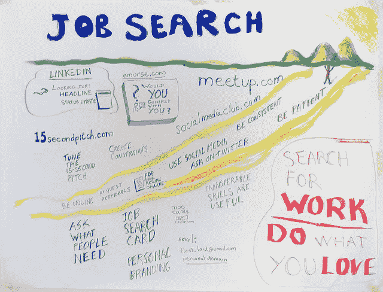

# 使用这个过程来获得一个入门级的软件工作

> 原文：<https://levelup.gitconnected.com/after-a-coding-bootcamp-follow-this-process-to-get-a-job-db949205841f>

来源:[迪安·迈耶斯](https://www.flickr.com/photos/deanmeyers/)经由: [flickr](https://www.flickr.com/photos/deanmeyers/3598159727)

我一年前写了这篇文章，当我重温它的时候，我发现很多建议都是正确的。精通写软件是不够的。你必须创造机会展示你的技能。这两者协同工作。

> “你不出手，你 100%都会失手。”
> 
> —韦恩·格雷兹基

是的，你…你可能真的很擅长投篮。如果你不吃，你永远也不会知道。

## 2018 年 12 月 18 日

最近，我被问了很多关于作为一名新兵训练营毕业生找工作的问题以及相关的流程。我是编码训练营世界里的一个成功故事。我拼命工作了 5 个月，巩固了一些已经掌握的 SQL 基础知识，成为了一家著名公司(Zeeto)的软件工程师。我有一个我信任并每天执行的流程。

我的过程最终让我得到了这份工作吗？那要看情况了…我的过程中有一部分是建立关系网，所以是的，我的过程让我得到了这份工作。但更重要的是，它还让我获得了一份没有人脉的工作。这是一种经典的、从未听说过的情况，公司喜欢你的简历，而你在面试中一路过关斩将。我做到了，感觉真的很特别。

下面是我的旅程，下面总结成小块的建议。要么全部接受，要么简单地重用一个最适合你的组件。最后，这一切都是关于第五卷的*过程。*

# **不要做什么**

> “张力是你认为自己应该成为的人。放松就是你自己。”
> 
> —中国谚语

以我的经验，有一件事我推荐大家不要做… **不要太早开始**。有很多令人焦虑的紧张(这毕竟是你的生计)，你想在课程进行到一半之前找到一份工作，这很酷。

冷静一点。

耐心点。

我犯了一个错误，在为期 12 周的项目的第 7 周，我拔掉了所有的联系人。我安排了很多电话面试，却被告知我应该稍后再联系。这些是我真的想为之工作的公司，他们拥有我真的想帮助发展的技术。我甚至没有完成一个完整的项目，完全失去了理智。不要像我一样。深呼吸。放松是你的本性。

# **何时开始**

[Gia Oris](https://unsplash.com/@giabyte?utm_source=medium&utm_medium=referral) 在 [Unsplash](https://unsplash.com?utm_source=medium&utm_medium=referral) 上拍照

*   如果你的程序结束了，而你什么也没做，那你等得太久了。
*   如果你连一个好项目都没有，那就太早了。
*   如果你的计划即将结束，工作人员鼓励你开始，但你还没有准备好，也许你需要审视自己的感受，重新协商任何没有根据的、自我限制的信念，这些信念可能不需要存在。

# 做什么

我从一个好朋友和前英特尔总经理那里得到了一些很好的建议。

> "迈克，如果你申请的是初级职位，你的工作就是量."

有很多组织在寻找开发人员，通过接触他们，你创造了一个机会，你的背景将与他们的理想候选人相一致。

他让我一天申请 10 家公司。我试过这个，它彻底击垮了我。你能一天写 10 封求职信吗？如果可以…请停止编码，继续写。

## 拥有流程是关于…

*   了解你的能力，并相应地设定数字和期望值。
*   通过每件事都做一点来安排一天，不要做太多的事情。
*   通过记录谁、什么、何时、何地、如何(公司、职位、申请日期、面试地点、申请媒介)来组织你的数据……使用电子表格，否则你会接到忘记申请的公司的电话。
*   每天出现就像这是你的工作，因为它是。

## 问自己这样的问题…

*   你如何申请那 10 家公司？
*   甜蜜点是多少封求职信？
*   你每天通过 LinkedIn Easy-Apply 发送多少份申请？
*   你在项目和你的技能上花了多少时间？

我想以“举例日”的形式与你分享我的过程，因为过程是关于*安排和组织你的时间。*这是否意味着你应该严格遵循这一天？我觉得不是…试试吧，提炼到你喜欢的程度。

照片由[免费使用声音](https://unsplash.com/@freetousesoundscom?utm_source=medium&utm_medium=referral)在 [Unsplash](https://unsplash.com?utm_source=medium&utm_medium=referral) 上

# **我的一天**

*   上午 6 点—8 点:运动和早餐
*   上午 8 点到 11 点:编程问题和面试问题
*   上午 11 点—下午 12 点:工作申请(基于求职信)
*   中午 12 点—下午 1 点:午餐和伸展运动
*   下午 1 点—4 点:工作申请(一键申请— Linkedin、ZipRecruiter、Organic Outreach)
*   下午 4 点到 5 点:文件夹工作
*   晚上:可选的网络活动

## 编程问题和面试问题

关注最适用的问题或你知识中最大的空白。如果你有一个即将到来的电话屏幕，练习那些工作要求的技能。使用不同的媒介……一块白板，一个定时在线测验，尽可能地模仿面试条件。

## 工作申请

两种不同类型的应用程序，一种需要很多时间，另一种不需要。如果你只申请需要求职信的工作，就很难达到要求。随后，1:10 的求职信工作比申请容易。

此外，了解你想为之工作的公司，并保留他们的空缺职位。在面试过程中记录你申请了什么和你所处的阶段，以保持条理。

## 作品集

通过建立一些真实的可以展示的东西来完善你的技能。这项工作是在构建东西时获得更多迭代解决问题的好方法。

## 网络活动

这包括聚会、技术讲座和黑客马拉松。在公共场所，你可以与来自技术社区的人交流和交谈。关键是要有你想交朋友和了解别人的心态，而不是你想让他们雇佣你。

# **结果和教训**

假设你关注了我的一天，能够完成 2 封求职信，发送 10 份 LinkedIn 简易申请，并提交 1-2 份其他申请(ZipRecruiter，Indeed.com，Indeed.com)。如果你一个月每周工作 5 天，那么你已经发出了 40 份附有求职信的申请，200 份 LinkedIn Easy-Apply 申请，以及 20-40 份其他申请。

**共有 280 份申请**。此外，你已经参加了 4-8 次社交活动，你已经学习了大约 60-100 个小时。这会让你找到工作吗？不，有些人可能需要一个月，有些人需要三个月。但是你不能控制它。你能控制的是你出现的天数。

错过一天，数字就会下降。

这个问题我已经被问过好几次了…因为我通过人际关系找到了一份工作，我会以不同的方式度过我的时间吗？

大多数人会告诉你，他们是通过人际关系网找到工作的……这都是关于人际关系网，专注于人际关系网！我认为这种方法本身就是有缺陷的，它会让你的求职充满机遇而不是实践。要点是:控制你能控制的。你无法控制你的人际网络中的某个人何时听说了一份工作，并能帮你接通。

上面例子中的一个月，你已经给了自己 280 个机会去应聘那些有空缺职位并且正在考虑的公司。问问你的关系网，宣传你正在寻找工作，但是*疯狂地申请*。最后，你永远不能怀疑你给自己的机会。

# **谈判就业的各个阶段**

面试过程很像一场力量的表演..要做倒立，很少有人会在第一次做倒立时把脚踢向空中并保持完全静止。你需要准备你的腕关节，训练保持正确的排列，调整位置，最终，在这个位置上感到舒适。

第一次电话面试可能会很尴尬和沉闷，当面试结束时，你的手腕会酸痛。你知道你做错了什么，你开始以一种你以前没有的方式理解你的腕关节。你在游戏中有皮肤，并通过尝试和错误来提高。更多带有某种程度的自我反省和正念的重复*会增加舒适感。这同样适用于你的第一次面试和编程问题。*

*量的过程引入了在面试过程中的每一步获得实践和经验的更高可能性。你在适应，在面试过程中不断进化。坚持一些关键的网络联系会招致更少的实践、更少的适应和更少的进化。你需要不断进步，这样当一份大工作落到你的头上时，你就能准备好粉碎面试。*

***子弹提示***

*   *通过 Linkedin 和其他方法接触你感兴趣的公司的人。经常做。建立联系，传播你找工作的消息，这样当其他人听到消息时，他们可以帮助你。我的建议是对人要非常直接。他们可能很忙。要求他们的时间谈话，只是拐弯抹角，这对你们都没有好处。*
*   *对你搜索的潜在结果和实际结果在情感上有些脱节。面试时，要真诚。让人们知道你的兴奋、恐惧和其他情绪。当你收到回复(或者没有)时，过于情绪化会让你的旅程脱轨。太多的兴奋可能会导致你接受第一份工作，而不是与你的目标一致的工作。太多的消极，你会发现自己在逃避这个过程，评判自己。很多时候不是你，是招聘经理没时间。提醒你自己。问问自己，你能做些什么来让他们的工作变得更容易。比如后续。顺便说一句，你应该在每次申请职位时跟进，即使不是和招聘经理，只是公司里的某个人。*
*   *提醒你自己，你已经承诺要进行一次大的转变，并且已经在建立一套新的技能上投入了很多。如果你要求并展示出你努力工作的能力，有人会尊重你并会尽他们所能帮助你。*

***收官***

*我玩得很开心。我正在做一些两三个月前甚至无法想象的事情。容器、bash 脚本和 ansi ble——都与 AWS 和 Drupal 交互。如果说我意识到了什么，那就是训练营只是一个学习的框架和一个学习的专用空间。这是我最喜欢它的一点。我开始意识到，当以初学者的心态对待时，工作本质上是一样的——一个协作解决问题和创造新的惊人事物的专用空间。那很酷…*

*祝你的搜索人员好运，记住，疯狂申请吧！*

# *分级编码*

*感谢您成为我们社区的一员！ [**订阅我们的 YouTube 频道**](https://www.youtube.com/channel/UC3v9kBR_ab4UHXXdknz8Fbg?sub_confirmation=1) 或者加入 [**Skilled.dev 编码面试课程**](https://skilled.dev/) 。*

* [## 编写面试问题

### 掌握编码面试的过程

技术开发](https://skilled.dev)*