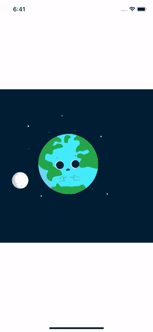
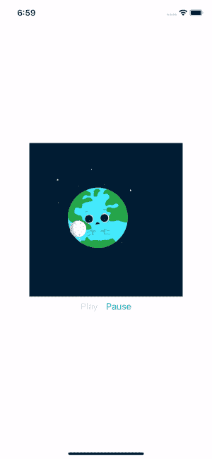

# 洛蒂·🧨在《原生反应》中的特效动画

> 原文：<https://levelup.gitconnected.com/after-effect-animations-in-react-native-with-lottie-abe939a6bdb8>

洛蒂允许我们在手机和网络上自然地渲染后效动画


Unsplash: [瑜伽 Perdana](https://dribbble.com/yoga)

# 介绍

动画有助于使你的应用程序更加动态，更加用户友好。您可能知道，使用 Adobe After Effect 创建动画视频是可能的。

为什么不将这些动画集成到我们的应用程序中呢？

这时洛蒂来帮助我们😎。

## 洛蒂是什么？

Lottie 是一个库，允许我们在 iOS、Android、React Native 等中添加动画。

Lottie 的主要目标是通过使用 JSON 文件将 After Effects 动画集成到我们的应用程序中(我们不会看到如何从 AE 传递到 JSON 文件。你可以在这里看到它。

在本文中，我们将在空白的 [Expo](https://expo.io/) app 中添加动画。

# 设置

在使用 Lottie 之前，我们需要在我们的项目中安装这个包:

在项目的根目录下，运行:

```
yarn add lottie-react-native
yarn add lottie-ios@3.1.3
```

添加软件包后，我们需要安装 iOS 依赖项:

```
cd ios
pod install
```

现在洛蒂应该安装了🛠

# 使用动画

如前所述，洛蒂使用 JSON 文件来运行我们的动画。在本文中，我们将从[lotti files](https://lottiefiles.com/)下载它。

下载后，您需要将它放在项目文件夹中。然后我们可以像这样使用文件:

App.tsx

在我的情况下，我在我的应用程序上得到它:



[洛蒂菲莱斯:潘吉维卡索诺](https://lottiefiles.com/26973-earth-moon)

## 以编程方式播放/暂停动画

LottieView 为我们提供了一个**命令式 API** ，让我们按照自己的意愿**播放**和**暂停**动画。

因此，我们需要向视图传递一个引用，并调用不同的方法，如下所示:

App.tsx

添加播放/暂停后，我们会看到:



[洛蒂菲莱斯:潘吉维卡索诺](https://lottiefiles.com/26973-earth-moon)

现在，举例来说，当用户完成一个动作，组件已经安装，等等，就可以开始你的动画了。(其他方法可在[文档](https://github.com/react-native-community/lottie-react-native/blob/master/docs/api.md)中找到)

# 结论

现在，你可以在你的应用程序中实现动画，让她更有活力。

GitLab 回购:[dmg.link/blog-lottie-repo](https://dmg.link/blog-lottie-repo)。

**你可以在这里** **找到我的其他文章并关注我** [**。感谢阅读，我希望你今天学到了一些新东西🚀**](https://medium.com/@nicolas_dmg)

[](/automate-your-react-native-app-with-fastlane-ea516b4a893) [## 使用浪子自动化您的 React 原生应用程序

### 简化截图、测试版部署、应用商店部署和 React 原生应用的登录🚀

levelup.gitconnected.com](/automate-your-react-native-app-with-fastlane-ea516b4a893) [](/how-to-sign-in-with-apple-on-react-native-4c445de5ff8c) [## 如何在 React Native 上“登录苹果”

### 在 React Native 和 Node.js 上使用 Apple 认证用户的简单指南

levelup.gitconnected.com](/how-to-sign-in-with-apple-on-react-native-4c445de5ff8c)