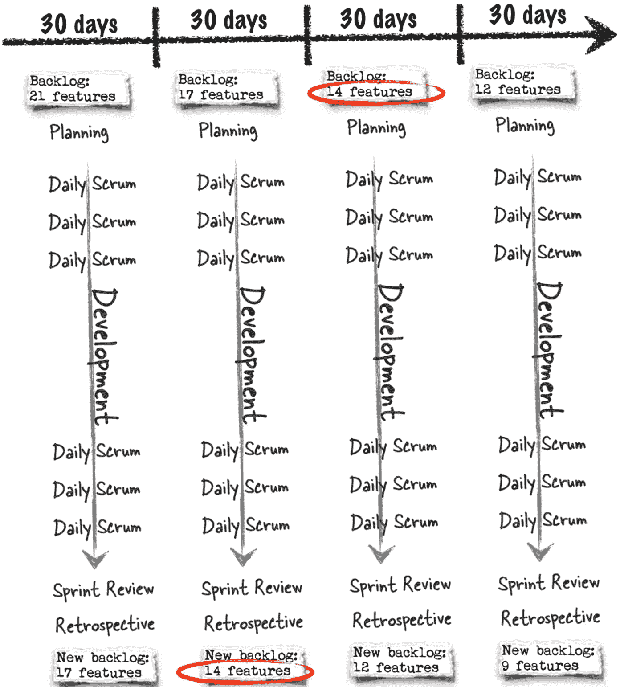

# 用简单的英语解释敏捷术语

> 原文：<https://levelup.gitconnected.com/agile-jargons-explained-in-simple-english-97f4ce81eb85>

敏捷和 Scrum 的简明指南

替罪羊:敏捷获胜！

## 🌻敏捷与敏捷方法

**敏捷**的意思是“快速行动的能力”，而**敏捷方法论**是一堆在软件开发中实现敏捷的方法。当人们说“敏捷”时，他们实际上指的是敏捷方法论。

## 🤔为什么需要敏捷？

*   在 90 年代，软件开发糟透了。
*   在业务需求和产品交付之间有一个巨大的时间差。业务，需求在这段滞后时间内发生了变化，最终的产品不能满足当前的需求。这导致许多项目被取消。
*   当时使用的瀑布模型不能满足对速度的需求，也没有利用软件可以被改变的速度。
*   2000 年，17 个家伙(思想领袖)聚在一起，想出了“**敏捷宣言”**来解决这些问题。

## 📕敏捷宣言

*   敏捷宣言是一组 **4 个价值观**和 **12 个支持原则的集合，以提高软件开发的敏捷性**
*   这有点像哲学，它基本上是说在构建软件时你应该关心的事情——他们称之为“价值观”。
*   敏捷宣言没有给出任何遵循这些价值观的特定方法，因为没有构建软件的“银弹”方法。每个软件都是独特的，可能需要不同的方法来遵循这些值。
*   这就是为什么有许多像 Scrum、XP、精益/看板等敏捷方法的原因..即给出具体的方法遵循这些价值观来指导发展。

# ✨4 价值观

## 1.过程和工具之上的个人和交互

*   像每日站立、用户故事、任务板、燃尽图、回顾都是有价值的工具。(将在本文后面解释)
*   但是，如果过程驱动开发，团队对变化的反应会更慢，满足客户需求的可能性也会更小。

## 2.综合文档之上的工作软件

*   文档的问题在于，两个人可以阅读同一页，然后得出两种截然不同的解释。
*   衡量软件工作好坏的最有效方法是实际使用它。

## 3.合同谈判中的客户协作

*   当团队中的人有“合同谈判”的心态时，他们会觉得在开始任何工作之前，他们必须就团队将构建什么达成严格的协议。
*   项目是变化的，人们在开始一个项目时从来没有完美的信息。因此，与其试图确定到底要构建什么，不如与用户合作，努力获得最佳结果。

## 4.响应变化而不是遵循计划

*   计划的问题在于，它们是在项目开始时建立的，而团队对他们将要建立的产品知之甚少。因此，计划会随着项目的进展而改变。

让我们来看看最流行的敏捷方法，以及它是如何尝试应用这 4 个价值观的——Scrum。

> 为了解释 scrum，我必须使用一些术语。我将让它们**加粗**和**将在 Scrum 部分结束后解释这些。**

# 🏈Scrum 工作流

*   Scrum 是最常见的敏捷方法。
*   Scrum 项目中有三个主要角色**:**产品负责人、Scrum Master 和开发团队。**产品负责人主管产品积压。Scrum Master 引导团队通过路障。开发团队实现了的软件功能。**
*   **按照“Scrum 模式”,该项目被划分为相同长度的冲刺或周期(通常是 2、3 或 4 周)**

## **Scrum 模式**

*   **在 sprint 开始时，团队做 **Sprint planning** 来确定他们将在 Sprint 期间从*产品积压中构建哪些特性，并将其放入 **Sprint Backlog 中。*****
*   ***团队在整个 sprint 中工作，构建 Sprint Backlog 中的所有特性。***
*   ***团队每天都会召开一个简短的会议，称为 ***每日 Scrum。******
*   ***在 sprint 结束时，在 **Sprint 评审中，向产品所有者和利益相关者展示工作软件。*****
*   ***最后，团队举行 ***回顾*** 来找出他们学到的教训。***

******

***图片来自:Andrew Stellman 和 Jill Alison Hart 的“Head First Agile”***

# ***敏捷术语***

## ***🏃‍♂️冲刺***

***Scrum 项目被组织成称为 Sprints 的限时迭代。通常选择 2、3 或 4 周的时间。***

## ***📑积压***

*   ***backlog 是等待构建的功能列表。***
*   ***Scrum 团队实际上维护**两个 Backlog**:一个用于当前 sprint，称为 **Sprint Backlog，**和一个用于整个产品，称为 **Product Backlog。*****
*   ***当团队计划一个 sprint 时，他们从产品待办事项列表中提取特性到 Sprint 待办事项列表。***
*   ***任何尚未包含在 Sprint Backlog 中的特性都是用户和产品所有者可以改变的。因此，这是管理不断变化的需求的好方法。***

## ***🤠产品所有者***

*   ***产品负责人维护积压工作。***
*   ***产品负责人的工作是与客户交谈，找出他们需要什么，并提出他们将使用的功能。***
*   ***每个人都从工作软件的每个新版本中学到了更多，产品负责人使用这些新知识来添加或删除 backlog 中的特性。***

## ***🧐 Scrum 大师***

*   ***Scrum Master 帮助团队正确理解和执行 Scrum。***
*   ***Scrum Master 把他或她的所有时间都花在帮助产品所有者，开发团队上。***

## ***🧾冲刺规划***

*   ***在每个 Sprint 开始的时候，Scrum 团队，包括 Scrum Master 和产品负责人，会聚在一起开一个 **Sprint Planning** 会议，他们**会选择在 Sprint** 中包含哪些项目。***
*   ***对于 4 周的短跑，时间限制为 8 小时，对于 2 周的短跑，时间限制为 4 小时***
*   ***在前半部分，团队指出在冲刺阶段可以做些什么。首先，团队写下冲刺目标，一两句话的陈述，说明他们将在冲刺中完成什么。***
*   ***然后他们一起工作，从产品待办事项列表中提取项目到**创建冲刺待办事项列表*****
*   ***在下半年，他们会想出如何完成工作。他们**将 Sprint Backlog 上的每一项分解成需要一天或更短时间的任务**。***

## ***📞每日站立/每日混战***

*   ***这是一个每天都会召开的会议，在会议期间，团队成员会谈论他们正在做的工作和面临的挑战***
*   ***这是一个 15 分钟的限时会议，每天都在同一时间举行***
*   ***会议时间很短，因为会议期间每个人都站着。这使得它简短，甜蜜，切中要害。***
*   ***会议不仅仅是提供状态更新，而是了解项目如何进行，并且每天聚在一起寻找每个人可以更好地工作的方法***
*   ***当开发人员在会议中提出计划的问题时，每个人都会倾听，项目会因此运行得更好。***
*   ***每日站立帮助团队计划第二天的工作——团队中的每个人都是计划过程的一部分。***

## ***✍冲刺评论***

*   ***当 Sprint 完成后，团队召开一个叫做 **Sprint Review** 的会议，在会上他们**与用户**见面**演示他们构建的工作软件的** **。*****
*   ***团队展示了他们在冲刺阶段构建的东西，并且**从涉众那里得到反馈*****
*   ***对于一个 4 周的 Sprint，这个会议的时间限制为 4 小时***
*   ***他们还会**讨论产品积压**，这样每个人都知道下一次冲刺可能会有什么。***

## ***🐲用户故事***

***用户故事是一种表达用户特定需求的方式，通常用几句话写出来。***

## ***☕任务委员会***

***任务板是一种敏捷计划工具，其中用户故事被附加到板上，并根据其状态分类到各个列中。例如“进行中”、“完成”、“准备开发”、“代码审查”等。***

## ***📉燃尽图***

***燃尽图是一种折线图，每天更新，跟踪项目中剩余的工作量，当工作完成时“燃尽”到零。***

## ***🍩增量***

*   ***它是在 Sprint 结束时完成并交付的所有待办事项的总和。***
*   ***增量代表一次完整冲刺的**结果。*****
*   *****产品增量**是本次 Sprint 和之前所有 Sprint 中完成的所有待办事项的总和。***

## ***🌟史前古器物***

*****产品积压**、**冲刺积压**和**增量**是 scrum 中使用的三个工件，代表项目的进展。***

## ***🤓回顾的***

***团队在 Sprint 中做的最后一件事是召开 Sprint 回顾会，讨论在 Sprint 中发生的事情，这样他们可以重现进展顺利的事情，并从任何问题中学习。***

***仅此而已。***

***希望这对你有用。干杯！***