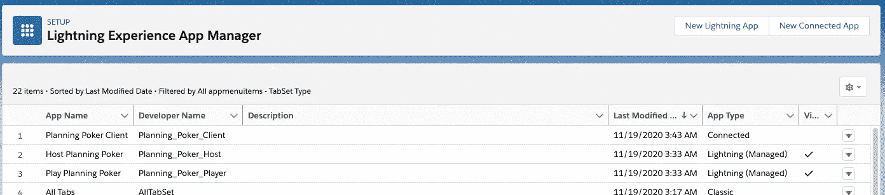

# 使用 Salesforce 和 Heroku 的敏捷规划扑克

> 原文：<https://levelup.gitconnected.com/agile-planning-poker-using-salesforce-and-heroku-9834d8d545c6>

[人们可能不希望使用 Salesforce 来规划扑克会议，但看看 Aditya Naag 的 planning-poker-salesforce 存储库如何可以很容易地实现这一点。]

特性团队经常使用规划扑克(或 Scrum Poker)的概念来帮助估计完成一个给定的用户故事所需的工作量。每个团队成员都有一套卡片，用来评估给定故事所需的工作量。大多数团队使用的牌组使用类似斐波那契数列的下列数值:0，1，2，3，5，8，13，20，40，100。

有经验的 scrum 大师让团队意识到，一个 8 点的故事应该能够分解成 3 点和 5 点的故事。因此，故事通常不值得评估为大于 8 的值。

对于功能团队来说，就基线故事达成一致是很有帮助的。基线故事有助于定义给定故事的价值。以我个人的经验，经常使用三点努力，因为它落在可用序列范围的中间。团队可以参考这个基线故事，理解所需的工作，并得出结论，这就是相应基线值的定义。

多年来，我在 DZone 的敏捷专区中引用了这种游戏化的故事估算技术。下面是我最喜欢的两篇文章:

*   [告白…策划扑克时作弊](https://dzone.com/articles/confession-i-cheated-during-planning-poker)
*   [一个策划扑克的实验](https://dzone.com/articles/a-planning-poker-experiment)

# 为什么选择 Salesforce？

在通过疫情工作的世界中，实体卡牌的使用并不有效，该世界已经将功能团队从位于专用团队房间转变为 100%远程的情况。虽然可以使用移动应用程序来代替物理卡，但拥有一个包含的系统来主持规划会议并处理结果的想法似乎更理想。

采用 Salesforce 生态系统的组织拥有必要的基础架构来引入可以快速开发的应用程序，并避免处理基础架构需求等方面。目前未使用 Salesforce 的组织可以通过使用免费版本(如 Salesforce Developer Edition)轻松开始使用。

虽然可以在 Salesforce 中创建自定义应用程序，并利用 Lightning 组件来提供完美的外观，但一个应用程序已经由 [Aditya Naag](https://twitter.com/adityanaag) (@adityanaag)创建，并且是 Salesforce 的完全开源的打包应用程序。

我想为我的团队尝试一些不同的东西，并利用 Aditya 的应用程序。

# 为什么是 Heroku？

使用基于 Salesforce 的解决方案的挑战在于，并非所有功能团队成员都有 Salesforce 帐户。事实上，在我使用敏捷原则的十二年中，只有一个项目中整个团队独立于一个组织。其他所有情况都是利用外部人员来处理项目中与公司团队无关的方面。这与我目前的团队没有什么不同——公司团队成员位于北美，外部顾问位于亚洲和欧洲。

这些外部顾问还需要一种方法来利用 planning poker 应用程序，而无需获得 Salesforce 客户端许可证。考虑到 Heroku 可以轻松地提高应用程序的速度，使用 Heroku 来提供一个访客客户端看起来非常合理。

使用 Node.js 作为后端服务和 Lightning Web Components 开源，Aditya 的存储库包括一个 Guest Player 应用程序，只需几个步骤就可以从 Heroku 运行。当然，如果 Planning Poker 会话中的所有参与者都有自己的 Salesforce 许可证，则可以跳过 Guest Player 应用程序的设置和配置。

# 规划-扑克-销售力量储存库

根据`README.md`的说法，`planning-poker-salesforce`应用程序是一种基于共识的游戏化技术，用于评估 Scrum 中的用户故事。该应用程序允许您利用这一技术进行规划，并且完全基于 Salesforce 构建。

1.  **选择自己的用户故事来源**在开始游戏之前，您可以选择任意一个 Salesforce 对象作为用户故事列表的来源，并将共识(故事点)直接保存到用户故事记录中。
2.  **使用预定义的卡片组或创建自己的卡片组**这个应用程序带有预定义的卡片组，如斐波那契和 2 的倍数。您也可以创建自己的自定义卡片组。
3.  所有玩家的回答都是隐藏的，直到计时器超时或者直到主持人选择显示它们。
4.  **主机控制**主机有显示计时器、隐藏或显示卡片、重置投票等选项。主持人也可以玩游戏，如果他们愿意的话。

[planning-poker-sales force](https://github.com/adityanaag3/planning-poker-salesforce)存储库，以及某种类型的 Salesforce Org 和一个可选的免费 Heroku Dyno 提供了功能团队主持规划扑克会议所需的一切。体系结构如下所示:


本文档的其余部分将介绍如何设置 Salesforce 和 Heroku，然后演示如何使用 planning poker 解决方案。出于对我的客户保密的目的，本文的剩余部分将使用示例数据。

# 设置和配置

将`planning-poker-salesforce`应用程序引入 Salesforce 有两个选项:

*   使用包
*   使用 SFDX 命令

以下链接描述了这两个选项:

[https://github . com/adityanaag 3/planning-poker-sales force #安装](https://github.com/adityanaag3/planning-poker-salesforce#installation)

此时，对于拥有 Salesforce 许可证的参与者来说，`planning-poker-salesforce`应用程序已准备好在 Salesforce 中使用。拥有“规划扑克玩家”权限集的用户将能够加入由拥有“规划扑克主持人”权限集的用户创建的会话。

# (可选)来宾播放器应用程序

如果需要至少一个没有 Salesforce 许可证的玩家，则需要创建一个证书，该证书将允许同一个 Salesforce 组织与将在 Heroku 中运行的 Node.js 应用程序进行通信。所有用户都使用 Salesforce 帐户的实施不需要遵循此步骤，可以继续到“举办策划扑克活动”部分(如下)。

在我的 Mac Book Pro 上，我在为本文创建的新文件夹中执行了以下命令:

`openssl req -nodes -new -x509 -keyout private.pem -out server.cert`

下面是我执行这个命令得到的输出:

```
Generating a 2048 bit RSA private key
..................................+++
..................................................................+++
writing new private key to 'private.pem'
-----
You are about to be asked to enter information that will be incorporated
into your certificate request.
What you are about to enter is what is called a Distinguished Name or a DN.
There are quite a few fields, but you can leave some blank
For some fields there will be a default value,
If you enter '.', the field will be left blank.
-----
Country Name (2 letter code) []:US
State or Province Name (full name) []:IN
Locality Name (eg, city) []:Zionsville
Organization Name (eg, company) []:JVC
Organizational Unit Name (eg, section) []:Development
Common Name (eg, fully qualified host name) []:Planning Poker
Email Address []:<my-email-address-was-entered-here>
```

由于上面的命令，创建了两个文件:

*   `server.cert`-SSL 证书的公钥
*   `private.pem` -私钥(以人类不可读的基于 Base-64 的 PEM 格式编码和创建)

在 Salesforce 中，需要从**设置|应用程序|应用程序管理器**屏幕创建连接的应用程序。我决定将连接的应用程序称为“规划扑克客户端”(`Planning_Poker_Client`)，配置如下:


选择“使用数字签名”选项，并选择`server.cert`(上面创建的)作为数字证书。激活“启用 OAuth 设置”后，还会提供回调 URL。

Planning Poker 客户端的管理屏幕如下所示:


这里唯一的区别是更改了“允许的用户”属性的值。单击“编辑策略”按钮允许使用“规划扑克玩家”权限集:


导航到应用程序管理器现在显示 Salesforce 中已安装并准备就绪的三个应用程序:



最后，需要为非 Salesforce 用户创建 Node.js 应用程序。可以使用以下链接启动该过程:

[https://heroku.com/deploy?template = https://github . com/adityanaag 3/planning-poker-heroku/master](https://heroku.com/deploy?template=https://github.com/adityanaag3/planning-poker-heroku/master)

登录 Heroku 后，将在新创建的 Heroku Dyno 中设置以下属性:


`PRIVATE_KEY`属性是上面创建的`private.pem`文件的内容。`SF_LOGIN_URL`和`SF_NAMESPACE`有多个值，在下面的 URL 中定义:

[https://github . com/adityanaag 3/planning-poker-sales force # player-app-for-guests](https://github.com/adityanaag3/planning-poker-salesforce#player-app-for-guests)

最后，`SF_USERNAME`是 Salesforce 中用于创建应用程序的唯一用户名。这也可以是维护**规划扑克玩家**权限集的任何用户。

随着 Heroku Dyno 的启动和运行，开始规划扑克游戏的一切都已准备就绪:


# 举办策划扑克活动

在 Salesforce 中，我创建了一个非常简单的 backlog 项目供`planning-poker-salesforce`应用程序评估:


请记住，在 Salesforce 中使用另一个对象也是可能的，它在游戏对象创建步骤中链接(如下)。

接下来，我创建了一个名为“规划会话 1”的游戏。


除了为条目提供名称之外，我还指定主持人可以在规划扑克会议期间投票。我还设置了游戏数据源的所有属性。这是我真正欣赏 Aditya Naag 设计的地方——能够利用不同的数据源来获取`planning-poker-salesforce`应用程序使用的数据。一个例子就是与敏捷加速器的无缝集成。

创建规划扑克游戏后，下一步是导航到 Salesforce 中的主机规划扑克应用程序，并选择主机规划扑克选项卡。


在那里，选择“规划会话 1”选项，并点击“启动游戏”按钮。此时，其他用户可以加入规划扑克会话。访客用户只需启动 Heroku Dyno 的 URL，就会出现以下屏幕:


游戏密钥显示在下面的屏幕截图中，其中还提供了所有已加入游戏的玩家的摘要:


# 玩策划扑克

在单击“开始播放按钮”时，第一个(也是唯一的)待办事项被呈现:


每个来宾用户都可以秘密投票。下面显示了两个会话:


一旦所有投票都已完成，将出现如下所示的主机屏幕:


此时，团队讨论他们的估计。达成共识后，主机控件会更新，如下所示:


在本例中，选择了 2 分，并点击了“保存共识”按钮。“保存”操作会自动更新源记录，包括该应用程序外部的对象(如 Agile Accelerator)。但是，如果需要再次投票，可以使用投票控件清除之前的结果。

“下一个故事”按钮可用于对剩余的待办事项重复该过程。完成后，主持人只需利用“结束游戏”按钮。

# 结论

在我从事技术人员工作的近三十年中，我非常重视采用技术来满足组织需求的成本。在这段旅程中，我试图灌输给后代的一个关键点是**避免做那些不会推动创新和进步以满足公司潜在业务需求的事情**。

Salesforce 提供可配置和定制以满足组织需求的功能，与构建、管理和支持定制 CRM 应用程序相比，可节省大量成本。Heroku 提供了类似的价值，允许功能开发人员专注于满足业务需求，而不必了解复杂的云选项。Aditya Naag 的`planning-poker-salesforce`为需要一个健壮的故事工作量估算解决方案的功能团队提供了一个开源选项。这三个方面导致了一种罕见的情况，即在没有一行原始源代码的情况下完全满足了需求。我目前的团队非常喜欢在我们的规划扑克会议中使用这种方法。

最后，介绍了一个例子，它有助于保持支持特性团队的成本最小，并允许团队成员专注于进行业务驱动的改进。在我看来，这是促进成功的关键因素。

(经我的同事[约翰·维斯特](https://www.linkedin.com/in/johnjvester/)许可发表)