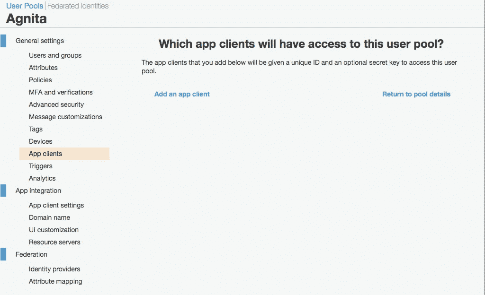

# Agnita:使用 AWS Cognito 创建 React 应用程序的身份验证

> 原文：<https://levelup.gitconnected.com/agnita-authentication-for-create-react-app-using-aws-cognito-80cde1fb781b>

Agnita 项目是使用 [Amazon Cognito](https://aws.amazon.com/cognito/) 和 [create-react-app](https://create-react-app.dev/) 实现的概念验证。

阿格尼塔这个名字来自拉丁语，意思是公认的。这个名字的选择与 Cognito 密切相关。找到一个合适的名字花了我不少时间，但毫无用处。

查看 GitHub 回购这里:【https://github.com/bartw/agnita 

# 设置 AWS 认知

确保你有一个 AWS 帐户，我建议你使用[免费层](https://aws.amazon.com/free/)开始。转到 [AWS 管理控制台](https://console.aws.amazon.com/console)中的 [Cognito](https://console.aws.amazon.com/cognito/) 服务，并点击管理用户池。


现在点击创建用户池来创建你的第一个用户池。


下一步，你必须给你的用户池起一个名字，我把我的命名为 Agnita，因为，嗯，那是我的应用程序的名字。通过点击 AWS Cognito 上的“查看默认值”,您可以在设置中做出大多数艰难的选择。作为概念的证明，我当然希望缺省值足够了。


据我所知，那些违约看起来还不错。既然你正在读这篇文章，你可能也没有头绪。因此，您可以单击“Create pool ”,查看您的第一个 AWS Cognito 用户池。


返回到 [AWS 管理控制台](https://console.aws.amazon.com/console)中的 [Cognito](https://console.aws.amazon.com/cognito/) 服务，但这次您要单击管理身份池。


是时候想出另一个名字了，我又选了阿格尼塔。您可以忽略未认证的身份和认证流设置。但是您应该扩展身份验证提供程序。

第一个 Authentication-providers-tab 是 Cognito，您可以填写刚刚在其中创建的用户池的用户池 ID。但是还需要一个应用客户端 id。我所做的是打开另一个浏览器选项卡来创建一个应用程序客户端。


如果您再次转到 Cognito，我不会再把那个屏幕截图放上去，然后管理用户池，您可以选择您的用户池。在常规设置下，有一个应用程序客户端选项。我认为你可以在那里创建非常需要的应用程序客户端。


看来我是对的。您可以单击添加应用程序客户端。



猜猜我给我的 app 客户端选了什么名字？没错，阿格尼塔，但我加了-Web 只是因为。您还应该**禁用生成客户端密码复选框**。我保留了所有其他设置，因此您也可以这样做，我单击了创建应用程序客户端。


现在，您可以继续使用身份池了。粘贴您的 id 并点击创建池！

出现了一个意外的屏幕。显然，您还需要指定至少一个角色。我想这是有道理的。我只对一种经过身份验证的用户感兴趣，所以我将保持简单。


那起了作用。现在你可以从一个网站开始使用 Cognito。

# 设置创建 React 应用程序

确保你已经安装了 [Node.js](https://nodejs.org/) 。我也喜欢使用 [Visual Studio 代码](https://code.visualstudio.com/)，因为它有效。

打开一个终端，开始像疯子一样打字。

```
npx create-react-app agnita
cd agnita
code .
```

如果一切顺利，您应该已经编写好 Visual Studio 代码，并且刚刚生成的 create-react-app 已经准备就绪。

# 更漂亮的弯路

在我开始一个 JavaScript 项目之前，我总是确保已经安装了[漂亮的](https://prettier.io/)。如果能每 3.8 秒自动格式化一次，编码速度会快很多。

当我在 Visual Studio 代码中时，我总是使用内置的终端。你可以像我一样在 [macOS](https://code.visualstudio.com/shortcuts/keyboard-shortcuts-macos.pdf) 上使用⌃` (control + backtick)快捷键来显示集成终端。同样的 Visual Studio 键盘快捷键也存在于 [Windows](https://code.visualstudio.com/shortcuts/keyboard-shortcuts-windows.pdf) 和 [Linux](https://code.visualstudio.com/shortcuts/keyboard-shortcuts-linux.pdf) 中。

现在回到漂亮。在安装了 prettier 并创建了一个空的配置后，当你在格式化一个文件时，你可以点击⇧⌥F (shift + command + f)。

```
npm install --save-dev prettier
echo "{}" >> .prettierrc
```

# 回到正轨

为了确保在开始集成 AWS Cognito 之前一切正常，您可以启动生成的应用程序。回到终端:

```
npm start
```

我不知道你怎么想，但对我来说，这打开了一个浏览器标签，显示了一个旋转的[反应](https://reactjs.org/)标志。

# AWS 放大器

要使用 AWS Cognito 注册、登录和注销，您需要 [AWS Amplify](https://aws-amplify.github.io/) 。AWS Amplify 是一个成熟的库，可以在 AWS 上构建应用程序。我现在只打算使用 AWS Cognito，所以我主要关注文档中的[手动设置](https://aws-amplify.github.io/docs/js/authentication#manual-setup)部分。

```
npm install --save aws-amplify
```

在 React 应用程序中，您需要 Cognito 的区域、用户池 ID 和应用程序客户端 ID。`.env`文件是您应该保存这些 AWS Cognito id 的地方。最好不要签入它们，因为其他人可能会开始使用你的用户池来存储他们的用户。所以一定要将`.env`添加到您的`.gitignore`中，将其从 Git 中排除。

你确实知道 Git，是吗？如果你没有，那你就去学吧，只要看完[这本免费书](https://git-scm.com/book/en/v2)的前 3 章就可以了。

```
touch .env
```

您的`.env`文件应该如下所示。对于 Create-React-App 来说,`REACT_APP_`前缀是必须的，以获取您的[环境变量](https://create-react-app.dev/docs/adding-custom-environment-variables/)。

> 我用了一个无法破解的算法来改变所有的 id，所以不要尝试任何东西。事实上，我只是输入了一些随机字符，而不是真正的 id，但它会完成工作。

```
REACT_APP_REGION=us-east-1
REACT_APP_USER_POOL_ID=us-east-1_SW382wGyU
REACT_APP_USER_POOL_WEB_CLIENT_ID=4t3RdWfp5ydwadefjthscrdrcd
```

将 AWS Cognito 集成到您的 Create-React-App 应用程序中的一切都已就绪。所以你可以开始反应了。我添加了一些 css 和一个`FormElement`组件，让它看起来更好一点(真的只是一点点)。您可以在完整代码中查看这些更改。

首先你需要初始化 AWS Amplify。我在我的`App`组件中这样做了。当我的`App`组件挂载时，我使用了 [useEffect](https://reactjs.org/docs/hooks-effect.html) 钩子来初始化 AWS Amplify。

```
import React, { useEffect } from "react";
import Amplify from "aws-amplify";
import logo from "./logo.svg";
import SignUp from "./SignUp";
import SignIn from "./SignIn";
import "./App.css";const App = () => {
  useEffect(() => {
    Amplify.configure({
      Auth: {
        region: process.env.REACT_APP_REGION,
        userPoolId: process.env.REACT_APP_USER_POOL_ID,
        userPoolWebClientId: process.env.REACT_APP_USER_POOL_WEB_CLIENT_ID,
      },
    });
  }); return (
    <div className="App">
      <header className="App-header">
        
        <h1>Agnita</h1>
        <h2>Authentication for Create React App using AWS Cognito</h2>
      </header>
      <SignUp />
      <SignIn />
    </div>
  );
};export default App;
```

你可以看到我创建了一个`SignUp`和一个`SignIn`组件。这是两个非常相似的表单，使用 AWS Amplify Auth API 来创建新用户并与这些用户一起登录。现在这个应用程序不做任何事情，所以你应该保持你的浏览器控制台打开，看看东西是否工作。

`SignUp`组件由两个表格组成。在第一张表格中，你需要填写电子邮件地址和密码。当您提交时，将创建一个用户，您的电子邮件将作为用户名，电子邮件也是您的电子邮件和密码。如果一切顺利，第二种形式将变得可见。第二种形式要求您输入确认码。这个代码应该在第一步之后通过电子邮件发送给您。提交确认码后，您将拥有一个注册用户。

```
import React, { useState } from "react";
import { Auth } from "aws-amplify";
import FormElement from "./FormElement";const SignUp = () => {
  const [email, setEmail] = useState("");
  const [password, setPassword] = useState("");
  const [waitingForCode, setWaitingForCode] = useState(false);
  const [code, setCode] = useState(""); const signUp = (e) => {
    e.preventDefault(); Auth.signUp({ username: email, password, attributes: { email } })
      .then((data) => {
        console.log(data);
        setWaitingForCode(true);
        setPassword("");
      })
      .catch((err) => {
        console.log(err);
      });
  }; const confirmSignUp = (e) => {
    e.preventDefault(); Auth.confirmSignUp(email, code)
      .then((data) => {
        console.log(data);
        setWaitingForCode(false);
        setEmail("");
        setCode("");
      })
      .catch((err) => console.log(err));
  }; const resendCode = () => {
    Auth.resendSignUp(email)
      .then(() => {
        console.log("code resent successfully");
      })
      .catch((e) => {
        console.log(e);
      });
  }; return (
    <div className="form">
      <h3>Sign Up</h3>
      {!waitingForCode && (
        <form>
          <FormElement label="Email" forId="sign-up-email">
            <input
              id="sign-up-email"
              type="email"
              value={email}
              onChange={(e) => setEmail(e.target.value)}
              placeholder="email"
            />
          </FormElement>
          <FormElement label="Password" forId="sign-up-email">
            <input
              id="sign-up-password"
              type="password"
              value={password}
              onChange={(e) => setPassword(e.target.value)}
              placeholder="password"
            />
          </FormElement>
          <button type="submit" onClick={signUp}>
            Sign Up
          </button>
        </form>
      )}
      {waitingForCode && (
        <form>
          <FormElement label="Confirmation Code" forId="sign-up-code">
            <input
              id="sign-up-code"
              type="text"
              value={code}
              onChange={(e) => setCode(e.target.value)}
              placeholder="code"
            />
          </FormElement>
          <button type="submit" onClick={confirmSignUp}>
            Confirm Sign Up
          </button>
          <button type="button" onClick={resendCode}>
            Resend code
          </button>
        </form>
      )}
    </div>
  );
};export default SignUp;
```

当您有一个注册用户时，您可以在`SignIn`表单中使用该用户的电子邮件和密码。只需填写电子邮件和密码，然后点击登录，你会看到一个用户信息的控制台日志。

```
import React, { useState } from "react";
import { Auth } from "aws-amplify";
import FormElement from "./FormElement";const SignIn = () => {
  const [email, setEmail] = useState("");
  const [password, setPassword] = useState(""); const signIn = (e) => {
    e.preventDefault(); Auth.signIn({
      username: email,
      password,
    })
      .then((user) => {
        setEmail("");
        setPassword("");
        console.log(user);
      })
      .catch((err) => {
        console.log(err);
      });
  }; return (
    <div className="form">
      <h3>Sign In</h3>
      <form>
        <FormElement label="Email" forId="sign-in-email">
          <input
            id="sign-in-email"
            type="email"
            value={email}
            onChange={(e) => setEmail(e.target.value)}
            placeholder="email"
          />
        </FormElement>
        <FormElement label="Password" forId="sign-in-password">
          <input
            id="sign-in-password"
            type="password"
            value={password}
            onChange={(e) => setPassword(e.target.value)}
            placeholder="password"
          />
        </FormElement>
        <button type="submit" onClick={signIn}>
          Sign In
        </button>
      </form>
    </div>
  );
};export default SignIn;
```

事实证明，使用 AWS Cognito 向 Create-React-App 添加身份验证并不难。我希望你也能成功。这里还有一个运行中的应用程序的小演示。

微型演示

这个概念验证可以使用很多后续内容:部署到多个环境中，在一个包含私有和公共部分的真实应用程序中使用它，以及添加像脸书这样的第三方身份验证提供商是首先想到的。也许我会找到尝试把它们写下来的动力。