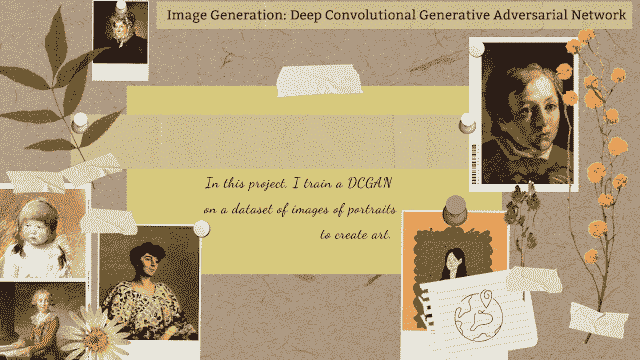
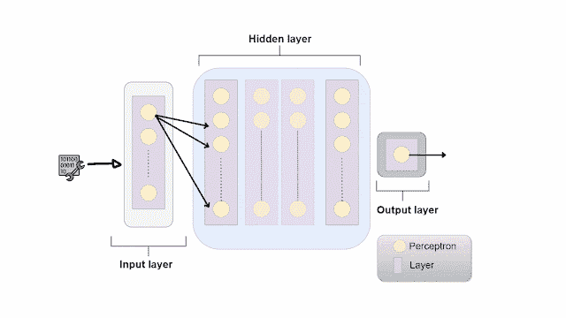
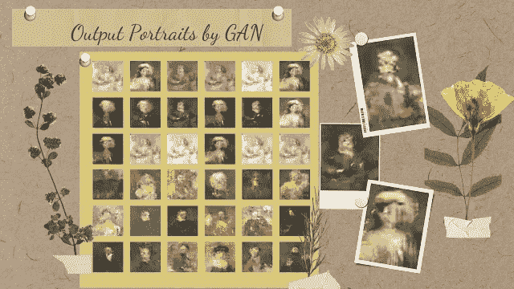

# AI &艺术

> 原文：<https://levelup.gitconnected.com/ai-art-9f844733445b>

当谈到艺术时，对于什么是艺术并没有一致的看法。关于“什么是艺术”有一个永恒的激烈争论在艺术学者和评论家中。所以当谈到称某样东西为“艺术”时，我坚持基本原则:如果你认为它是艺术，那么它就是艺术。

艺术界正在发生一个明显的范式转变，所有的狂热都围绕着 NFT。更新艺术精神既能容纳功利主义又能容纳美学观的思想流派。至于“艺术的目的”，它是人类经验的组成部分。我离题了，把这个博客引入了关于什么是艺术的永无止境的讨论。这个博客是关于人工智能的。

创建一个输出“艺术”的神经网络对我来说似乎是一个悖论。这里创意的缩影是什么？所创造的艺术或创造虚拟“大脑”的代码创造了艺术作品。如果我们试图解决这方面的所有问题，将需要大量时间和许多假设。因此，我认为，让我们把它作为一个主观问题留给思想家。

所以在我的上一篇博客[帖子](https://karnikakapoor.blogspot.com/2021/10/down-uncanny-valley.html)中“发布”了这张专辑之后，我认为现在是时候移交一个画架和画笔给另一个人工智能模型了。所以我训练 AI 创造另一种艺术形式。谈到绘画，我想让我的模特画我最喜欢画的东西:油画肖像。好吧，我们实际上不能用真正的油画颜料在画布上创作，因为让我们面对现实吧，我对拥有一个现实生活中的机器人并训练它这样做有太多的限制。因此，出于所有的意图和目的，我将坚持一幅油画的虚拟复制品，又名图像。

布面油画肖像

为此，我建立了一个生成性对抗网络(GAN)。生成建模是机器学习中的一项无监督学习任务，涉及自动发现和学习输入数据中的规则或模式。甘斯通过识别图案来工作，所以我用肖像图像来训练他们。数据集中的方向和姿态变化非常大，这使得模型很难识别模式。尽管知道这一点，我还是愿意试一试。因为我基本上喜欢油画肖像，并认为这将是可怕的，看看机器会处理出来。

**它是如何工作的！**

神经网络是深度学习的基础，其中算法受到人脑结构的启发。神经网络接受数据，训练自己理解数据中的模式，并在一组新的类似数据中给出输出。让我们了解一下神经网络是如何处理数据的。神经网络由多层感知器组成，感知器是神经网络的基本组件。该网络由三种层组成；输入层、输出层以及夹在它们之间的一个或多个隐藏层。

比方说，我们想要建立一个可以对猫和狗的图像进行分类的神经网络。输入层接收猫狗图像形式的数据，这些数据被编码为所有三个颜色通道中像素的数值。输入层的神经元通过通道连接到结果层，以此类推。这些通道中的每一个都被分配了一些权重。权重是一个数值，然后乘以相应的输入数据，即我们示例中的像素值。这个相乘的数据值被传递到相应的隐藏层。隐藏层中的每个神经元都与一个称为偏差的值相关联。其然后被添加到来自前一层的神经元的输入，并被传递到激活函数。激活函数输出决定相应神经元是否将被激活的结果。我喜欢把它想象成人脑中的突触。如果相应的神经元被激活，数据被转发到下一层。这种单向的数据流称为前向传播。对于所述神经网络具有的尽可能多的隐藏层，都是如此。在输出端，层端具有最高值的神经元启动，这是网络预测的决定因素。这种预测是以概率的形式进行的，概率较高的输出类是模型的最终分类。对于一个未经训练的神经网络来说，这绝对是任意的。

当我们训练一个网络时，它以这样一种方式迭代权重和偏差的值，最终值被优化以预测正确的输出。这是通过包括反向传播的双向信息流过程来完成的。为了连同训练数据一起训练神经网络，网络还被馈送图像的实际类别。这样，在每次迭代中，网络都可以评估误差。计算值和真实值的比较表明需要改变权重和偏差的值。当这个信息馈送通过网络反向传播时，权重被调整。这种信息的反向流动被称为反向传播。在训练过程中，这种向前和向后的信息流会对多个数据点进行多次迭代，直到误差非常低并且预测基本正确。

这种方法很适合对数据进行分类。为了生成图像，我将建立一个生成性对抗网络(GAN)。这是将问题作为监督学习问题的一种巧妙方式。它包括两个模型，一个生成器和一个鉴别器。

两个模型通过对抗过程同时被训练。生成器(“艺术家”)学习创建看起来像数据集的图像。而鉴别者(“艺术评论家”)则学习分辨真实图像和赝品。在训练期间，发生器在创建看起来真实的图像方面逐渐变得更好。同样，鉴别器在区分它们方面变得更好。当这个过程达到平衡时，鉴别者就不能再分辨真假了。

生成建模是机器学习中的一项无监督学习任务。它包括自动发现和学习输入数据中的规律或模式。由于甘斯通过识别数据中的模式来工作，我使用了肖像。然而，浏览了一下数据集后，我觉得这是一次冒险。数据集中的方向和姿态变化很大。牢记这一点，我仍然愿意尝试一下。因为肖像是我的最爱。我基本上喜欢油画肖像。

神经网络的输出在肖像中提取了一些模式。正如我们在下面的幻灯片中看到的。我和甘的模型工作得很好。

为了这一个，检查我的全部项目 Kaggle 笔记本。( [*此处*](https://www.kaggle.com/karnikakapoor/art-by-gan) *)*

gan 是出了名的数据饥渴，所以我会考虑增加数据集。数据中有许多不一致的地方，这对于 GAN 来说是相当复杂的。调色板和姿势方向不一致。清理肖像风格的数据肯定会有所帮助。对它进行更长时间的训练，即更多的时期，也会有所帮助。最后，人们总是可以努力为神经网络建立一个更健壮的体系结构。

尽管如此，我对结果还是很满意。距离我发表这本笔记本已经有几个星期了。所以，我很高兴地告诉你，它现在有一个卡格尔的金牌。这是我的第 15 个笔记本金牌(也是我的第 15 个笔记本)，我现在是一个 **Kaggle 笔记本电脑大师**！

***感谢访问我的博客；在这里见到你总是很高兴！***

链接到我的[笔记本](https://www.kaggle.com/karnikakapoor/code)

*原载于***。**