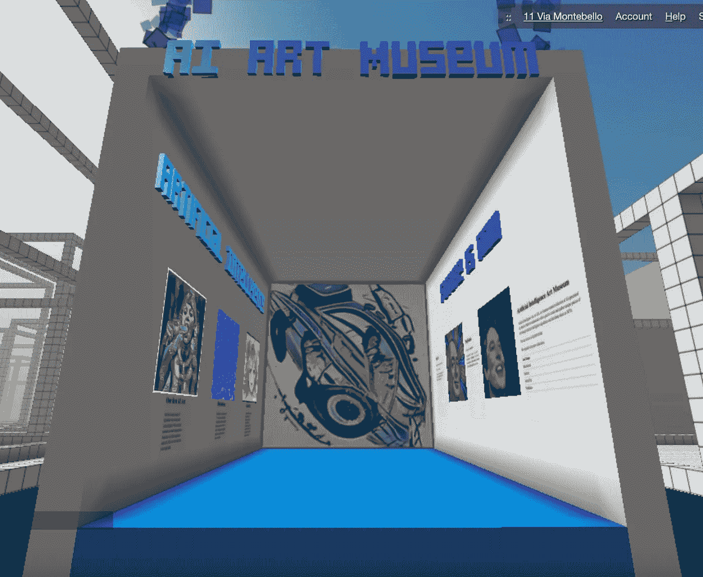

# 艾艺术博物馆

> 原文：<https://levelup.gitconnected.com/ai-art-museum-with-nfts-9a1220cfcbdc>

## 在数字博物馆展示你的艺术。

未来就是现在。新的艺术浪潮将是数字化的:它将被数字化地创造、展示和购买。

你可能[已经听说过 NFTs](https://medium.com/swlh/art-by-ai-sold-through-nfts-9a37278c9cdd) 。如果没有，快速回顾一下:NFT 代表不可替换的令牌，这是区块链上一种独特的不可互换的物品，您可以通过与智能合约(最常见的是 ERC-721)进行交互来获得。

简而言之，想象一份所有权证明被数字化并公开。这就是 NFT 的真正含义:你可以通过以前的交易/所有者的历史来证明你的真实性。

这就是为什么 NFT 对数字艺术世界如此完美。他们建立数字原件。数码绘画不再仅仅是。png 文件，有。png 文件加上区块链上的唯一地址来标识和描述它们。这是艺术家们真正在网上销售原创作品的方式。

我最近刚刚进入 NFTs，正是它们让我对整个加密世界充满信心。以下是我的信念:

# 3 个关于未来的信念

1.  **权力下放是关键。**
2.  **比特币将成为全球货币标准。**
3.  **数码和实物一样好。**

这与我的普遍信念相符，即人工智能将接管世界——它将无处不在，并将为那里的每一项工作提供动力，使大多数工作自动化，优化其余工作。

按照这些信念行事意味着我想:

*   大量接触加密和非加密技术，
*   在人工智能解决方案上加倍下注，
*   如果可能的话，把 AI 和区块链合并。

2021 年 3 月是开创性的，因为整个世界都被 NFTs 和整个加密世界所征服，比特币和以太坊[价格飙升](https://coinmarketcap.com/)，[6900 万美元的 NFT 拍卖会](https://www.christies.com/features/Monumental-collage-by-Beeple-is-first-purely-digital-artwork-NFT-to-come-to-auction-11510-7.aspx)，以及主要公司在其服务中采用加密(特斯拉、Visa、PayPal，仅举几例)。

未来将写在区块链上，因为这是一种存储交易历史和验证真实性的简单方法。

# 如何创建 NFT

对我个人来说，3 月也是开创性的，因为我冒险进入 NFTs，尽可能多地了解整个空间，阅读和观看那里的一切，并试图赶上过去 3 年(第一部 NFT， [CryptoPunks](https://www.larvalabs.com/cryptopunks) 于 2017 年问世)。

然后是实际测试它的时刻，创建我的第一个 NFTs，同时使用人工智能算法生成艺术。

OpenSea 成了我的首选平台，它是目前 NFT 最大的市场，使用起来非常简单。你只需要 Metamask 钱包(Chrome 插件)登录，就可以开始提交 NFTs 了。为了卖掉它们，你的钱包里需要有一些 ETH 来支付“汽油”(交易费)，但这也很容易克服。

事实证明这是有史以来最好的决定。我的收藏， [**AIA 或人工智能艺术**](https://opensea.io/collection/artificial-intelligence-art-aia/) 很受欢迎，有一百多人加入并收集个人作品。

我建立了一个 AIANFT.COM 网站来发布新的滴剂[在推特上创建了一个社区](https://twitter.com/AIA_NFT)。

最后的增加是以数字博物馆的形式出现在区块链的隐体素世界中。

[**你可以在你的浏览器中查看——无需安装**！](https://www.cryptovoxels.com/play?coords=S@636E,581N)

[艾美术馆关于隐体素](https://www.cryptovoxels.com/play?coords=S@636E,581N)

# 人工智能艺术的下一步是什么？

这只是开始。整个 NFT 空间有如此多的东西。加密世界是超级快速的，它不断变化——这还为时过早！

我计划继续探索，购买和收集 NFT，利用人工智能创造新的艺术，或者[不(见我在 Rarible 上的简介)](https://rarible.com/przemekc)。有这么多要看和要理解的东西，真令人兴奋。

我迫不及待地想看到接下来会发生什么:在接下来的几个月和几年里，会有什么样的平台、什么样的代币、什么样的艺术品和收藏品被创造出来并与之互动。随着越来越多的艺术家来到这个空间，区块链将举办世界各地创作的大部分艺术。

[友邦保险 NFT 项目](https://aianft.com)还将通过新的 NFT 集合、赠品、社区建设、创造更多的区块链资产进行交易以及创建我们自己的平台来保持增长。

变化即将到来。

## P.S .想从 Crypto 开始？[在币安注册，轻松购买加密资产](https://www.binance.com/en/register?ref=KX4WY3HO)。