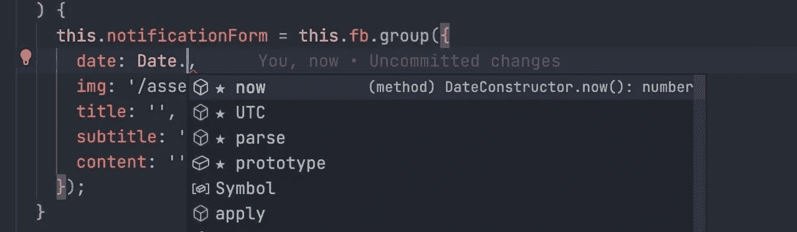
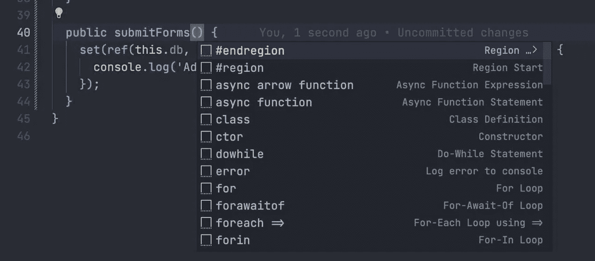
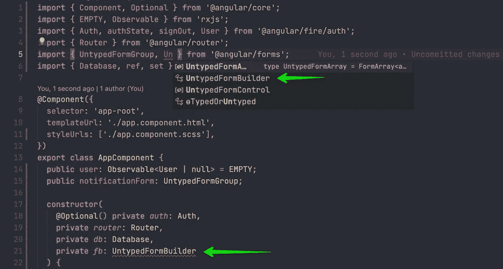
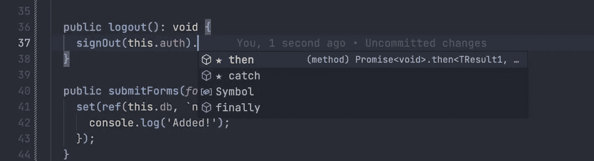
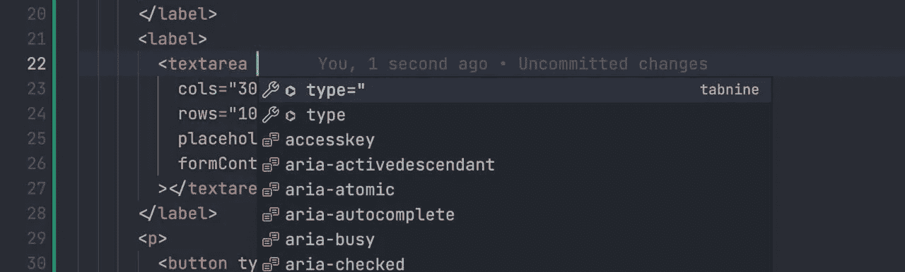
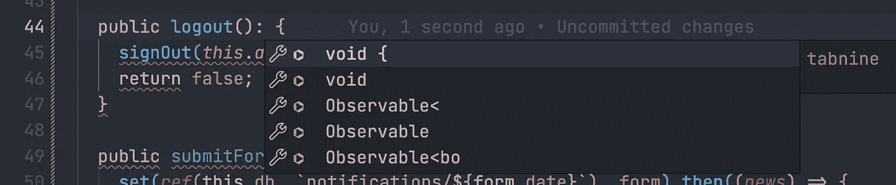
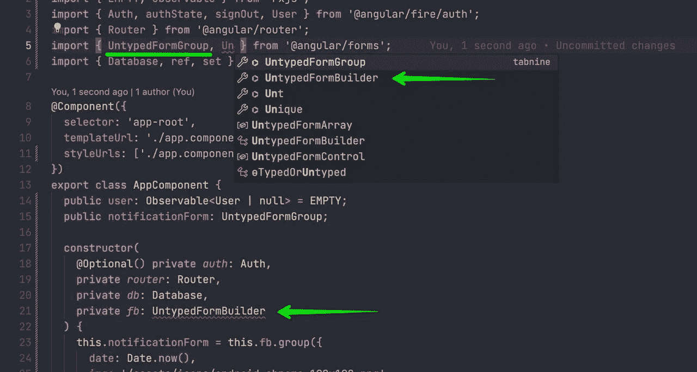

# AI 编码助手大战:Tabnine vs IntelliCode vs Kite

> 原文：<https://levelup.gitconnected.com/ai-coding-assistants-battle-tabnine-vs-intellicode-vs-kite-6aca84bfe224>

## 免费人工智能编码助手比较

人工智能生成的图像:机器人坐在咖啡馆的桌子旁，在笔记本电脑上工作。

早些时候我发表了一篇关于人工智能代码助手 GitHub Copilot 的文章，在那里我展示了它如何与动画演示一起工作。今天我想回顾一下最受欢迎的免费代码助手，选出最适合 VS 代码的。

今天有三个最受欢迎的人工智能助手:

*   Microsoft Visual Studio intelli code(免费)
*   Tabnine(免费和付费版本)
*   GitHub Copilot(付费)
*   风筝(免费)

为什么我说三个？因为另一家公司已经收购了 Kite 软件，在此之后(超过 1 年)，无法通过官方网站获得。关于凯特的未来也没有任何官方声明。

> *如果你真的想在你的系统上尝试风筝，它仍然可以通过下面的链接获得:* [【https://linux.kite.com/dls/linux/current】](https://linux.kite.com/dls/linux/current)
> 
> [https://release.kite.com/dls/mac/current](https://release.kite.com/dls/mac/current)

为了比较这些助手，我将从头开始做一个小角度的应用程序

*   Firebase 身份验证登录页面
*   授权保护
*   重定向到主页
*   在主页上，我将显示一个用于发布我的 side hustle 项目通知的表单— [methodist.io](http://methodist.io) 。

# Visual Studio 智能代码

IntelliCode 是最受欢迎的人工智能助手，拥有 2250 多万用户。这个扩展为 Python、TypeScript/JavaScript 和 Java 开发人员提供了 AI 辅助开发功能。它是微软专门为 VS 代码创建的。目前，它是大多数人安装的 VS 代码的必要扩展。

## JS 核心建议

对于这项任务，IntelliCode 处理得很快。因此，来自文档、窗口和 DOM 的方法和变量几乎总是 100%准确。

我想引起你的注意。这里我在 Angular 类中定义了反应形式。因为，对我来说，AI 要读懂这个语境。稍后您将看到扩展如何重用它。(剧透:nohow)

## 类型定义

这里有一个例子。这是包含反应形式实例的角度项目中的角度构件。

但是当我开始定义提交函数时，它并没有提出类型、参数等。

所以，你可以看到，这里的 AI 只能对对象和类的属性和方法进行排序。

## 出口和进口

当您确切知道方法或类的名称时，VS 代码可以自动导入依赖项。您可以在代码中写入名称，按 cmd/ctrl+space，然后选择从建议中导入。

但是，如果您不记得类名或者想查看导出变量的完整列表，该怎么办呢？

以下是您将看到的内容:

在这种情况下，**扩展将不会做任何事情**。相反，你会看到 VS Code core 的提案。**对我来说最奇怪的是，它没有首先提出代码中已经存在的导入。**

> 对于导入，还有一个必备的扩展— [TypeScript Importer](https://marketplace.visualstudio.com/items?itemName=pmneo.tsimporter) 。如果你仍然不使用它，它将真正简化你的生活。

## 导入依赖项的方法

如果一个依赖项有一个接口，IntelliCode 会以相当好的准确度提出正确的建议。与核心 JS 相同。

但是不要期望建议会引入一些应该在您刚刚输入的函数中用作参数的东西。例如，在 Firebase set 函数中，我们需要导入并提供`ref(dbInstance, ‘path’)`作为第一个参数。当然，它不会建议你这么做。

## IntelliCode 的结果

*   将代码编写速度提高大约 10–15%
*   脱机工作
*   隐私方面
*   它只是以一种更好的方式对代码自动完成建议进行排序。真的很难叫它代码助手😄
*   它不适用于 HTML

# 泰伯宁

它是一个流行的人工智能代码助手，可以与许多语言和 ide 一起工作。它尊重代码隐私，开发人员可以选择在本地机器或云上处理数据模型。

Tabnine 有两种定价方案。

*   第一个是完全免费的，可以和 IntelliCode 相比。
*   第二个将花费 12 美元/平方米，但它将建议提升到另一个层次。Pro 版可以和 GitHub Copilot 比较，因为它可以提示整个代码行。

> Tabnine Pro 和 GitHub Copilot 我将在接下来的帖子中进行比较。在那里，我将尝试检查它们是否值 10-12 美元/平方米👀。

在这篇文章中，我们比较的是自由代码助手。

## 语言支持

Tabnine 最强大的一面是支持的语言列表。

即使没有在官方网站上列出，Tabnine 仍然试图在编写代码时提出一些有用的东西。例如，Tabnine 处理 HTML 文件。

不多，但有一些)

## JS 核心建议

在目前的测试和我以前的经验中，Tabnine 提出的建议不多，但几乎都是我想要的。

下面是一个定义初始表单对象的示例。

所有五行提议相同，略有不同。助手决定`.UTC()`或`.parse()`方法不适合我们)。但无论如何，一个建议是正确的。

与 IntelliCode 不同，Tabnine 不仅可以建议对象或类的属性。但是甚至建议使用依赖于代码上下文的类。

## 类型定义

使用打字的情况比使用智能代码的情况好得多。在键入`:`字符后，Tabnine 试图提出均匀的类型或接口。

但后来，我发现这是一个巧合。在函数末尾添加带有布尔值的 return 不会影响建议。

所以聊胜于无，但我不会强烈依赖它。

## 出口和进口

依赖项导入似乎是 VS 代码中最复杂的任务之一。无论您喜欢哪个代码助手，都不能保证它会建议导出变量，即使是从同一目录下的文件中导出。

所以我们得到了与智能代码相同的结果。

不管你是否已经导入了变量。如您所见，它在第一个位置提出了一个已经导入的项目。忽略第 21 行的未知变量。

## 泰伯宁的结果

*   将代码编写速度提高大约 15–20%
*   脱机工作
*   隐私方面
*   对于低功率的机器，AI 可以在云中工作(可选)
*   支持多种语言，包括 HTML
*   有时它隐藏 VS 代码建议。因此，当 Tabnine 不能预测您想要的内容时，方法或属性根本无法显示
*   非常有限的进口支持

## 摘要

风筝正式不可安装已经一年多了。所以在免费代码助手中，Tabnine 表现得最好。使用 Tabnine 总比没有好，它会提高你的代码输入速度 15-20%。

但老实说，在 VS 代码中，IntelliCode 和 TabNine 都离 Web Storm 自动完成建议非常远。可能是代码编辑器的限制，因为 VS 代码不是真正的 IDE。Web Storm 使用索引数据库来提供最好的搜索结果和建议。

稍后我会检查 Tabnine Pro 和 GitHub Copilot 的功能、速度和准确性。因此，我们将澄清，为一个人工智能助手支付 10-12 美元是否值得？

 [## Github Copilot:使用 3 个月后的回顾，并举例说明

### 它在实际项目中是如何进行的，它真的有帮助吗？

javascript.plainenglish.io](https://javascript.plainenglish.io/github-copilot-review-after-3-months-of-usage-with-examples-74335cd45478) 

非常感谢您阅读我的文章！如果你不是一个媒体成员，想要支持我，你可以通过[点击这个链接](https://golosay.medium.com/membership)来支持我。中型会员将允许你阅读我的帖子和其他人的帖子。再次感谢大家的支持！