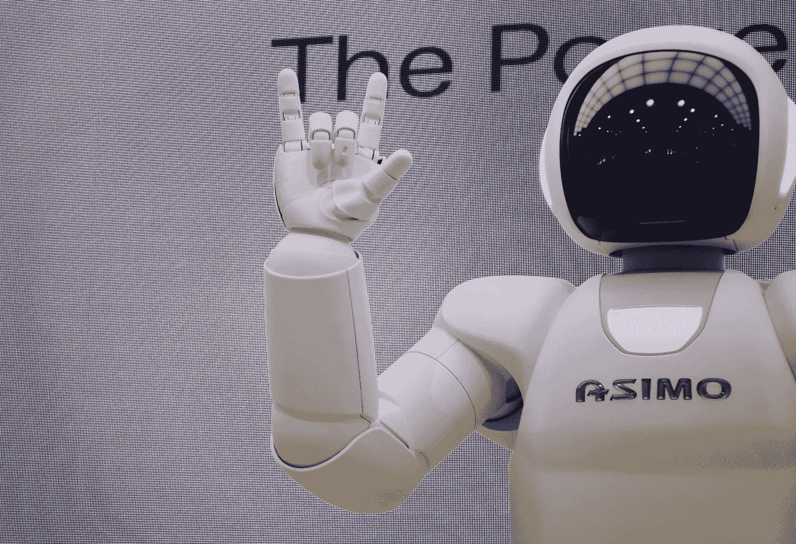
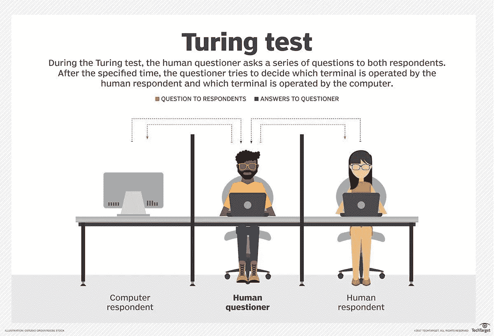
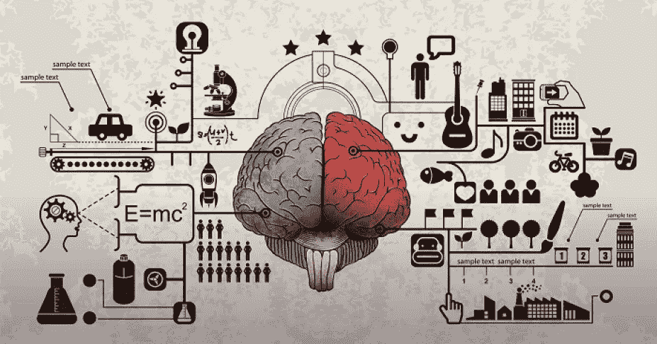

# AI、机器学习、深度学习——有什么区别？

> 原文：<https://levelup.gitconnected.com/ai-machine-learning-deep-learning-what-are-the-differences-3c2c13c0388e>

在 [Unsplash](https://unsplash.com/s/photos/artificial-intelligence?utm_source=unsplash&utm_medium=referral&utm_content=creditCopyText) 上由 [Franck V.](https://unsplash.com/@franckinjapan?utm_source=unsplash&utm_medium=referral&utm_content=creditCopyText) 拍摄的照片

## 初学者指南

## 如果你是数据科学的新手，或者对人工智能、机器学习、深度学习的定义感到困惑。

# 人工智能

AI 是人工智能的缩写。纵观人工智能的历史，研究人员分成了 4 种不同的方法:

*   为人处事
*   人性化思考
*   理性思考
*   理性行事

这项研究中最具挑战性的任务是编程计算机有效地模仿人类的行为，包括行动和思想。人工智能研究人员还试图灌输以下特征:

*   **推理:**用逻辑的方式解决问题的能力。
*   **知识:**在一个情境中消化信息的能力(比如分析现实世界中有多少物体、事件、明显的情境，并根据相应物体的特征进行分类)。
*   **规划:**根据知识创造和追求目标的能力。
*   **沟通:**理解人类书面和口头沟通的能力。
*   **感知:**从图像、音频和其他类型的输入中理解上下文的能力。

## 图灵测试——人性化行动

图片由 [SearchEnterpriseAI](https://searchenterpriseai.techtarget.com/definition/Turing-test) 提供。

1950 年，一位名为艾伦·图灵的著名数学家提出了一种方法来确定人工智能是否像人类一样行事。这个提议被称为“图灵测试”。

根据图灵的说法，其目的是检验系统的智能程度。这些测试以类似讨论的方式进行:一个人问一个问题，另一个人回答这个问题，计算机会对这个问题做出反应。在讨论过程中，如果提问者不能区分答案是来自人类还是机器，就可以认为机器“聪明”。

这种方法带来了显著的成就:

*   自然语言处理:计算机能够理解文本或人类的声音，并做出回应。
*   知识表征:通过视觉、听觉或文档记忆知识的能力。
*   自动推理:机器能够利用自己的知识来回答问题或做出决定。
*   机器学习:计算机能够适应环境，然后从获得的知识中总结出新的原则，并将其用于决策目的。
*   计算机视觉:观察和确定物体的能力。
*   机器人技术:这种机器能够与附近的物体互动，也能够在一个区域内移动。

## 认知科学——人性化思考

**像人类一样思考**是另一种方法。研究人员将需要一个大型图书馆来从事这一领域的研究。如果我们希望计算机像人类一样思考，我们首先需要了解人类是如何思考的。

有 3 种方法可以检查:

*   观察思考过程
*   观察一个人的行动
*   观察大脑活动

如果我们给计算机一个类似人类的输入，并接收一个类似人类的输出，我们可以认为它在某些时候像人类一样思考。有一种信念认为，如果我们能够将图灵测试和认知科学的结果结合起来，我们就可以更快地实现人工智能的目标。

## 逻辑——理性思考

然而，说我们希望计算机像人一样思考是一项广泛而具有挑战性的任务，因此我们将问题缩小到:理性思考就足够了。

在 19 世纪，逻辑学家发明了数学符号来描述世界上物体之间的陈述或关系，这对后来训练计算机很有用。然而，这种方法是一条崎岖的道路。发明者面临两个挑战:

*   首先，计算机无法消化**非正式的**知识，并将其用**正式的**术语表达出来，尤其是这些知识不能保证 100%确定。
*   第二，在理论上解决一个问题和在现实世界中解决是有很大区别的。我们需要一个大的数据集作为输入，这会耗尽任何计算机的资源，即使输入是一个有几百个事实的问题。

## 代理人——理性行事

显然，计算机程序必须做一些事情，但是人们期望计算机代理满足更多的要求。它们必须自主运作，从周围环境中收集信息，长期生存，适应任何变化，制定计划，并努力实现这些计划。

一个典型的例子是美国国家航空航天局的机器人，它们被发射到环境恶劣的星球上，很少或根本没有收到人类的命令。他们如何收集土壤，在暴风雨和多风的气候中生存，制定自己的太阳能电池充电计划以继续任务？

# 机器学习(ML)和深度学习(DL)

人工智能只是“像人一样思考”方法的一部分，这种方法只是研究人工智能的四种方法之一。

为了达到最大似然目标，研究人员一直在发明算法和不同的方法来处理问题:

*   监督学习:决策树、k-NN、朴素贝叶斯、SVM、神经网络、**深度学习**等。
*   无监督学习:k 均值，层次聚类
*   强化学习:被动/主动/概括

我们可以再次看到，深度学习只是使用监督学习解决问题的方法之一。那么，为什么深度学习在我们的行业中是如此重要的话题呢？

## 深度学习:

**优势:**深度学习是一种实现机器学习的技术，以达到计算机视觉或语音识别的最先进的结果。深度神经网络有效地处理图像、音频和文本数据，能够通过批量传播用新数据更新模型。模型的体系结构(层的数量和结构)可以应用于不同的问题，特别是，隐藏层在降低特征工程的成本中起作用。

**弱点**:深度学习不是瑞士军刀，需要某个领域的大数据集来训练。实际上，在一些基本的机器学习任务中，深度学习可以被[树集成方法](https://towardsdatascience.com/ensemble-methods-bagging-boosting-and-stacking-c9214a10a205)击败。此外，训练一个深度学习模型是昂贵的。它需要强大的资源和高质量的专家来执行超参数(层数、每层的节点数、学习率)的调优。

# 结论

我希望我的读者对 AI、ML 和 DL 的定义有一个清晰的了解。如果你想以步入 AI 世界为职业，问问自己，你的目标是哪种途径(思维或行动)，以及类人的水平(刚刚够或接近人类)。这些人工智能系统需要大量的努力来完成，但也有很高的失败风险。然而，如果他们成功地完成了为人类服务的使命，你将改变世界。人工智能是未来！

# 参考

*   人工智能:一种现代方法。(2016).
*   [Copeland，M. *人工智能、机器学习和深度学习的区别？:英伟达博客。* (2019)。](https://blogs.nvidia.com/blog/2016/07/29/whats-difference-artificial-intelligence-machine-learning-deep-learning-ai/)
*   [Sebastian，R. *深度学习和常规机器学习在概念层面上是什么关系？* (2020)。](https://sebastianraschka.com/faq/docs/difference-deep-and-normal-learning.html)
*   [Oppy，g .&Dowe，D. *图灵测试。* (2016)。](https://plato.stanford.edu/entries/turing-test/)
*   [m . Brody，e . t . Mitzenmacher，& Tsai，J. *控制天网:人工智能和大数据中的监管风险。* (2019)。](https://www.americanbar.org/groups/business_law/publications/committee_newsletters/banking/2019/201904/fa_4/)