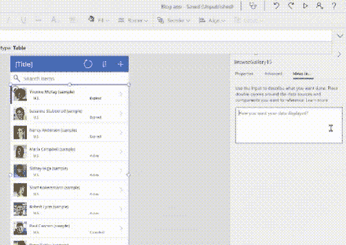

# 人工智能自动完成代码？微软和 GPT-3 你看了吗

> 原文：<https://levelup.gitconnected.com/ai-powered-autocomplete-for-code-microsoft-and-gpt-3-have-you-covered-c890452cdc57>

## 将自然语言转换成代码片段

约书亚·阿拉贡在 [Unsplash](https://unsplash.com/?utm_source=unsplash&utm_medium=referral&utm_content=creditCopyText) 上拍摄的照片

去年，微软扩大了与总部位于旧金山的人工智能研究公司 OpenAI 的合作关系。更有意思的是:微软现在获得了 GPT-3 语言模型的独家许可。如果你看过[人工智能写的文章](https://www.theguardian.com/commentisfree/2020/sep/08/robot-wrote-this-article-gpt-3)或[基于文本的冒险游戏](https://www.gizmodo.com.au/2020/08/this-ai-powered-choose-your-own-adventure-text-game-is-super-fun-and-makes-no-sense/)展示它的人工智能印章，你就会知道这值得再看一眼。

 [## 微软的 OpenAI 合作伙伴关系可能会永远改变视频游戏 RPG

### 最近贝塞斯达的收购仅仅是个开始

superjumpmagazine.com](https://superjumpmagazine.com/microsofts-openai-partnership-might-change-video-game-rpgs-forever-fa0431b2c083) 

现在，这个雷德蒙巨人已经开发了该模型的另一个用例:将自然语言转换成代码。新工具只能用[微软 Power Fx](https://powerapps.microsoft.com/en-us/blog/introducing-microsoft-power-fx-the-low-code-programming-language-for-everyone/) (一种基于微软 Excel 查询的语言)开发公式。但这是一个开始。可能性是无穷无尽的。

# 自动完成:编码者的梦想成真

微软开发 Power Fx 的目的是模糊制造商和开发者之间的界限。其“低代码，无代码”主要针对企业级。但是，在像 GPT-3 这样的预测模型的帮助下，这些好处可能很快就会渗透到从事数据分析和可视化的程序员身上。

微软展示了 GPT 3 的实力与现实生活中的场景，饮料巨头可口可乐。该公司使用一个应用程序来跟踪其浓缩可乐的供应情况。该应用程序可以像 Word 文档一样进行修改。我见过不同领域的朋友发现这种数据组织非常混乱，很高兴看到技术提供了解决方案。至于特定的查询，仍然需要 Microsoft Power Fx 公式才能运行。这就是微软的新工具进入画面的地方。

看了一眼微软的 Power Fx 代码，让我想到了 SQL 查询。虽然这些查询并不因为它们的难度而臭名昭著，但学习基本查询仍然会给工作流程增加一些摩擦。由于新的更新，用户可以简单地用自然语言编写他们的查询。GPT-3 负责剩下的工作，将其转换成 Power Fx 数据库查询。非编码人员现在可以使用一种工具，这种工具有可能改进他们的工作流程。

微软自然语言翻译预览。来源:微软。

# 自动完成功能尚未完成

虽然这个工具是朝着正确方向迈出的一步，但它绝不是完美的。人工智能语言模型倾向于混合单词和短语来提供完全脱离上下文的结果。这意味着人们可能需要编码经验来验证所述程序的结果，这违背了该工具的初衷。但是对于像微软的 Power Fx 这样的简单代码，这可能不是一个限制。

> “它是数据绑定的，单行表达式；没有构建和编译的概念。你写的东西会立即计算出来。”
> —微软低代码应用平台 CVP 查尔斯·拉曼纳

[The Verge](https://www.theverge.com/2021/5/25/22451144/microsoft-gpt-3-openai-coding-autocomplete-powerapps-power-fx) 指出，Power 应用程序将要求用户确认所有生成的 Power Fx 公式，作为额外的缓冲。我希望人们不要只是点击第一个自动完成建议，就好像它是一个谷歌搜索。虽然这些语言模型在过去已经有过显示偏见的实例，但我相信这不会妨碍用户处理(大多数)数据库查询的能力。微软对此似乎也有一些解决方案。

# 反对偏见倾向

解决我们的机器学习模型中的偏见不是一件简单的事情。这在过去已经引起了反响，尤其是在[雇佣员工](https://www.nber.org/papers/w9873)的领域。人们不会简单地忘记让模拟病人自杀的医疗人工智能聊天机器人。在医疗保健等领域，任何形式的不一致都是绝对不可接受的。The Verge [报道](https://www.theverge.com/2021/5/25/22451144/microsoft-gpt-3-openai-coding-autocomplete-powerapps-power-fx)如果微软的系统产生了它认为值得关注的东西，它会提示用户寻求技术支持。虽然这种无代码解决方案绝非完美，但它仍然是朝着正确方向迈出的一步。

除了微软庞大的以业务为中心的应用程序套件之外，任何代码查询都不能有其他应用程序。有一天，编码人员可能会模糊基本编程和较弱的无代码替代方案之间的界限。它让数百万用户有能力开发他们以前无法创造的东西。随着这些工具比以往任何时候都更容易获得，没有人知道未来会发生什么。毫无疑问，人工智能自动完成将会继续存在。它也是为了让您住得更好。