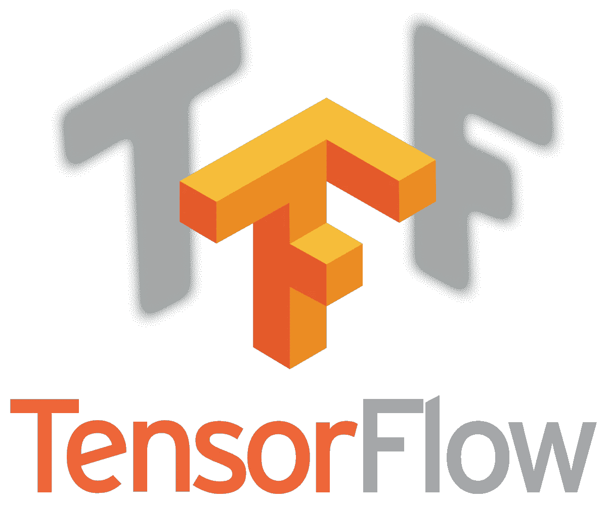

# 人工智能革命正在改变网络世界

> 原文：<https://levelup.gitconnected.com/ai-revolution-is-changing-the-web-world-fe38e751ede>

## 用于 Web 开发的顶级人工智能和机器学习框架

在 [Unsplash](https://unsplash.com/s/photos/ai?utm_source=unsplash&utm_medium=referral&utm_content=creditCopyText) 上由 [Franck V.](https://unsplash.com/@franckinjapan?utm_source=unsplash&utm_medium=referral&utm_content=creditCopyText) 拍摄的照片

科技领袖对人工智能的争夺是如此残酷和激烈。人工智能日复一日地改变着一切。Web 开发也不例外。

有一个网站是强制性的所有商业利基市场。人工智能将使网页设计和开发成为可能。根据 Statista 的报告，2025 年人工智能的收入预计将达到[1260 亿美元](https://www.statista.com/statistics/607716/worldwide-artificial-intelligence-market-revenues/)。

作为一名网络软件工程师，我今天选择给你一个关于 2020 年及以后网络的顶级 AI 和 ML 框架的简要愿景。这将改变未来 web 开发人员的角色和需求技能。

准备好了吗？走吧~ ᕕ(ᐛ)ᕗ

# 张量流

[TensorFlow](https://www.tensorflow.org/js) 是由 Google Brain 团队开发的用于机器学习的 JavaScript 库，于 2015 年推出。

## 特点:

*   **写于:** C++，Python 和，CUDA
*   **平台:** Linux，macOS，微软 Windows，安卓。

## 关键点:

*   Web 开发人员可以在浏览器中或 Node.js 下运行现有模型。
*   使用您的数据重新训练预先存在的机器学习模型(迁移学习)
*   用灵活直观的 JavaScript APIs 开发 ML。

# 阿帕奇看象人

[Apache Mahout](https://mahout.apache.org/) 是 Apache Software Foundation 在 2008 年开发的开源机器学习框架。

## 特点:

*   **写于:** Java 和 Scala
*   **平台:** Apache Hadoop，Apache Spark，Apache Flink，Scala+

## 关键点:

*   通过使用[分布式线性代数框架](https://mahout.apache.org/docs/latest/algorithms/linear-algebra/)来提高 web 应用程序的性能，该框架具有数学上表达类似 R 的 Scala DSL 用于分布式算法。
*   使用 Apache Hadoop 库在云中构建可扩展的监督(分类)和非监督(分组)机器学习系统。
*   发现项目和分组数据之间的相似性的聚类实现因此增强了推荐系统。

# 微软认知工具包

一个免费易用的开源深度学习工具包。由微软研究院开发，成立于 2016 年。

## 特点:

*   **写于:** C++和 Python
*   **平台:** Windows，Linux
*   **模型类型:**支持前馈 DNNs、卷积和递归神经网络

## 关键点:

*   高效的图像识别
*   高效的语音识别
*   高效的手写识别
*   因其语音识别、预测分析和理解大型非结构化数据集的能力而被大公司使用和熟知。

# 咖啡 2

[Caffe2](https://caffe2.ai/) 是一个灵活的深度学习框架，由伯克利视觉和学习中心开发，最近成为 [PyTorch](https://pytorch.org/) 的一部分。

## 特点:

*   **写于:** C++和 Python
*   **平台:** Linux，macOS，Windows

## 关键点:

*   易于使用和快速。
*   灵活的高性能框架，适合您的机器学习产品使用。
*   模块化并促进深度学习中想法和实验的快速原型化。

# 阿帕奇辛加

[Apache Singa](https://singa.apache.org/) 是由 Apache Software Foundation 开发的可扩展、灵活的深度学习平台，于 2015 年推出。

## 特点:

*   **用:** C++，Python，Java 写成
*   **平台:** Linux，macOS，Windows

## 关键点:

*   可扩展性:SINGA [将训练并行化，优化通信开销](https://singa.apache.org/docs/dist-train)提高训练可扩展性。
*   效率:[构建计算图](https://singa.apache.org/docs/graph)优化训练速度和内存占用。
*   可用性:有一个简单的[软件栈和 Python 接口](https://singa.apache.org/docs/software-stack)来提高可用性。

# 外卖:

*   毫无疑问，AI 正在改变 IT 世界。
*   很明显，它将为 web 开发带来很多价值和力量。
*   统计数据显示了这个领域的激烈竞争。
*   明天，网络开发人员将在人工智能和人工智能技能方面更具竞争力。
*   有了人工智能，网络应用将变得更加智能。
*   根据这篇[文章](https://www.forbes.com/sites/louiscolumbus/2017/09/10/how-artificial-intelligence-is-revolutionizing-business-in-2017/#7d4382c45463)，84%的企业表示，人工智能将使他们能够保持或获得竞争优势。
*   根据这篇[文章](https://www.forbes.com/sites/louiscolumbus/2017/09/10/how-artificial-intelligence-is-revolutionizing-business-in-2017/#7d4382c45463)，技术、媒体和电信行业 72%的受访者预计人工智能将在未来五年对产品供应产生重大影响。

亲爱的读者，感谢你的时间。关注我，了解更多关于网络开发和人工智能的有趣故事\ (•◡•) /

**后会有期(ﾉ◕ヮ◕)ﾉ*:･ﾟ✧**

**FAM**