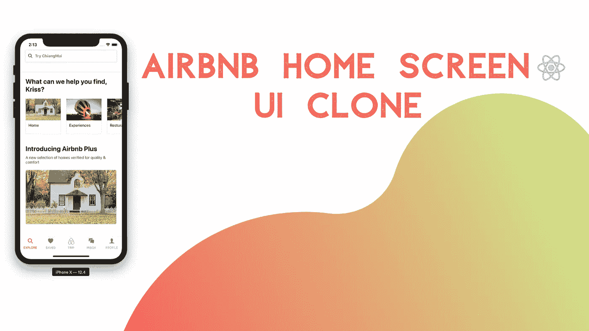
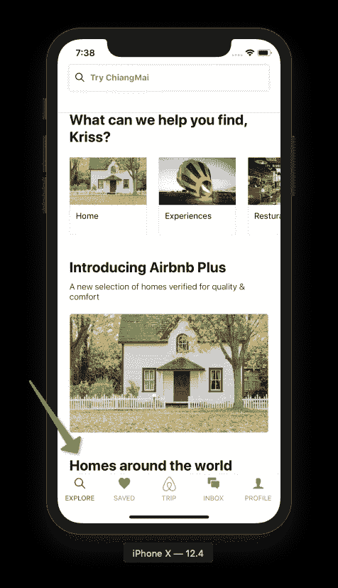
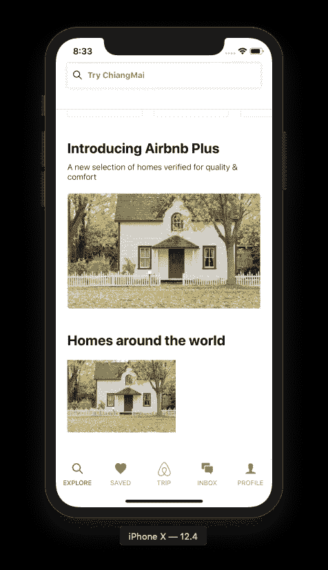
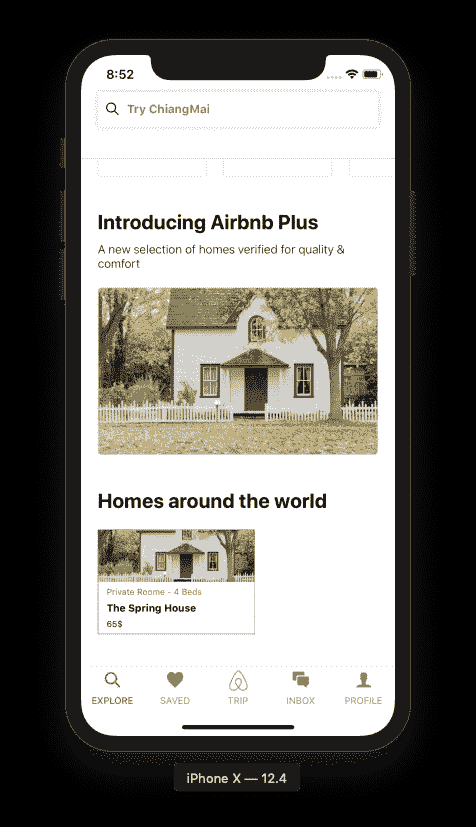
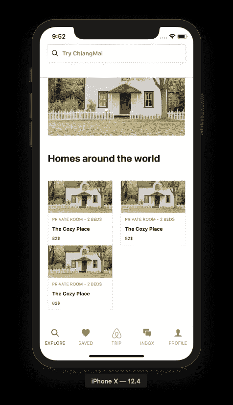
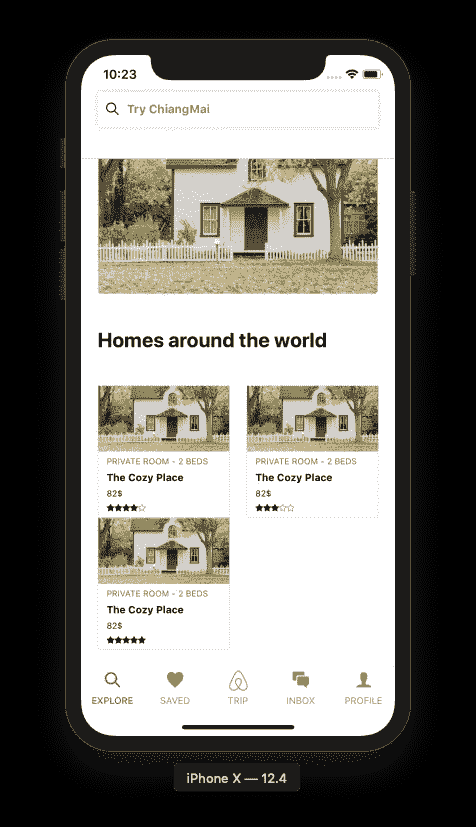

# 世界各地的家屏幕 Airbnb 主屏幕 UI 克隆，使用 React Native #3

> 原文：<https://levelup.gitconnected.com/airbnb-home-screen-ui-clone-with-react-native-3-home-around-the-world-ff0c5d8d6043>



本教程是我们使用 React Native 克隆 Airbnb 主屏幕 UI 的第三部分。在前一部分中，我们成功地实现了类别和 Airbnb Plus 部分。本教程是我们上一部分停止的同一教程的继续。建议浏览前面的部分，以便更好地理解和洞察整个项目。

如前所述，本系列教程的灵感来自于[React native real estate template](https://www.instamobile.io/app-templates/real-estate-app-template-react-native/)，它帮助我们构建一些令人惊叹的现成应用程序，任何人都可以使用它们来创建创业公司或销售应用程序模板。这第三部分也是 Youtube 视频教程中由不确定的程序员[为 Airbnb 克隆的编码实现和设计的延续。](https://www.youtube.com/watch?v=Ebqtkqw95Y8)

我们系列教程的这一部分相当简单。这里，我们将实现一个在主屏幕 UI 中显示主包的部分。这个想法是在网格样式的布局中包含一个带有一些描述、标题和价格的图像。然后，我们稍后还将包括[**react-native-star-rating**](https://github.com/liuchungui/react-native-star-rating)包中的星级。

*那么，我们开始吧！*

## 添加标题

我们将在家庭套餐部分添加一个标题。为此，我们需要在 Airbnb Plus 部分下面的 Explore.js 文件中使用带有一些内联样式的`Text`组件。然后，我们需要用带有某种边距样式的`View`组件包装`Text`组件，如下面的代码片段所示:

```
<View style={{ marginTop: 40 }}>
       <Text
         style={{
           fontSize: 24,
           fontWeight: "700",
           paddingHorizontal: 20
         }}
       >
         Homes around the world
       </Text>
  </View>
```

w 在 Airbnb Plus 部分正下方的模拟器屏幕中获得以下结果，箭头所示:



## 添加图像和描述

我们需要在刚刚实现的标题部分下面添加一个图像及其描述。对于图像，我们将使用 react-native 包提供的`Dimensions`组件。`Dimensions`组件使我们能够获得应用程序屏幕的全部宽度和高度。我们需要从 react-native 包中导入`Dimensions`组件和其他组件。然后，我们需要分配两个常量`height`和`width`，它们使用`Dimentions`组件提供的`get()`方法初始化为屏幕的整个高度和宽度，如下面的代码片段所示:

```
import {
  View,
  TextInput,
  Text,
  Image,
  SafeAreaView,
  ScrollView,
  Dimensions
} from "react-native";
import Category from "../components/Category";
const { height, width } = Dimensions.get("window");
```

我们需要创建新的`View`包装器。首先我们需要定义一个父`View`组件，然后在父组件中定义两个`View`组件，它们是子`View`组件。添加子组件`View`是为了显示图像和文本描述。

包装`Image`组件的`View`组件由自定义`width`和`height`进行样式化，它们被初始化为屏幕宽度的一半和屏幕高度的三分之一。图像组件被绑定到它自己的内联样式属性，如下面的代码片段所示:

```
<View style={{ paddingHorizontal: 20, marginTop: 20 }}>
     <View style={{ width: width / 2, height: width / 3 }}>
       <Image
         style={{
           flex: 1,
           width: null,
           height: null,
           resizeMode: "cover"
         }}
         source={require("../images/home.jpeg")}
       />
     </View>
     <View style={{ flex: 1 }}></View>
 </View>
```

我们在标题下方得到一幅美丽的图像，如下面的模拟器截图所示:



现在是时候在图片下面添加描述部分了。我们已经为这个部分定义了一个子组件`View`。我们将在这个`View`组件中添加三个`Text`组件，它们都有自己的内联样式属性。`View`组件本身有自己的一组内联样式属性，其中包括`flex`样式，如下面的代码片段所示:

```
<View
  style={{
    flex: 1,
    alignItems: "flex-start",
    justifyContent: "space-evenly",
    paddingLeft: 10
  }}
>
  <Text style={{ fontSize: 10, color: "#b63838" }}>
    Private Roome - 4 Beds
  </Text>
  <Text style={{ fontSize: 12, fontWeight: "bold" }}>
    The Spring House
  </Text>
  <Text style={{ fontSize: 10 }}>65$</Text>
</View>
```

w 获取图像下方的描述部分，如下面的模拟器截图所示:



我们已经成功地创建了一个家庭包部分，其中只展示了一个包。我们需要向家庭包部分显示多个包。为此，我们将为此包部分创建一个单独的组件。然后，我们可以在 Explore.js 文件中多次重用它，以显示完整的 home package 部分。

## 实现单独的组件

在这一步中，我们将创建一个单独的组件，它包括我们前面实现的 image 部分和 description 部分。我们需要创建一个名为 Home.js 的组件文件。/components '目录。

在 Home.js 文件中，我们需要导入所有必需的包，以便实现 Image 和 description 部分。我们需要创建一个名为`Home`的`class`，它扩展到了`Component`模块。之后，我们需要在`Home`类的`render()`函数中包含我们在上一步中实现的图像和描述部分的代码。我们需要用来自父组件的道具替换静态数据。我们需要从父组件发送并在 Home.js 子组件中接收的属性是 height，并带有属性、类型、名称和价格，如下面的代码片段所示:

```
import React, { Component } from "react";
import { View, Text, StyleSheet, Image } from "react-native";

class Home extends Component {
  render() {
    return (
      <View
        style={{
          width: this.props.width / 2 - 30,
          height: this.props.width / 2 - 30,
          borderWidth: 0.5,
          borderColor: "#dddddd"
        }}
      >
        <View style={{ flex: 1 }}>
          <Image
            style={{ flex: 1, width: null, height: null, resizeMode: "cover" }}
            source={require("../images/home.jpeg")}
          />
        </View>
        <View
          style={{
            flex: 1,
            alignItems: "flex-start",
            justifyContent: "space-evenly",
            paddingLeft: 10
          }}
        >
          <Text style={{ fontSize: 10, color: "#b63838" }}>
            {this.props.type}
          </Text>
          <Text style={{ fontSize: 12, fontWeight: "bold" }}>
            {this.props.name}
          </Text>
          <Text style={{ fontSize: 10 }}>{this.props.price}$</Text>
        </View>
      </View>
    );
  }
}
export default Home;
```

在我们实现了 Home.js 组件之后，我们需要将该组件包含在我们的主屏幕中，即 Explore.js 文件中。我们需要将 Home.js 组件导入到 Explore.js 文件中，就像我们在前面的教程中所做的那样。然后，我们需要将`Home`组件包含到 Home package 部分的`View`组件中，并将所有需要的道具传递给子组件，如下面的代码片段所示:

```
<View
                style={{
                  padding: 20,
                  marginTop: 20,
                  flexDirection: "row",
                  flexWrap: "wrap",
                  justifyContent: "space-between"
                }}
              >
                <Home
                  width={width}
                  name="The Cozy Place"
                  type="PRIVATE ROOM - 2 BEDS"
                  price={82}
                />
                <Home
                  width={width}
                  name="The Cozy Place"
                  type="PRIVATE ROOM - 2 BEDS"
                  price={82}
                />
                <Home
                  width={width}
                  name="The Cozy Place"
                  type="PRIVATE ROOM - 2 BEDS"
                  price={82}
                />
              </View>
```

我们在模拟器屏幕上得到以下结果。



正如我们所看到的，现在我们的主屏幕 UI 以网格样式显示了包含三个 Home 包的 home package 部分。然而，我们仍然需要在这些网格包部分中添加一项内容，即星级评定。星级表示在真实应用程序中购买了这些套餐的用户给出的评级。

## 实施星级评定

在本教程的最后一步，我们将在显示套餐价格的`Text`组件下方添加星级。为此，我们需要安装[**react-native-star-rating**](https://github.com/liuchungui/react-native-star-rating)包，该包使我们能够添加所需的星级组件以及所需的所有配置。这个包提供了一个 React 本地组件，用于生成和显示 iOS 和 Android 中可用的交互式星级评定。为了安装这个包，我们需要在我们的项目目录中运行以下命令:

```
yarn add react-native-star-rating
```

接下来，我们需要将 react-native-star-rating 包导入到 Home.js 文件组件中，如下面的代码片段所示:

```
import { View, Text, StyleSheet, Image } from "react-native";
import StarRating from 'react-native-star-rating'
class Home extends Component {
```

然后，我们需要初始化我们导入的`StarRating`组件，该组件位于以包的价格为特色的`Text`组件之下，如下面的代码片段所示:

```
<View style={{ flex: 1, alignItems: 'flex-start', justifyContent: 'space-evenly', paddingLeft: 10 }}>
    <Text style={{ fontSize: 10, color: '#b63838' }}>{this.props.type}</Text>
    <Text style={{ fontSize: 12, fontWeight: 'bold' }}>{this.props.name}</Text>
    <Text style={{ fontSize: 10 }}>{this.props.price}$</Text>
    <StarRating
        disable={true}
        maxStars={5}
        rating={this.props.rating}
        starSize={10}

    />
</View>
```

一些道具被设置到`StarRating`组件，以便正确地配置它。

*   disable 属性的值为 true，以便将星星设置为只读。
*   `maxStars`道具的值为 5，以便只显示总共 5 颗星。
*   `ratings`属性被设置为从父组件接收的属性值。此`rating`道具用于显示一个家庭套餐总共有 5 颗星。

我们需要转到 Explore.js 文件，并为我们的 Home 组件设置另一个道具。需要将带有所需值的`rating`属性传递给 Home 子组件，如下面的代码片段所示:

```
<Home
  width={width}
  name="The Cozy Place"
  type="PRIVATE ROOM - 2 BEDS"
  price={82}
  rating={4}
/>
<Home
  width={width}
  name="The Cozy Place"
  type="PRIVATE ROOM - 2 BEDS"
  price={82}
  rating={3}
/>
<Home
  width={width}
  name="The Cozy Place"
  type="PRIVATE ROOM - 2 BEDS"
  price={82}
  rating={5}
/>
```

我们得到了以下结果，每个包中显示了评级，如下面的模拟器屏幕截图所示:



最后，我们已经成功地创建了在 Airbnb 主屏幕 UI 克隆中显示 Home packages 部分所需的所有部分。

## 结论

本教程是 Airbnb 主屏幕 UI 克隆教程系列的第二部分。在这一部分中，我们从本系列教程第一部分停止的地方继续。在这里，我们学习了如何实现可重用组件，并在屏幕文件的多个地方使用它。我们还学习了如何使用`Dimensions`组件以网格风格排列 home package 组件。然后，我们深入了解了如何使用 react-native-star-rating 包，以便在我们的 home 包中显示星级。然后，我们最终使用 React Native 将 Home Packages 部分显示到我们的主屏幕 UI 克隆中。在下一部分，我们将开始实现搜索栏的动画。

*最初发表于* [*克里斯*](https://kriss.io/airbnb-home-screen-ui-clone-with-react-native-3-home-around-the-world/) *。*