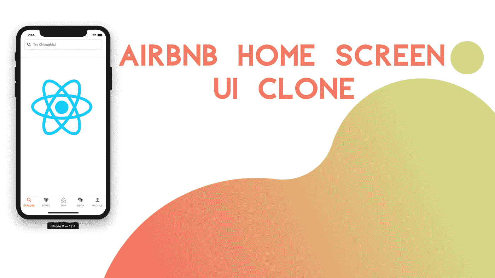
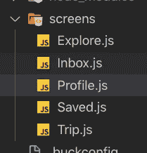
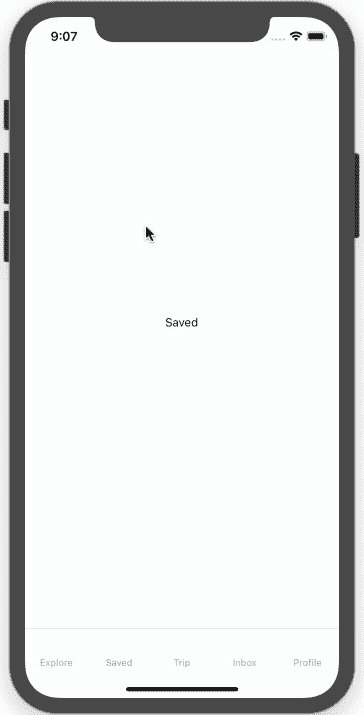
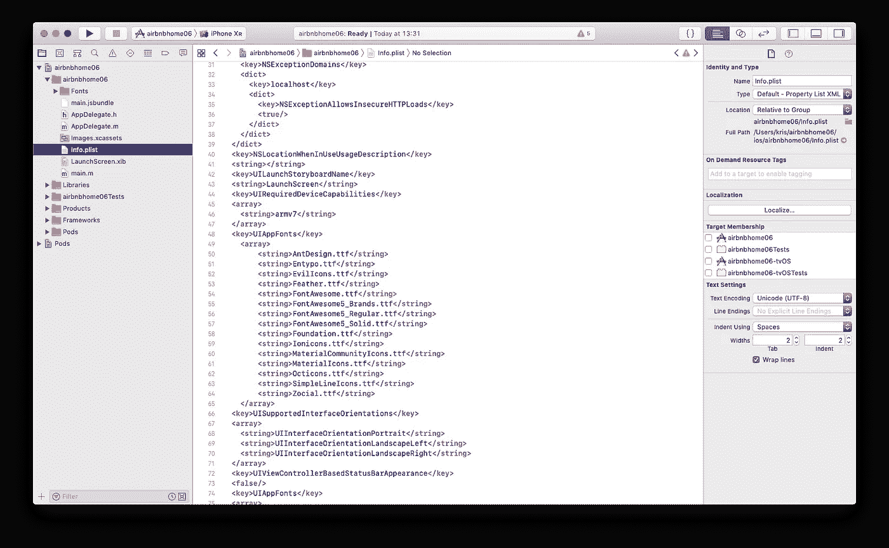
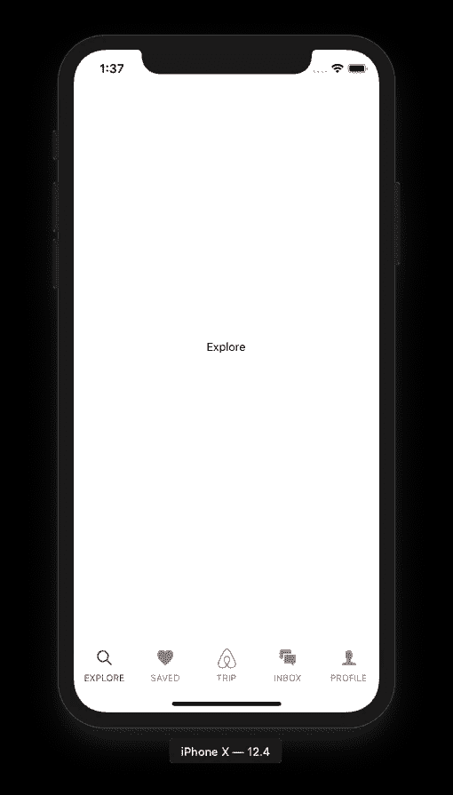
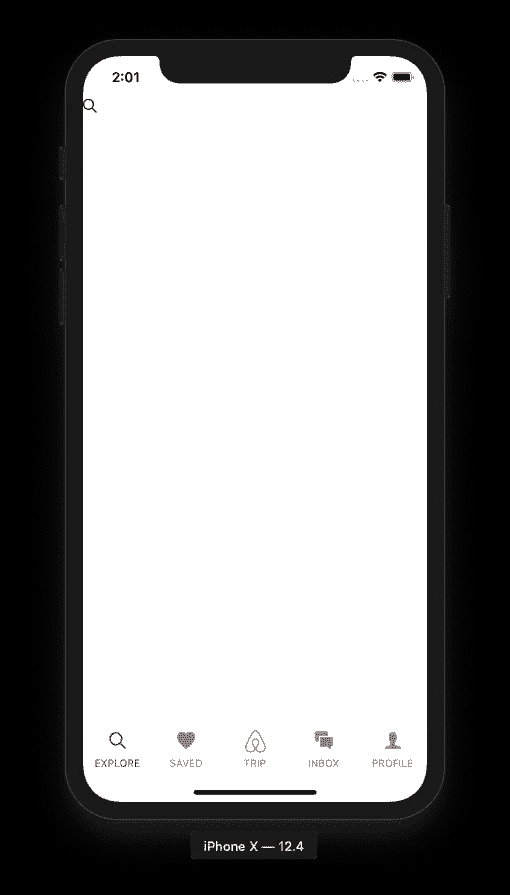
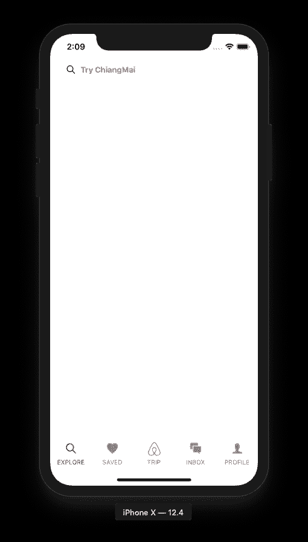

# Airbnb 主屏幕 UI 克隆与 React Native——设置 UI

> 原文：<https://levelup.gitconnected.com/airbnb-home-screen-ui-clone-with-react-native-setting-up-the-ui-6afa11628de>



> 本*系列教程最初发布于* [*【克瑞斯*](https://kriss.io/airbnb-home-screen-ui-clone-with-react-native-1-setup-ui/) *。*的灵感来自于[React Native real estate template](https://www.instamobile.io/app-templates/real-estate-app-template-react-native/)，它帮助我们构建一些令人惊叹的现成应用程序，任何人都可以使用它们来创建初创公司或销售应用程序模板。本教程复制了 Youtube 视频教程中的编码实现和设计，由不确定的程序员为 Airbnb 克隆制作。视频教程非常容易理解和直观。在这里，我们将遵循视频教程，但通过使用 React 本地包和插件的不同版本来实现它。

在这个系列教程的第一部分中，我们将实现底部的菜单标签和顶部的搜索栏来创建一个漂亮的 UI。该教程非常简单和有趣，将提供一步一步的指导，以实现所需的功能。

*那么，我们开始吧！*

## 实现底部菜单选项卡

这里，我们将为 Airbnb 克隆应用程序实现底部菜单标签按钮。

但是首先，我们需要配置 react-native 导航和屏幕，以便我们可以正确地实现选项卡按钮。这里，我们将使用 react-navigation v4.0，它通过将包分离到`react-navigation-tabs`和`react-native-reanimated`中，为底部选项卡导航器配置提供了许多更改。因此，为了处理整体的反应式导航，我们需要首先安装以下软件包:

```
"react-native-gesture-handler": "^1.4.1",
"react-native-reanimated": "^1.3.0",
"react-navigation": "^4.0.10",
"react-navigation-tabs": "^2.5.5"
```

我们可以通过使用 NPM，纱，或博览会安装上述软件包。

成功安装所有软件包后，我们需要在项目命令提示符下将目录更改为 ios 文件夹，并运行下面代码片段中给出的命令:

```
pod install
```

现在，我们需要使用以下代码片段在 iOS 模拟器中运行项目:

```
react-native run-ios
```

请注意:在模拟器中运行应用程序之前，可能需要运行模拟器。

## 为菜单添加空白屏幕

这里，我们将为选项卡菜单按钮创建 5 个空白屏幕。应用程序项目目录的屏幕截图中提供了包含所需屏幕的屏幕项目目录:



下面的代码片段提供了配置文件屏幕的代码。我们需要复制下面给出的代码并粘贴到 Profile.js 文件中。

```
import React, {Component} from 'react';
import {View, Text, StyleSheet} from 'react-native';

class Profile extends Component {
  render() {
    return (
      <View style={styles.container}>
        <Text>Profile</Text>
      </View>
    );
  }
}
export default Profile;

const styles = StyleSheet.create({
  container: {
    flex: 1,
    alignItems: 'center',
    justifyContent: 'center',
  },
});
```

现在，我们需要对所有其他屏幕进行同样的操作。也就是说，从 Profile 屏幕的上述代码片段中复制代码，然后将其粘贴到其他剩余的屏幕文件中。**我们需要记住更改每个屏幕的** `**class**` **名称，以匹配它们各自的文件名**。例如:

*   在 Explore.js 中，我们需要将类名编辑为`Explore`。
*   对于 Saved.js，我们需要将类名编辑为`Saved`。
*   对于 Trip.js，我们需要将类名编辑为`Edit`。
*   而对于 Inbox.js，我们需要将类名编辑为`Inbox`。

## 创建底部菜单选项卡

这一步非常重要，因为我们要为我们的应用程序配置导航。这里我们将使用 **react-navigation-tabs** 提供的`createBottomTabNavigator`方法。因此，这个方法使我们能够设置一个底部选项卡菜单，其中包含我们之前创建的所有屏幕。因此，我们需要打开 App.js 文件，然后导入配置底部`TabNavigator`所需的所有包和屏幕，如下面的代码片段所示:

```
import {createAppContainer} from 'react-navigation';
import {createBottomTabNavigator} from 'react-navigation-tabs';
import Explore from './screens/Explore';
import Saved from './screens/Saved';
import Inbox from './screens/Inbox';
import Trip from './screens/Trip';

const TabNavigator = createBottomTabNavigator({
  Explore: {
    screen: Explore,
  },
  Saved: {
    screen: Saved,
  },
  Trip: {
    screen: Trip,
  },
  Inbox: {
    screen: Inbox,
  },
  Profile: {
    screen: Inbox,
  },
});
export default createAppContainer(TabNavigator);
```

这里，我们使用**反应-导航-选项卡**中的按钮选项卡导航器，并将屏幕映射到菜单。然后，我们使用从 **react-navigation** 包中导入的应用程序容器来用所有屏幕包装我们的`TabNavigator`。

因此，我们在模拟器屏幕上得到以下结果:



正如我们在上面的模拟器模拟中看到的，所有的选项卡都完美地设置在底部，我们可以点击它们导航到不同的屏幕。但是所有的选项卡菜单按钮只包含各自屏幕的文本。因此，我们需要在标签页上添加图标，让它们看起来更吸引人、更酷。

## 添加带样式的图标

在这一步中，我们将向底部选项卡菜单按钮添加图标。为此，我们需要安装一个为我们提供漂亮图标的软件包。因此，我们在这里使用的包是**react-native-vector-icons**，它为我们提供了来自不同图标提供商的图标，如 Ionicons、FontAwesome、Material Design 等。要将包添加到我们的项目中，我们需要在项目命令提示符下运行以下命令:

```
yarn add react-native-vector-icons
```

还有一点更重要的是，我们需要手动将`node_modules`中的`Font`添加到 XCode 项目中。对于 iOS 平台，我们需要遵循来自[苹果](https://developer.apple.com/documentation/uikit/text_display_and_fonts/adding_a_custom_font_to_your_app)的这个说明和来自 Github 的[官方自述。Xcode 增加字体如下面的截图所示:](https://github.com/oblador/react-native-vector-icons#option-manually)



然后，我们需要将 react-native-vector-icons 包导入到我们的 App.js 文件中，并将 Ionicons 作为所需的图标包，如下面的代码片段所示:

```
import Icon from 'react-native-vector-icons/Ionicons'
```

然后，我们需要使用`navigationOptions`对象将图标添加到我们的按钮菜单标签按钮，这将帮助我们配置导航选项。在`navigationOptions`对象中，我们可以设置`tabBarLabel`和`tabBarIcon`，如下面的代码片段所示:

```
const TabNavigator = createBottomTabNavigator(
  {
    Explore: {
      screen: Explore,
      navigationOptions: {
        tabBarLabel: "EXPLORE",
        tabBarIcon: ({ tintColor }) => (
          <Icon name="ios-search" color={tintColor} size={24} />
        )
      }
    },
    Saved: {
      screen: Saved,
      navigationOptions: {
        tabBarLabel: "SAVED",
        tabBarIcon: ({ tintColor }) => (
          <Icon name="ios-heart" color={tintColor} size={24} />
        )
      }
    },
    Trip: {
      screen: Trip,
      navigationOptions: {
        tabBarLabel: "TRIP",
        tabBarIcon: ({ tintColor }) => (
          <Image
            source={require("./images/airbnb.png")}
            style={{ height: 24, width: 24, tintColor: tintColor }}
          />
        )
      }
    },
    Inbox: {
      screen: Inbox,
      navigationOptions: {
        tabBarLabel: "INBOX",
        tabBarIcon: ({ tintColor }) => (
          <Icon name="ios-chatboxes" color={tintColor} size={24} />
        )
      }
    },
    Profile: {
      screen: Inbox,
      navigationOptions: {
        tabBarLabel: "PROFILE",
        tabBarIcon: ({ tintColor }) => (
          <Icon name="ios-person" color={tintColor} size={24} />
        )
      }
    }
  },
```

`tintColor`是我们用来定义菜单颜色的颜色。在这里，我们将设置`activeTintColor`和`inactiveTintColor`。

最后，我们需要向菜单添加一些额外的样式，并将其配置为`createBottomTabNavigator`的第二个参数，如下面的代码片段所示:

```
,
  {
    tabBarOptions: {
      activeTintColor: "red",
      inactiveTintColor: "grey",
      style: {
        backgroundColor: "white",
        borderTopWidth: 0,
        shadowOffset: { width: 5, height: 3 },
        shadowColor: "black",
        shadowOpacity: 0.5,
        elevation: 5
      }
    }
  }
```

因此，我们在模拟器屏幕上得到以下结果:



正如我们所见，底部菜单选项卡按钮完美地配置了选项卡图标和选项卡标签以及活动和非活动色调。这就完成了我们在 React Native 中为 Airbnb 克隆应用程序实现底部菜单标签按钮的工作。

现在，我们继续下一个任务，在 Explore 屏幕的顶部创建一个搜索栏。

## 在顶部添加搜索栏

在本节中，我们将在 Explore 屏幕的顶部添加一个搜索栏。因此，我们需要打开 Explore.js 文件并导入所有必需的包，以便创建搜索栏。下面的代码片段提供了需要导入的包。然后，我们将使用`TextInput`组件和`Icon`组件来创建一个左侧带有搜索图标的搜索栏。然后，我们需要用包含所需样式的`View`组件包装`Icon`和`TextInput`组件。此外，这个`View`组件必须用另一个`View`组件包装，然后再用`SafeAreaView`组件包装，以使搜索栏可见并位于设备状态栏下方。下面的代码片段提供了实现搜索栏所需的代码和样式:

```
import React, { Component } from "react";
import { View, TextInput, SafeAreaView } from "react-native";
import Icon from "react-native-vector-icons/Ionicons";
class Explore extends Component {
  render() {
    return (
      <SafeAreaView style={{ flex: 1 }}>
        <View style={{ flex: 1 }}>
          <View
            style={{
              backgroundColor: "white",
              height: 80,
              borderBottomWidth: 1,
              borderBottomColor: "#dddddd"
            }}
          >
            <Icon name="ios-search" size={20} style={{ marginRight: 10 }} />
            <TextInput />
          </View>
        </View>
      </SafeAreaView>
    );
  }
}
export default Explore;
```

因此，我们在模拟器屏幕中得到以下结果，搜索栏位于顶部:



正如我们所看到的，顶部的搜索栏看起来不合适，一点也不吸引人。因此，我们需要向 search `TextInput`组件和包装图标和搜索输入的`View`组件添加一些样式，以使其看起来更有吸引力。下面的代码片段提供了实现这一点的代码:

```
<View
           style={{
             backgroundColor: "white",
             height: 80,
             borderBottomWidth: 1,
             borderBottomColor: "#dddddd"
           }}
         >
           <View
             style={{
               flexDirection: "row",
               padding: 10,
               backgroundColor: "white",
               marginHorizontal: 20,
               shadowOffset: { width: 0, height: 0 },
               shadowColor: "black",
               shadowOpacity: 0.2
             }}
           >
             <Icon name="ios-search" size={20} style={{ marginRight: 10 }} />
             <TextInput
               underlineColorAndroid="transparent"
               placeholder="Try ChiangMai"
               placeholderTextColor="grey"
               style={{ flex: 1, fontWeight: "700", backgroundColor: "white" }}
             />
           </View>
         </View>
```

因此，最终结果显示在下面的模拟器屏幕截图中:



正如我们所见，搜索栏完美地出现在顶部，标签菜单在底部。这就完成了我们在 Airbnb 克隆项目中使用 React Native 实现底部标签菜单和搜索栏的工作。

## 结论

这是我们 Airbnb 克隆教程系列的第一部分。在这篇文章中，我们学习了如何使用 react-navigation 提供的`BottomTabNavigator`并设置底部标签菜单。我们也得到了如何在顶部建立搜索栏的逐步指导。我们还学习了如何设置不同的包，帮助我们创建一个模仿 Airbnb 应用程序的应用程序。在本系列教程的下一部分，我们将研究水平滚动视图。所以，敬请期待！！

# 公开

这篇文章包括附属链接；如果您从本文提供的不同链接购买
产品或服务，我可能会收到报酬。