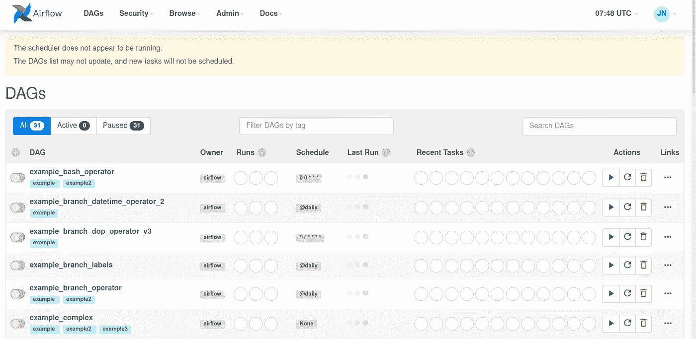
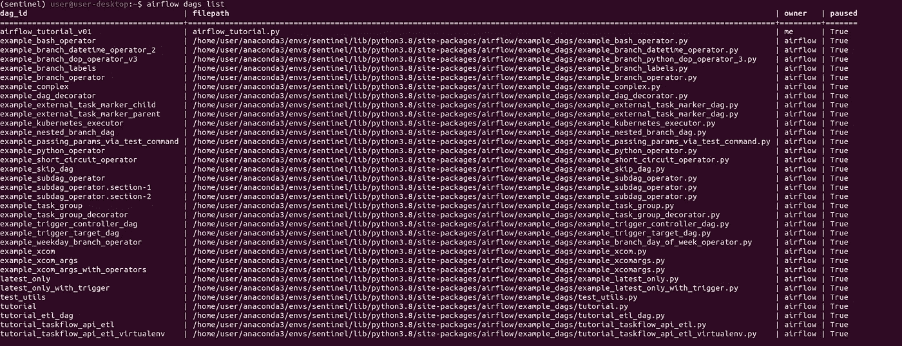
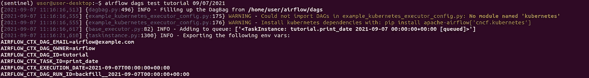
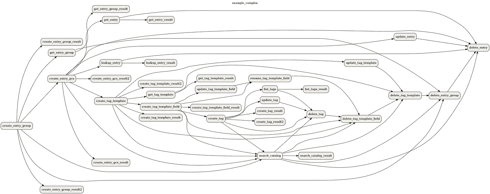
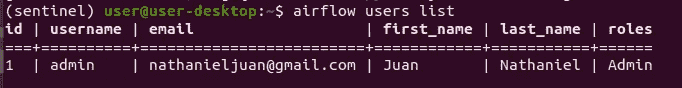

# 气流:命令行界面(CLI)备忘单

> 原文：<https://levelup.gitconnected.com/airflow-command-line-interface-cli-cheat-sheet-6e5d90bd3552>

## 如何使用 CLI 在 Airflow 中快速部署、诊断和评估您的数据管道任务

想象一下这样一个场景，您必须运行多个日常作业来从数据湖/数据库中提取数据，对它们进行预处理，并将清理后的数据集存储到专用存储中。如果我们必须每天运行管道，不断检查可能的错误，这将是一项极其乏味的工作。在这里，Airflow 将为您提供自动构建和监控多个数据管道的所有工具。使用**命令行界面(CLI)** 肯定会加快这个过程，这篇文章会给你一些更常用命令的备忘单。


照片由 [Pankaj Patel](https://unsplash.com/@pankajpatel?utm_source=medium&utm_medium=referral) 在 [Unsplash](https://unsplash.com?utm_source=medium&utm_medium=referral) 上拍摄

这篇文章是我最近开始的(深入兔子洞)与气流相关的系列文章的一部分:

```
1\. [Airflow for Data Pipeline 101](/airflow-for-data-pipeline-101-7a42cc28cf3a)
2\. [Airflow: Decorators for a Clean Data Pipeline](/airflow-decorators-for-a-clean-data-pipeline-48ebdf12e9b0)
3\. Airflow: Unit Tests for Bug-Free Pipeline
4\. Running Airflow in Docker
5\. **Airflow: Command Line Interface (CLI) Cheat Sheet**
6\. *TBD...*
```

在这里，我将带您了解如何使用 Airflow 提供的 CLI 工具快速部署、诊断和评估您的任务。

```
**Table of Content:** 1\. Airflow recap
2\. DAG commands
3\. Database commands
4\. Tasks commands
5\. Users commands
```

事不宜迟，让我们直接进入主题吧！

# 气流概述

在我们开始之前，请确保您的机器中的气流设置正确，并且您对气流的工作原理有一个基本的了解。本系列的第一篇文章[将指导您完成安装和设置过程。](/airflow-for-data-pipeline-101-7a42cc28cf3a)

正确设置后，您将能够查看 Airflow web GUI，如下图所示。该页面将突出显示您的所有管道、它们的所有者、时间表以及用于监控系统健康状况的相关诊断。



气流网络用户界面(图片由作者提供)

# **DAGs**

*   `airflow dags list`将列出您当前正在运行的 Dag 列表。



Dag 列表(图片由作者提供)

*   `airflow dags test <DAG_ID> <EXECUTION_TIME>`将对您的任务执行单一测试。数据库不会发生任何变化。



测试 DAG(作者图片)

*   `airflow dags delete <DAG_ID>`将删除 DB 中所有与任务相关的数据。
*   `airflow dags show <DAG_ID>`将显示 DAG 的结构和依赖关系。



显示 DAG 结构和依赖关系(图片来自 airflow.org)

*   `airflow dags show <DAG_ID> --save <FILE_NAME.png>`将上述图像保存到本地文件。您可以使用许多分机，包括`png`、`jpg`和`pdf`

# 数据库ˌ资料库

*   `airflow db init`将初始化一个数据库，如果你还没有这样做。
*   `airflow db check`将检查您的数据库的状态(如已连接、未连接、*等*)。
*   `airflow db upgrade`将升级您的数据库的信息和元数据。定期执行升级以防止任何依赖性问题。
*   `airflow db shell`将让您访问数据库本身。*请小心前进。*

# **任务**

*   `airflow tasks list <DAG_ID>`将列出与给定 DAG 相关的所有任务。


DAG 中的任务列表(按作者排序的图像)

*   `airflow tasks test <DAG_ID> <TASK_ID> <EXECUTION_TIME>`将对 DAG 中的特定任务执行测试。

# 用户

*   `airflow users list`将列出所有用户及其角色。



气流用户列表(图片由作者提供)

*   `airflow users create -u <USERNAME> -f <FIRST> -l <LAST> -r <ROLE> -e <EMAIL>`将创建一个新用户。`role`列表包括`Admin`、`User`、`Op`、`Viewer`和`Public`。点击了解更多关于不同访问[的信息。](https://airflow.apache.org/docs/apache-airflow/stable/security/access-control.html)
*   `airflow users delete -u <USERNAME>`将删除该用户。

# 结论

就是这样！使用 CLI 运行 Airflow 为我们提供了几个优势，包括易于设置和快速访问一些更常用的命令。我正在下气流的兔子洞，敬请关注未来更多学习分享！

# 保持联络

> 请订阅我的 [**电子邮件简讯**](https://tinyurl.com/2npw2fnz) ，在那里我会定期用简单的英语和漂亮的可视化语言总结编程技巧和人工智能研究论文。