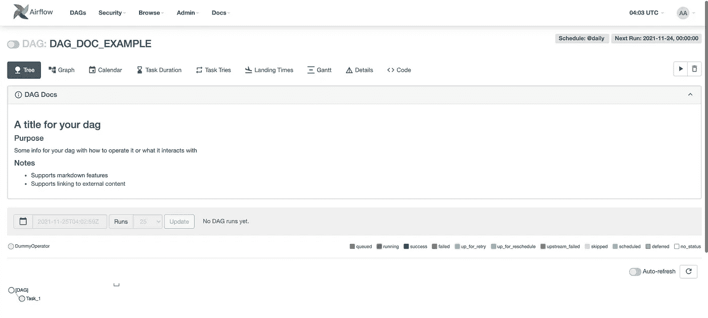
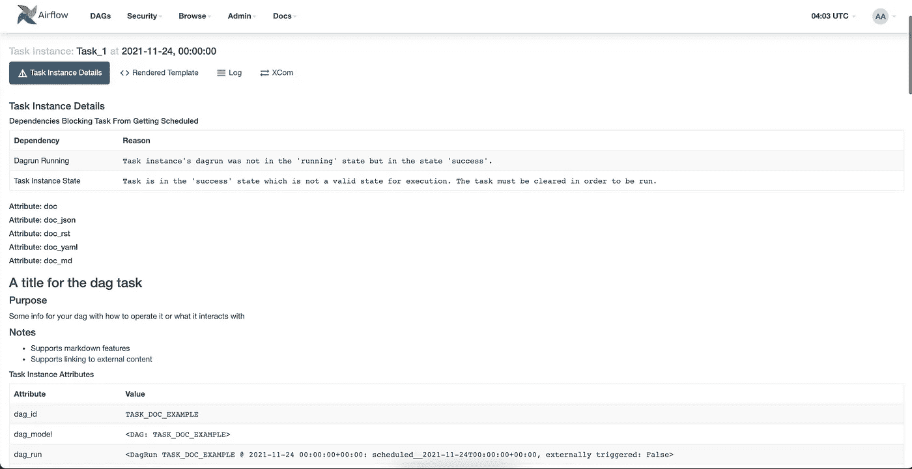

# 气流 DAG 和任务降价文档

> 原文：<https://levelup.gitconnected.com/airflow-dag-and-task-markdown-docs-2c00c72152b4>


我最近在气流平台上做了更多的开发和操作。在进行这种开发时，总是存在这样的挑战，即在开发人员或操作员不必打开 DAG 代码来理解它如何工作的情况下，如何有效地传达 DAG 的各个部分。

在试图找到解决这个问题的方法时，我发现 Airflow DAG 和 task documentation 特性已经在 Airflow 中提供了。我将介绍如何开始使用它，并像下面的示例一样，以一种简单、无摩擦的方式在 Airflow 中记录 DAG，以便那些 Airflow DAGs 的最终用户能够快速理解您的 DAG 做了什么。



# 气流 DAG Doc MD

因此，您可以设置这些 DAG 文档的最直接的方法是按照您的 DAG 定义在 markdown 中编写您的文档。然后，您可以将这个降价字符串传递给 DAGs 配置的 ***doc_md*** 参数。

```
from airflow import DAG
from airflow.utils.dates import days_ago
from airflow.operators.dummy_operator import DummyOperatordoc_md = """
### A title for your dag#### PurposeSome info for your dag with how to operate it or what it interacts with#### Notes- Supports markdown features
- [Supports linking to external content]([https://example.com/](https://example.com/))"""with DAG(
    dag_id="DAG_DOC_EXAMPLE",
    doc_md=doc_md,
    schedule_interval="[@daily](http://twitter.com/daily)",
    start_date=days_ago(1),
) as dag:task_1 = DummyOperator(task_id="Task_1")
```

一旦您的 DAG 更改被 airflow scheduler 和 web 服务器获取，当您导航到您的 DAG 时，您应该会在 airflow UI 中看到以下下拉列表。


这个特性支持所有常规的 markdown 语法，因此您可以嵌入表格、图像和视频等内容。这对于传达 DAG 的基本接触点非常有用，例如它与什么交互，或者触发 DAG 成功运行所需的 DAG 运行配置的形状。

# 气流任务文档 MD

这个特性不仅仅扩展到记录你的 DAGs 您还可以使用它来记录 DAG 中的单个任务。就像你记录你的狗一样。只需写出一个 markdown 字符串，并使用任何实现了 ***BaseOperator*** 类的操作符的 doc MD 参数，就像包含在气流中的任何标准操作符一样。

```
from airflow import DAG
from airflow.utils.dates import days_ago
from airflow.operators.dummy_operator import DummyOperatordoc_md = """
### A title for the dag task#### PurposeSome info for your dag with how to operate it or what it interacts with#### Notes- Supports markdown features
- [Supports linking to external content]([https://example.com/](https://example.com/))"""with DAG(
    dag_id="TASK_DOC_EXAMPLE",
    schedule_interval="[@daily](http://twitter.com/daily)",
    start_date=days_ago(1),
) as dag:task_1 = DummyOperator(task_id="Task_1", doc_md=doc_md)
```

一旦调度程序选择了您的操作符更改，您应该可以在该操作符的任务实例细节下看到您的文档。最好用提供的配置参数记录 DAGs 任务的工作方式。



如果您实现了任何自定义操作符，我的建议是根据传递给操作符的输入自动生成这个文档。这个文档特性提供了一个显著的能力，可以根据传递给操作符的参数创建动态文档，并更详细地表达这个特定任务一旦执行将会做什么。我发现记录 DAG 操作员可能看到的一些常见故障并提供一些关于如何进一步解决或调试的可能细节是很有帮助的。

# 结束语

在我工作的团队中，使用这些 DAG 和任务配置很有帮助，主要是作为一种简单的方式，让 DAG 的操作者(他们可能不一定是编写 DAG 的人)快速理解它并了解它能做什么。

这些文档字符串也支持 plain markdown，这一事实为您创建和格式化设置所需的任何内容提供了一个非常灵活的解决方案，无论它是简单的还是复杂的。另一个好处是，这种文本格式可以很容易地存储在您的 DAG 代码旁边，并用它进行版本控制。

DAG 和任务文档功能还支持其他文档格式，包括 YAML、JSON 和 RST，这取决于您熟悉的内容或您可能已经在使用的一些文档工具。查看以下文档了解更多信息，但它们都使用相同的选项键，位于 ***doc_md*** 下。

 [## 教程-气流文档

### 本教程将带您了解一些基本的气流概念、对象及其用法，同时编写您的…

airflow.apache.org](https://airflow.apache.org/docs/apache-airflow/stable/tutorial.html#adding-dag-and-tasks-documentation) 

# 进一步连接

*   如果你正在考虑获得一个中型订阅，你可以通过使用我的[推荐链接](https://aaron-kt-berry.medium.com/membership)来帮助我。
*   查看我在[媒体](https://medium.com/@aaron-kt-berry)上的其他文章，如果你想了解最新消息，请通过[电子邮件](https://aaron-kt-berry.medium.com/subscribe)订阅。
*   如果你想聊天，请在 Twitter 或 LinkedIn 上联系我，如果你想雇佣我，我在 Codementor 上。