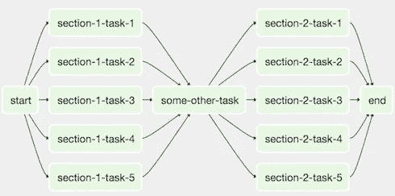

# 数据管道 101 的气流

> 原文：<https://levelup.gitconnected.com/airflow-for-data-pipeline-101-7a42cc28cf3a>

## 如何使用 Apache Airflow 设置自动化数据管道

想象一下这样一个场景，您必须运行多个日常作业来从数据湖中提取数据，对它们进行预处理，并将清理后的数据集存储到专用数据库中。如果我们必须每天运行流水线，不断检查可能的错误，那将是非常乏味的。这就是 Airflow 派上用场的地方:它为您提供了自动构建和监控多个数据管道的所有工具。


照片由[法比奥](https://unsplash.com/@fabioha?utm_source=medium&utm_medium=referral)在 [Unsplash](https://unsplash.com?utm_source=medium&utm_medium=referral) 上拍摄

这篇文章是我最近开始的与气流相关的系列文章的一部分:

```
1\. **Airflow for Data Pipeline 101**
2\. [Airflow: Decorators for a Clean Data Pipeline](/airflow-decorators-for-a-clean-data-pipeline-48ebdf12e9b0)
3\. [Unit Testing Your Airflow Data Pipeline](/airflow-unit-testing-for-bug-free-data-pipeline-d96f87a3cc8f)
4\. *TBD...*
```

在这里，我将介绍气流的基本原理，以及如何使用它们来构建一个干净、高效、自动化的数据管道。

```
**Table of Content:** 1\. Installing Airflow
2\. Initializing Database
3\. Creating data pipeline tasks
4\. Testing and monitoring
```

事不宜迟，我们进入正题吧！

# 安装气流

目前，Airflow 仅支持通过以下命令安装的`pip`模式:

```
pip install apache-airflow
```

默认情况下，您的整个气流目录位于`~/airflow`。但是，如果您选择更改默认目录，只需运行以下命令:

```
export AIRFLOW_HOME="<YOUR_AIRFLOW_DIRECTORY>"
```

# 正在初始化数据库

现在，我们需要设置数据库来存储我们的气流工作流程。

```
airflow db init
```

让我们通过运行以下命令来可视化 web 服务器中的气流:

```
airflow webserver --port 8080
```

在你的浏览器中，输入`http://localhost:8080`,你会看到下面的网页界面。


气流网络用户界面(图片由作者提供)

在继续之前，我们需要通过运行以下命令来创建用户名和密码(记得将**名字**、**姓氏**和**电子邮件**字段更改为您的字段):

```
airflow users create \
    --username admin \
    --firstname <YOUR_FIRST_NAME> \
    --lastname <YOUR_LAST_NAME> \
    --role Admin \
    --email <YOUR_EMAIL>@<YOUR_EMAIL_HOST>
```

命令行会提示您输入密码。请记住这一点作为您的登录凭证。

登录后，您现在可以看到您的气流网络用户界面。祝贺你走到这一步！


气流网络用户界面(图片由作者提供)

# 创建数据管道任务

气流中的管道被定义为任务。任务被构造为有向非循环图(DAG ),其中:

*   **定向**是指按预定顺序发生的有序任务
*   **非循环的**意味着一个终止的任务，没有进入一个永久循环的可能性
*   **图**表示可以建立多对多任务关系的结构

下图说明了一个使用 DAG 结构的简单数据管道。



对于本教程，我们将定义一个简单的管道，如下所示:

*   打印`data`
*   等待 5 秒钟
*   打印`pipeline`

**第一步:创建一个 DAG 文件**

首先，导航到你的气流目录`~/airflow/dags`(或者找出你在`~/airflow/airflow.cfg`中指定的默认 DAG 目录)并创建`airflow_tutorial.py`文件。我们将默认参数定义如下:

```
import datetime as dtdefault_args = { 'owner': 'me',
    'start_date': dt.datetime(2021, 8, 23),
    'retries': 1,
    'retry_delay': dt.timedelta(minutes=5),
}
```

默认设置指示该管道的所有者是“我”，并且该管道自 2021 年 8 月 23 日起有效。如果管道失败，该进程将不会发送任何电子邮件，并且允许在第一次失败后延迟 5 分钟重试一次。

**第二步:创建任务**

接下来，您可以为您的管道指定一个`BashOperator`或`PythonOperator`。第一个将运行 bash 相关的命令，而后者运行用户指定的 Python 函数。让我们在我们的例子中使用这两者。

首先，我们导入并定义一个 Python 函数`print_data()`，它将打印一个简单的`'data'`字符串。

```
import datetime as dt

from airflow import DAG
from airflow.operators.bash_operator import BashOperator
from airflow.operators.python_operator import PythonOperator

def print_data():
    print('data')
```

接下来，我们定义包括`sleep`操作和`'pipeline'`回显的完整管道。

```
with DAG('airflow_tutorial_v01',
         default_args=default_args,
         schedule_interval='0 * * * *',
         ) as dag:

    print_data = PythonOperator(task_id='print_data',
                               python_callable=print_data)

    sleep = BashOperator(task_id='sleep',
                         bash_command='sleep 5')

    print_pipeline = BashOperator(task_id='print_pipeline',
                                 bash_command='echo pipeline')
```

最后，我们将 DAG 任务连接在一起。

```
print_data >> sleep >> print_pipeline
```

# 测试和监控

**第一步:测试**

现在我们有了完整的管道，让我们检查 Python 脚本的有效性。

```
python airflow_tutorial.py
```

或者，您可以按如下方式手动检查工作流程

```
airflow test airflow_tutorial_v01 print_data 2021-08-23
```

这将加载您的`print_data()`函数并测试管道，就像是在 2021 年 8 月 23 日一样。

*注意:如果您注意到任何警告，请尝试按照所写的说明解决它们(例如安装* `*kubernetes*` *)。否则，您的管道将发挥作用！*

**第二步:监控**

如果您对您的管道有信心，我们可以对其进行部署和监控！运行:

```
airflow scheduler
```

如果您重新打开 web 服务器 UI，您会注意到您的管道正在运行！


新气流管道(图片由作者提供)

# **结论**

我们已经成功地利用气流建造了一条简单的自动化管道。如果你喜欢这个帖子，我会写更多的文章详细介绍更先进的气流概念！

*请订阅我的电子邮件简讯:*[*https://tinyurl.com/2npw2fnz*](https://tinyurl.com/2npw2fnz)*在那里，我会定期用通俗易懂的英语和漂亮的可视化方式总结编程技巧和 AI 研究论文。*