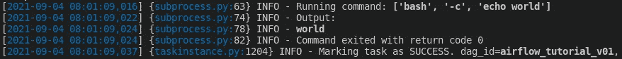

# 单元测试您的气流数据管道

> 原文：<https://levelup.gitconnected.com/airflow-unit-testing-for-bug-free-data-pipeline-d96f87a3cc8f>

## 单元测试你的气流管道，以防止不正确的代码和意外的运行时间

想象一下这样一个场景，您必须运行多个日常作业来从数据湖中提取数据，对它们进行预处理，并将清理后的数据集存储到专用数据库中。如果我们必须每天运行管道，不断检查可能的错误，那将是非常乏味的。这就是 Airflow 派上用场的地方:它为您提供了自动构建和监控多个数据管道的所有工具。然而，随着您的数据管道变得更大更复杂，您必须通过执行健壮的**单元测试**来确保管道没有泄漏。


[斯科特·格雷厄姆](https://unsplash.com/@homajob?utm_source=medium&utm_medium=referral)在 [Unsplash](https://unsplash.com?utm_source=medium&utm_medium=referral) 上拍照

这篇文章是我最近开始的与气流相关的持续系列的一部分(不知何故我正在深入这个兔子洞):

```
1\. [Airflow for Data Pipeline 101](/airflow-for-data-pipeline-101-7a42cc28cf3a)
2\. [Airflow: Decorators for a Clean Data Pipeline](/airflow-decorators-for-a-clean-data-pipeline-48ebdf12e9b0)
3\. **Unit Testing Your Airflow Data Pipeline**
4\. *TBD...*
```

在这里，我将带你通过气流中的单元测试。这些测试非常重要，因为它们可以在数据管道部署到实际环境之前，尽早发现错误并捕获 bug。

```
**Table of Content:** 1\. Problem Statement
2\. Unit test: DAG
3\. Unit test: Structure
```

事不宜迟，让我们直接进入主题吧！

# 问题陈述

在我们开始之前，请确保您的机器中的气流设置正确，并且您对气流的工作原理有一个基本的了解。本系列的第一篇文章[将指导您完成安装和设置过程。](/airflow-for-data-pipeline-101-7a42cc28cf3a)

正确设置后，您将能够查看 Airflow web GUI，如下图所示。该页面将突出显示您的所有管道、它们的所有者、时间表以及用于监控系统健康状况的相关诊断。


气流网络用户界面(图片由作者提供)

让我们回顾一下我们之前创建的一个简单任务。首先，我们在代码中导入所有必要的库

```
import datetime as dt
from airflow import DAG
from airflow.operators.bash import BashOperator
```

之后，我们将为我们的任务定义一个简单的默认参数。

```
default_args = {
    'owner': 'me',
    'start_date': dt.datetime(2021, 9, 4)
}
```

接下来，我们将制定一个简单的`hello_world`任务，将它、`hello world`打印到终端上。

```
with DAG('airflow_tutorial_v01', default_args) as dag: print_hello = BashOperator(task_id='print_hello',
        bash_command='echo hello') print_world = BashOperator(task_id='print_world',
        bash_command='echo world')
```

最后，我们将构建 DAG 的结构。

```
print_hello >> print_world
```

在之前的文章中，我们已经学习了如何使用下面的格式对整个任务进行测试。

```
airflow dags test <DAG_ID> <EXECUTION_DATE>
```

在我们的例子中，情况是这样的:

```
airflow dags test airflow_tutorial_v01 2021-09-04
```

运行上面的脚本后，调试终端将弹出并显示任务是否已经完成，或者是否有任何警告/错误需要纠正。



调试气流管道(图片由作者提供)

然而，如果我们的任务变得巨大/复杂，并且我们有复杂的功能，该怎么办？在接下来的章节中，我们将学习一些在气流中执行单元测试的基本技术。

# 单元测试:DAG

***注意:*** *将测试脚本放在别处(不在~/airflow/dags 中)*

让我们确保我们的 DAG 已正确加载，并且没有引发任何错误。在`airflow_test.py`文件中，我们首先导入依赖项。

```
from airflow.models import DagBag
```

`DagBag`是一个将导入我们所有 Dag 和任务的类。接下来，我们将定义一个简单的单元测试函数。

```
def test_no_import_errors():
    dag_bag = DagBag()
    dag = dag_bag.get_dag(dag_id='airflow_tutorial_v01') assert len(dag_bag.import_errors) == 0, "No Import Failures"
    assert dag is not None
```

这个函数确保我们的`hello world` DAG 被正确加载。然后我们调用函数。

```
test_no_import_errors()
```

并运行 Python 脚本。

```
python airflow_test.py
```

如果一切顺利，你就可以走了！

# 单元测试:结构

现在，我们想检查我们的任务结构是否正确。通过在 Python 解释器中运行以下代码，我们可以快速检查任务的结构。

```
python>>> from airflow.models import DagBag
>>> dag_bag = DagBag()
>>> dag = dag_bag.get_dag(dag_id='airflow_tutorial_v01')
>>> print(dag)
```

打印输出将显示如下内容:

```
dict_keys(['print_hello', 'print_world'])
```

太好了！让我们从在`airflow_test.py`文件中定义另一个函数开始。

```
def test_dag_structure():
    dag_bag = DagBag()
    dag = dag_bag.get_dag(dag_id='airflow_tutorial_v01')

    target_keys = {'print_hello', 'print_world'}
    assert dag.task_dict.keys() == target_keys
```

这里我们断言我们的任务与我们定义的目标相匹配。如果一切正常，那么您的 DAG 已经过验证，您可以开始了！

# 结论

我们已经成功地执行了单元测试，以确保气流中数据管道的完整性。单元测试允许我们确保我们的 DAG 任务已经被正确加载，并且它的结构是一致的。更高级的概念是对气流中的定制操作执行单元测试(例如，确保 S3 桶中的数据完整性等)。但这将是下一篇文章的主题，敬请关注！

*如果你喜欢这种帖子，请考虑订阅我的* [***电子邮件简讯***](https://tinyurl.com/2npw2fnz) *，在那里我会定期用简单的英语和漂亮的可视化语言总结编程技巧和人工智能研究论文。*