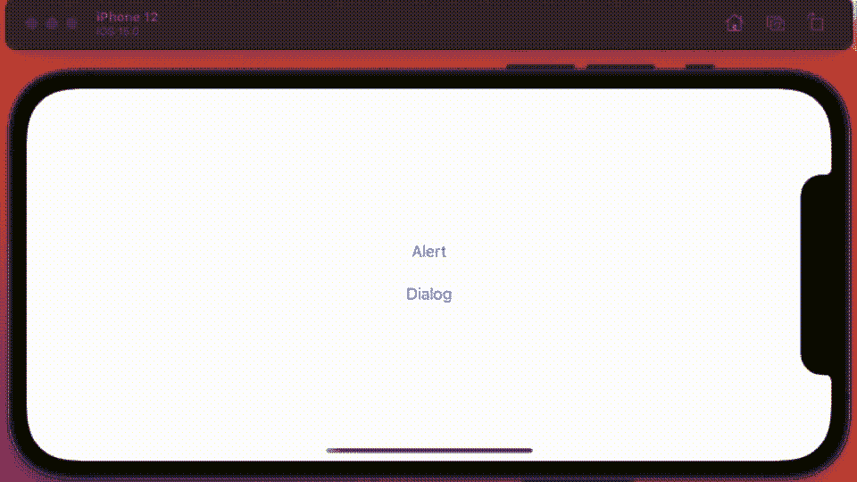
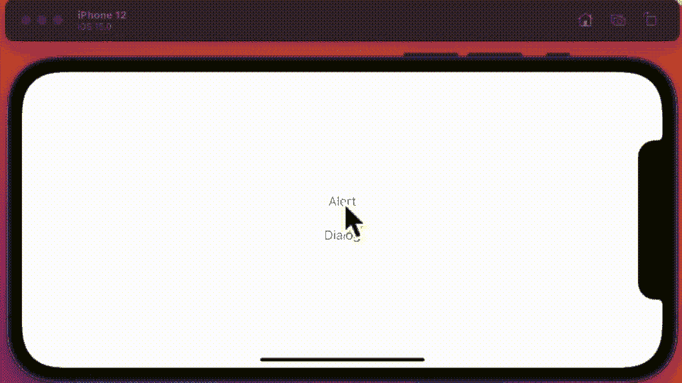
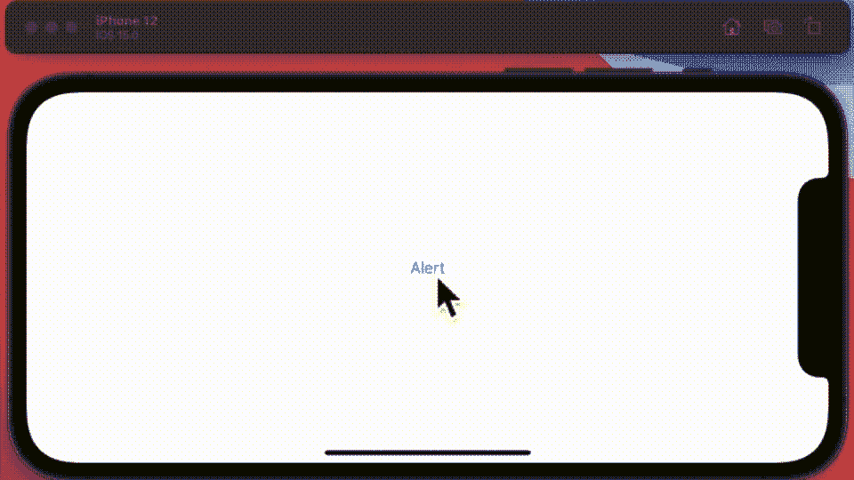
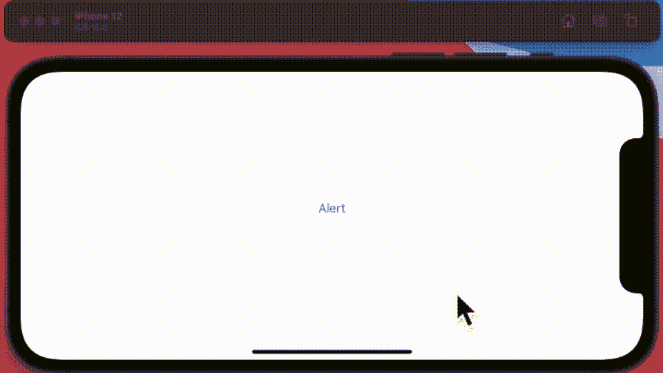
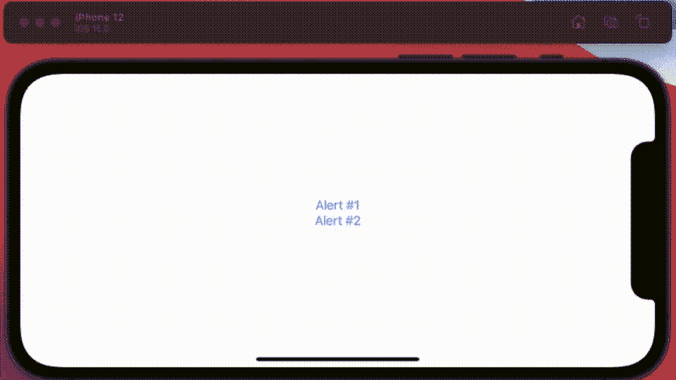
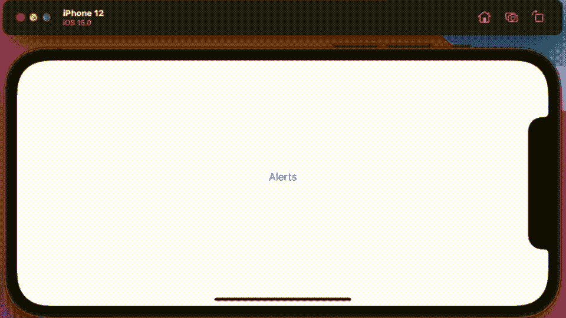

# SwiftUI 3.0 中的警报和对话框

> 原文：<https://levelup.gitconnected.com/alerts-dialogs-in-swiftui-3-0-b0cb1dd034b8>

## 何时、为何以及在何处使用

当 SwiftUI 出来的时候，苹果决定偷工减料的领域之一，如果你愿意的话，就是 alertViews。当然他们添加了它，但是 SwiftUI 版本没有它的 UIKit 版本强大。我认为这并不像我在本文中所阐述的那样是一个阻碍，而是一个不便之处。

 [## SwiftUI 中的 7 个警报视图选项

### gif 中 AlertView 的不同用法

better 编程. pub](https://betterprogramming.pub/7-alertview-options-in-swiftui-691ccb742d22) 

遗憾的是，两年过去了，即使有了 SwiftView 3.0 alertView，它仍然是可怜的表亲。和我一起看看现在的语法是什么样子，以及我在 SO 上发现的一些解决 alertView 挑战的好方法。

SwiftUI 3.0 的主要变化似乎是将 alertSheet 重命名为 conformationDialog。当然，从官方角度来说，它们是不同的——但最终输出/功能看起来是一样的。

动画 GIF 背后的代码是这样的。

这一切都很好，但是你知道你可以给动作添加一个结尾——这样当他们按下按钮时，它会在显示之前给警告/对话框传递一个值。

你可以在这里看到。当我按下提醒按钮时，它会报告我这样做了多少次，对话框也是如此。下面是这个例子背后的代码。

现在，alertView 的第三种变体值得一提。此版本采用预定义的 enum，您可以使用它来更改所需的警报消息/响应。

如你所见，它工作得很好——我喜欢这个解决方案，因为代码的任何问题都将在编译时被发现，而不是在运行时。这个解决方案的代码如下所示。

bon——但是对于一些稍微有点挑战性的现实情况呢？假设你做不到，一个警告会自动弹出并消失。像这样…

代码在这里。它使用一个类来管理控制警报外观的变量。但是，使用它时要小心，因为如果您没有按下继续按钮(在本例中为 2 秒钟内)，警告按钮后面的操作将不会执行。

好的——如果您想使用一个单独的警报，根据其他一些输入来显示多个警报呢？警报修饰符。

这个解决方案背后的代码是这样的。

这个想法的另一个变体[我喜欢的是这个]—只不过它依赖于一个 struct，你可以预先加载一系列的警告。我不确定在这个例子中你会如何使用这个有点烦人的用户界面。但是您可以重构它来构建一个警报的中央代码库。

背后的代码看起来像这样—

当然，我忽略了一些你仍然不能在 SwiftUI 中使用提醒的事情。没有按钮就无法显示标准警报。你也不能用一个文本字段来呈现一个标准的警告，这两个都是严重的疏忽。这不是一个显示停止，你当然可以使用自定义窗口，但显然，这是不一样的。