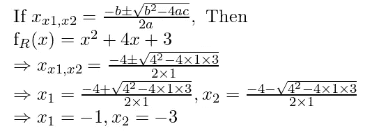
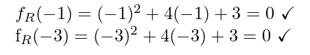

# 代数等式及其证明:二次公式

> 原文：<https://levelup.gitconnected.com/algebraic-equalities-and-their-respective-dis-proofs-quadratic-formula-7527cc3d78e5>

C 继续这个关于证明(或否定)断言等式的代数命题的案例研究的小编(见“阿列克谢” [2022a](https://medium.com/math-simplified/algebraic-equalities-and-their-respective-dis-proofs-introduction-92547c854d9f) 、 [2022b](https://medium.com/math-simplified/algebraic-equalities-and-their-respective-dis-proofs-distribution-law-e8825cb8e7ac) )，我将演示一个二阶多项式的一般数学解，称为二次公式。在本文中，我将讨论来自[e . y . Amiran](https://www.amazon.com/Algebra-Calculus-Mathematical-Modeling-Economics/dp/1500774936)的*代数和微积分*教材中的二次公式的性质及其在任意问题中的应用(2014，第 23–25 页)。

# 目录一览

1.  背景
2.  个案研究
3.  结束事项
4.  参考

# 背景

初等代数的学生学习抛物线方程，抛物线方程是用方程 1 表示的二阶多项式:


情商。一

该多项式的导致零(0)的一般解是如等式 2 所示的二次公式:


情商。2

二次公式中一个有趣的部分是行列式(见 [Pearson Edexcel](https://www.pearson.com/content/dam/one-dot-com/one-dot-com/uk/documents/subjects/mathematics/Worksheets/Chapter2/Example-14-Chapter-2-The-discriminant-two-distinct-roots.pdf) )，它是:


Exp。一

行列式可用于根据以下标准确定解的数量:


表 1

这些标准中的一些可以用常识来看待——例如当行列式小于零时没有真正的解。计算完行列式后，求它的平方根，当平方根小于零时，这个数就是一个非实数的复数。

有了这个背景，我现在可以继续讨论我在*代数和微积分*课本上做的一些案例研究。

# 个案研究

正如我在以前的文章中所做的那样，我将使用 *JupyterLab 桌面应用*来制作图表( [Bektas 2021](https://blog.jupyter.org/jupyterlab-desktop-app-now-available-b8b661b17e9a) )。在我继续之前，我想对我的笔记本做一些关于 plot_functions 的修改，plot _ functions 是用于将函数分解到图形上的函数:

```
def plot_functions(f_l, f_r, r=[0, 100, 0.1]):
    plt.figure()

    # [... snip ...]

    plt.plot(np.arange(r[0], r[1], r[2]), 
             [f_l(x) for x in np.arange(r[0], r[1], r[2])], color="black", label=r'$f_L(x)$')
    plt.plot(np.arange(r[0], r[1], r[2]), 
             [f_r(x) for x in np.arange(r[0], r[1], r[2])], "--", color="blue", label=r'$f_R(x)$')

    # [... snip ...]
```

我对函数原型进行了修改，只为两个函数添加了一个绑定`r`。当我试图为它们各自的函数画出两个不同的界限时，我遇到了错误。所以我决定坚持使用一个绑定来简化事情。

对于每一个例子，我都会论证它要么被证明(真)，要么只是猜想(假)；所有这些问题都源于 [Amiran (2014，第 24–25 页)](https://www.amazon.com/Algebra-Calculus-Mathematical-Modeling-Economics/dp/1500774936):

## Q10: "(x+2)(x-3) = x -x-6 "

在试图解决这个问题之前，我将把它绘制成一个笛卡尔坐标图，以确定它是否值得用一个证明来研究。首先，我将等式的左侧和右侧分解为两个独立的函数:


情商。一

然后，我用 Python 代码实现了分解后的函数:

```
f_L = lambda x: (x + 2) * (x - 3)
f_R = lambda x: x**2 - x - 6

plot_functions(f_L, f_R, [-100, 100, 0.01])
```

图 1 描述了绘图输出:


图 1

这个等式看起来是一个很好的证明。我将应用二次公式来计算猜想右边的根:


图 2

二次公式给出的解看起来很奇怪。返回的系数是有理数(甚至是实数)。我会不会在这个过程中犯了什么错误？评估这一点的一种方法是在猜想的左侧应用分布定律:


图 3

可能是我在应用二次公式时犯了一个错误(可能是在它的设置或算术中)。这可以被看作是使用多种方法“双重检查”一个人的工作的一个教训。

## Q11: "(x-3)(x+3) = x +9 "

我将继续把等式分解成两个函数，第一个是它的左边，第二个是它的右边:


情商。2

然后，我将把`f_L(x)`和`f_R(x)`编码到一个 Python 脚本中，以便绘图:

```
f_L = lambda x: (x - 3) * (x + 3)
f_R = lambda x: x**2 + 9

plot_functions(f_L, f_R, [-100, 100, 0.01])
```

图 4 描述了该图的输出:


图 4

与前面的案例研究一样，这个等式看起来是真实的。所以我将尝试用二次方法来证明它。如果它导致一个不寻常的答案，我将对等式的分解部分使用分布定律:


图 5

这里我不讨论复数，所以我将使用已分解系数的分布定律来评估它是否等于二次项:


图 6

二次公式在某些情况下可能不适用。如果需要，准备应用分配定律。

## Q4(再次):"(x + 1)(x + 3) = x + 4x + 3 "

我在以前的一篇文章( ["Aleksey" 2022b](https://medium.com/math-simplified/algebraic-equalities-and-their-respective-dis-proofs-distribution-law-e8825cb8e7ac) )中已经证明了这个等式是错误的，但是我想我可以利用这个机会来证明二次公式:


情商。3

应用于该等式的二次公式为:



图 7

虽然从该公式导出的系数不等于该等式左侧的系数解，但我可能错误地应用了该公式，就像我在 Q10 的解中那样。为了确认我是否正确地导出了系数，我将把导出的系数代入三项式，如果它们的结果都是 0，那么确实有正确的解。



情商。四

我对二次公式的使用确实是正确的！

# 结束事项

二次公式看起来很复杂，有时会导致不真实的复杂解！读者可能会问:“为什么要使用它？”

在我看来，考虑使用它的一个原因是，面临这种问题的人手头可能没有分解的表达式。当其他因子分解技术不起作用时，该公式也可以非常方便。它也可以作为另一种检查你的工作的技术——人类数学家可能会犯错误，仔细检查一个人的工作通常是很好的做法。

关于本文中的二次公式，我犯了很多错误，但这可以被看作是如何使用多种方法来检查一个人的工作的一个例子。对于任何感兴趣的读者，他们可以访问我用来制作这些图表的笔记本:

[](https://www.kaggle.com/code/lambdacalculus/algebraic-equalities-introduction/edit/run/111672833) [## 代数等式简介

### 使用 Kaggle 笔记本探索和运行机器学习代码|使用来自无附加数据源的数据

www.kaggle.com](https://www.kaggle.com/code/lambdacalculus/algebraic-equalities-introduction/edit/run/111672833) 

## 插头

对于喜欢我的作品但尚未注册 Medium 会员计划的读者，如果他们能通过我的推荐链接注册，我将不胜感激(这在经济上帮助了我 https://medium.com/membership/@EpsilonCalculus ❤️):

此外，读者可能正在阅读我的文章，因为他们喜欢做教科书数学问题。在做数学题时，计算思维是一种有用的心态。因此，对于任何喜欢看我解决数学问题的读者，我邀请他们来看看我的一系列技术文章，在这些文章中我解决了计算机科学和安全工程问题:


[阿列克谢](https://medium.com/@EpsilonCalculus?source=post_page-----7527cc3d78e5--------------------------------)

## 技术报道

[View list](https://medium.com/@EpsilonCalculus/list/technical-writeups-63f8cfbee59c?source=post_page-----7527cc3d78e5--------------------------------)43 stories

# 参考

《阿列克谢》(2022a)。*代数等式及其各自的(反)证明:简介*。数学简化版。2022 年 11 月 30 日检索自:[https://medium . com/math-simplified/代数-等式-及其各自的证明-简介-92547c854d9f](https://medium.com/math-simplified/algebraic-equalities-and-their-respective-dis-proofs-introduction-92547c854d9f)

《阿列克谢》(2022b)。*代数等式及其各自的(反)证:分布律*。数学简化版。2022 年 11 月 30 日检索自:[https://medium . com/math-simplified/代数-等式-和-它们各自的-dis-proof-distribution-law-e 8825 cb8e 7 AC](https://medium.com/math-simplified/algebraic-equalities-and-their-respective-dis-proofs-distribution-law-e8825cb8e7ac)

艾米兰，2014 年。*代数和微积分:商业、经济和金融的数学建模*。创建空间独立发布平台。

贝克塔斯，M (2021)。JupyterLab 桌面应用程序现已推出！Jupyter 博客。2022 年 11 月 12 日检索自:[https://blog . jupyter . org/jupyterlab-desktop-app-now-available-b8b 661 b 17 e 9 a](https://blog.jupyter.org/jupyterlab-desktop-app-now-available-b8b661b17e9a)

Pearson Edexcel(未注明日期)。*判别式:两个不同的根*。2022 年 11 月 30 日检索自:[https://www . Pearson . com/content/dam/one-dot-com/one-dot-com/uk/documents/subjects/mathematics/Worksheets/Chapter 2/Example-14-Chapter-2-The-discriminant-two-distinct-roots . pdf](https://www.pearson.com/content/dam/one-dot-com/one-dot-com/uk/documents/subjects/mathematics/Worksheets/Chapter2/Example-14-Chapter-2-The-discriminant-two-distinct-roots.pdf)