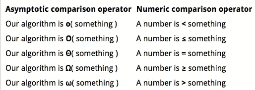
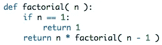
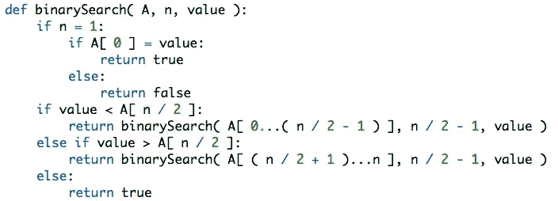
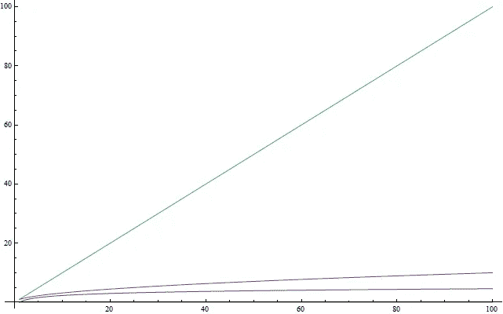
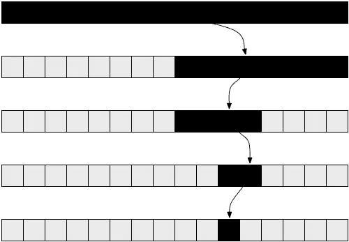
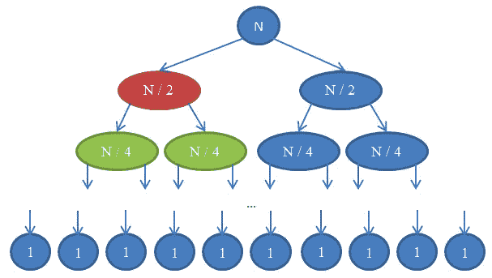
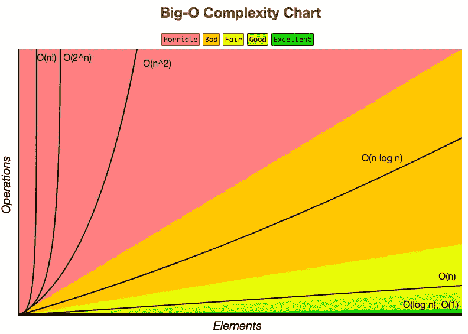
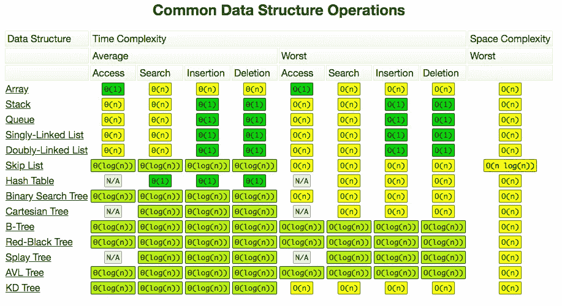
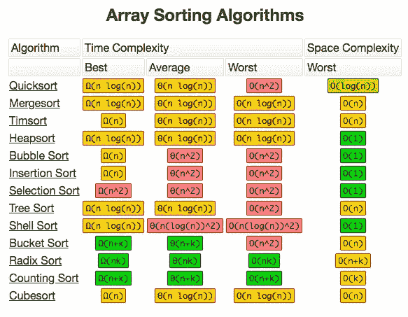

# 算法复杂性和大 O

> 原文：<https://levelup.gitconnected.com/algorithm-complexity-and-the-big-o-cb703e093faa>

随着我对数据科学和编程的进一步了解，编写计算效率高的代码的想法变得越来越重要。雇主面试问题以及我个人在尝试运行更复杂的算法时遇到的困难都证明了这一点。

理解这个概念并能够应用它是有好处的。我认为我理解算法复杂性的一般概念，但随着我作为一名数据科学家的不断成长，我希望有一个更明确的理解。在做任何正式的研究之前，下面是我对算法复杂性的定义，我将在这篇博文中进行介绍:

> “一个函数需要完成多少次操作或循环，以及重复这些操作或循环的次数，以完成一次迭代。”

好吧，这真的是我在写这篇博客之前的定义。算法复杂性在理论计算机科学中被大量讨论，可以被认为是一种正式衡量程序或算法运行速度的方法。

这个话题有意思的地方在于，刚开始编程的时候没必要去理解它(或者至少我没在想这个问题)。起初，我只是希望我的算法能够正确运行。然后，我希望它们以一种可读的方式编写——一种让我在审查之前编写的代码时容易理解的方式。但是随着我的算法开始增长，随着我开始考虑更大的问题，需要更好的解决方案。

现在有许多例子表明，有些人虽然没有正式学习过这个话题，但可能理解其核心原理，并在计算机科学领域非常成功。不幸的是，我这样学得不好，通常需要一个正式的回顾，以便让他们坚持下来，让我对他们的范围有一个彻底的理解。所以如果你和我一样，我希望下面的算法复杂性之旅能有所帮助！

# **基础知识**

首先，解释算法完成所花费的运行时间并不一定转化为算法的复杂性是很重要的。运行时间会受到编程语言、使用的硬件或 CPU 指令集的影响。所以我们希望有一种方法可以取出这些变量，以便能够准确地进行比较。

分析器是以毫秒为单位测量运行时间的程序，可以识别代码中的瓶颈，因此可以使用识别运行时间来识别算法在哪里变慢。然而，算法复杂性是我们希望在理念层面(剔除变量)比较算法的概念。例如，用低级编程语言([汇编](https://en.wikipedia.org/wiki/Assembly_language))编写的糟糕算法可能比用 Python 或 Ruby 编写的好算法有更快的毫秒运行时间。那么我们如何在理念层面比较算法呢？

我们可以通过复杂性分析来做到这一点。这表明程序执行计算的速度有多快。一个很好的例子是在字符串上运行[正则表达式](https://www.regular-expressions.info)来返回定义模式的匹配。这允许我们解释当输入大小增加时算法如何表现。这个想法是，如果你能够精确地测量一个小输入的输出，那么你就可以推断出随着输入的增加，这个输出会如何变化。

因此，为了测量复杂性，我们需要定义算法执行计算的意义。这发生在使用基本指令时，基本指令是 CPU 必须直接执行的简单任务。其中包括:

*   给变量赋值
*   查找数组中的特定元素
*   比较两个值
*   增加一个值
*   基本算术(加法、乘法等。)

这里的目标是计算发生的基本指令的数量。

当计算一个算法的指令时，你是在一个**“最坏情况分析”**的思维框架中计算的。这采用了算法的“路径”,该路径将导致大多数指令被执行。得到的计数可能类似于 f(n) = 6n + 4，其中 6n 可以表示这个特定函数每次迭代执行的指令数，而 4 表示无论输入大小如何都会出现的指令数。如果这是令人困惑的，不要太担心，理解这一点并不是最重要的，以掌握你将很快看到的整体概念。如果你想要进一步的解释，博客底部的链接和这个链接都是很好的资源。

退一小步，我们感兴趣的是当我们的算法被挑战去做一些困难的事情时，它是如何表现的。如果一种算法在处理大量输入时胜过另一种算法(比另一种算法快),那么对于更简单、更小的输入，通常也是如此。因此，第一步是从计数函数中删除所有增长缓慢的项。随着 n 的增加，上面例子中的 4(6n+4)变得越来越不重要，所以我们去掉了 4，因为它“增长缓慢”。从几千或几百万的角度来看，如果 n = 1000，(6*1000 + 4)，数字 4 就没什么意义了。

下一步是把常数乘数放在 n(6)前面。现在我们只剩下原始方程中的 n。其原因同样与不同的编程语言如何不同地编译有关，导致生成相同的输出需要不同数量的 n。抛开这一点，我们忽略编程语言和编译器之间的差异，只分析算法本身的思想。

刚才描述的过程是**渐近行为**，我们丢弃所有无关紧要的因素，只保留最大的增长项。

*   f(n) = 2n + 8 将导致 f(n) = n
*   f(n) = 109 将导致 f(n) = 1，所有其他常数也是如此。

我们感兴趣的是接近无穷大时函数的极限，因为我们测试的是大输入。在严格的数学环境中，我们不能在确定极限时去掉常数，但是为了计算机科学的目的，我们可以这样做。这里还有几个例子来说明这个概念。

*   f(n) = n + 3n +112 将导致 f(n)= n。n 变得大于 3n，所以我们保留 n
*   f(n) = n + 1999n + 1337 将得到 n
*   f(n) = n +平方根(n)将得到 n

快速回顾一下:

*   任何没有 for 循环(没有迭代)的函数的复杂度应该是 1，因为它需要的指令数只是一个常数(除非它使用递归，我将在后面介绍)。
*   任何具有从 1 到 n 的单个 for 循环的函数将具有 n 的复杂度，因为它将在循环之前执行恒定数量的指令，在循环之后执行恒定数量的指令，并且在循环内执行恒定数量的指令，所有这些都运行 n 次。
*   嵌套在另一个 for 循环中的 for 循环的复杂度为 n。如果在 for 循环中嵌套了一个函数，并且我们知道该函数执行 n 个函数，那么总复杂度也为 n。
*   给定一系列 for 循环，最慢(或最坏情况)的循环决定了函数的渐近行为。

当我们已经计算出一个函数的复杂度时，我们说我们的函数是(1)的θ，它被表示为这样的ɵ(1，并被外推为其他函数的ɵ(n 或ɵ(n。我们也可以把 2n∈ɵ(n)读作“两个 n 是 n 的θ”。这仅仅意味着我们已经把一个程序需要和产生的指令数计算为 2n。然后，我们算法的渐近行为将由 n 来描述。以下是正确的:

*   n^6+3n∈ɵ( n^6)
*   2^n+12∈ɵ( 2^n)
*   3^n+2^n∈ɵ( 3^n)
*   n^n+n∈ɵ( n^n)

这个函数的时间复杂度(或者仅仅是复杂度)是我们在ɵ(here).中的所以ɵ(n)的复杂度为 n。以下是常见的复杂度列表:

*   ɵ(1)=常数时间算法
*   ɵ(n)=线性
*   ɵ(n)=二次
*   ɵ(log(n))=对数

总结一下复杂性，**具有较大ɵ的算法比具有较小ɵ.的算法运行得慢**

# **大 O 批注**

现在我们有了算法复杂度的概念，以及如何比较两种算法的复杂度，我们可以开始把它转换成大 O 格式。对于更复杂的算法，发现复杂性可能是困难的。然而，可以更容易地说，它永远不会超过某个界限。因此，我们不需要找到它运行的确切速度(复杂性)，我们只需要找到算法的具体界限。

为了定义一个算法的边界，我们首先通过使一个算法变得比现在更糟来发现它的复杂性。这就是更好算法的上限。这可能看起来没用，但是通过找到“更差”的算法，你可以说类似 O(n)，“n 的平方的大 oh”。这意味着我们的程序在渐近上不会比 n 差，只是为了说明这一点，让它变得更差可能只是在 for 循环中增加了一个额外的变量，这根本不会增加复杂性，但仍然会增加一个额外的基本指令。

ɵ(n)= o(n)的算法。但是 O(n)的程序可能不总是等于ɵ(n)。任何是ɵ(n 的程序)除了是 O(n)外，也是 O(n)。这种思路的一般公式是ɵ(a)是 O(b)当 O(b)更差时。

同样，o 给出了实际复杂度的上限，而ɵ给出了实际复杂度。实际的复杂性也被称为**紧束缚的**。

如果一个算法是ɵ(n)，那么它的复杂度是 n。这个算法是 O(n)和 O(n)。o(n)是紧束缚的，而 O(n)不是，所以我们可以说 O(n)，" n 的平方的小 O。"紧界给了我们更多的信息，因此如果能找到它们就更好了。

o 告诉我们一个上界，我们的算法永远不会比指定的慢。如果我们使我们的算法**更好**，我们使用欧米伽(𝝮，“大欧米伽”)。𝝮告诉我们一个复杂性，我们知道我们的算法不会更好。说一个程序是𝝮(n)意味着这个程序并不比 n 好。𝝮给了我们一个复杂度的下界。我们也可以写𝞈(一个小写的欧米伽，“小欧米伽”)来表示下界不紧。如果我们有ɵ(n 的算法，那么 o(n⁴和𝞈(n 会准确地描述它。

当我们不想仔细检查一个算法时，o 和𝝮是有用的。查看下图查看刚才描述的所有内容。

# **对数**

对数会问这样一个问题，当我把一个数提高到多少次方时，它会给我正确的结果。一个公式化的例子是 2^x = 16。在这种情况下，x = 4，所以我们可以说以 2 为底的 16 的对数是 4。对数的底(2)显然可以改变。如果你对对数不熟悉，想要一个有用的解释，我发现[这个](http://tutorial.math.lamar.edu/Classes/Alg/LogFunctions.aspx)教程很棒。正如平方根是平方的倒数，对数是指数的倒数。

# **递归复杂度**

如果你不熟悉编码中的递归概念，我的朋友 Tom Grigg 有一篇文章[在这里](https://towardsdatascience.com/finding-a-recursive-solution-184784b0aea0)，这篇文章非常好，是我遇到的最好的解释。

简单地说，递归函数就是调用自身的函数。虽然这是一个很难理解的概念，但它的复杂性是相当简单的。对于一个简单的**递归问题，复杂度将是ɵ(n)**。在不使用 for 循环的情况下，您几乎可以将递归视为 for 循环。如前所述，不管循环执行多少次，复杂度都是ɵ(n).同样的思想也适用于递归。

求解一个数的阶乘的简单递归问题

# **对数复杂度**

试图解决的一个著名的计算机科学问题是在数组中搜索一个值。二分搜索法结合了我们刚刚谈到的递归函数和以 2 为底的对数。以 2 为底的对数经常在代码中使用，因为它可以被视为二进制解决方案(输出将是 0 或 1 ),并且可以用于对不同类型的问题进行分类。

二分搜索法的伪代码

一般来说，我们的数组会随着每次调用分成两半，直到我们达到 1。因此，每个数组中元素的数量如下:

1.  第 0 次迭代:n
2.  第一次迭代:n / 2
3.  第二次迭代:n / 4
4.  第三次迭代:n / 8
5.  第 I 次迭代:n / (2^i)
6.  上次迭代:1

这可以解释为将其元素数除以 2，也就是将分母乘以 2。如果我们这样做 I 次，我们得到 n / (2^i)，其中 n 是数组的大小，I 是达到基本情况或正确答案所需的迭代次数。按照这个函数，随着我变大，结果将趋向于 1。一旦该函数减少到 1 = n/(2^i)，就达到了基本情况，并且只剩下 1 个元素被搜索。

所以我们有 1 = n/(2^i)…

*   这就简化为 2^i = n……这看起来很像我们之前提到的对数问题，因为它是对数问题，我们可以这样对待它。
*   当 i = log(n)时，求解该二分搜索法所需的迭代次数为 log(n ),其中 n 是原始数组中的元素

这种情况的一个简化版本是用一个 32 的数组。这将被简化为如下一个要素:

*   32 → 16 → 8 → 4 → 2 → 1
*   这是将初始数组减半的 5 次迭代。因此**ɵ(log(n 是二分搜索法的复杂性)**。这使我们能够比较二分搜索法和线性。由于 log(n)比 n 小得多，我们也可以假设它快得多。最终结果将是，如果我们要执行许多搜索，我们希望保持我们的结果排序，因为这样更快。

以上是函数 n、n 的平方根和 log( n)的比较。顶部以绿色绘制的线性函数 n 比中间以红色绘制的平方根函数增长快得多，而平方根函数又比底部以蓝色绘制的 log( n)函数增长快得多。即使对于 n = 100 这样的小 n，差异也是相当显著的。

# **归并排序问题**

另一个常见的计算机科学问题是将两个数组合并在一起，并创建一个新的排序数组。这类似于上面描述的二分搜索法，只是在这种排序中，我们保留了原始数组的两半。类似于二分搜索法，我们不断地将一个数组分成两半，但是因为我们每次都保留一半的数组，所以每次递归“级别”的总数等于 1N。随之而来的是，每一个人的“水平”的复杂性将是ɵ(n).从前面对二分搜索法的解释中，我们知道递归问题的复杂性在于它的深度(或递归在对数表达式中出现的次数，ɵlog(n)).结合这两个独立的逻辑，我们可以得出结论，合并排序问题的**复杂度将是ɵ(n log(n))**，递归的“层”的数量乘以递归深度。

左:二分搜索法—右:合并排序的递归树

# **总之**

重温我最初的定义，我认为我的思路是正确的，但经过进一步的研究，这个话题对我来说肯定是清楚的，我现在对算法复杂性的真正含义以及它与大 O 符号的关系有了更好的理解。

在阅读和理解了上面的所有内容后，我发现了几个非常有用的备忘单，它们有助于总结不同算法之间的比较，并且非常适合快速参考。

感谢你的阅读，我希望你喜欢它，并像我现在一样有更好的理解。如果你有任何问题，请告诉我，我很乐意尽力回答。

我还需要对 Dionysis Zindros 大呼小叫，他的关于算法复杂性的文章，列在下面，对我理解这个主题有很大的帮助，并提供了很好的例子来加强我的想法。

 [## 算法复杂性分析简介

### 然而，理论计算机科学有它的用途和应用，可以证明是非常实用的。在这个…

离散型. gr](https://discrete.gr/complexity/)  [## Big-O 算法复杂性备忘单(了解你的复杂性！)@ericdrowell

### 你好。这个网页涵盖了计算机科学中常用算法的空间和时间复杂性。当…

bigocheatsheet.com](http://bigocheatsheet.com/)  [## 了解如何编码-查找编码教程| gitconnected

### 使用我们完整的编码资源列表学习任何编程语言或框架。我们分享、汇总和排名…

gitconnected.com](https://gitconnected.com/learn)