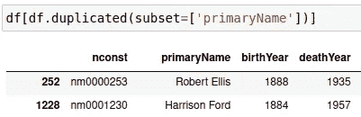

# 算法测试工程:探索性工作分析

> 原文：<https://levelup.gitconnected.com/algorithm-test-engineering-exploratory-job-analysis-1048b4344e21>

## 测试一个算法意味着什么？让我们来玩吧！

剧情转折。文章有一个 RNA 算法的“例子”.. [Braňo](https://unsplash.com/@3dparadise?utm_source=unsplash&utm_medium=referral&utm_content=creditCopyText) 在 [Unsplash](https://unsplash.com/?utm_source=unsplash&utm_medium=referral&utm_content=creditCopyText) 上拍照

最近我有一个关于测试一个算法意味着什么，或者说做算法测试工程意味着什么的讨论。我无法给自己一个令人信服的定义。在一个基本的水平上，也许你弄清楚了算法的一些基本规则，给它一些输入和输出。检查结果。但我相信还有更多，包括适合目的的算法、适合数据、评估备选方案、使算法适应问题和手边的系统、设计和运行实验、学习等等。

为了更好地理解这一切，我将在本文中探讨这个主题。我尝试分析和测试两种算法，看看它会把我带到哪里。在本文中，我从更经典的算法开始，在这些算法中，输入、输出以及它们之间的关系都有明确的定义。在后续文章中，我希望看到一个基于机器学习的，正确结果的定义不是那么清楚的结果。

# 算法的选择

因为我的目标是分析算法的测试和分析，所以我需要选择一个算法来工作。幸运的是，[维基百科提供了大量的算法列表](https://en.wikipedia.org/wiki/List_of_algorithms)。我挑了两个经典，**和 [*Levenshtein 编辑距离*](https://en.wikipedia.org/wiki/Levenshtein_distance) 。我将首先通过对二分搜索法的基本测试和分析来热身。接下来是对 Levenshtein 的更广泛的观察。**

**总的来说，我发现在没有更广泛背景的情况下测试一个算法会错过整个过程中的一些关键点。因此，我为 Levenshtein 算法建立了一个应用程序，为我的测试和分析探索提供了一些背景。这个上下文是一个比较 RNA 字符串编辑距离的应用程序，更具体地说，是由新冠肺炎病毒结构激发的。**

# **二进位检索**

**第一，[二分搜索法](https://en.wikipedia.org/wiki/Binary_search_algorithm)。这是一种为在对数执行时间[内高效搜索条目列表而设计的算法。在我的实验中，我使用了](https://blog.eepy.net/2020/06/15/a-gentle-explanation-of-logarithmic-time-complexity/) [IMDB names 数据集](https://datasets.imdbws.com/name.basics.tsv.gz)，以及一个二分搜索法 Python 实现(改编自一组[堆栈溢出答案](https://stackoverflow.com/questions/18010660/binary-search-implementation-with-python))。**

## **理解算法**

**当测试一个算法时，我首先需要理解我正在处理的是什么。为了获得这方面的一些直觉，我从看一下[线性搜索](https://stackoverflow.com/questions/43302810/linear-search-python)与二分搜索法开始。线性搜索是一个非常基本的搜索，它简单地循环列表以找到一个匹配，并在这里提供一个基本的参考。为了说明区别以及二分搜索法算法是关于什么的，请看 IMDB 数据集中的一组 10 个名字:**

****

**IMDB 数据集中 10 个姓名的示例集。图片作者。**

**我选择了数据集中的最后 10 个，因为它看起来像一个很好的随机组合。二分搜索法要求对输入进行排序，我们就这么做吧。经过排序和重新索引，这 10 个变成了这样:**

****

**IMDB 命名数据集切片，按字符串顺序(名字)排序。图片作者。**

**为了更好地理解线性和二分搜索法，我制作了插图，将它们应用到上面的列表中以找到“卢·贝文斯”:**

****

**IMDB 名称片上的线性搜索(左)与二分搜索法(右)。图片作者。**

**线性搜索总是从头开始遍历整个列表，直到找到匹配项。该列表可以按任何顺序排列。二分搜索法不断地将列表一分为二，并检查匹配的中间值，在更小的块中重复这一过程，直到找到匹配，或者检查完所有元素。**

**二分搜索法是一个众所周知的简单算法，但上面说明了我将如何去尝试理解一个算法。我发现*具体的例子和图表帮助我建立理解。*获得*(领域)专家的帮助来构建和检查这些*真的很有帮助*。*特别是用不太知名的算法。**

**上面的 10 个例子非常少，并没有真正说明二分搜索法的好处。对于更大的尺寸，线性和二分搜索法之间的比较应该是这样的(期望对数复杂度):**

****

**说明了理论上的对数执行时间与线性执行时间的关系。图片作者。**

**这样的假设是很好的检查，所以我将这样做。**

## **测试计算复杂性**

**测试和分析算法时感兴趣的一个常见属性是[计算复杂度](https://en.wikipedia.org/wiki/Analysis_of_algorithms)。这是指算法在不同比例下使用的资源(处理时间、内存等)。这里我主要关注处理时间，尽管可以对其他资源进行类似的分析。**

**为了探索二分搜索法的可伸缩性，我对 IMDB names 数据集进行了 10 到 1000 个名字的采样，以 10 为增量，并对这些采样列表中的随机项目执行了线性和二分搜索法。**

**为了获得统计上更有把握的结果，我对每个列表都进行了 100 次实验。我使用我的 [codeprofile](https://pypi.org/project/codeprofile/) 库进行执行时间分析。下图说明了在 100 次运行中，以一定样本量测得的平均执行时间与理论预期时间的对比:**

****

**实测性能(左)与理论性能(右)。图片作者。**

**上面的图形显示曲线遵循对数执行时间增长(二分搜索法)和线性增长(线性搜索)的预期曲线。因此测量结果与理论相符(由于参数的原因，图中的比例不同，我只是对形状感兴趣)。**

**1000 项对于真正的性能测量来说仍然是一个非常短的列表。对 1000 万到 100 万个样本(增量为 10 倍)进行相同的实验，可以更清楚地显示二分搜索法的效果和优势:**

****

**二分搜索法 vs 线性搜索。左侧= 10–1000 列表大小，右侧= 10–1M 列表大小。图片作者。**

**在上图中，列表大小为 100 万，差异如此之大，二分搜索法线与线性搜索相比看起来很平。基于以上简单的实验，我认为这些假设适用于计算复杂性。**

**线性和二分搜索法是众所周知和研究过的算法，它们的复杂性也是众所周知的。因此，这些演示了我们如何在实践中进行评估。我发现*评估实际实现的实际计算复杂性*会带来惊喜，尤其是来自第三方的定制算法的不同用例。**

## **测试投入产出关系**

**知道计算的复杂性是好的，但是我们还需要保证实现如预期的那样工作。对二分搜索法来说，寻找选定名称、边界、类别划分等基本测试就是很好的例子。我把这些叫做*基础保证测试*。**

**为了扩大规模，我使用了上面 1000 万到 1000 万计算复杂度分析中的测试生成器，并添加了以下检查:**

*   **对于每一项，线性和二分搜索法找到相同的指数。**

***我称之为对数据/算法的预期/假设不变量*。我期望两种算法对相同的输入给出相同的结果，断言只是为了额外的保证。然而，这种断言是失败的，因为即使对于相同的输入，线性和二分搜索法给出的指数也不总是相同的。**

**在思考了是什么导致了这种差异，以及算法是如何工作的之后，我发现数据集中可能有重复的名字。下面是一个快速检查，看看是否是这种情况(连接到两行):**

****

**列出数据集(切片)中具有重复名称的项目。图片作者。**

**上图显示“罗伯特·埃利斯”和“哈里森·福特”有重复。要查得更深一点，一看“哈里森·福特”这个名字:**

****

**检查哈里森·福特是否作为主要姓名出现在多个实例中。图片作者。**

**在这个数据集中有四个人以相同的名字“哈里森·福特”被列出。确定存在重复名称后，我们会对一些汇总指标感兴趣，以了解有多少重复名称:**

****

**计算数据集中重复的主要名称的数量。图片作者。**

**上图显示总共有 853911(行计数)个不同的名称有重复。重复次数最多的是“大卫·史密斯”，重复了 340 次。以上对于不匹配的搜索结果意味着什么？由于这两种算法的工作方式，搜索“大卫·史密斯”可能会导致线性和二分搜索法返回一个“大卫·史密斯”，但不同的。线性搜索总是返回列表中的第一个，二分搜索法可以从重复列表中给出任何结果。**

**对我来说，这说明了*对算法的测试和分析如何有助于理解算法，以及它正被应用于更好的*的数据。以及*断言和测试你对数据和算法的假设有多好*。有一个明确的目标，并系统地执行这个过程应该会有所帮助。**

**除了算法输出的不变量之外，还可以考虑输入的不变量。例如，二分搜索法希望对其输入进行分类。选择是限制测试的范围，期望环境(整个系统)强制执行，还是期望算法实现来处理它。我将这称为*定义算法(测试)范围*。**

# **Levenshtein 编辑距离(带 RNA 搜索)**

**作为第二个例子，为了更深入地了解这个主题，我在这里看一下 [Levenshtein](https://en.wikipedia.org/wiki/Levenshtein_distance) [编辑距离](https://www.geeksforgeeks.org/edit-distance-dp-5/)算法。编辑距离有时也被称为[近似字符串匹配](https://en.wikipedia.org/wiki/Approximate_string_matching)。它是指将字符串转换为特定(目标)字符串所需的编辑(字符改变)次数。已知的应用包括提供[拼写建议](https://en.wikipedia.org/wiki/Approximate_string_matching#Applications)、[近似字符串搜索查询](https://lucene.apache.org/core/7_1_0/core/org/apache/lucene/search/FuzzyQuery.html)，以及 [DNA/RNA 序列比较](https://academic.oup.com/nar/article/42/7/4160/2435711)。**

**与二分搜索法的单一搜索操作相比，经典的 Levenshtein 算法支持三种操作:*插入*、*删除*、*替换*(字符串中的一个字符)。它给出的编辑距离是这些操作所需的最少次数。还有一个叫做 [Damerau-Levenshtein](https://en.wikipedia.org/wiki/Damerau%E2%80%93Levenshtein_distance) 的变体，增加了一个*转置*操作，但是为了让这个例子更简单，我在这里将使用经典的 Levenshtein。**

**一些例子:**

*   **te**s**t->te**n**t:一个*替换**s**->n= Levenshtein 得分 1***
*   **leven stein-> Levens**h**tein:一个*插入* of **h** =得分 1**
*   **levens**h**tein->leven stein:**h**的一个*缺失*=得分 1**
*   **坏-> ba **se** :一个替换**d**-**s**+一个*插入 **e** 的*=得分 2**
*   **坏-> ba **se** d:两个*插入 **s** + **e** =得分 2***

## ****定义示例应用****

**正如我前面提到的，我将从一个示例应用程序的角度来看 Levenshtein，给它一些我的二分搜索法示例所缺乏的上下文。由于 Levenshtein 已经应用于 [RNA 分析](https://ieeexplore.ieee.org/abstract/document/9097943)，我使用 RNA search 作为应用。特别是新冠肺炎病毒[，它是基于 RNA 的](https://www.rochester.edu/newscenter/covid-19-rna-coronavirus-research-428952/)。它提供了大量的信息，并且它给了我一个机会在一个适时的主题上使用更长的 RNA 字符串。和二分搜索法一样，我从*研究开始，以了解应用领域和应用的算法。***

**新冠肺炎 RNA 序列被描述为长度为 29881 个字符的[，由代表其化学碱基](https://www.nature.com/articles/s41401-020-0485-4)的[四个字母组成。新冠肺炎结构中特别令人感兴趣的部分是](https://www.livescience.com/how-much-can-coronavirus-mutate-variants.html)[刺突蛋白](https://en.wikipedia.org/wiki/Coronavirus_spike_protein)。这种兴趣来自于刺突蛋白在感染人类细胞中的作用。**

**刺突蛋白被描述为整个病毒 RNA 的一个 [3831“字符”长的子序列](https://www.livescience.com/how-much-can-coronavirus-mutate-variants.html)。[维基百科描述奥米克隆变异体与原始武汉变异体相比有 60 处突变，其中 32 处位于刺突蛋白](https://en.wikipedia.org/wiki/SARS-CoV-2_Omicron_variant#Mutations)。**

**所以在这个例子中，我希望对长度为 3831(可能高达 29881)的序列应用 Levenshtein。在 Omicron 突变之后，我将在测试中最多使用 60 次编辑。和二分搜索法一样，我正在*基于领域知识和预期用途来定义算法(测试)参数*。**

****免责声明**:我没有对 RNA 搜索做过深入的研究，我确信它要先进得多，但这是本文的一个基本例子。**

## **实验设置**

**我使用 Python [加权 levenshtein](https://pypi.org/project/weighted-levenshtein/) 库来运行我的实验。我的*基本保证测试*包括处理空字符串、不同长度的字符串、无效字符和选定的字符串突变。诸如此类。**

**为了扩大测试规模，我再次构建了一个简单的*输入生成器*来生成输入字符串，并对它们应用*算法支持的操作* ( *插入*，*删除*，*替换*)。这生成了给定长度的随机字符串，对字符串应用了选定的操作计数，并计算了修改后的字符串与原始(未修改)字符串的距离得分。同时测量执行时间，并检查一组*输出不变量*:**

*   **算法给出的分数应该总是与应用的操作数相匹配。**
*   **翻转被比较的字符串，例如*汽车* - > *汽车*到*汽车*->-*汽车*，应该总是给出相同的分数。因为操作实际上是可逆的。**

**我的测试执行器为算法的每个生成(测试)执行检查这些不变量。**

**为了支持基本保证测试，我首先使用输入生成器构建大量相对较短(5–10)的字符串，应用不同数量(0–9)的操作。这给了我更多的信心，更高的职位覆盖率，更容易调试结果(长度有限)。用于分数计算、字符串边界、分组操作等。它也向我展示了我对上述两个不变量的假设对于第一个是如何的错误。**

**我发现的是，通过足够多的迭代来运行该算法，随机机会将发现这样的情况，即从多个*替换*操作构建的目标字符串可以通过更少的*插入*、*删除*和*替换*操作的组合来实现。这里有一个例子:**

****

**在源上应用 3 个替换来产生目标，期望 Levenshtein 得分为 3。图片作者。**

**上面显示了源字符串，以及用随机选择的字符在随机选择的索引处进行 3 次替换后的目标字符串。记住，我的目标是新冠肺炎 RNA 搜索，有 4 个字符(ABCD)。进行了以下替换:索引 3: A->B，索引 4: C->A，索引 5: D->C .期望 Levenshtein 得分与编辑操作的数量匹配(此处为 3 个*替换*)，这应该给出 3 分。**

**但是，上面不是给 3 分，而是给 2 分。经过一些分析，我意识到同样的目标可以通过一个*插入*和一个*删除*来实现，给出最低分数 2:**

****

**仅用两个操作(插入+删除)就实现了与上述相同的目标。图片作者。**

**有了这个知识，我必须从检查中禁用失败的不变量。相反，我选择*收集不同操作次数的得分统计数据。*然后，我可以检查总体分数分布是否与应用的操作数相差太远，如果不是完全相同的话。第二个不变量(翻转字符串)对所有生成的测试都很好。**

**我发现这是一个可能被称为*探索性算法测试*的例子。假设算法是如何工作的，将它们编码为不变量(或任何有效的东西)，生成进一步的测试，看看它们是否成立。一路学习算法及其领域。**

**在成功运行这些较小的测试之后，我确信我已经充分覆盖了我的假设，为了测试计算复杂性，我增加了生成器字符串的大小。**

## ****计算复杂度:设置****

**对于这个评估，我使用输入生成器生成长度从 100 到 5000 的字符串，间隔为 250 (100，350，600，850，…直到 4850)。我之前设置的目标字符串长度是 3981 个字符，在这里有所涉及，并留有一定的余量。为了统计上的可信度，我将每个测试规模(100 到 4850)重复了 100 次。**

**对于每个生成的字符串，我应用了以下操作 1、3、9 和 60 次(60 是上面定义的 omicron 限制):**

*   ***在随机(非重叠)位置替换字符串中的*字符**
*   ***在测试字符串的随机位置插入*随机字符**
*   ***删除测试字符串中的*随机字符**
*   **以上的*组合*，全部同时**

**我的目标是看看不同的算法操作、它们的数量或字符串长度是否会影响计算时间。或者更一般地说，用于*测试算法操作和参数，以查看它们如何影响其执行时间*。**

****计算复杂性:测量****

**上述实验的结果在性能方面非常相似。下图说明了*替换*测试，以及它们的总执行时间:**

****

**Levenshtein 执行时间与字符串大小。图片作者。**

***Substitute_x* 是指在源字符串中代入 X 字符，计算 Levenshtein 得分。上面的 x 轴是从 100 到 4850 的字符串大小。y 轴是运行 100 次实验所花费的时间。**

**上图中的四条线实际上是重叠的，因为每种情况下的执行时间都非常接近。因为这看起来有点可疑，我用不同的参数分别运行了多个实验，看看这是否成立，它确实成立。有点奇怪，但是还好。如果有一个领域专家和一个团队来讨论这个问题，那就太好了。**

**我在这里省略了显示所有其余的操作、它们的大小变化和组合。它们都非常接近，表明执行时间与操作的类型或数量几乎没有关系。**

**上述曲线通常类似于指数增长曲线。为了验证这一点，我试验了几个参数，试图将指数曲线的匹配形式可视化。下面是最终测量的执行时间图与指数时间的理论图:**

****

**执行时间(左)与指数图(右)。图片作者。**

**由此，我会说该算法具有指数复杂性。维基百科实际上有一些关于 Levenshtein 计算复杂性很高的华丽词汇。由此，我的结论是，这些结果与理论预期相匹配，该算法对于较长的输入似乎不太适用。**

## **测试算法的适应性:**

**有时我们测试和分析一个算法，并意识到它不是很适合需要。但是，我们可能希望尝试一种替代方法，或者对这种算法进行修改来解决问题。让我们来看一个例子。**

**执行时间的指数级增长通常被认为不利于可伸缩性。对于较短的字符串(例如，对单词或 shell 命令进行拼写检查)，这可能不是问题，因为对于较短的输入，指数效应非常小。然而，在我的 RNA 故事中，我想搜索和分析长度为 3831+的序列。为此，研究可能的加速似乎是有用的。**

**假设我们决定通过尝试在较小的输入片段上运行算法来加快速度。这将使执行时间线性增长，而不是指数增长。最后我们只需要对搜索结果进行相对排名，不一定是一个确切的分数。一旦知道了最好的结果，就可以计算出那个子集的精确分数。由于这是一个假设的例子，所以我称之为假设的发展思路:)。**

**下面是一个执行时间图，用于将生成的输入字符串分割成长度为 100 个字符的片段，并对它们的分数求和:**

****

**分割成 100 个切片后的执行时间。图片作者。**

**从执行时间的角度来看，上面的图表看起来要好得多。指数增长消失了，变成了线性增长。但是结果如何呢，计算完整字符串的分数与将 100 个片段的分数相加的分数之间的差异有多大？下表说明了这一点:**

****

**替换运算符，100 个片段对整个字符串。图片作者。**

**上表中， *s_x* 表示替换字符串中的 X 字符。*尺寸*是弦的总长度。 */full* 的后缀指的是在整个字符串上运行 Levenshtein 算法。 */100* 版本使用 100 个字符的切片。每个配置重复 100 次，以获得统计覆盖率。这也是为什么比如 *s_1/full* 的分数是 100 (100 次运行，每次得分 1)。**

**对于这个*替换*的例子，分片版本的分数非常接近完整版本。也许是因为替换是局部变化，对多个切片影响不大。表中有几行的总分相差 1-2 个编辑(6000 比 5998 和 5999)。这是因为我上面提到的问题，其中*插入*和*删除*可以一起找到一个更小的最小值。如果*替换*操作足够了，这似乎是一个合理的修改。但目标是支持所有操作。**

**在下表中，*插入*操作使用前缀 *i* ，而*删除* a 前缀 *d* 。所以 *i_x* 指插入 X 字符， *d_x* 删除 X 字符:**

****

**插入运算符，100 个片段对整个字符串。图片作者。**

**上面的*插入*表格显示了 *i_x/full* 分数如何始终与预期的操作数(*100)相匹配。使用 *i_x/100* 切片，随着字符串长度的增加，分数开始变大，应用的操作数量也增加(从 1 到 3、9 和 60)。经过一些分析，我得出结论，这是因为在字符串的开头插入一个字符会将所有剩余的片段向右移动，从而导致每个片段需要多次编辑，并增加总得分。**

**下图说明了这个问题:**

****

**在长度为 10 的字符串上方插入 B，Levenshtein 得分按完整字符串计算。图片作者。**

****

**与上述字符串相同，Levenshtein 分数以长度为 3 的切片计算。图片作者。**

**以上是切片大小为 3 而不是 100 但概念相同的示例。根据*插入*的位置，编辑计数向末端传播，并大量增加总和。要匹配 3 的每个片段，它必须删除第一个字符并添加最后一个字符。*删除*操作相同:**

****

**删除运算符，100 个片段对整个字符串。图片作者。**

**上面的*删除*表显示了与*插入*表非常相似的行为。出于同样的原因，当*插入*将切片向右移动时，一个*删除*将所有切片向左移动。**

**因此，虽然切片方法在减少算法处理时间方面是成功的，但是它肯定不能正确地对*插入*和*删除*的搜索结果进行排序。从应用的角度来看，我会认为这种适应是一个失败的实验，除了学习。**

**然而，就本文的目的而言，我发现这是一个很好的实验。它展示了如何对一个算法进行测试，分析其结果，适合目的，和其他属性，建立假设，实现实验，评估它，和迭代。最理想的情况是，这就是我如何看待*算法测试和分析更广泛地为整体开发做出贡献，帮助设计和评估改进算法和适应性的实验*。**

## **总结 Levenshtein 搜索实验**

**在更现实的情况下，我希望我将与一个专家团队一起工作。并有资源对所有的方法、技术水平和其他相关的事物进行研究。事实上，当算法和它的应用领域很复杂，并且有机会的时候，我会认为这是测试和分析过程中必不可少的部分。*与领域专家、研发团队合作，研究领域知识*。这里我将限制范围，因为我的资源有限。**

# ****总结****

**我写这篇文章的目的是探索算法测试(和分析)的概念。总结列表使记忆更简单:**

*   **传统测试技术可以用专家定义的输入和预期输出来定义*基本保证测试***
*   **构建对算法的良好、深入的理解有助于理解如何测试它，以及如何使它适应一个领域**
*   **这包括对它所应用的数据建立类似的良好理解，以及这与算法的关系**
*   **理想情况下，上述工作*与研究、开发和测试*相互作用**
*   **除了验证之外，算法测试还有助于*理解其局限性、潜在的优化，并比较备选方案***
*   ***识别关于数据和算法输入的假设*描述了算法预期的工作内容**
*   ***探索性数据分析可以使用这些假设作为输入*，检查它们是否成立，并对它们进行提炼**
*   **识别关于数据和算法输出的假设为*编写不变量以在每个测试中检查提供了基础***
*   **一个自动化测试生成器帮助用这些不变量进行大规模测试，并检查假设是否成立**
*   ***测试范围*涉及定义算法的范围和使用它的整个系统，输入和输出处理的责任**
*   **理论上的计算复杂度是好的，但是*实践评估如果对实施和可用数据*有效，则是好的保证**
*   **算法测试可以形成*探索算法的工具，通过制定关于算法的假设并使用测试来评估它们***
*   **工具和技术，如 [*变形测试*](https://towardsdatascience.com/metamorphic-testing-of-machine-learning-based-systems-e1fe13baf048) *可以帮助评估算法对不同类型的有效和无效输入的鲁棒性***
*   **测试和分析最好是一个迭代的过程，最终结果是最终生成的测试和检查，*以及所有正在进行的学习***

# **结论**

**我开始这篇文章的想法是探索测试一个算法意味着什么，或者做“算法测试工程”意味着什么。我喜欢认为我取得了一些进展，尽管我确信定义可能是主观的，很像(机器学习)算法结果的“好”。**

**我在本文中的两个例子，*二分搜索法*和 *Levenshtein 编辑距离*，最终都是非常简单和基本的算法。正如本文所提到的，这种算法的基本测试并不太复杂。然而，考虑到算法测试和分析是更广泛的研发过程的一部分，我相信互动、合作、研发贡献可以使它更加多样化和有趣。**

**在本文中，我研究了两个“经典”算法，其中的输入、输出以及它们之间的关系很容易定义。在后续文章中，我将研究基于机器学习的算法，以及一个算法示例，其中输入-输出关系和输出的正确性在传统意义上是难以定义的、主观的或“不可定义的”。在那之前。**

**目前就这些。干杯。**