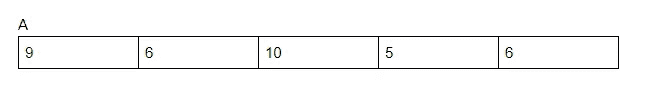

# 算法分析

> 原文：<https://levelup.gitconnected.com/algorithmic-analysis-92b8b78ba83d>

在上一篇介绍 [*算法*](/algorithms-3bd92fa4155f) *的文章中，我们谈到了算法分析。在这篇文章中，我们将深入探讨。*


来源:Micheal Dziedzic via[Unsplash.com](https://unsplash.com/photos/aQYgUYwnCsM)

# 编写算法

在我们能分析一个算法之前，我们需要先写它。那么我们该怎么写呢？

```
Algorithm Swap(a,b):
    temp = a
    a = b
    b = temp
return
```

以上是一个简单的算法，我借用了一些 Python 语法。我在以前的文章中说过算法是语法独立的，这一点我仍然袖手旁观。

我只是借用了 Python 语法，这样我们就可以看到算法的名字是从哪里开始的。算法中的命令以及算法结束的位置。

我们没有变量声明，因为不需要它们，也没有启动函数的语法，等等。

# 分析算法

现在我们知道了如何编写算法，我们可以继续分析算法。

对于算法，我们需要考虑以下几点:

*   时间
*   记忆
*   数据消耗(您的算法消耗了多少数据)
*   功率消耗

在我们的算法系列文章中，我们将只关注时间和空间分析。这两个是用大 O 符号来衡量的

# 算法花费的时间

一个算法完成一个特定的任务需要多长时间。

比方说我们想要一个算法来找到 A.B.C.D 之间的最短路径，并将答案返回给用户。

我们将编写这个算法，然后检查完成这个任务需要多少时间。我们不希望算法花很长时间来完成一项任务。

让我们从陈述开始；

算法中简单的直接语句需要一个时间单位。

示例:

temp = a，这是一个时间单位。

a = b，这也是另一个时间单位。

上述语句非常直接，直奔主题，没有调用任何其他算法，因此它们不是嵌套语句。

让我们分析上述函数的时间分析:

```
Algorithm swap(a,b):
    temp = a
    a = b
    b = temp
return
```

我们计算所有的语句，temp = a，a = b，b = temp。这些语句中的每一个都需要 1 个单位的时间。

温度= a (1)

a = b (1)

b =温度(1)

所以我们的 f(n)是 3，是一个常数值。任何整数都被视为常数值。

我们已经可以看到所有赋值语句占用一个时间单位的模式。

我们可以用 O(1)表示常数值，所有的整数都是 O(1)。

让我们分析这个算法的空间复杂度:

为了分析空间复杂性，我们着眼于变量，在我们的例子中，我们有 a，b 和 temp。

总之，我们使用了三个变量。我们的空间复杂度是 O(3)。

我们可以用两种方法计算时间复杂度，第一种是频率计数，另一种是渐近符号。

# 频率计数

Frequency count 指定一个语句被执行的次数，也就是我们算法中的语句被执行的次数。

我一般遵循这四个规则基础:

*   对于注释和声明，步骤计数为 0，因为在编写算法时不执行注释，也不需要声明。
*   对于返回和赋值语句，步骤计数是 1，赋值语句只是将一个左边的值赋给一个右边的值。而 return 语句只是返回一个值。
*   只考虑高阶指数。例如；3n +4n。我们将只考虑 3n，因为它具有高阶指数。
*   忽略常量值乘数。我们剩下 3n，我们的常数乘数是 3，我们忽略它，剩下 n，我们的时间复杂度是 O(n)。

让我们用一些例子来试试；

```
Algorithm Sum(A,n):
    s = 0
    for i in A:
        s = s + A[i]
        return s
```

上面的算法是一个有一定大小的数组，假设数组中有 4 个元素。数组中的元素是 9，6，10，5，6



a 是我们的数组，n 是元素的个数。上面的算法是寻找数组中所有元素的和。我们想找到算法所用的时间，我们将通过找到频率计数方法，以及我们的四个规则来实现。

分解算法；

最初 I 是 0，因为我们有一个 for 循环，我们知道我们的算法重复了一定的次数，这个次数是 n。

让我们用它来计数；

i = 0

i = 1

i = 2

i = 3

i = 4

i = 5

循环停止并返回 s 处的值，这是算法完成循环的时间。其逻辑如下:i = 0 和 0 < n, i = 1 and 1 <n i="2" and="" n="">n。当 5 大于 n 时，循环将在 i = 5 处停止。</n>

总共检查 5 次情况。我们的循环执行了 n + 1 次。我们如何计算 For 循环，因为它执行了 n + 1 次，那么我们把它计算为 n+1 步。

总结；

```
Algorithm Sum(A,n):     0
    s = 0 -1
    for i in range(A):  n+1
        s = s + A  n(1) 
        return s    1
```

我们算法的第一行；

算法 Sum(A，n):这没有任何意义，因为它是一个声明，并且步骤计数为 0。

我们算法的第二行:

s = 0；这在步数频率方法中被赋予值 1，因为它是一个赋值语句。

我们算法中的第三行；

对于范围 A 中的 I:该语句将告诉我们的解释器在数组内循环，直到你完成数组的范围。这意味着我们将循环 n + 1 次。

我们算法中的第四行；

s = s+A[I]；这是一个赋值语句，因为我们要把 s 赋值给 s + A[i],因为这个语句在一个循环中，所以我们把 n 作为它的值。

我们算法中的第 5 行；

返回 s；因为它是一个返回语句，所以步骤计数是 1

总结我们的价值观；

1+n+1+n+1 = 2n + 3

2n + 3

我们只考虑高阶指数，这意味着我们将只剩下 2n。

那么我们将忽略常数乘数，我们将剩下 n，因此我们将剩下 O(n)。

继续讨论算法的空间复杂度。我们只计算算法中的变量。

我们有 s，A，n，I；

A = n ( A 是我们的数组，有 n 个元素，所以它是 n)

s = 1 ( s 只占据一个元素)

n =1 ( n 只占据一个元素)

i = 1 ( i 只占据一个元素)

理货计数；

n+1+1+1+1 = n + 4，我们只考虑高阶指数，剩下 n。

O(n)。

示例 2:

```
Algorithm Add(A,B,n):
    for i in range(A):
        for j in range(A):
            C = A + B
    return
```

在第二个例子中，我们有两个嵌套循环，外部 for 循环和内部 For 循环。此外，我们有一个矩阵，或称为二维数组。

大小为 3 * 3，也表示为 n * n，因此我们可以说我们的上述算法找到了两个矩阵的和。

```
Algorithm ADD(A,B,n):   0
    for i in range(A):     n+1
        for j in range(A): n(n+1)
            c = A + B      n(n)
   return       1
```

从第一个语句开始，我们忽略算法 ADD(A，B，n):

第二行是我们的外部 for 循环，我们的步数是 n+1。

第三行是我们的内部 for 循环，它有 n，因为它在一个循环中，在这个例子中是外部循环。因为它本身是一个循环，所以我们也给它赋值 n+1。第二个循环将有 n，因为它在一个循环中，还有 n+1，因为它本身是一个循环(即使它在一个循环中，它也循环 n+1 次)。

第四行我们有 c = A + B，它在两个 for 循环之内，对于第一个循环，我们指定 n，第二个循环指定另一个 n。

最后一行< return 1，它在 For 循环后返回。

计数:n + 1 +n +1 + n + 1

2n n +3

仅考虑高阶指数，我们将剩下 2n。

2n，我们忽略乘数常数。

我们剩下 n，因此我们将有 O(n)。

# 附加阅读:

[](https://www.geeksforgeeks.org/basic/frequency-counting/) [## 频率计数-基本物品

### 获取无广告内容、疑问帮助等！

www.geeksforgeeks.org](https://www.geeksforgeeks.org/basic/frequency-counting/)