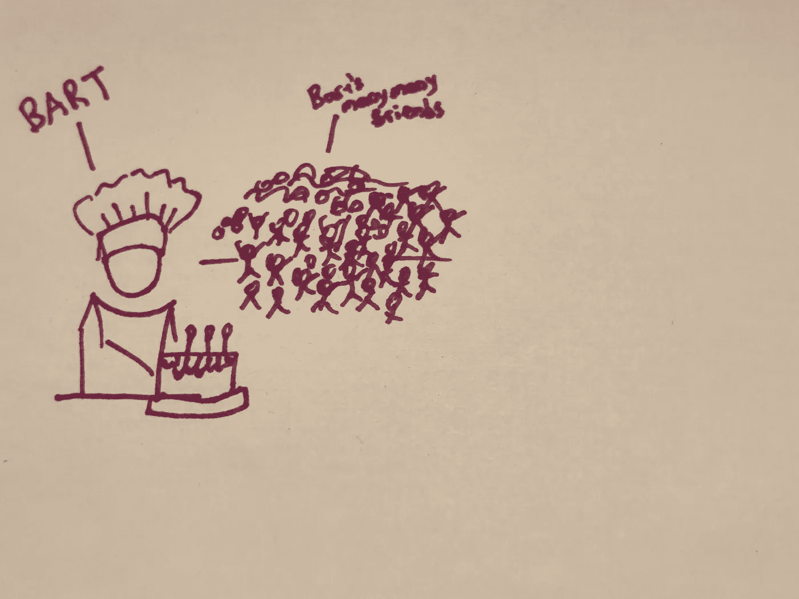
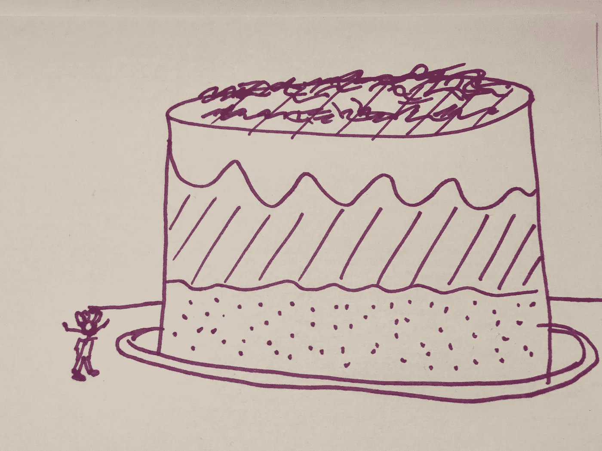
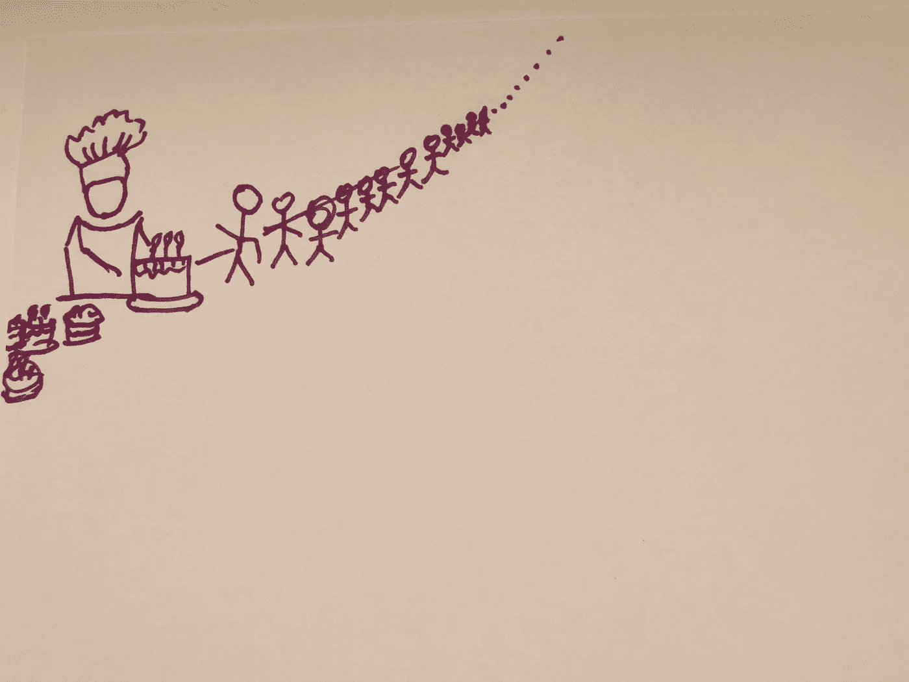
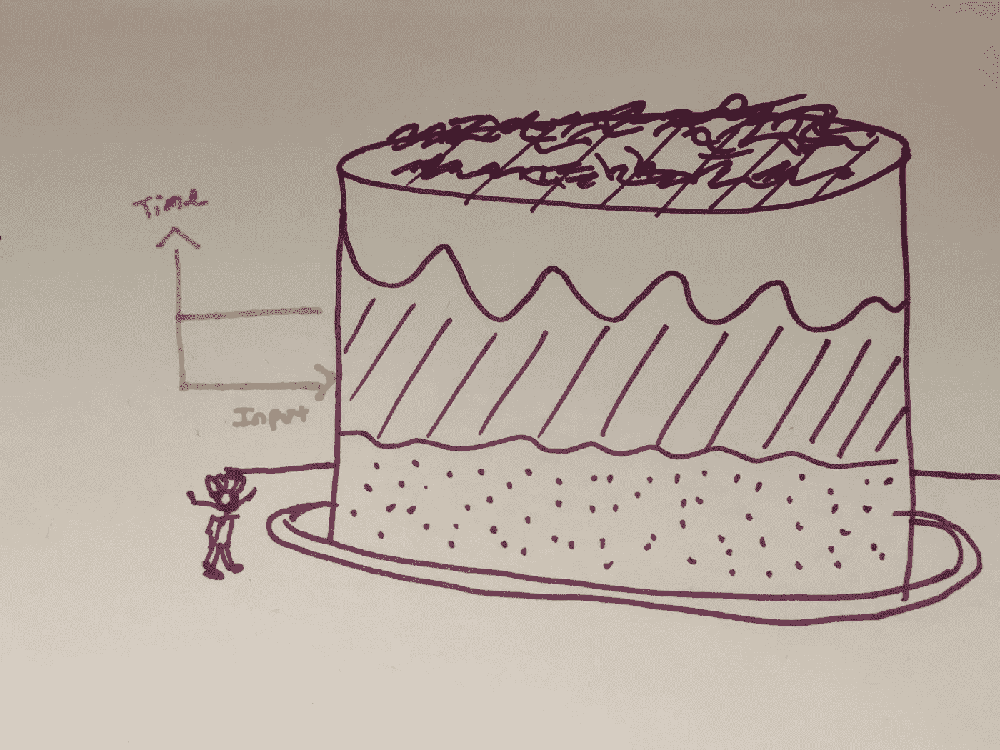
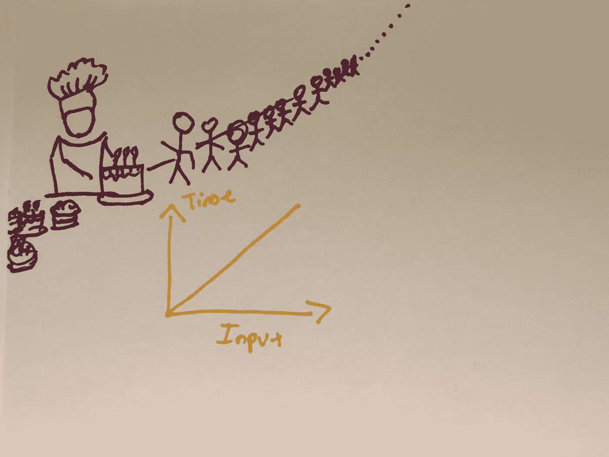

# 算法复杂性和大 O 符号(数据结构和算法变得简单)

> 原文：<https://levelup.gitconnected.com/algorithmic-complexity-big-o-notation-data-structures-algorithms-for-5th-graders-5250c8fc5c53>

如果将来某个时候电脑能烤蛋糕就超级好了！

你听说过“大米和棋盘”的故事吗？根据历史记载，这个故事最早是在 1256 年由一位名叫伊本·哈利坎的学者记录的。故事是这样的:

从前有一个喜欢下棋的印度国王，他经常和聪明的来访者下一盘棋。一天，一位圣人路过，国王向他挑战，要和他比赛。智者接受了国王的挑战。国王想用强烈的激励来激励对手，于是国王告诉贤者，如果贤者赢了，他可以有任何想要的奖励，前提是他事先命名。圣人要求一些非常特别的东西。他的奖赏如下:国王将把一粒米放在第一个国际象棋方格上，然后在随后的每个方格上加倍，直到棋盘上的每个方格都被填满。国王接受了智者的请求，认为这是他的对手所能要求的最小的回报。

圣人最后赢了，所以国王尊重了他的请求。国王命令将一袋大米带到棋盘上，并开始根据他们同意的安排放置米粒。当他经过第一个、第二个、第三个和第四个方块时，他很快发现有问题。当他到达第二十个方块时，国王必须放一百万粒米，当他到达第四十个方块时，他必须放十亿粒米！根据米粒排列覆盖整个棋盘将需要国王在棋盘上放置价值超过 2100 亿吨的大米！

经验教训:指数可能非常可怕。

— — —

# 目标/免责声明

本系列文章(“数据结构和算法变得简单”)的目的是帮助所有“学习爱好者”对 DSA(数据结构和算法)概念和主题有一个直观的理解。我强烈支持阿尔伯特·爱因斯坦和理查德·费曼共享的学习哲学。爱因斯坦曾有一句名言:“如果你不能向一个 6 岁的孩子解释，那你自己也不明白。”费曼基本上说了同样的话，“如果你不能用简单的术语解释某事，你就不理解它。最好的学习方法是教。”我真诚地希望，通过撰写这些文章的过程，我自己将更加巩固我对 DSA 的概念性理解，并且许多其他人也将从这种直观的理解中受益。

— — —

# 必备知识

为了对算法复杂性和大 O 符号有一个直观的理解，有必要对几个主题有一个基本的了解:

*   [代数](https://www.youtube.com/watch?v=5Q0FlxcEEIw)，具体是[函数](https://www.khanacademy.org/math/algebra/x2f8bb11595b61c86:functions/x2f8bb11595b61c86:evaluating-functions/v/what-is-a-function)和[指数](https://www.youtube.com/watch?v=S3IEeCyUWWA)
*   [电脑程序](https://www.snhu.edu/about-us/newsroom/stem/what-is-computer-programming)的最基本要素，以及[程序速度和内存空间](https://www.geeksforgeeks.org/understanding-time-complexity-simple-examples/)

— — —

我有一个非常愚蠢的例子给你看。

想象一下，有一个叫巴特的家伙，他是一个非常棒的蛋糕师，并且有很多朋友。

请原谅我写得不好

Bart 觉得他真的想招待他所有的朋友，并纪念他与他们所有人的甜蜜关系，因为他是一个非常好的蛋糕烘焙师，他决定用蛋糕招待他们。

巴特不想冒犯任何一个朋友，因为他看起来更喜欢一些朋友，所以他决定烤一个绝对大的蛋糕，可以喂饱他们每一个人。

巴特花了一些时间来完成他的巨型蛋糕，但他完成了它，并把它送给了他的朋友，希望他们都开心。然而，他的许多朋友抗议说，他们不想要一个巨大的公共蛋糕，而是，他们每个人都想有一个自己的蛋糕。他们每个人都告诉巴特，“如果你真的是我的朋友，那么你应该为我烤一个蛋糕！”

在巴特设法为他的每一个朋友烤好蛋糕后，他的“朋友”回来对他说，“实际上，这还不够好。我们不仅仅是你的朋友，我们也是彼此的朋友，所以我们想为这里的每一对朋友都准备一块蛋糕！”

正是在这一点上，巴特意识到他需要找到新朋友。

— — —

在我们开始直观理解算法复杂性和大 O 符号之前，我们首先需要定义这些术语的含义！

一个**算法**就是完成一个目标或任务的一个过程或一组步骤。对巴特来说，就是烤足够多的蛋糕来满足他“朋友”的欲望。

**算法复杂度**是在给定输入大小(通常用变量“n”表示)的情况下，算法完成一项任务需要多长时间。从我之前那个愚蠢的例子中，应该很容易看出，为每个朋友烤一个蛋糕比烤一个蛋糕有更高的算法复杂度，因为尽管单个蛋糕可能比单个蛋糕大得多，但它的大小仍然是恒定的，并且总的烘焙时间不会受到 Bart 朋友数量的很大影响(假设朋友数量非常非常多)。也应该很容易看出，为每一对朋友烤一个蛋糕，比为每一个朋友烤一个蛋糕的算法复杂度要高得多。

在编程世界中，正在使用的输入数据量很容易达到兆字节或千兆字节或更多，试图捕获每一条信息是完全不合理的。当输入量大得离谱时，更容易进行归纳和假设。

**大 O 符号**是一种简单的数学方法，用代数术语概括地描述算法的复杂性。更具体地说，它描述了当给定一个输入变量时，时间(或内存空间)如何缩放。

像 O(1)或 O(n)或 O(n)或 O(log(n))这样的术语很常见。我们再次使用变量“n ”,因为我们正在进行归纳，以便考虑到一个大得离谱的输入大小，甚至是一个接近无穷大的输入大小。你可以在其他时间更深入地研究大 O 的正式数学定义，但是现在，我们想把对大 O 的基本理解应用到我们愚蠢的插图中。

当 Bart 为他所有的朋友烘烤一个巨大的蛋糕时，我们可以用 O(1)来描述这个“烘烤算法”的复杂性。为什么？因为 Bart 完成任务所花费的时间不会随着输入大小(朋友的数量)而改变，尤其是当输入大小非常大时。

当 Bart 为他的每个朋友烤蛋糕时，我们可以将复杂度描述为 O(n ),因为 Bart 完成任务的时间量与输入大小成正比(线性)。更多的朋友=更多的蛋糕。朋友少=蛋糕少。

当 Bart 为每一对朋友烤蛋糕时，我们可以将复杂性描述为 O(n ),因为我们本质上必须将输入大小乘以它本身才能得到朋友对的数量。实际上，这实际上不是 O(n ),但我希望我们能看到这个函数肯定不是线性的！

— — —

# 概述

总结一下，什么是算法复杂度和大 O 记法？算法是完成一项任务的程序或步骤集，算法复杂性是在给定特定输入大小的情况下，任何算法完成一项任务需要多长时间。因为计算机任务处理非常大的输入，所以使用大 O 符号来估计和概括算法复杂性要有效得多，大 O 符号使用代数术语来描述给定输入变量时时间或内存空间如何缩放。

那些对这些概念有深刻理解的人在处理任何与计算机相关的任务时会更有准备，因为他们会理解为什么一些程序和一些算法被使用而其他的没有，他们会对什么更节省资源和时间有直观的理解。理解这些概念对每个使用计算机的人来说都是至关重要的。

— — —

# 资源

如果你需要更多的帮助来直观地理解算法的复杂性和大 O 符号，看看这些视频:

*   [https://www.youtube.com/watch?v=v4cd1O4zkGw&ab _ channel = hacker rank](https://www.youtube.com/watch?v=v4cd1O4zkGw&ab_channel=HackerRank)
*   https://www.youtube.com/watch?v=itn09C2ZB9Y[ab _ channel = WebDevSimplified](https://www.youtube.com/watch?v=itn09C2ZB9Y&ab_channel=WebDevSimplified)

如果您想更深入地了解这些主题的理论、应用和正式理解，请查看以下文章:

*   【https://www.bigocheatsheet.com/ 
*   [https://www . freecodecamp . org/news/big-o-notation-why-it-matters-and-why-it-stunts-1674 CFA 8 a 23 c/](https://www.freecodecamp.org/news/big-o-notation-why-it-matters-and-why-it-doesnt-1674cfa8a23c/)