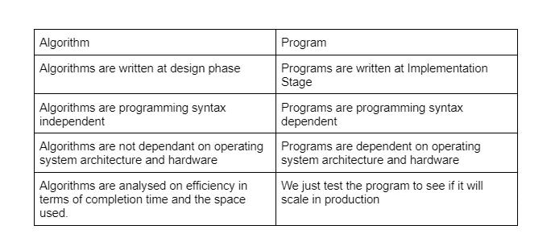

# 算法

> 原文：<https://levelup.gitconnected.com/algorithms-3bd92fa4155f>

这是详细讨论算法的多篇文章之一。开发人员在这些问题上苦苦挣扎，我想尽可能地简化它们，从基本到复杂。

来源:Marcus Spiske via【Unsplash.com 

无论你是想获得一份高薪的软件开发工作，还是想在竞争激烈的编码领域获得独家金牌。

# 什么是算法？

简单地说，算法是解决计算问题的一步一步的过程。

我们应该永远把我们的计算机当作我们不太聪明的朋友，如果你跳过一步，解释器或编译器就会返回一个错误。

在这个阶段，你会问，“那么什么是程序？”

我会回答说“这也是解决问题的一步一步的过程。”

在这个阶段，你很困惑，准备放弃，不想再看到编码。

在此之前，让我们比较一下程序和算法的区别。

让我们更详细地看一下上表:

## 设计阶段的算法

在软件开发中，我们有设计和实现阶段。在设计阶段，我们将业务问题分解成更小的部分。

然后将这些小部分写成算法，看看它们是否有商业意义，并解决内部工作。

## 设计阶段的程序

一旦我们的业务问题被简化并写成算法，那么它就可以被实现并变成一个程序。

## 算法是语法独立的

我们不需要遵守任何编程语言规范，我们可以使用数学符号和简单英语的组合。

## 程序是语法相关的

另一方面，因为我们在实现阶段编写程序，所以我们使用编程语言。

每种编程语言都有自己的语法，把“语法”想象成语法。解释器和编译器不会理解你，因为你违反了语法规则。

## 算法与硬件无关

我们可以在任何地方编写算法，甚至在白板上，因此在技术面试中你会遇到白板挑战。为此，我们不需要任何特定的硬件。

另一方面，程序是在 IDE 上编写的，并且依赖于硬件才能执行。

## 程序依赖于硬件

因为我们已经处于实现阶段，所以我们需要与机器对话来自动化我们的业务问题。

9/10 的人可以做这些业务任务，完美的例子是推荐系统。几十年来，我们一直在向我们的人类同胞推荐商品。

就这一点而言，机器比我们做得更好，因为它们是连续学习者。当我们睡觉的时候，他们在学习；当我们开心的时候，我们睡觉；当我们吃饭的时候，他们在学习。

事实证明，机器更有效。机器只是简单的电子硬件，我们用语法与它们交流。

# 分析算法

在计算机科学中，我们有所谓的空间和时间复杂性。这是一个算法的分析。

我们的算法解决一个问题需要多快，需要多少内存。

# 不分析程序

在实现阶段，我们将只需要测试我们的程序，我们已经分析了作为算法的程序。

# 算法的属性

## 大多数算法需要接受一个输出

一个问题可以被构造为:

写一个算法来反转一个字符串。在这种情况下，我们的输入是我们需要反转的字符串。

我们有绳子。“Thenjiwe”我们想把它反过来变成“ewijneht”。那么字符串“Thenjiwe”就是我们的输入。

## 算法需要产生一个输出

参考上面的问题，我们的输入是“Thenjiwe”。我们的算法应该是反转这个字符串，也许所有的都小写。那么我们的输出将是“ewijneht”。

## 算法需要清晰

我们需要从一开始就知道我们在解决哪些问题。我们是否颠倒字符，检查重复字符，寻找到一个位置的最短路径等。

## 算法需要在某个时候结束

它们有起点和终点。然后将在特定指令处开始并在特定指令处结束。算法的持续时间必须是有限的。

## 算法需要有效

你的算法不需要太花哨，也不需要有多个在编程阶段不会用到的语句。

# 附加阅读

1.  [http://www . edu 4 Java . com/en/concepts/what-is-a-program-an-algorithm . html](http://www.edu4java.com/en/concepts/what-is-a-program-an-algorithm.html)
2.  [https://www . investopedia . com/terms/a/algorithm . ASP #:~:text = An % 20 algorithm % 20 is % 20a % 20 set，正在准备%20a%20dish%20or%20meal](https://www.investopedia.com/terms/a/algorithm.asp#:~:text=An%20algorithm%20is%20a%20set,preparing%20a%20dish%20or%20meal) 。