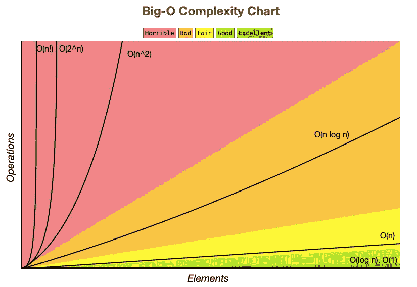

# 算法和大 O 符号

> 原文：<https://levelup.gitconnected.com/algorithms-and-big-o-notation-f93fb66e7093>

## 你在编程中发现的五个主要价值


[由 Dhru J 在 Unsplash 上](https://unsplash.com/photos/VT-dBtF8kb0)

前几天我写了一篇关于编程职业以及你需要的素质和技能的文章。其中一项技能是数学。然后我写了第二篇关于算法的文章，再次提到了数学。嗯，我想这可能是一个很好的机会来改变一下，写一些关于数学的东西。

所以我们开始吧。现在在计算机科学中有相当多的数学，尽管我认为大部分都有合理的根据。我提到了基础理论，布尔逻辑，几何，矩阵和百分比作为候选。但我现在不想谈这些。我想谈谈这个叫做大 O 符号的数学东西。大 O 记法是衡量算法性能的一种手段。

这是一种由保罗·巴赫曼和埃德蒙·兰道发明的符号。你不会惊讶地发现这些人是数学家。虽然你可能会回想起他们都出生在 18 世纪计算机发明之前很久的知识。

这种符号被用作一种标准方法，用来比较随着数据输入的增长算法的表现。这是一张备忘单，向你展示了什么是什么的图表。



图片复制自 https://www.bigocheatsheet.com

简而言之，你在寻找处于绿色波段的算法，并希望避开红色波段的算法。那么，这一切实际上意味着什么呢？

## O(1)

这表示**恒定性能**。因此，无论您向集合中添加多少数据，所花费的时间都是一样的。这方面的一个例子可能是一个计算某些东西的函数，如果你喜欢的话，可以说是纯数学。向函数发送什么样的数字并不重要，它所花费的时间总是不变的。这是绿色区域。

## O(n)

这也被称为**线性时间。**这意味着您的方法运行所需的时间与您添加到其中的数据量直接相关。一个 CS 的例子应该是这样的。

```
for t in 0...n {
  print("n ",n)
}
```

如你所见，n 越大，这个方法完成的时间就越长。但是花费的时间将是均匀的。把它画在图上，它将是一条直线。在上面的图表中，我们处于黄色区域。

## 氧气(氮气)

这也被称为**二次时间。这意味着随着你发送的数据量的增加，你的方法运行的时间会急剧增加。一个简单的例子是这样的。**

```
for t1 in 0...n {
  for t2 in 0...n {
    print("t1 t2 ",t1,t2)
  }
}
```

你可以理解，我确信 n 的值越大，花费的时间就越长。我们在红色区域。

## o(登录号)

这就是所谓的**对数时间**，这意味着运行一个方法所需的时间将与输入数据大小的对数成比例增加。对数算法的经典例子是二分搜索法。代码如下所示。

## O(nlog n)

这也称为**对数时间**，只是这个时间乘以 n【也就是数据量】。二进制排序是一个经典的 nlog n 算法的例子。

涵盖了我们的五个主要案例。要成为一名更好的程序员，你需要在这个列表中名列前茅。你不希望构建一个底部有很大复杂度的循环的应用程序，当然，除非你喜欢在你的代码评审中被活活烤死。

**O(1)
O(n)
O(log n)
O(nlog n)
O(N2)**

现在，它不仅仅是你的函数运行所花费的时间。因为在讨论应用程序使用的内存时，您可以使用相同的想法。也就是说，显然同样的启发式规则也适用，在理想世界中，你想要 O(1 ),你肯定不想要 O(n2)。

作为结束语，这里的[是我使用的图片的来源。如果你有兴趣了解/有比我在这篇关于这个主题的超级短文中给出的更多的例子，这是一个很好的参考。](https://www.bigocheatsheet.com)

保持冷静，继续编码