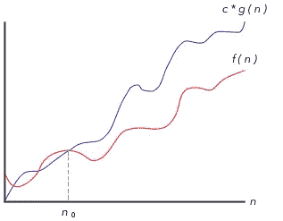
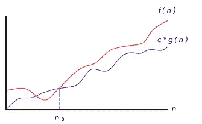
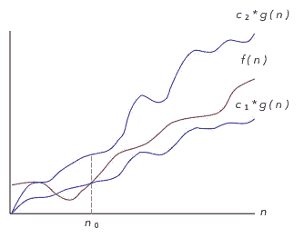
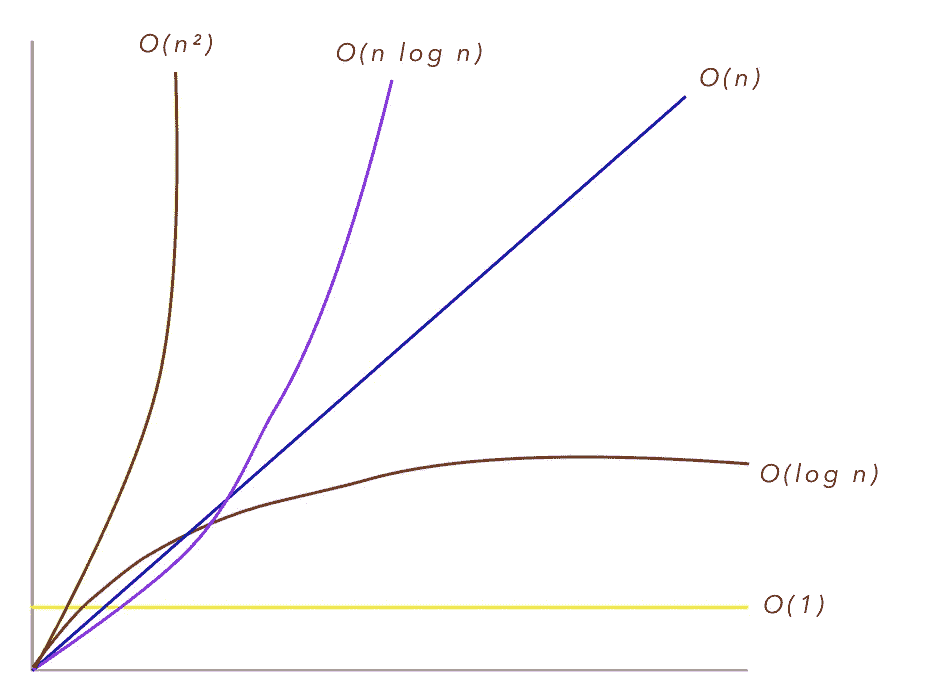
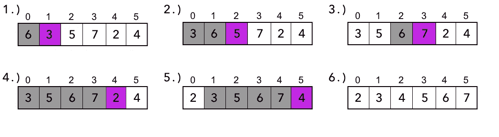

# Swift 中的算法和数据结构:Big-O 符号

> 原文：<https://levelup.gitconnected.com/algorithms-and-data-structures-in-swift-big-o-notation-579fdd38f3d8>

## 开始使用 Swift 中的算法


凯文·Ku 在 [Unsplash](https://unsplash.com/s/photos/time?utm_source=unsplash&utm_medium=referral&utm_content=creditCopyText) 上的照片

# 介绍

在本文中，我们将深入研究 Big-O 符号，编写我们的第一个算法，并通过 Swift 标准库中的一个具体示例来说明算法运行时间增长的重要性。

理解 Big-O 符号对于算法的比较和设计是必不可少的，因此对于后面的文章也是必不可少的，所以我认为这是一个很好的起点。

现在我们走吧。

# 什么是大 O 记数法？

Big-O 符号是一种度量标准，我们用它来判断随着输入大小的增加，算法运行时间的增长率。这叫做**时间复杂性。**

我们还可能关心算法需要的内存量，或者在进行递归调用时关心堆栈空间。这叫**空间复杂度**，也是用 Big-O 来描述的。

然而，我们最感兴趣的是算法的时间复杂度，这也是我在进一步的分析中要提到的。

## 渐近时间

当谈到时间复杂性时，Big-O 时间通常被称为算法的渐近运行时间。这意味着什么呢？这非常重要，我想先谈谈这个问题。

渐近复杂性使用 ***主导项*** 表达算法的增长。为了理解这一点，考虑一个例子:

我们有两个算法，姑且称之为 a *算法 A* 和*算法 B* ，运行时间分别为 *O(n)* 和 *O(2n)* 。两者中哪一个渐进地更有效？

你可能会认为算法 A 更有效，因为 n 小于 2n。然而，这是不正确的。事实是，它们在渐近上是同样有效的。

这是因为唯一的主导项是 n。一旦 n 变得足够大，就会主导算法的增长率，让 2 变得无关紧要。由此我们可以得出两个重要的事实:

1.  当计算渐近效率时，常数因子和非主导项可以被丢弃，因为它们对算法的长期增长率没有影响。在上面的例子中，将 n 乘以常数 2 只会使运行时间增加该常数因子。**算法还是会线性增长。**像 O(n + n)这样的运行时也是如此，其中唯一的主导项是 n，所以变成 O(n)。
2.  渐近效率不关心一个算法需要运行多长时间。它关心算法如何扩展。当然，算法 B 将需要更长的时间来运行，但总体增长率将与算法 a 相同。

# 大 O、大θ和大ω

我希望到目前为止一切都说得通，因为我想让你更加困惑。

我们可以区分三种记谱法。它们是 Big-O、Big-ω(大ω)和 Big-θ(大θ)。对于每一个，我将从它的正式定义开始，然后我们将检查它们在实践中的含义。

## 大 O:

Big-O 给出了函数的一个*渐近上界*。

正式定义如下:

> 对于给定的函数 g(n)，我们用 O(g(n))表示函数集:
> 
> O(g(n)) = { f(n):存在正常数 c 和 nₒ使得 0 ≤ f(n) ≤ c * g(n)对于所有 n ≥ nₒ }

那么这意味着什么呢？这可能过于简单，但是为了用一句简单的话来解释以上内容，我们可以说，Big-O 意味着**函数的增长率永远不会比这个更差。**

现在一个实际的例子:下面我们将编写我们的第一个算法，插入排序，它(剧透警报)的运行时间为 O(n)。

这也意味着它的运行时间为 O(n)，O(n⁴等。因为绝对不会比这些差。

如图 1 所示，f(n)的值总是位于 c*g(n)之上或之下。



**图 1:大 O 符号**

## 大ω(大ω):

big-ω给出了函数的一个*渐近下界*。

正式定义如下:

> 对于给定的函数 g(n)，我们用ω(g(n))表示函数集:
> 
> ω(g(n))= { f(n):存在正常数 c 和 nₒ使得 0 ≤ c*g(n) ≤ f(n)对于所有 n ≥ nₒ }

把我们用 Big-O 的逻辑反过来，我们可以说，用 Big-ω，我们的意思是**函数的运行时间永远不会比这更好。**

当数组已经排序时，插入排序的最佳运行时间为*ω(n)*。写*ω(log n)*和*ω(1)*也是正确的，因为**算法永远不会像这样快。**

如图 1 所示，f(n)的值总是位于 c*g(n)之上。



**图 2:大-*ω符号***

## 大θ(大θ):

Big-θ给出了函数的一个*渐近紧界*。

正式定义如下:

> 对于给定的函数 g(n)，我们用θ(g(n))表示函数集:
> 
> θ(g(n)) = {f(n):存在正常数 c₁，c₂和 nₒ使得 0 ≤ c₁*g(n) ≤ f(n) ≤ c₂*g(n)对于所有 n ≥ nₒ }

简而言之，Big-θ意味着**一个同时为 O 和*ω的运行时。***

正如我们看到的，插入排序是 O(n)和ω(n ),因此，它是θ(n)。

> “在工业界(因此在采访中)，人们似乎已经把θ和 O 融合在一起了。业界对大 O 的定义更接近于学术界对θ的定义，因为将打印数组描述为 O(n)被认为是不正确的。行业只会说这是 O(n)。”— *破解编码采访:盖尔·拉克曼·麦克道尔*

您可以在图 3 中看到渐近紧界是什么样子的。 *f(n)* 的值总是落在 *c₁*g(n)* 和 *c₂*g(n)* 之间。



**图 3:大θ符号**

# 最常见的运行时

在深入研究代码之前，让我们回顾一下您将遇到的一些最常见的运行时。



**图 4:最常见的运行时间**

**O(1):** 这就是所谓的*常数*时间。无论 n 的大小如何，执行该操作所需的时间总是相同的。这是你能拥有的最好的时间复杂度，但也是非常罕见的。

**O(log n)** :这个叫*对数*时间。O(log n)仍然是一个相当高效的运行时。O(log n)时间算法的一个例子是二分搜索法。

**O(n)** :这叫*线性*时间。运行时间最多随着输入的大小线性增加。打印数组中所有值的算法的时间为 O(n ),因为它所需的时间与 n 的大小成正比。

**O(n log n)** :这就是所谓的*线性算法*时间。这个运行时的两个例子是合并排序和堆排序。

**O(n )** :这个叫*二次*时间。这通常被认为是一个非常糟糕的运行时。插入排序就是一个例子。

# 插入排序

现在我们对时间复杂性有了一些了解，是时候将我们的知识付诸实践了。

我们要构造的算法叫做*插入排序*。像所有排序算法一样，它解决了排序问题:

> *给定一个由 n 个数字组成的序列(a₁，a₂，…安)，返回该序列的一个排列，使得 aٰ₁ ≤ aٰ₂ ≤ … ≤ aٰn.*

插入排序是一个非常简单的算法，它就地对输入数组进行排序。对于较小的输入大小，这可能是一个不错的选择，但是一旦 n 变得足够大，其他算法就会胜过它。

解释插入排序的老方法是把它比作一手扑克牌的排序。

我们有一手 n 张扑克牌，一张一张地拿出每张牌，通过从左到右与每张牌进行比较来确定它的正确位置。这就是这个名字的由来，因为我们取出物品并把它们放回正确的位置。

图 5 展示了对一个包含 6 个元素的数组进行插入排序的操作。紫色矩形表示当前从数组中取出的元素，灰色矩形表示与之比较的值。



图 5:插入排序的操作

*   我们迭代数组中的每个元素，跳过第一个元素，因为它已经是一个排序的子数组。
*   该元素从右到左与排序后的子数组中的每一项进行比较。
*   当一个值大于当前元素时，它向右移动一个位置。
*   如果有一个更小的项目或者到达了子数组的末尾，当前项目将被插入到该槽中。

现在让我们动手写一些代码吧！

如果你想编码，现在是在 Xcode 中创建一个新游戏场的最佳时机。

因为我们喜欢[干代码(*不要重复* )](https://en.wikipedia.org/wiki/Don%27t_repeat_yourself) 代码，讨厌湿代码(*我们喜欢打字*)代码，所以我们将使我们的插入排序算法通用化。这样，我们只需编写一次函数，就能够对符合 [Comparable](https://developer.apple.com/documentation/swift/comparable) 的任何类型进行排序。

```
func insertionSort <T: Comparable>(array: inout [T]) {
    //...
}
```

到目前为止，这相当简单:

*   我们创建一个新函数，并声明一个符合 Comparable 的泛型变量。
*   我们将输入指定为包含通用元素的数组。
*   因为我们之前说过插入排序会对数组进行排序，所以我们的输入必须是一个 [inout](https://stackoverflow.com/a/34486086/10706839) 参数。

我们要做的第一件事是检查传入的数组是否为空。如果是，我们就返回。

```
if array.isEmpty {
   return
}
```

现在，我们必须按照上面简单例子中的步骤实现我们的算法。

```
for i in 1..<array.count {
    var pos = i
    let temp = array[i]while pos > 0 && array[pos - 1] > temp {
       array[pos] = array[pos - 1]
       pos -= 1
    }
    array[pos] = temp
}
```

让我们看看这里发生了什么:

*   我们迭代数组，从第二个元素开始。
*   我们创建一个变量来存储当前的索引。
*   我们创建一个变量来临时存储从数组中取出的当前元素。
*   然后，当元素比我们的临时变量大的时候，当我们不在数组的末尾的时候，我们想继续向右移动元素。
*   如果上述先决条件为真，我们将元素推到右边，并将 *pos* 的值减 1。这样，当 while 循环再次执行时，它将检查左边的下一个元素。
*   当一个元素不大于我们的临时变量时，或者当到达数组的末尾时，我们将临时变量插入到发生这种情况的索引中。

这个过程的结果是一个排序后的数组。

要测试我们的代码:

```
var array = [6, 3, 5, 7, 2, 4]
insertionSort(array: &array)
print(array) //[2, 3, 4, 5, 6, 7]
```

这是整个算法:

## 插入排序分析

在分析时间复杂性时，一般情况往往与最坏情况相同。这里，最坏的情况发生在数组顺序相反的时候，所以这就是我们要关注的。

让我们假设执行上面的每一行代码需要恒定的时间。一行可能比另一行花费不同的时间，但是为了简化我们的分析，让我们假设为一个元素运行我们的 for 循环花费 *c* 时间。

我们必须将每个元素*数组【I】*与整个排序后的子数组进行比较。

如果我们插入一个有 *k* 个元素的子数组，在第一次调用 *k=1* ，然后 *k=2* 一直到 *k=n-1* 。

这使我们的总时间为:

c*1 + c*2 + … c*n-1=c*(1+2+…(n-1))

这是一个上升到 n-1 的[等差数列](https://www.mathwords.com/a/arithmetic_series.htm)。使用算术级数的公式，我们最终得到:

cn . 2-cn . 2

如果我们现在丢弃非主导项和常数因子，我们最终得到的是θ(n)。

# 实际例子

这一切都很好，但现在你可能想知道当涉及到构建 iOS 应用程序的日常工作时，所有这些有什么实际用途。的确，你可以在不了解所有这些的情况下构建应用程序。

然而，在结束本文之前，我想给出一个实际的例子，在这个例子中，这种类型的知识非常有用。

假设您必须检查一个元素是否包含在一个非常大的元素池的集合中。(如果你在一家大公司工作，这是一个完全可以想象的场景。)

细节可以单独作为一篇文章来讨论，我们先不说细节，只说测试成员资格的集合是数组还是集合非常重要。

集合是用哈希表实现的，它本质上是一个只存储键的字典。查找一个值需要恒定的时间。

相比之下，在数组中查找值需要线性时间。

所以你有 *O(1)* vs. *O(n)* 。例如，如果您必须在 100 万用户的集合中找到某个用户，那么两个运行时之间的差异就会变得非常大。

# 结论

在本文中，我们回顾了渐近效率的基本概念，了解了一些最常见的运行时，实现并分析了我们的第一个算法，并探索了 Big-O 重要性的真实示例。

感谢你阅读这篇文章，我希望你从中获得价值。如果您有任何问题或想法，请随时回复。

资源:

*   [插入排序](https://gist.github.com/lajosdeme/379b4c951529d501f9e0c684b88b78ae)
*   [算法介绍](http://Introduction to Algorithms)
*   [破解编码面试](https://www.amazon.com/Cracking-Coding-Interview-Programming-Questions/dp/0984782850/ref=sr_1_1?crid=7YIYYRFDVXQV&keywords=cracking+the+coding+interview&qid=1581365610&sprefix=cracking+the+cod%2Caps%2C279&sr=8-1)
*   [等差数列](https://www.mathwords.com/a/arithmetic_series.htm)