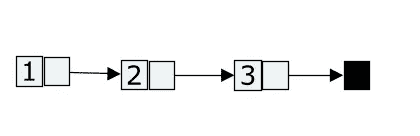
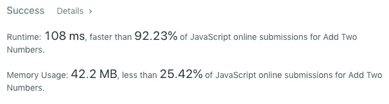

# JavaScript 算法:将两个数相加

> 原文：<https://levelup.gitconnected.com/algorithms-with-javascript-add-two-numbers-d297cec0c747>

在这篇博文中，我们将练习解决一些算法问题。而今天我们的 leetcode 问题是:[加两个数](https://leetcode.com/problems/add-two-numbers)。


**问题定义:**

*给你两个非空链表，代表两个非负整数。这些数字以相反的顺序存储，并且它们的每个节点都包含一个数字。将两个数相加，并以链表的形式返回。*

你可以假设这两个数字不包含任何前导零，除了数字 0 本身。

**链表**

首先让我们弄清楚什么是链表。链表是一种线性存储多个值的数据结构。每个值是它的 owl 节点/对象，它存储值并链接到列表中的下一个节点/对象。看起来是这样的:

```
function ListNode(val) { this.val = val; this.next = null;}
```

这就是我们如何构建一个链表:

```
// add a first node
const head = new LinkedListNode(1);// add a second nodehead.next = new LinkedListNode(2);// add a third nodehead.next.next = new LinkedListNode(3);
```



**思维过程**

我们有两个反向链表，我们需要同时遍历每个链表，并将两个链表中的值相加。因此，我们需要返回一个新的链表，其中包含这些值的总和。

我们需要实现价值。因为每个节点都必须有一个一位数的值。如果你加上 5 + 5，结果是 10，所以你把 0 放在最近的节点，把 1 移到下一个节点。在下一个节点中，您将在总和上加 1。

在我们的解决方案中，我们将使用 while 循环来遍历两个链表中的每个节点。while 循环的条件如下所示:

```
while(l1 || l2 || sum > 0)
```

在循环中，我们将 l1 和 l2 赋给链表的头。然后做加法，将 sum 添加到新的链表中，并移动到下一个节点**。如果 l1 或 l2 不为假，它们继续循环。即使我们没有相同大小的链表，这也是可行的。**

同样，在函数的最后，我们将把进位值赋给和，即使 l1 和 l2 为空，进位值也将被添加到最终的链表中。

**解决方案**

下面是最终函数的样子:

leetcode 对我们的解决方案有什么看法？



**结论**

这个问题在编码面试中很常见。如果你能解决它，说明你对数据结构的理解已经超越了内置数据结构，比如数组和对象。

不断学习，不断成长！

我们上 [LinkedIn](https://www.linkedin.com/in/pavel-ilin) 连线吧！

[](https://skilled.dev) [## 编写面试问题

### 编码面试课程

技术开发](https://skilled.dev)