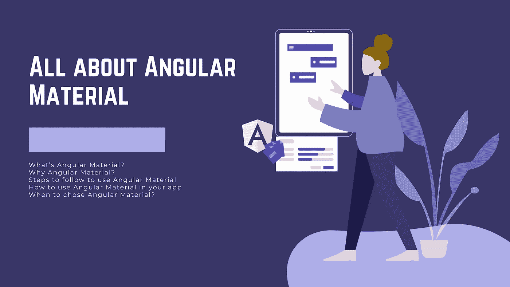

# 所有关于有角的材料

> 原文：<https://levelup.gitconnected.com/all-about-angular-material-3e0b86e9e195>

## 关于这个 Angular UI 库你需要知道的事情



如今，UI 库对于每个 web 应用程序都是必不可少的。首先，因为它加速了开发，并约束所有开发人员为相同的目的使用相同的组件，因此应用程序中更多的可重用性和更少的维护工作。其次，它使团队中的新前端开发人员感到舒适，并开始超快速的生产，因为源或遵循的准则是一个并且已经指定:Prime NG。

在这篇文章中，我回答了一些关于 Angular Material UI 库的问题，比如这是什么？为什么使用它？怎么用，什么时候用？

最后，我将根据我的经验和我作为前端开发人员的观点给出一些最终的想法。

准备好了吗？李 eet 的 gooo

# 什么是有角的物质？

**Angular Material** 是一个针对 **Angular** 应用的 UI 组件库。它提供了可以在桌面和移动设备上工作的现代 UI 组件。您可以使用这些 UI 现代组件构建有吸引力的、一致的和功能性的 web 应用程序。

# 为什么是棱角分明的材质？

*   Angular Material 受到麻省理工学院的许可，所以它是免费的，可以用于商业用途。
*   提供现代网页设计原则，如可移植性、设备独立性和有吸引力的应用程序。
*   简化开发过程，最重要的是帮助用提供的高质量和可维护的组件快速构建应用程序。
*   跨不同设备和不同屏幕尺寸的统一 web 应用程序(响应式应用程序)
*   为开发人员提供工具，让他们使用通用交互模式构建自己的定制组件。
*   因为它是由 Angular 团队构建的，所以可以无缝地集成到 Angular 应用程序中。

# 使用角形材料应遵循的步骤

*   **步骤#1:用 Angular CLI 安装 Angular app**

如果这是你第一次创建 Angular 应用程序，这里有一个快速的总结步骤:

[](https://medium.com/@famzil/2-steps-to-create-launch-test-discover-angular-application-713387952e69) [## 创建、启动、测试和发现角度应用的 2 个步骤

### 发现角度应用的快速简单步骤

medium.com](https://medium.com/@famzil/2-steps-to-create-launch-test-discover-angular-application-713387952e69) 

*   **步骤#2:安装角度材质、角度 CDK 和角度动画**

不带角度 CLI(与 npm 或 yarn 一起安装):

```
***npm install @angular/material @angular/cdk @angular/animations --save***
```

带角度 CLI:

```
***ng add @angular/material***
```

CLI 将建议您选择您想要的角度主题材料。

*   **步骤#3:配置动画**

如果您有 Angular CLI，通常您不需要这一步，因为它已经设置了所有需要的角度材料。

否则，您将需要自己配置角度动画。别担心，这很简单快捷。你只需要将动画模块导入到你的 Angular 应用模块中:

```
import { BrowserAnimationsModule } from '@angular/platform-browser/animations';@NgModule({
  imports: [BrowserAnimationsModule],
})

export class AppModule { }
```

**祝贺️🎉，您的应用程序就可以使用 Angular Material UI 组件了。现在，让我们看看如何使用它。**

# 如何在你的应用中使用棱角分明的材质

*   **步骤#1:导入您需要使用的组件的模块**

假设您想要构建一个表单，我们需要导入:

```
import {MatFormFieldModule} from '@angular/material/form-field';
import {MatButtonModule} from '@angular/material/button';
```

*   **第二步:在你的 HTML 模板中添加组件**

```
<div class="example-container">
  <mat-form-field appearance="fill">
    <mat-label>Input</mat-label>
    <input matInput>
  </mat-form-field>
  <br>
  <mat-form-field appearance="fill">
    <mat-label>Select</mat-label>
    <mat-select>
      <mat-option value="option">Option</mat-option>
    </mat-select>
  </mat-form-field>
  <br>
  <mat-form-field appearance="fill">
    <mat-label>Textarea</mat-label>
    <textarea matInput></textarea>
  </mat-form-field><button mat-raised-button (click)="onNoClick()">No, thanks</button><button mat-raised-button (click)="onYesClick()">Yes</button>
</div>
```

您可以在角材文档中查看更多组件:[角材组件](https://material.angular.io/components/categories)

# 何时选择 Angular Material 作为应用程序的 UI 库？

由于我使用了这两个 UI 库，在我看来，Angular Material UI 库更适合具有基本和经典需求的小型应用程序，如表单、菜单、侧边栏等。你真的可以构建一个性感的应用程序。

对于大型应用程序，例如具有大量功能和特定需求的企业应用程序。我不认为有棱角的材料真的会有效率。我宁愿选择像 Prime NG 这样的。

还有一个解决方案是只使用 Bootstrap 和 CSS，通过用 npm 或 yarn 安装这些包: [ngx-bootstrap](https://www.npmjs.com/package/ngx-bootstrap) ，[ng-Bootstrap](https://www.npmjs.com/package/ng-bootstrap)…等等。对于企业应用程序来说，这也是一个方便的解决方案，但是你需要有一个 UI/UX 设计者，他将制作一个定制的 bootstrap 主题，该主题尊重客户端的图表。所以开发者会按照主题来有一个统一的代码和前台。这种解决方案的唯一不便之处是代码维护的成本。

如果你想使用 Prime NG，这里有一个快速教程，总结了在你的应用程序中使用它需要遵循的步骤:

[](https://medium.com/@famzil/how-to-use-primeng-angular-9-c70b023a3633) [## 如何使用 PrimeNG — Angular 9

### 快速教程:在您的 Web 应用程序中设置 PrimeNG 的步骤

medium.com](https://medium.com/@famzil/how-to-use-primeng-angular-9-c70b023a3633) 

# 最后的想法

*   这个 UI 库非常强大，它极大地方便和减少了开发人员构建完全一致、统一和有吸引力的 Angular 应用程序的工作和时间。
*   当使用一个 UI 库时，确保在同一个应用程序中只使用一个而不是几个 UI 库，例如 [Prime NG](https://primefaces.org/primeng/showcase/) 以获得一个可维护的统一应用程序。
*   如果你正在为你的应用程序寻找一个特定的定制设计，考虑要么用 Angular Material 构建你自己的主题，要么使用另一个提供更多组件和经典设计的库，你可以很容易地用 SCSS/CSS 定制这个库，如 [Prime NG](https://primefaces.org/primeng/showcase/) 。

亲爱的读者朋友们，感谢你们的支持和宝贵时间。我希望这对你有用和有帮助。

**关注我上** [**中**](https://medium.com/@famzil/) **、**[**Linkedin**](https://www.linkedin.com/in/fatima-amzil-9031ba95/)**、**[**Twitter**](https://twitter.com/FatimaAMZIL9)**了解更多文章。**

不久后见(ﾉ◕ヮ◕)ﾉ*:･ﾟ✧)

**FAM**