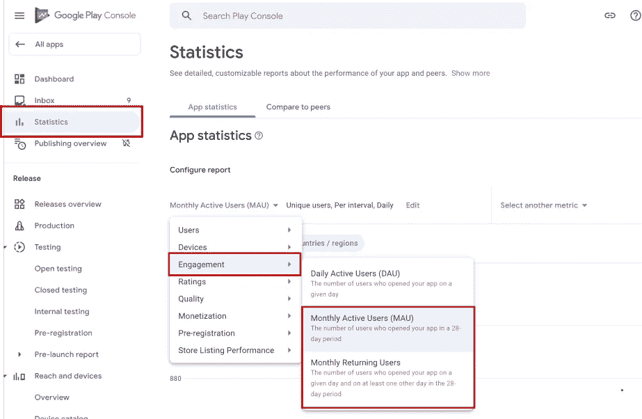

# 关于应用参与的所有内容，第 1 部分:它是什么以及它如何影响你的 Google Play 排名

> 原文：<https://levelup.gitconnected.com/all-about-app-engagement-part-1-what-it-is-and-how-it-affects-your-google-play-ranking-f1adce5d9afa>

谷歌 Play 商店可能是这个星球上最好的应用商店。比起竞争对手，它更喜欢真正优秀的应用程序，这真的很聪明。对于 Android 应用开发者来说，这意味着没有欺骗系统；你的应用只有在实际上更好的情况下才能在竞争中名列前茅。不管你有多少朋友在你的清单上写满了精彩的评论，不管你在社交媒体上被提及多少次，也不管你做了多少广告——这些都不会有任何影响。

相比之下，苹果的搜索排名更加传统。iOS 商店更受应用的评论、历史和用户群规模的影响。因此，本文中的原则在 Android 世界中的作用将比苹果更强大，但这并不意味着它对 iOS 无效。最后，这篇文章是关于找到你的“甜蜜点”用户群，这对两个平台都有价值，对其他平台也有价值。

Google Play 排名算法的具体细节错综复杂，尽管谷歌自己会告诉你，重要的部分出奇的简单:他们关心的是能产生参与度的应用。

因此，在 Google Play 中，应用商店优化技术变得完全是为了提高你的应用的参与度。

# 什么是订婚？

参与度是你的用户对你的应用的投入程度。他们是否依赖它来完成某项任务？他们是觉得经常玩游戏有用，还是经常玩游戏，总是试图提高分数或取得更大进步？

或者，他们是否运行了一次，发现它没有用处或乐趣，并且随后再也没有使用它？

对谷歌来说，参与度的简单衡量标准是:每 1000 名下载你的应用的用户中，有多少人在一个月、两个月、三个月后仍在使用它。

因此，最糟糕的用户是那些运行过一次你的应用程序，然后要么卸载它，要么再也不运行它的人。因此，提高你的参与度就是要么将这些人转化为常规用户，要么从一开始就避开他们。

# 如何在 Google Play 控制台上查看我的参与度统计数据？

在 Google Play 控制台中，选择您的应用程序，然后单击左侧菜单中的统计数据。有两个有用的统计数据:

**月活跃用户(MAU)** 。这给出了在给定的 4 周内使用你的应用的用户数量。(是的，对谷歌来说，每个月有 28 天)。

**月返用户**。这给出了每月活跃用户的数量(如上所述)，但只包括那些在过去 28 天内至少使用过一次该应用的用户。

以上两项都可以从“配置报告”标题下的下拉菜单中选择，它们位于该菜单的 Engagement 部分。

Google Play 控制台中参与度统计的位置

这里重要的是一个和另一个的比例。因此，在该页面上，您可以绘制每月活跃用户与每月返回用户的对比图。如果两者的价值接近，那么你的大部分用户都是回头客，这很好。如果他们相距甚远，那么你就有工作要做。

# 避免错误的用户类型

显而易见，如果有人会对你的参与度产生不良影响，你不会希望他们成为你的用户。那么我们能做些什么来阻止这些人下载呢？

最重要的是，这意味着在用户下载你的应用之前，不要做出错误的承诺。你会失去每一个下载你的应用程序的用户，他们认为这是一个针对特定需求的伟大解决方案，但发现它实际上专注于解决一个微妙不同的问题。所以，要具体说明你的应用程序提供了什么好处，以避免这样的人。我以前写过确保你的应用列表不会吸引错误的人*的重要性——这和吸引正确的人一样重要。*

*记住，重要的是参与的用户的*百分比*。与 1000 次安装中的 300 名新参与用户(30%)相比，200 次安装中的 100 名新参与用户(50%参与)将显著有利于你的参与统计数据，从而你的应用排名。*

*一旦你找到了你的最佳点——参与度非常高的精选人群——谷歌就会注意到，并开始向你提供更多与之相关的人。你的胜利也是谷歌的胜利，因为它们都是关于搜索的。他们希望为给定的搜索查询和输入该查询的用户类型提供最相关的应用。交付给你的用户越相关，你的参与度就越好。*

*不吸引错误类型用户的原则不仅仅适用于你的商店列表。同样重要的是，要密切关注店外广告和社交媒体。如果你通过没有仔细定位的按安装付费广告找到你的用户，你会带来那些不太可能长期保持用户的人。这通过创建一个没有参与的用户群，积极地损害你的有机播放商店搜索排名。总是非常有选择性。*

*与往常一样，社交媒体是一个潜在的强大但不可超越的工具，可以提供愿意参与的目标用户。如果你能让已经参与进来的用户和其他像他们一样的人谈论你的应用，这将是一个很好的相关用户的来源。*

# *后续步骤*

*在这篇文章中，我们讨论了应用参与度:它是什么，为什么它很重要，如何查看你的参与度统计，以及如何改进它们以提高你在应用商店中的有机搜索排名。*

*一旦你把你的商店列表和外部链接调整到你满意的程度，你需要对你的应用程序进行修改，以进一步提高你剩下的用户的参与度。这是本系列第二部分的主题，将于 2021 年 9 月 16 日星期四发布。到时候见！*