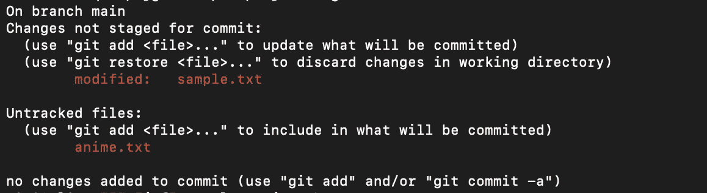
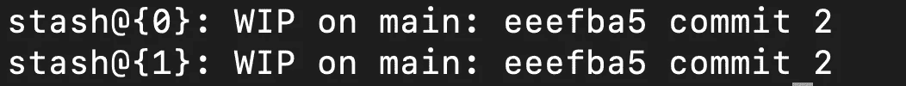

# 关于 git stash 的一切

> 原文：<https://levelup.gitconnected.com/all-about-git-stash-8a9460fdc01e>

一个简单易懂的分步指南来理解 git stash


照片由[扬西·敏](https://unsplash.com/ja/@yancymin?utm_source=medium&utm_medium=referral)在 [Unsplash](https://unsplash.com?utm_source=medium&utm_medium=referral) 上拍摄

[Git](https://git-scm.com/) 是一个人必备的技能之一。很好地掌握 Git 的概念不仅可以帮助您有效地管理您的变更，还可以提高整体的生产力和工作流。本文旨在介绍许多有用的 git 命令之一，即 [git stash](https://git-scm.com/docs/git-stash) 。

我个人在从事各种项目时发现它非常有用。

话虽如此，让我们开始吧！

# 方案

你有没有发现自己处于这样一个位置

*   在错误的分支中进行了更改，但尚未提交它们？现在您希望以某种方式将这些变化转移到您选择的分支？
*   正在实施尚未完成的新变革，但由于新任务的优先级较高，您不得不紧急接受它？
*   因为这样或那样的原因，想要一个干净的工作树，但又不想放弃你的改变？
*   只是希望保存您未提交的更改以便将来查看？

那么不要担心，因为 [git stash](https://git-scm.com/docs/git-stash) 就是你所需要的！

# 什么是 git stash？

它是一个命令，允许您将未提交的更改保存在类似数据结构的堆栈中。然后，您可以在需要时将这些更改应用回您的工作树。

这允许一个灵活的工作流程，同时同时处理几个任务。

# 要记住的命令

下一节包含与隐藏相关的各种命令以及与它们相关的细节

## 1.列出所有的藏匿点

```
git stash list
```

根据你是否有什么东西，它会给出以下两个输出中的一个

*   空行:无库存
*   索引中的存储列表:一个或多个存储

更多关于如何阅读这个列表的信息，请见下一节。

## 2.将更改保存到存储

考虑以下场景，其中您可能有两种更改，即

*   跟踪文件中的更改
*   未跟踪文件中的更改



要保存更改，只需输入

```
git stash
```

这创建了下面的 stash 并回滚到 HEAD 工作树。


这里，花括号中的数字表示该特定存储的索引。在这种情况下，由于 stash 堆栈为空，因此它出现在堆栈的顶部**，即索引 0** 。当新的变更被保存到 stash 中时，先前变更的索引会不断增加。就像堆栈(FIFO)一样，堆栈的顶部是索引 0。

“**在干管上的 WIP**”表示在干管分支上正在进行的工作

并且 **eeefba5** 和**提交 2，**分别是前一次提交的 ID 和消息。

因此，总而言之，通用格式应该是这样的

```
stash@{<index of stash>}: WIP on <branch name>: <SHA-1 hash of the commit> <commit message of the last commit>
```

**问题 1**

默认情况下，未跟踪文件中引入的更改不会被隐藏。因此，要将这些包含在 stash 中，必须使用`--include-untracked`标志。这将把未跟踪的变更和跟踪的变更一起保存在存储中。

```
git stash --include-untracked
```

**问题二**

考虑我们在工作树中做了另一个改变，并把它藏起来。这将导致`stash`看起来像这样



正如我们所看到的，它们在表面上看起来是一样的。这使得某人很难识别哪些变更与哪个隐藏的项目相关联。人们必须研究实际的变化，以确定应用哪个存储。

因此，向隐藏的项目添加有意义的消息，而不是保留默认消息，证明是有帮助的。要提供自定义消息，请使用以下命令

```
git stash push -m "test message" --include-untracked
```

这将导致我们的存储看起来像这样，而不是我们之前没有任何自定义消息


**重要注意事项**

*   命令`git stash save`在 Git 的 [2.16.0 版本](https://github.com/git/git/blob/master/Documentation/RelNotes/2.16.0.txt#L34)中被正式否决。因此，我不会在这篇文章中讨论这个问题。一个很好的参考是 stackoverflow 上的 [this](https://stackoverflow.com/a/71040797/11597114) 和 [this](https://stackoverflow.com/a/44681952/11597114) 答案。

命令`git stash create`和`git stash store`已经被

## 3.将更改应用到工作树

既然我们已经将更改保存在我们的存储中，我们可能希望将它们应用到正确的位置。为此，只需键入

```
git stash pop
```

关于这个命令的行为，需要注意一些事情

*   这将应用堆栈顶部的已保存更改，即堆栈的索引 0
*   这将从存储中删除那些更改。因此将所有其他保存的改变的索引分别减 1。

如果你想应用一个存在于第 n 个索引的改变，那么使用下面的命令

```
git stash apply stash@{N}
```

其中 **N** 是您希望应用的已保存更改的索引。关于这个命令需要注意的一点是，它不会删除保存的存储。

补充说明

```
git stash branch <branchname> stash@{N}
```

从最初创建`<stash>`的提交开始，创建并检查一个名为`<branchname>`的新分支，将`<stash>`中记录的更改应用到新的工作树和索引。如果成功，并且`<stash>`是表单`stash@{<revision>}`的引用，那么它就丢弃`<stash>`。更多信息请点击[这里](https://git-scm.com/docs/git-stash#Documentation/git-stash.txt-branchltbranchnamegtltstashgt)。

## 4.从存储中删除保存的更改

如果您觉得存储中某个保存的更改没有用，并且希望删除它，您可以使用以下命令

```
git stash drop stash@{N}
```

其中 **N** 是您希望从存储中删除的已保存更改的索引。

如果您希望删除所有保存的更改并清空存储，请使用以下命令

```
git stash clear
```

# 额外参考和阅读

1.  [git stash save*和 *git stash store**](https://stackoverflow.com/a/57008221/11597114) 的区别
2.  [目的 *git stash 创建*和 *git stash store*](https://stackoverflow.com/questions/28635989/what-is-the-purpose-of-git-stash-create-and-git-stash-store)
3.  [区别 *git stash save* 和 *git stash push*](https://stackoverflow.com/questions/44680028/whats-the-difference-between-git-stash-save-and-git-stash-push)

我希望我能够通过这篇文章提供至少一条有用的信息。如果你想让我介绍任何其他有用的 [Git](https://git-scm.com/) 命令，这超出了基础知识的范畴，请随意在评论中留下名字。