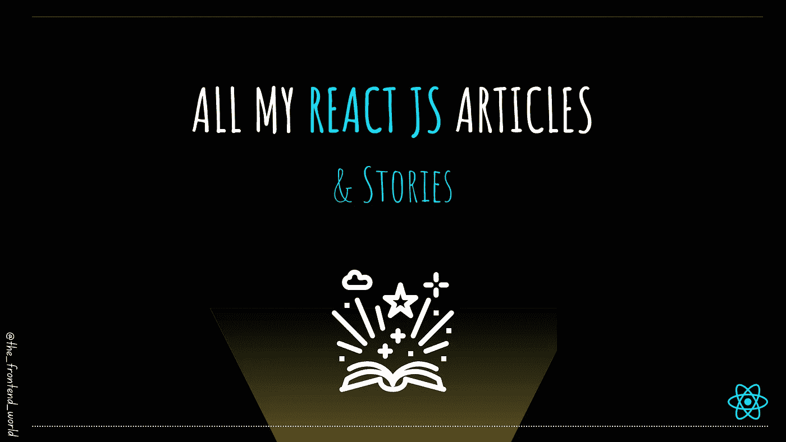

# 我所有的反应文章

> 原文：<https://levelup.gitconnected.com/all-my-react-js-articles-de3400b07c98>

## 关于 React 的实用常识文章

作者:FAM

应 Kev Everall 的要求，这里是我所有的反应堆文章。我希望你会喜欢它，像往常一样，请在下面评论任何关于 React JS 的请求或反馈。

# React JS 的一般知识

 [## React 中的虚拟 DOM 有什么用？

### React 的虚拟 DOM 哲学。

levelup.gitconnected.com](/what-is-the-use-of-the-virtual-dom-in-react-62a2ad61bb88)  [## React JS 有什么特别之处？

### 什么反应？为什么它如此受欢迎？

famzil.medium.com](https://famzil.medium.com/whats-so-special-about-react-js-7707f706e038)  [## 何时、为何以及如何使用 React 上下文

### React 中的上下文是什么？

levelup.gitconnected.com](/when-why-and-how-to-use-react-context-2f9832a3ebc4)  [## 每个 React 开发人员都应该知道的 4 个关键特性

### 在本文中，我将介绍每个 React 开发人员都应该知道的 4 个关键特性。

javascript.plainenglish.io](https://javascript.plainenglish.io/the-4-key-features-every-react-developer-should-know-bdd2cfa0a7c8) 

# React JS 应用的良好参考和工具

 [## 创建卓越 web 应用程序的最佳 UI React 框架！

### 2021 年的 6 个最佳 React UI 框架和套件

medium.com](https://medium.com/geekculture/6-best-react-ui-frameworks-and-kits-for-2021-14ae9611ca1d)  [## 2021 年 6 大热门 React JS 动画库

### 发现 React 应用程序的最佳动画库

medium.com](https://medium.com/geekculture/6-top-popular-react-js-animation-libraries-in-2021-e6ea75bb6fcd) 

# 关于 React JS 的实用文章

 [## React 中的黑暗模式

### 如何在 react JS 中制作黑暗主题？

levelup.gitconnected.com](/dark-mode-in-react-533faaee3c6e)  [## 如何将谷歌分析账户链接到 React 应用

### 只需两步！

levelup.gitconnected.com](/how-to-link-a-google-analytics-account-to-your-react-app-f0b4dd13663c)  [## 如何衡量 React 应用组件的性能

### 创建高性能的 React 组件！

levelup.gitconnected.com](/how-to-measure-react-apps-components-performance-6b0b9b0236db)  [## 如何将 Godaddy 域连接到已部署的 Heroku React 应用程序

### 只需三步。简单！

levelup.gitconnected.com](/how-to-connect-a-godaddy-domain-to-a-deployed-heroku-react-app-9b8809d858c0)  [## 如何创建用于 React 应用程序的节点全局变量

### 修复返回未定义的 process.env.VARIABLE_NAME

levelup.gitconnected.com](/how-to-create-node-global-variables-to-use-in-react-app-9df1514a4eb7)  [## 如何在 React 中创建 Jest 快照测试

### 测试对于维护任何应用程序都是至关重要的！

levelup.gitconnected.com](/how-to-create-a-jest-snapshot-test-in-react-6fd2f755a568) 

# 短视频…

 [## 每个 React 开发人员都应该知道的 4 个关键特性

### 如果你是 React 新手，或者正在寻找 React 开发人员的工作，你应该知道 React 的特别之处和它的优点…

www.youtube.com](https://www.youtube.com/shorts/xqSlclGG1rU) 

***窃窃私语(*** *我发现这不公平相比之下* [*我写的所有棱角分明的文章*](/all-my-angular-articles-6fe4c14e863e?source=your_stories_page-------------------------------------) *额。我应该做点什么。请请求 React JS 话题解决这种对 React 的不公*😆 ***)***

> 我今天的故事到此结束，希望你喜欢 it❤

[如果你喜欢看我的文章……♥️](https://famzil.medium.com/subscribe)

 [## 如果你喜欢看我的文章… ♥️

### 如果你喜欢读我的文章… ♥️，当我的文章发表时，欢迎你第一个得到通知…

famzil.medium.com](https://famzil.medium.com/subscribe) 

> 谢谢你，❤

如果你有兴趣成为付费会员，你可以使用我的推荐链接。下次见

亲爱的读者，感谢你在我生命中的存在。

**让我们在** [**上取得联系**](https://medium.com/@famzil/)**[**Linkedin**](https://www.linkedin.com/in/fatima-amzil-9031ba95/)**[**脸书**](https://www.facebook.com/The-Front-End-World)**[**insta gram**](https://www.instagram.com/the_frontend_world/)**[**YouTube**](https://www.youtube.com/channel/UCaxr-f9r6P1u7Y7SKFHi12g)**或**********

****参见我的关于网络要素和一般文化的电子书。****