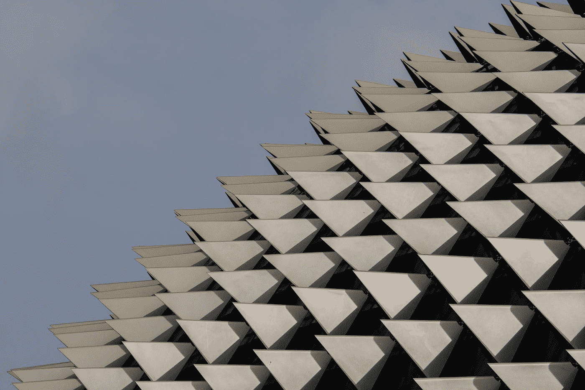
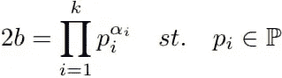
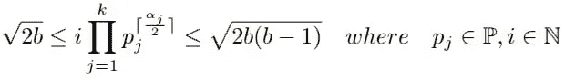
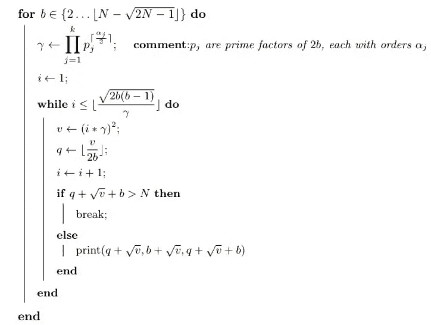
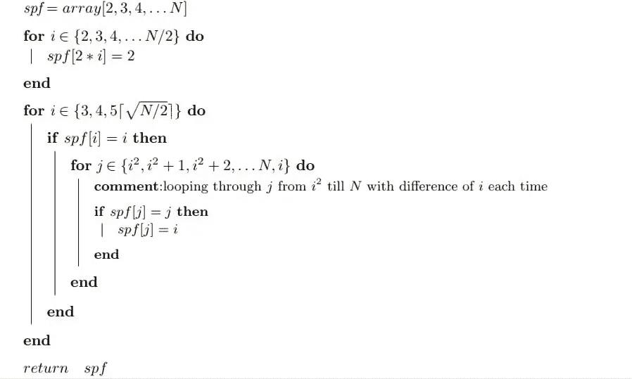
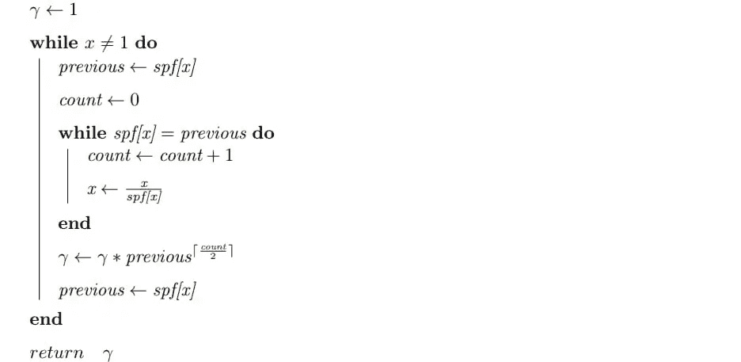
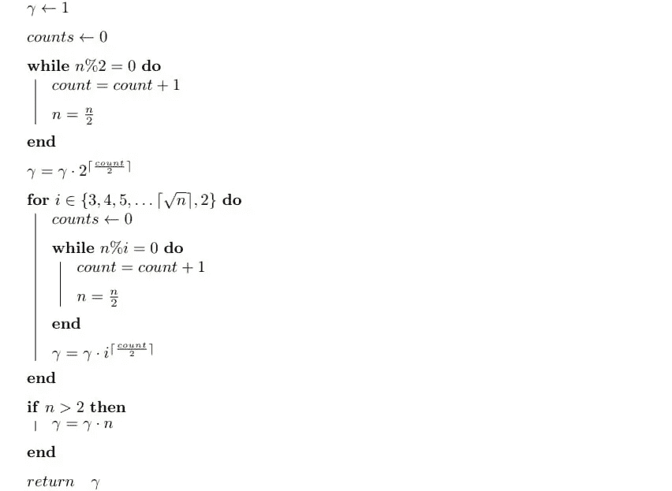

# 最优时间复杂度小于等于 N 的所有勾股三元组

> 原文：<https://levelup.gitconnected.com/all-pythagorean-triplets-less-than-equal-n-in-optimal-time-complexity-babfbe742337>



照片由 [Unsplash](https://unsplash.com?utm_source=medium&utm_medium=referral) 上的[尼克·费因斯](https://unsplash.com/@jannerboy62?utm_source=medium&utm_medium=referral)拍摄

毕达哥拉斯三元组是三个有序正整数(x，y，z)的集合，使得

```
 x^2 + y^2 = z^2    --- (1)
where,
x < y < z <= N
```

有几种生成勾股三元组的技术，例如使用[高斯整数](https://en.wikipedia.org/wiki/Gaussian_integers)和使用[欧几里德公式](https://en.wikipedia.org/wiki/Formulas_for_generating_Pythagorean_triples)。它们可用于生成所有本原毕达哥拉斯三元组，通过使用非本原毕达哥拉斯三元组是本原毕达哥拉斯三元组的正整数倍这一事实，它们可再次用于生成所有非本原毕达哥拉斯三元组。

简单地使用两个循环通过对所有可能的 x 和 y 迭代 x 和 y 来生成勾股三元组，并检查它们是否满足等式(1 ),花费时间 O(N)。此外，使用上述方法来生成原始的毕达哥拉斯三元组以及从它们生成所有的毕达哥拉斯三元组可能需要 O(N)时间。

我使用了方程(2)，通过求解 x 的二次方程可以很容易地从方程(1)得出方程(2)，因此对于“ *x > 0”、*

```
 x = (b - a) + sqrt{2b(b - a)} --- (2)where,
a = y - x,
b = z - x and
0 < a < b
```

为了找到所有的毕达哥拉斯三元组，我们需要找到 *a* 和 *b* 的所有值，使得它们是整数并且等式(2)成立。为了找到 a 和 b 的值，首先，我们将一步一步地寻找它们各自的范围。

根据 *a* 的定义，其上限和下限取决于 *b* ，可以写成

```
 1 ≤ a ≤ b − 1
```

由于 *b >* *a* 和 *a* 的下限为 1，因此 *b* 的下限为 2。现在我们需要找到 *b* 的上限。

我们知道 *0 < z ≤ N* ，从(*b = zx)*(*x+b≤N)*，从而从等式(2)和*a = B1，*

```
 (b − a) + sqrt{2b(b − a)} + b ≤ N           
                       ⇒ b + 1 + sqrt{2b} ≤ N
                       ⇒ 0 ≤ b ≤ N − sqrt{2N − 1}Since first pythagorean Triple is (3,4,5), which makes N ≥ 5
```

设，*v = 2b(ba)*，由于 *x* 为正整数且 *1 < a < b，*因此从等式(2)，

```
 2b ≤ v ≤ 2b(b − 1) and 
                        sqrt{v} ∈ **N**        and 
                        v (mod 2b) = 0
```

为了找到 *v* 的实际值，我们使用 *2b* 的[质因数分解](https://www.mathsisfun.com/prime-factorization.html)，



等式(3):2b 的质因数分解

其中，p_i 是 k 个素数，每个素数的阶为α_i。

使用 2b 的质因数，我们可以通过等式计算出 *v* 的值，



等式(sqrt { v }的解

其中，p_j 是 k 个素数，每个素数的阶次为{a_j /2}，p_i = p_j，α_i = α_j，分别来自等式(3)和等式(4)。等式(4)可以被证明，这并不困难，但也不难。

# **算法**

一切都设置好了，现在我们来看算法的伪代码:

[](https://i.imgur.com/sOitf6i.jpg)

用于生成勾股三元组的伪代码

上述算法在 python 中可以写成:

在上面的算法中，for 循环运行了 *N-sqrt{2N-1}* 次，在其中，我们计算的是 *2b* 的素因子，然后是 *γ* ，可以及时计算出来 *O(ln N)* 见定理 2。由于毕达哥拉斯三元组 *(x，y，z)* 与 *z ≤ N* 的数量顺序为*O(N lnn)*【1】【2】，并且在 while 循环中我们计算三元组直到 *z ≤ N* ，每次迭代时，我们都会发现一个毕达哥拉斯三元组，顺序为 *O(1)* ， 因为我们只是在做乘法来找到 *v* 因为 v = (iγ)^2 并且从 *v* 我们正在计算 *q* 也就是 *b-a* 除以 *v* 除以 *2b* ，有 *q* 和 *v* 我们计算，三胞胎乘

```
 x = (b − a) + sqrt{2b(b − a)}
                 ⇒ x = q + √(v)                   y = x + a
                 ⇒ y = a + √(v)                    z = x + b 
                 ⇒ z = q + √(v) + b
```

由于 while 循环中的操作花费了 *O(1)* 的时间，因此，while 循环花费了 *O(ln(N))* 的时间，使得整个算法花费了 *O(N ln N)* 的时间和 *O(N)* 的空间。

# **计算 SPF 数组**

为了计算每个小于等于 N 的整数的最小质因数，我们可以使用厄拉多塞筛算法。这种算法不是最佳算法，但是由于它没有损害整个算法的运行时间复杂性，所以它是好的。

还有比厄拉多塞筛算法更好的算法，但是为了说明和简单起见，我们将坚持使用厄拉多塞筛算法。

[](https://i.imgur.com/PQDJSzR.jpg)

用于计算 spf 阵列的伪代码

而且，上面的算法可以用 python 写成:

我们可以在线性时间[3]内预先计算出每一个小于 *N* 的正整数的最低质因数并存储在一个数组中比如说 *spf* ，使用 *spf* 通过使用 [*试除法*](https://en.wikipedia.org/wiki/Trial_division) 计算出 *x* 的质因数。使用 spf 数组的试除法需要时间 *O(ln x)* 而 *spf* 数组本身需要空间*O(N)*【3】(存储小于 2N 的整数的空间)。

# **计算伽玛**

通过稍微改变试除法，我们也可以直接使用 *spf* 计算 *γ* ，见下面的算法。

[](https://i.imgur.com/qVkcg13.jpg)

使用 spf 阵列计算伽玛的伪代码

上述算法可以用 python 写成:

如果我们不想存储每个整数的最低质因数，或者在某些情况下我们的存储空间较少，我们需要每次从开始计算 *2b* 的质因数，然后为此计算 *γ* ，这在 *O(N^0.5) (* 见下面的算法)、中很容易完成，只需用试除法替换最终算法中的“getReducedFactorization”函数并做一些修改， 类似于 getReducedFactorization 函数来计算 *γ* ，从而使得最终算法取 *O(N^1.5)* 。

[](https://i.imgur.com/5nB2heG.jpg)

直接计算伽玛的伪代码

所有函数都在一个 python 文件中的最终算法可以在[这里](https://github.com/abecus/DS-and-Algorithms/blob/master/pytriplets/pythagoreanTriplets.py)找到。

如果你发现任何错误，请让我知道，以便其他读者可以得到正确的结果。

# **参考文献**

[1] Nowak，W. G .，& Recknagel，w .“毕达哥拉斯三元组的分布和一个三维除数问题”，数学。冈山大学，31，213–220，1989 年。

[2] Manuel Benito，Juan L.Varona，“边数少于 n 的毕达哥拉斯三角形”，《计算与应用数学杂志》，Elsevier，143，117–126，2002 年。

[3]大卫·格里斯，贾亚迪夫·米斯拉。“寻找素数的线性筛选算法”，1978 年