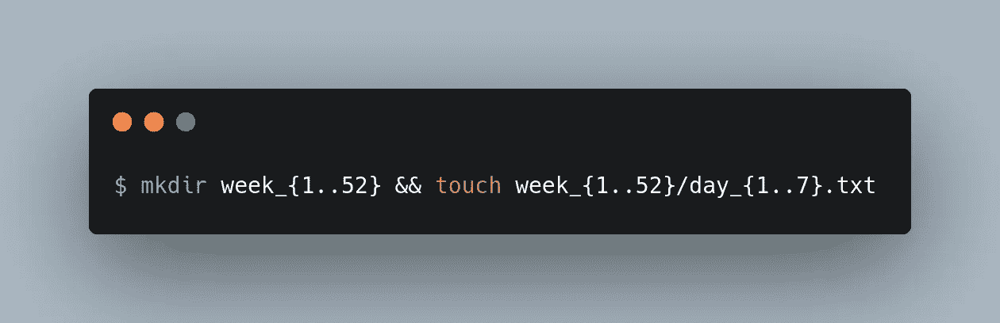
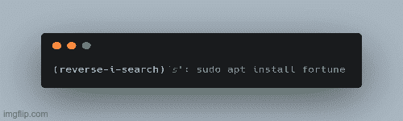
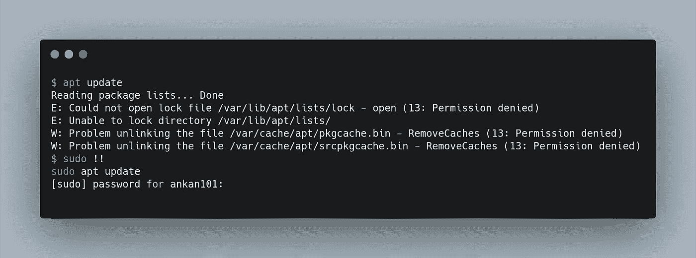
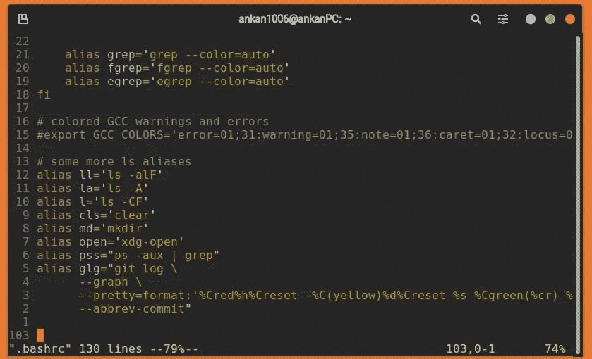

# 在终端中获得更快速度所需的所有快捷方式。

> 原文：<https://levelup.gitconnected.com/all-the-shortcuts-you-need-to-get-faster-in-the-terminal-ce91b91ecf91>

## 这些快捷方式将帮助初学者和超级用户，在更短的时间内完成更多的工作。

亚历克斯·丘马克在 [Unsplash](https://unsplash.com?utm_source=medium&utm_medium=referral) 上的照片

> “生活中所有最优秀的人似乎都喜欢 LINUX。”
> 
> ~苹果联合创始人史蒂夫·沃兹尼亚克

你知道业内大部分资深 dev 的共同点吗？他们中的大多数人对*命令行界面有基本的了解。*拥有码头的工作知识让你比其他开发人员更有竞争优势。使用终端也可以极大地增强你的工作流程，但是这些技巧会让你的工作流程更上一层楼。

几乎所有的操作系统都有一个内置的命令行界面，供高级用户控制系统和发射导弹(但愿如此！).但是 Windows PowerShell 有些限制，所以微软的人为开发人员建立了“Windows Subsystem for Linux(wsl 2.0)”( T7)(即使他们最近才意识到)。因此，要学习基础知识，你不必离开你现有的舒适的机器。

# 为什么首先要考虑使用终端？

害怕终端是很常见的，甚至我也害怕它，那是 3 年前我进入技术世界的时候，我曾经把 Windows 作为我的日常驱动程序。我们觉得使用 GUI 很舒服，许多人甚至认为它是过去的遗物(这是！真)。以下是它至今仍然存在的一些原因。

*   自动化每天重复的任务:当你想在每个星期天的午夜更新服务器时，有没有想过事情会变得多么无聊！或者在特定日期的特定时间运行脚本，或者在启动机器时打开应用程序。好吧，terminal 为您提供了保护，您可以设置一个 cron 作业来做这些事情，再也不用担心了。您不能从 GUI 中自动完成这些事情。
*   **对操作系统的更多控制:**您可以运行命令来更改文件的权限，查找系统中最大的文件，与数据库交互，启动和管理服务器，管理进程，执行快速 DNS 查找，ping 网络中的其他机器，等等。使用 GUI，您可以完成上面的一些任务，但是这些任务中的大部分是为终端保留的。

在一个目录中找到 10 个最大的文件(只需将/usr/bin/替换为所需的目录)

*   **云计算:**如果你从事过该行业，那么你现在肯定会经常碰到这个术语。要使用这项技术，您需要对终端有一些基本的了解，比如对服务器的 ssh-ing。
*   **从终端做事情确实更快:**让我们想象一下，我想让你为一年中的每一周创建 52 个不同的文件夹，然后在每个文件夹中，你想为一周中的每一天创建 7 个不同的文件。如何在 GUI 中实现这一点？右击并点击新文件夹 364 次？或者你可以在终端中输入一个命令(查看下图)来做同样的事情！不是更快吗？

为一年中的每一周创建文件。

*   **工作起来有趣多了:**除了做严肃的工作，你还可以在航站楼里做很多有趣的事情。比如每天下午 6 点随机更新自己的推特状态！或者运行蒸汽机作为对打错了 ls 而不是 sl 的惩罚，或者每天得到一个幸运饼干，或者寻找任何数字的质因数，或者让一头牛说话等等。

使用**【curl】**更新推特状态

如果你确信使用终端，我们现在将讨论今天的主题。

# 顶级终端技巧。

> "智力是一种逃避工作，但却完成工作的能力."
> 
> ~ Linus Torvalds，LINUX 内核的创造者

现在，你知道使用终端已经更快了，但是还有很多捷径可以带你去月球(不用迫降！).说真的，您可以使用一些列出的快捷键和终端别名，让它为您完成所有繁重的工作。知道这些捷径会让你驯服这头野兽，让你瞬间弹指做事(就像灭霸)。

# 1.自动完成命令。

标签自动完成:这可能是最重要也是最常见的。你可以写几个字母的命令或文件，然后点击 tab，命令或文件名会自动填充。

# 2.在终端中剪切和粘贴。

如果您尝试使用键盘快捷键在提示中复制、剪切或粘贴文本，您可能会发现它根本不起作用。要在终端中粘贴从 StackOverflow 复制的文本，您必须按下 **' *ctrl-shift-v* '** 。类似地，要从命令行复制或剪切文本，您必须分别按下**‘ctrl-shift-c’**和**‘ctrl-shift-x’**。但是等等，在终端还有更多的技巧。

这不仅仅是普通的剪切、复制和粘贴。探索！

**ctrl-k:** 从当前光标位置开始剪切/删除文本，直到行尾。

**ctrl-u:** 剪切/删除从当前光标位置到行首的文本。

**ctrl-w:** 从当前光标位置到单词开头剪切/删除文本。

**alt-d:** 从当前光标位置到单词末尾剪切/删除文本。

**ctrl-y:** 当我们使用上述命令删除文本时，“被删除”的文本被存储在一个被称为“kill-ring”的内存中。 *'ctrl-y'* 检索文本，将其粘贴到光标下方。

# 3.在命令行中跳转。

当你在一大行的开头、中间或结尾打错了一个错别字会怎么样。嗯，你必须不停地按箭头键才能到达那里。这些键盘快捷键会让你更快到达目的地。

**ctrl-a:** 将光标移动到行首。这类似于按下键盘上的 *Home* 按钮。

**ctrl-e:** 将光标移动到行尾。这类似于按下键盘上的*结束*按钮。

**ctrl-f:** 一次向前移动光标一个字符(与右箭头相同)。

**ctrl-b:** 一次向后移动光标一个字符(与左箭头相同)。

**alt-f:** 将光标向前移动一个单词(与按 ctrl +右箭头键相同)。

**alt-b:** 将光标向后移动一个单词(与按 ctrl +左箭头键相同)。

**ctrl-t:** 将光标下的当前字符与其前一个字符交换。这对于快速纠正错别字非常有用！

# 4.探寻历史与历史扩张。

Bash 将我们在实际文件中输入的命令记录在 *~/中。bash _ 历史。*您可以查看主目录中的文件，并可以使用上下箭头一次一个命令地滚动历史记录。我们也可以使用 ***历史*** 命令来查看整个历史。但是一般来说，如果我们将输出通过管道传输到*而不是*，那么管理起来会更容易。

**Reverse-I-search(ctrl-r):**当您输入时，bash 将开始搜索历史记录，并填充最近执行的最匹配的命令。您也可以按下 **ctrl-r** 来搜索最近历史中的下一个匹配命令。

使用(ctrl-r)进行反向搜索

**从历史中自动填充:**你是否曾经输入了一个命令，却发现你忘记了给出必要的许可。例如，您键入了`apt install cmatrix`，但忘记了在命令前面加上 sudo。嗯，你可以输入`sudo !!`，它会展开为`sudo apt install cmatrix` *。*T45！！运算符扩展到前面的命令。

使用！！用之前的命令替换

另一个历史扩展是当您想要只自动填充以前命令的以前参数时。按下 **alt-。** *循环显示之前命令的相关参数。*

# 5.终端的扩展。

还记得我在一个命令中创建了 52 个文件夹和 364 个文件的例子吗，我使用了一个叫做*大括号扩展*的东西。

**通配符或 Globbing 模式:**我们可以使用特殊的通配符来创建一次匹配多个文件名的模式。

**星号(*)通配符:**星号字符代表文件名中的零个或多个字符。例如，`ls *.js`将匹配任何以*结尾的文件。js* 如当前目录中的 *index.js* 和 *app.js* 和`cat pink*`将匹配任何名称以 *"pink"* 开头的文件如*pinky.pdf*或 *pinkSky.js*

**问题(？)通配符:**问号字符代表文件名中的任意单个字符。例如，`ls index.???`将匹配任何名为“index”且扩展名为 3 的文件，如*index.htm*或 *index.css* ，但不匹配*index.html*

**范围通配符:**方括号([])用于指定要匹配的字符范围。括号内的任何字符都将被单独匹配。例如，`ls file[0–9]`将匹配*文件 1、文件 2* ，直到*文件 9* 和`ls *[abc]`将匹配任何以 a、b 或 c 结尾的文件，如*漫画*、*鲍勃*和*厚度*。

我们也可以通过简单地在字符的开头使用一个脱字符号(^)来否定这些范围通配符，比如`ls [^A]*`将匹配任何不以大写字母“a”开头的文件。

**大括号扩展:**大括号扩展用于生成任意字符串。它将根据给定的模式生成多个字符串。为了使用它，我们在花括号({})中提供了一组字符串，以及可选的后缀和前缀。例如，`touch count-{123}.txt`会生成三个文件: *count-1.txt，count-2.txt，count-3.txt.* 我们也可以通过使用(..)将执行与前面命令相同的操作。我们也可以使用这个扩展进行嵌套，就像`echo {a,b{1..5},c}`将打印 *a，b1，b2，b3，b4，b5，c.*

# 创建您自己的命令！

别名就像键盘快捷键，但对于终端和增压。它们是最有用的捷径。只用一个命令就可以做很多复杂的工作。这些对命令很有帮助，你使用最像你可以设置一个别名`gcm`来做`git commit -am`这样打字要快得多。

要创建别名，我们必须编辑一个名为 *~/的文件。bashrc* 或者 *~。/bash_profile。在文件里面，你可以通过写`alias <your_alias_name> = “type command to execute”`来设置你的别名。例如，`alias pss=”ps -aux | grep”` 会让你搜索当前正在运行的进程，你现在可以输入`pss chrome`，它会搜索所有属于 chrome 的进程。*

在~/中设置自定义别名。bashrc 文件

# 结尾注释。

恭喜你！现在你可以认为自己是终极超级英雄了。现在，您对终端拥有最终控制权。您还可以使用现有命令创建自己的小命令来完成更复杂的工作。你也可以用这些技巧在工作中打动你的同事。

愿终端的力量与你同在！