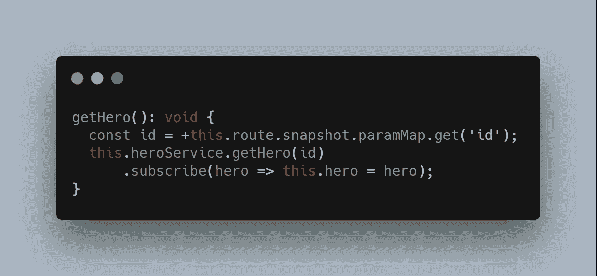
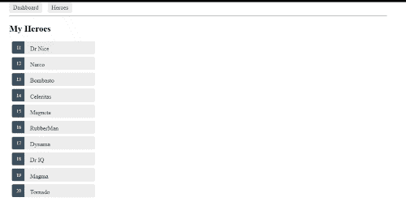
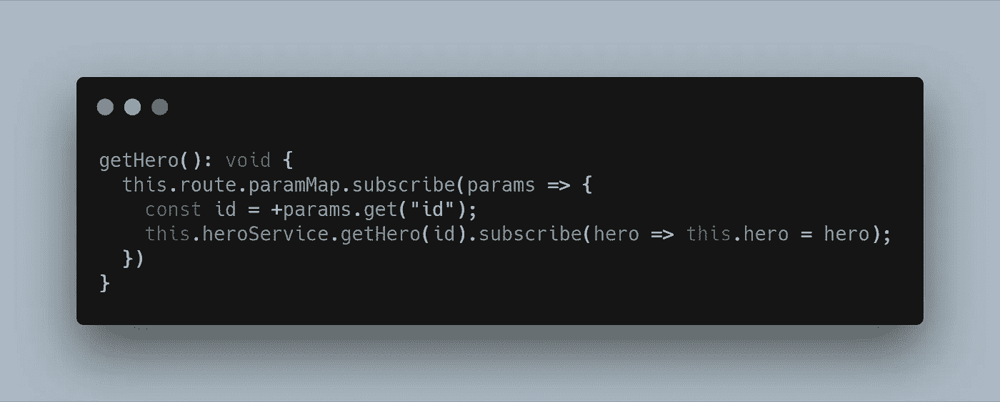
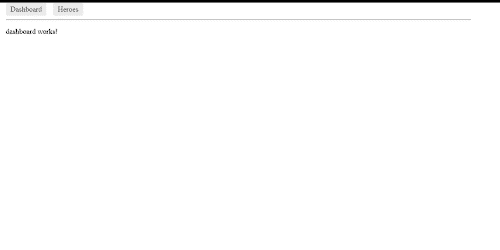
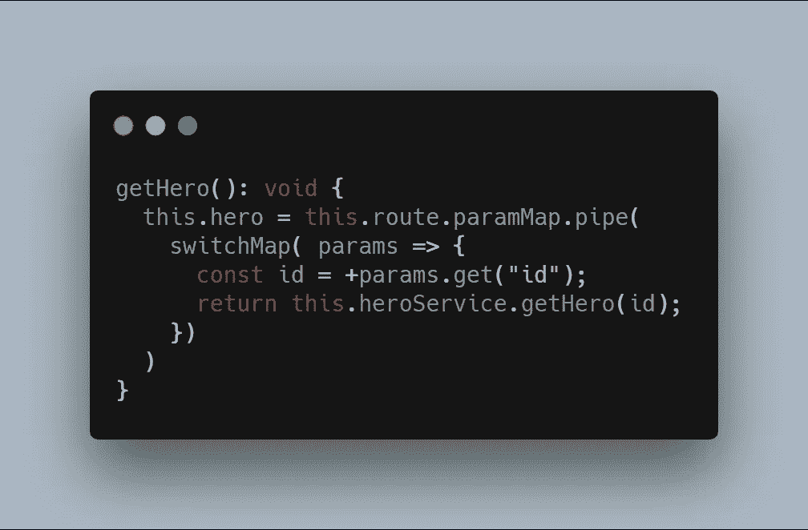
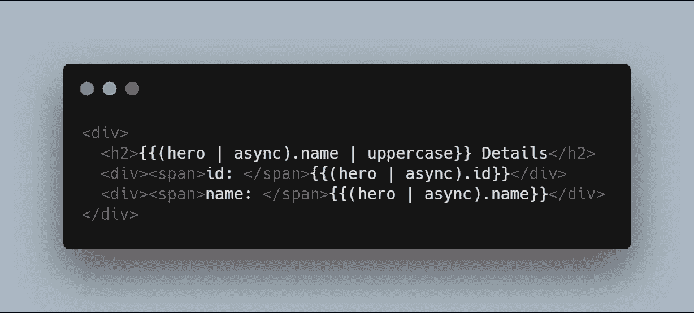
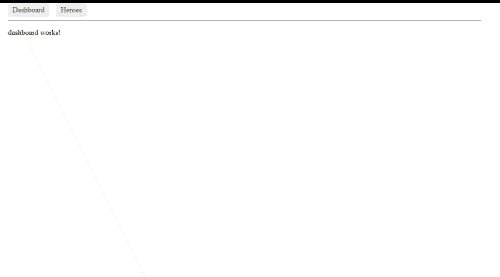
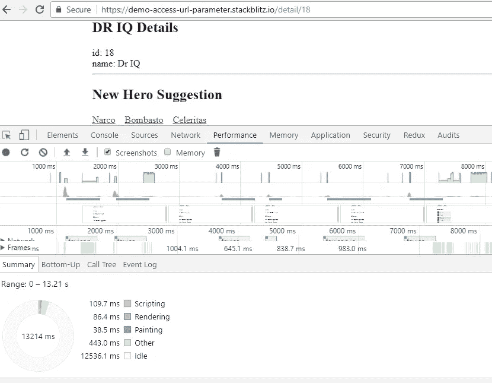
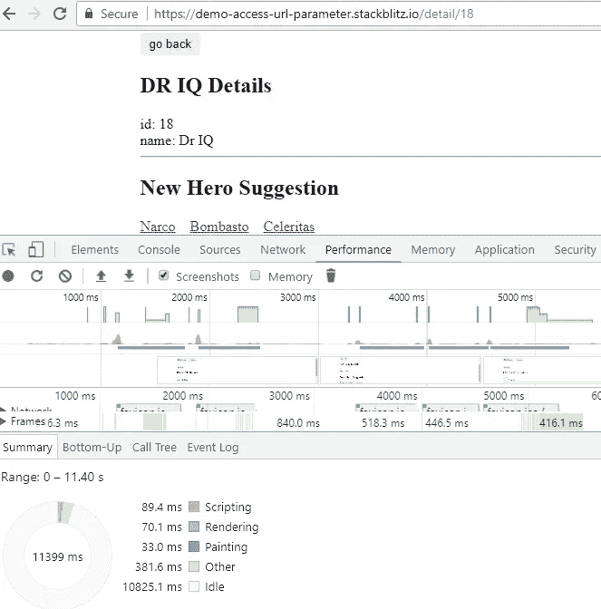
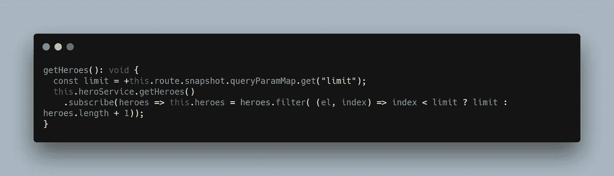

# 关于角度参数，你只需要知道

> 原文：<https://levelup.gitconnected.com/all-you-need-to-know-about-angular-parameters-309828b30826>

## 在 Angular 应用程序中从 URL 获取数据的指南和使用 RxJS 提高性能的技巧

丹尼尔·麦金尼斯在 [Unsplash](https://unsplash.com/search/photos/coffee?utm_source=unsplash&utm_medium=referral&utm_content=creditCopyText) 上拍摄的照片

在本文中，我将分享我在 Angular 应用程序中从 URL 获取数据的经验以及提高网页性能的技巧。

*更多类似内容，请查看*[https://betterfullstack.com](https://betterfullstack.com/)

通常我们在 Angular 应用中会看到两种 URL:

1.  URL 模式`/heroes/:limit`。示例:`/heroes/20`
2.  网址模式`/heroes`。示例:`/heroes?limit=20`

Angular 为这些 URL 结构提供了不同的技术来选择所需的信息，以便调用 API 来为页面加载数据或执行操作。

## 导航到不同页面时使用`route.snapshot.paramMap.get`

首先我想讨论一下什么是**快照**和**参数图**。

`snapshot`是组件创建后不久的路线信息的静态图像。

`paramMap`是从 URL 中提取的路由参数值的字典

来自 [Angular.io](https://angular.io/tutorial/toh-pt5#extract-the-id-route-parameter) 的布线模块示例。

这个案例显示了当点击英雄名字时的**英雄**列表页面，然后导航到**英雄详情**页面。

我将从 URL 中获取一个 hero ID，并将其传递给 hero 服务，通过这行代码从服务器获取数据:

获取详细信息页面上的英雄

这是从 URL 检索数据的官方方式。你可以在 Angular 的首页这里阅读更多[。](https://angular.io/tutorial/toh-pt5#extract-the-id-route-parameter)

## 对 URL 更改使用订阅

什么是订阅？

> [订阅](https://rxjs-dev.firebaseapp.com/guide/subscription)是一个表示可支配资源的对象，通常是一个可观察对象的执行。

有一种情况，用户可以在英雄详情页面上点击相关的英雄或者新的英雄建议。它还重定向到一个英雄的详细信息页面，但有不同的英雄信息。

现在`route.snapshot.paramMap.get`有问题了。它不再工作了。

详细页面未加载新英雄

快照是一次性事件，仅在创建组件后触发。因此，在 hero detail 页面上，如果我们单击建议区域中的任何 hero，它将不再工作，因为组件不会再次重新启动，并且 hero ID 存储为旧值。

有其他解决方案吗？是的。通常使用**订阅**是识别当前路由中 URL 参数何时改变的好方法。这意味着有一个链接或按钮，我们可以使用不同的参数导航到同一个 URL，就像上面的例子一样。

在`getHero`内使用 Subscribe:

获取详细信息页面上的英雄

然后我们可以看到不同的

详细页面加载新英雄和订阅

## 通过 RxJS 处理退订

使用订阅是更新 URL 参数中的 hero ID 值的好方法。然而，订阅有一个重要的方法， [unsubscribe](https://rxjs-dev.firebaseapp.com/guide/subscription) ，它没有参数，只是处理订阅持有的资源

> *一个* ***订阅*** *本质上只是有一个* `*unsubscribe()*` *功能来释放资源或者取消可观察的执行。*

[本·莱什](https://medium.com/@benlesh)在他的[伟大文章](https://medium.com/@benlesh/rxjs-dont-unsubscribe-6753ed4fda87)中也提到了。

> 保留太多的订阅对象是一种迹象，表明您正在强制性地管理您的订阅，而没有利用 Rx 的强大功能。

这意味着当用户点击 hero 建议时，它会取消上一次订阅，这对于下一次订阅很重要。

我建议将 [switchMap](https://www.learnrxjs.io/operators/transformation/switchmap.html) 与订阅一起使用，因为它比其他扁平化操作符更有优势。它将切换到一个新的可观测值，并取消之前的可观测值。

下面是`getHero`的新代码:

获取详细信息页面上的英雄

当 hero 的类型是 observable 时，模板应该添加一个**异步**管道来处理 observable。

模板详细信息页面

这里的优势是什么？

在 hero 详细信息页面上，订阅内部调用了一个 HTTP 请求。在 HTTP 请求过程中，参数会发生变化。这意味着将使用新的 HTTP 请求创建新的订阅。

这里的`switchMap`帮助我们取消上一次订阅和请求，然后进行新的订阅。因此，性能会得到提高。

其他优势包括:

1.  更具可写性和可读性。
2.  更少的代码和更少的管理(无需在 [onDestroy](https://angular.io/api/core/OnDestroy) 使用取消订阅)

这是一个性能测试

场景:

用户进行一些用户界面交互

不使用`switchMap`的订阅:

脚本 109.7 毫秒

使用`switchMap`订阅:

脚本 89.4 毫秒

在用户界面上点击几次后，使用`switchMap`运行脚本的时间比不使用`switchMap`要少。

> 注意:在 RxJS 中有很多方法可以结束订阅，例如 [take](https://www.learnrxjs.io/operators/filtering/take.html) 、 [takeUntil](https://www.learnrxjs.io/operators/filtering/takeuntil.html) 、 [takeWhile](https://www.learnrxjs.io/operators/filtering/takewhile.html) 、 [first](https://www.learnrxjs.io/operators/filtering/first.html) 。这取决于每个案例。

## 使用 queryParamMap 获取值

`queryParamMap`与`paramMap`相同。这里的区别是用它来处理类似于`/heroes?limit=5`的 URL。

这些参数不会在角度应用程序的路由中声明。

现在更新`getHeroes`方法:

获取英雄页面上的英雄

英雄页面现在会显示英雄的数量，例如通过 URL `**/heroes?limit=5**`的限制参数。

## 摘要

本文概述了一些从 URL 获取参数的技术。这取决于每个案例。使用`route.snapshot.paramMap.get`从这个页面转到另一个页面或使用`switchMap`订阅时，如果参数可以以相同的方式改变。

有时参数没有在布线时定义，所以我们用`queryParamMap`代替`paramMap`。

我希望这篇文章对你有用！你可以在[媒体](https://medium.com/@transonhoang)上关注我。我也在[推特](https://twitter.com/transonhoang)上。欢迎在下面的评论中留下任何问题。我很乐意帮忙！

点击此处查看源代码。

 [## 演示-访问-URL-参数-堆栈

### 导出到 Angular CLI 的 Angular 应用程序的启动项目

stackblitz.com](https://stackblitz.com/edit/demo-access-url-parameter?embed=1&file=src/app/app.component.ts) 

## 资源/参考资料

[1]:https://angular.io/guide/setup-local 角路由

[2]:angular . io 教程的英雄 app[https://angular . io/generated/live-examples/toh-pt5/stack blitz](https://angular.io/generated/live-examples/toh-pt5/stackblitz)

[3]: RxJS:不要退订[https://medium . com/@ benlesh/RxJS-Don-Unsubscribe-6753 ed 4 FDA 87](https://medium.com/@benlesh/rxjs-dont-unsubscribe-6753ed4fda87)

[4]:switch map[https://www . learn rxjs . io/operators/transformation/switch map . html](https://www.learnrxjs.io/operators/transformation/switchmap.html)

 [## 学习角度-最佳角度教程(2019) | gitconnected

### 50 大角度教程-免费学习角度。课程由开发人员提交和投票，使您能够…

gitconnected.com](https://gitconnected.com/learn/angular)  [## 故事-更好的全栈

### 所有的故事故事为我们写指南提交故事到更好的编程博客 1。故事指南避免什么…

betterfullstack.com](https://betterfullstack.com/stories/)