# JSON—JavaScript 中的 parse()和 stringify()

> 原文：<https://levelup.gitconnected.com/all-you-need-to-know-about-json-and-its-usage-in-javascript-b5181208966d>

## Java Script 语言

## JSON 的详细指南，以及 JavaScript 中 parse()和 stringify()的用法

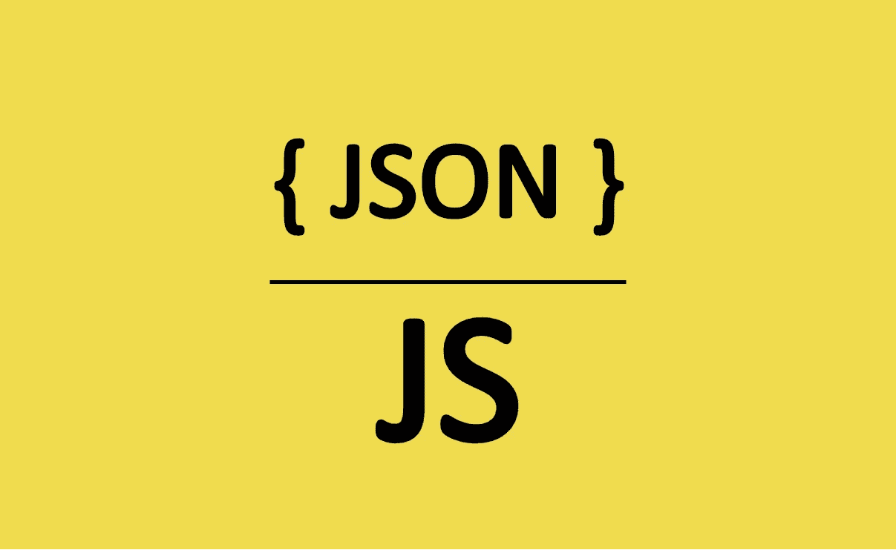

JSON(图片由作者提供)

**JavaScript Object Notation(JSON)**是一个轻量级的数据表示，由一个**对象/对象数组**组成，它以**键值对**的形式存储数据。在本文中，您将详细了解什么是 JSON，以及作为 JSON 对象一部分的 **parse** 和 **stringify** 方法的使用。

## JSON 格式概述

*   易于阅读/书写。
*   用于 API 请求在服务器和客户端之间传输数据，反之亦然。
*   用作许多技术/工具的配置文件格式。
*   易于与大多数编程语言集成。

## 下面是 JSON 文件的样子

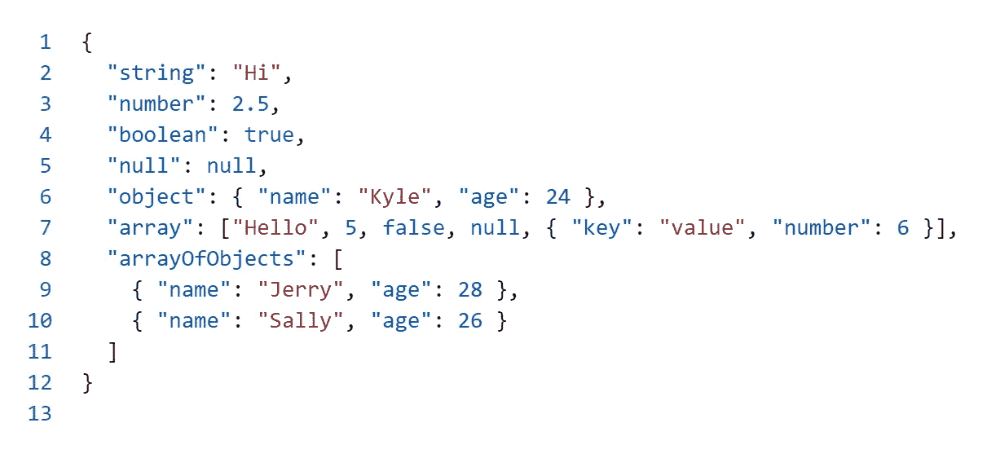

示例 JSON 文件(图片由作者提供)

下面你可以看到所有不同类型的值的细节，这些值可以作为 JSON 对象的一部分。

*   **数字:**可以使用的不同数值有整数(正负)、分数(正负)、指数(正负)。下面是一些例子。

```
2, -4, 2.2, -6.3, 2.0e+4, 4.1E+2, 3.3e-2, 5.2E-5.
```

*   **String:** 您可以照常使用所有的字符串文字，允许的转义字符如下。

```
Double quotations (“)
Forward slash (/)
Backward slash (\)
Backspace (b)
Form feed (f)
Newline (n)
Carriage return (r)
Horizontal tab (t)
Four hexadecimal digits (u) eg: \u00ff would be ÿ 
```

*   **布尔:**值可以是`true`也可以是`false`。
*   **空值**
*   **对象:**它可能包含任何其他支持的类型。

```
{ "message": "Hi 👋", "name": "John", "city": "New Jersey 🏙️" }
```

*   **数组:**可以是所有支持的不同类型的集合。

```
[
    { "name": "John", "age": 25, "city": "New Jersey 🏙️" },
    { "name": "Kelly", "age": 24, "city": "New York 🏙️" }
]
```

> **注意:**JSON 对象和 **JavaScript 对象**的主要区别在于**属性名**应该在**双引号**内，否则就是一个**无效的 JSON 对象**，并且 **JSON 对象**不应该有任何**尾随逗号**。

# 1.解析( )

您可以使用这个方法将字符串解析为 JSON 对象。

第一个参数是需要解析成 JSON 的**字符串**。

您可以传递一个可选的 **reviver 函数**作为第二个参数，该参数可用于在原始值被解析为输出之前对其进行转换。

当 reviver 函数返回 **undefined** 或**在转换任何属性时跳过值**，那么该属性**将不是解析输出**的一部分。

> **注意:** You **不允许对传递给解析方法的字符串中的任何属性名或字符串值使用单引号**，并且输入字符串不应该有任何**尾随逗号**。在这两种情况下，**解析方法**都会抛出一个 **SyntaxError** 异常。

## 将字符串解析为 JSON 对象的示例

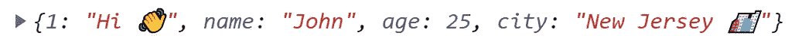

解析为 JSON 对象的字符串输出(图片由作者提供)

如果您传递的字符串**不是有效的 JSON 字符串**，那么该方法将抛出一个 **SyntaxError** 异常。

## 使用 reviver 函数作为第二个参数将字符串解析为 JSON 对象的示例

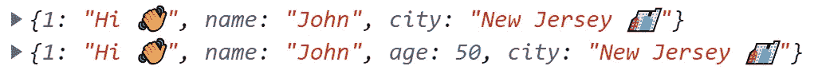

使用 reviver 函数修改给定输入的 parse 方法的输出(图片由作者提供)

第一个解析方法获取字符串，然后检查该值是否属于 number 类型，以返回未定义的**。并且该函数为所有其他值类型返回相同的属性值**。由于 reviver 函数返回 undefined，该属性将不是解析的 JSON 对象的一部分。

第二个解析方法获取字符串，然后检查该值是否属于 number 类型，以返回**值乘以 2** 。该函数为所有其他值类型返回相同的属性值。

# 2.stringify()

您可以使用此方法将对象或值转换为 JSON 字符串。

第一个参数是需要转换成 JSON 字符串的对象或值。

第二个可选参数可以是:

*   一个 **replacer 函数**，它在将输入对象转换成 JSON 字符串之前修改输入对象的对象或值。当 replacer 函数返回 **undefined** 或**在修改任何属性时跳过值**，那么属性**将不是解析输出**的一部分。
*   一个字符串/数字的数组**可以作为一个列表提供，以过滤掉可以包含在 JSON 字符串中的属性。**

如果你**跳过**这个参数或者如果它**为空**，那么所有的属性都将包含在 JSON 字符串中。

第三个参数可以是字符串或数字。

*   如果它是一个数字，那么相同数量的空格作为填充符被添加到 JSON 字符串的每个属性中。允许作为填充的最大字符数是 **10** ，即使提供的字符数超过 10，stringify 方法也只添加 10 个空格。
*   如果是一个字符串，那么只有提供的字符串的前十个字符**作为填充符**被添加到 JSON 字符串的每个属性中。

如果你**跳过**这个参数，那么**不会向 JSON 字符串添加**填充符。

> **注意:**当你传递第三个参数时，你必须提供 **null** 或者一个 **replacer 函数**作为第二个参数。

## 从 JavaScript 对象创建字符串的示例

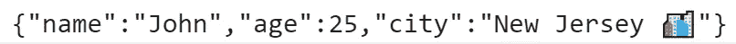

从 JavaScript 对象创建字符串的输出(图片由作者提供)

parse 方法将一个 **JavaScript 对象作为参数**，并将其解析为一个 JSON 字符串。

## 使用 replacer 函数过滤值的 stringify()示例

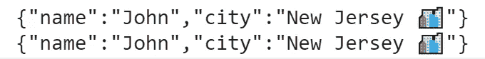

使用 replacer 函数过滤值的 stringify 输出(图片由作者提供)

在上面的例子中，replacer 函数检查每个属性的值，如果它们的数据类型是一个**数字**，那么第一个 replacer 函数**返回 undefined** ，第二个**返回 nothing** 。在这两种情况下，那些特定的属性**不会成为输出字符串**的一部分。

## 使用 replacer 函数更改 JavaScript 对象值的 stringify()示例

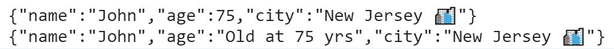

使用 replacer 函数修改值的 stringify 输出(图片由作者提供)

在上面的例子中，replacer 函数检查每个属性的值，如果它们的数据类型是一个**数字**，那么一个函数返回它的值**乘以三**，另一个函数返回串联在字符串中的值的三倍**。**

## 使用 replacer 数组从 JavaScript 对象中过滤出值的 stringify()示例

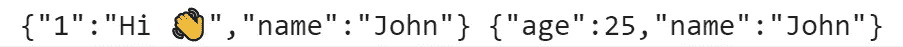

stringify 的输出，带有一个 replacer 数组来过滤掉值(图片由作者提供)

在上面的例子中，您可以传递一个 replacer 数组作为第二个参数，只有属于这个数组的属性会出现在输出字符串中。

## 带有第三个参数的 stringify()示例，用于向 JSON 字符串输出的每个属性添加填充

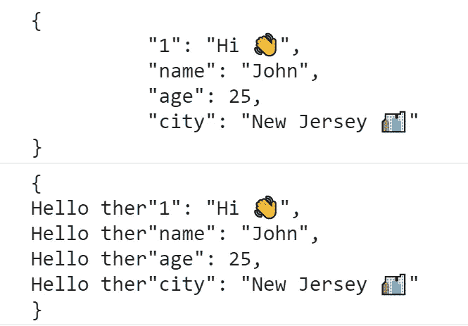

stringify 的输出，每个属性都添加了填充符(图片由作者提供)

在上面的例子中，我们传递了一个**第三个参数**，用于**向输出字符串的每个属性**添加填充。

当您为该参数使用一个**数字**时，那些相同的**数量的空白将被添加为填充**。即使您提供一个大于 10 的值，您可以添加作为填充的最大数量的**空白最多为 10 个**。

当您为这个参数使用一个**字符串**时，那么这个**字符串将作为填充符添加到输出字符串**的每个属性中。当该字符串的长度**大于 10 时，则只添加前 10 个字符**作为填充。

# 托吉森

您还可以使用自定义的 **toJSON** 方法，以自定义的用户定义方式显示对象

**stringify** 方法调用 **toJSON** 如果它在对象中可用的话。

## 带有 toJSON 的对象示例

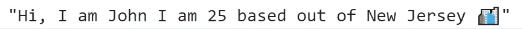

使用 toJSON 函数输出 stringify(图片由作者提供)

当您将包含 toJSON 的对象嵌套在另一个对象中时，toJSON 被调用。

## 带有嵌套在另一个对象中的 toJSON 的对象示例

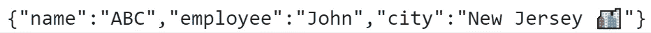

包含嵌套在另一个对象中的 toJSON 的对象的输出(图片由作者提供)

# 结论

让我们总结一下你在整篇文章中学到了什么:

1.  JSON 的概述以及可用于该格式的不同值。
2.  **解析方法**，带有一个**字符串**和一个可选的 **reviver 函数**作为第二个参数。
3.  **stringy 方法**带有一个**对象**，一个可选的**替换函数/数组**作为第二个参数，第三个可选参数用于**填充**。

# 资源

*   MDN 中的 JSON[web 文档](https://developer.mozilla.org/en-US/docs/Web/JavaScript/Reference/Global_Objects/JSON)
*   [MDN web 文档](https://developer.mozilla.org/en-US/docs/Web/JavaScript/Reference/Global_Objects/JSON/parse)中的 JSON.parse()
*   [MDN web 文档](https://developer.mozilla.org/en-US/docs/Web/JavaScript/Reference/Global_Objects/JSON/stringify)中的 JSON.stringify()

感谢阅读❤️和快乐学习😃