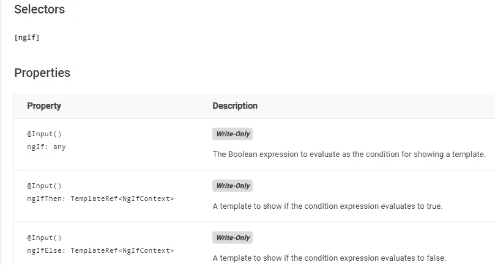

# 所有你需要知道的关于 ngIf 的角度

> 原文：<https://levelup.gitconnected.com/all-you-need-to-know-about-ngif-in-angular-a71e56b05a9e>

## 有角的

## 基于新的 Angular 文档，收集了在 Angular 模板中使用 ngIf 的所有案例。

[Lex Sirikiat](https://unsplash.com/@pundalex?utm_source=unsplash&utm_medium=referral&utm_content=creditCopyText) 在 [Unsplash](https://unsplash.com/s/photos/coffee-cup?utm_source=unsplash&utm_medium=referral&utm_content=creditCopyText) 上拍摄的照片

这篇文章是关于如何在 Angular 中使用`*ngIf`在一个模板中有条件地呈现不同的 HTML。

1.  单形
2.  将 if 与 else 一起使用
3.  使用 if 和 then
4.  将 if 与 else 和 then 一起使用

*更多类似内容，请查看*[*https://betterfullstack.com*](https://betterfullstack.com)

[**NgIf**](https://angular.io/api/common/NgIf) 是一个结构化的指令，它有条件地包含一个基于强制为布尔值的表达式的值的模板。

当表达式评估为**真**时，Angular 呈现在`then`子句中提供的模板，当**假**或**空**时，Angular 呈现在可选的`else`子句中提供的模板。`else`子句的默认模板为空。

ngIf 指令属性

# 单形

这是一个简单的 HTML 条件形式，我们大部分时间从一个有角度的模板中看到。

带有速记语法的简单形式

带有速记语法的简单形式

具有扩展语法的简单形式

具有扩展语法的简单形式

# 将 if 与 else 一起使用

当我们有两种情况在一个角度模板中渲染相同的东西时，我们应用这个语法。

用“else”块形成

通过使用属性，我们还有另一种语法:

*   **ngIf**
*   **ngIfElse**

在 Angular 中使用 ngIf 和 ngIfElse

# 使用 if 和 then

这是有趣的语法。带有`*ngIf="condition; then thenBlock"`的`div`内的内容永远不会显示。

只有当`condition`为`true`时`thenBlock`才会显示。否则，UI 上不会显示任何内容。

用“then”块形成

通过使用属性，我们还有另一种语法:

*   **ngIf**
*   **ngIfThen**

在 Angular 中使用 ngIf 和 ngIfThen

# 将 if 与 else 和 then 一起使用

这个语法和 **if with then** 语法有点不同。但是，如果用 else 语法，它与**相似。**

带有“then”和“else”块的速记形式

对于这种情况，我们还有另一种使用所有属性的语法:

*   **ngIf**
*   **ngIfThen**
*   **ngIfElse**

在 Angular 中使用 ngIf、ngIfElse 和 ngIfThen

# 结论

这篇文章包含了你需要知道的关于在 Angular 框架中使用渲染条件的所有事情。

我希望这篇文章对你有用！可以跟着我上[媒](https://medium.com/@transonhoang?source=post_page---------------------------)。我也在推特上。欢迎在下面的评论中留下任何问题。我很乐意帮忙！

 [## 故事-更好的全栈

### 关于 JavaScript、Python 和 Wordpress 的有用文章，有助于开发人员减少开发时间并提高…

betterfullstack.com](https://betterfullstack.com/stories/)