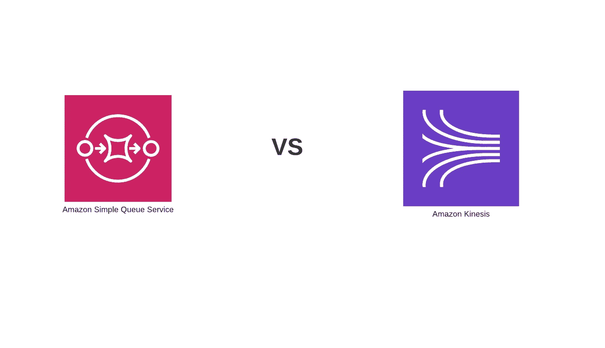

# 你需要知道的关于 SQS 和 Kinesis 的一切都在这里

> 原文：<https://levelup.gitconnected.com/all-you-need-to-know-about-sqs-and-kinesis-is-here-33bfd699b9dd>

*最初发表于*[*【https://edward-huang.com】*](https://edward-huang.com/cloud/aws/devops/2020/05/30/all-you-need-to-know-about-sqs-and-kinesis-is-here/)*。*

在设计一个可靠的分布式系统或消息系统时，使用 AWS 资源时首先想到的是 SQS 和 Kinesis。

乍一看，Kinesis 有一个比 SQS 更强大的功能。关于 Kinesis 的一点是它可以处理大量的数据；你可以重播消息，或者让多个消费者订阅你的 Kinesis 流。然而，Kinesis 也是一个昂贵的工具，在学习开发 Kinesis 时有很多学习曲线。这也取决于你的应用，有时你在使用中不需要像 Kinesis 这样的大型提升工具，SQS 会工作得非常好。

在这篇文章中，我想讨论 Kinesis 和 SQS，向你展示 Kinesis 和 SQS 的优点和缺点。最后，我将深入探讨这两个系统之间的差异以及这两种服务的最佳用例。

# 由外界刺激引起的不随意运动

在有流数据管道或 Kinesis 之前，处理大数据应用的唯一方式是使用[批处理](https://www.7wdata.be/business-analytics/batch-vs-real-time-data-processing/)。

生产者将聚合所有的文件，把它放入一个存储文件，或简单存储(S3)。然后，消费者将通过 Cron 作业进行批处理，即每天一次，来处理每一批新数据。

这种大数据操作存在一个问题。使用批处理，您无法实时处理数据。需要实时分析的应用程序，如股票市场应用程序、欺诈检测甚至点击流，将总是处理过去的数据。

Kinesis stream 是一个流管道，有助于在您的应用程序中创建实时数据流处理。

# 动力流的好处

# 多个消费者

一旦生产者向管道发布了新数据，就可以立即从各种消费者那里使用这些数据。

它提供了记录(数据)的排序，以及向多个消费者读取或重放相同顺序的能力。

每个消费者在 Kinesis 迭代器分片中都有自己的检查点，用来跟踪他们在哪里消费数据。

有一个增强的扇出功能，每个用户可以接收自己的 2MB/秒管道读取吞吐量。

# 实时

Kinesis 拥有最大的数据接收或处理吞吐量。当生产者将数据发布到 Kinesis 流时，消费者通常可以在不到一秒钟的时间内获得数据——不管您写了多少数据。

# 大数据

如果你需要每天在单个流中处理数兆字节的数据，Kinesis 可以帮你做到。您可以推送来自许多数据生产者的数据，并存储以供以后处理或实时处理。

请注意，Kinesis 默认存储记录 24 小时，最长可达 168 小时。

# 运动流的缺点

# 碎片管理

您需要管理您的数据碎片。知道是否需要根据拥有的消费者数量来增加或减少碎片的数量。

# 复杂的消费者和生产者库

为了获得最佳性能，Kinesis 提供了消费者和生产者库。作为一个生产者库，您使用 Java 接口部署 C++二进制文件，用于读写 Kinesis 流的数据记录。要添加消费者库，您需要实现一个可以与其他语言通信的 Java 应用程序。不管怎样，开发和维护这个库都需要一些时间。

# 保持状态

Kinesis 允许它的每个消费者独立地从数据流中读取数据。它要求每个消费者管理自己在流中的迭代器/检查点，以及他们已经读取和处理了多远。如果您有多个消费者从 Kinesis 流中读取数据，那么消费者元数据将存储在 DynamoDB 中，您需要管理每个消费者的检查点，以便从 Kinesis 流中的每个碎片中读取数据。

# 简单队列服务(SQS)

SQS 有助于分离您的微服务和分布式系统。

使用 SQS，您可以在任意数量的软件组件之间发送、存储或接收消息。您不需要担心组件上的任何数据丢失，也不需要服务始终可用。您可以通过将队列作为中间层在服务之间传输数据来单独扩展系统。您还可以让每个服务执行独立的功能，以提高系统的可伸缩性和可靠性。

# SQS 的利益

# 使用方便

用于 SQS 的 AWS SDK 易于使用。你不需要创建一个生产者或客户端库来与 SQS 互动。

# 读取吞吐量

SQS 可以快速扩展大量数据，无需用户干预。它允许您根据从队列中读取的任务量动态增加读取吞吐量。SQS 缓冲处理负载峰值的请求。

# SQS 的缺点

# 创建检查点

如果没有和配置，则有 AWS 预设的延迟时间属性和可见性超时属性。

延迟时间属性是从消息到达 SQS 到消费者看到消息的延迟时间。

可见性超时是指当使用者读取消息时，在可见性超时过期之前，该消息对正在读取它的其他使用者不可见。消费者将再次看到该消息。

SQS 不像 Kinesis Stream 那样有多个消费者，消息至少传递一次行为，消费者可能会收到重复的消息。

因此，最佳做法是在收到邮件后将其删除。

# 消息可重放性

因为消费者通常会在消息处理后将其删除，所以在 SQS 中没有消息可重放性。

相比之下，Kinesis 中的每个消费者都有其检查点，指向他们处理的最新记录，SQS 为其所有消费者提供单个迭代器。

# SQS 的使用案例

如果您想要解耦您的软件组件或者将任务分配给多个工作人员，可以使用 SQS。

如果您有任何具有大量后台任务的操作，您可以将后台任务发送到 SQS，以从该服务中移除故障点。例如，在向 DDB 写信之前，需要在后台执行一个繁琐的过程。该服务无法同时处理大量的请求。因此，通过将每个应用程序放在 SQS 中，我们可以轻松处理显著的流量高峰，并且不需要担心服务中断时的数据丢失。此外，SQS 有一个死信队列功能，如果 14 天没有处理，可以将数据存储在 DLQ 中。

# Kinesis 的用例

Kinesis 可以帮助你实时传输数据。如果有多个消费者需要对数据进行分析，您可以将数据放在 Kinesis 管道中，让众多消费者从流中读取数据。

Kinesis 最适合用于记录事件数据、实时分析、搜索功能或欺诈检测——多个消费者需要实时处理或处理的任何事情

# 摘要

在云中开发应用程序时，有各种各样的工具和资源。设计应用程序的注意事项是理解并研究应用程序的用例，并知道哪些工具适合什么目的。

如果您正在处理大量实时数据，或者需要让多个用户订阅这些数据，那么可以考虑 Kinesis。如果没有，考虑一下 SQS。

**感谢阅读！如果你喜欢这篇文章，请随意订阅我的时事通讯中的******来获取关于科技职业的文章、有趣的链接和内容！****

**你可以关注我，也可以在[媒体](https://medium.com/@edwardgunawan880)上关注我，以获得更多类似的帖子。**