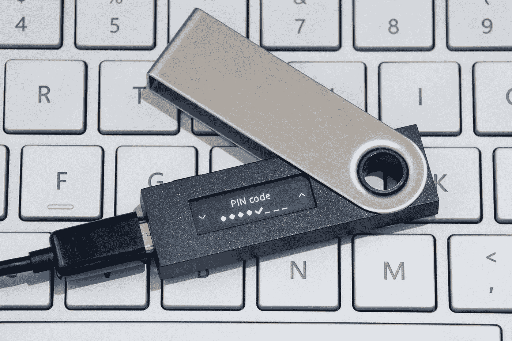

# 你需要知道的一切:NFT 钱包——保管与非保管

> 原文：<https://levelup.gitconnected.com/all-you-need-to-know-nft-wallets-custodial-vs-non-custodial-e4bdb0c50889>

如今(感谢中本聪🙏🏼)，NFT 和数字资产可能变得非常有价值，它们的存储需要最佳的安全性以避免丢失或被盗。这些数字资产存储在不同安全级别的钱包中。

保管型和非保管型钱包有什么区别，你应该使用哪一种？

虽然区块链技术通过去中心化安全地存储数据(你可以查看这篇文章)，但许多连接的组件可能没有完全去中心化，这就产生了黑客可以利用的漏洞。现在，在提交资源之前，检查可用于存储 NFT 的不同钱包比以往任何时候都更重要。我相信你希望自己价值数十亿美元的 NFT 投资组合安全无虞😉

# **NFTs 简介**

不可替代令牌(NFT)是在区块链上创建的数字令牌。你可以在我的 [NFT 课程](https://www.udemy.com/course/the-complete-nft-course-learn-everything-about-nfts/learn/lecture/28554327?referralCode=AAEE908D13D0E2276B19#questions)中学到一切。他们通常通过 [ERC-721 和 ERC-1155](/which-one-to-choose-erc-20-vs-erc-721-vs-erc-1155-ethereum-token-smart-contract-red-pill-9bb827148671) 、Solana 或 BSC 标准利用以太坊等区块链。NFT 的功能特别像数字资产。它们通常代表数字艺术品，可以被拥有并存储在代表数字资产所有权的加密钱包中。

NFT 是 DeFi 领域的下一个大事件，特别是对于内容创作者和艺术家来说，他们现在可以对他们的产品有更多的控制，并最大限度地提高收入。此外，区块链技术的进步和发展使我们能够在没有人为干预或中间人的情况下开展某些金融服务，如银行、经纪、拍卖、贷款等。

分散化的应用程序已经被开发出来，可以在线制作非功能性交易，通过使用智能合约，这些非功能性交易可以在市场上销售给大量的在线受众，而不需要中间人。

# **拥有一辆 NFT**

NFT 可以在区块链上创建，也可以从 NFT 市场购买。然而，要拥有一台 NFT，你需要事先获得一个数字钱包。

任何提供 NFT 铸造服务的区块链平台都可以用来[创造你自己的 NFT](/7-steps-for-a-successful-nft-business-the-nft-sell-out-framework-9434007cac62) :例如，OpenSea、SuperRare 等等。这个铸造过程要求您的有价值资产以图片、GIF、视频或音频形式的数字文件的形式上传，并支付一定的费用来铸造代表您有价值资产的加密货币。

好的，所以，当你创造或者[铸造一辆 NFT](https://medium.com/geekculture/mint-an-nft-and-erc-721-smart-contract-easy-step-by-step-4fafff151fbe) 的时候，你将拥有那辆 NFT，但是……有其他方法可以获得 NFTs 的所有权！你可以购买它，在 NFT 的拍卖会上铸造它，甚至有人送你一件 NFT。

**⚠️crypto Henri**[**YouTube**](https://www.youtube.com/channel/UCRXmxbm5pAGLPMdJXxzGKuQ)**⚠️**

# **加密钱包**

任何 NFT 的所有权都与钱包公钥相关联。这些钱包与不可替代的代币和各自的网络兼容:以太坊、BSC、Solana、Tezos 等。因此，为了拥有或使用加密货币，获得数字钱包是很重要的。加密货币钱包识别区块链上存储资产的位置，并通过公钥和私钥的双重系统来保护这些资产。这也称为 PKI，即公钥基础设施。简单地说，它是这样工作的:

**公钥**或钱包地址是可以共享的钱包的标识符。它是一组数字和字符，可以像传统的帐号一样共享。例如，在将存款存入钱包之前，需要一个公共地址。

以太坊地址(公钥)总是以“0x”开头，看起来像这样:

0 xe7 b 69 C5 c 831718 BC 955 e 52 b 78 C4 BD 2 fa 8b 4999 ee

私人钥匙像别针一样保护钱包。任何时候都必须保密。私钥用于签署交易和解密数据。如果私钥泄露给第三方，钱包中的加密货币或 NFT 可能会被盗。钱包的安全性取决于授予私钥多少访问权限。如果私钥离线存储，例如存储在一张纸上或硬件设备中(如 Ledger Nano 或 Trezor wallet)，则更安全，称为冷存储。

# **NFT 钱包的种类**

NFT 钱包可以是保管型的，也可以是非保管型的。我们先来了解一下保管型和非保管型钱包的区别。

**保管钱包**提供存储所有敏感用户数据和资产，包括钱包私钥，这意味着**第三方**为您的资产提供存储服务，您只有发送或接收付款的登录权限。例如 Blockchain.com 的币安、比特币基地等。

**保管钱包的优点**

*   用户可以通过向第三方请求信息来恢复帐户
*   保管钱包通常可以免费购买，并且与您的 exchange 帐户相关联

**保管钱包的弊端**

*   用户必须连接到互联网才能访问他们的钱包
*   第三方持有并管理私钥
*   第三方对所有敏感用户数据的访问可能会损害资产
*   为了符合政府政策，需要用户注册和 KYC

这些保管钱包有时候可能会带来更多的便利。您不需要保护您的私钥，因为这是第三方的职责。这很像是用银行的保险箱而不是用你自己的保险箱。但是，在这种情况下，您相信第三方在保护您的资产方面做得非常出色。

**非保管钱包**授予钱包所有者所有访问权限。私钥由用户存储，第三方无法访问。非保管钱包完全去中心化。例如 Exodus、Ledger Nano、Trezor、 [Metamask](https://medium.datadriveninvestor.com/keeping-your-nft-purchases-more-secure-d3ea49abf629) 以及 Coinomi 和菌丝体(用于加密和比特币)等移动钱包。

**非保管钱包的优点**

*   交易实时反映在区块链上
*   存储在冷钱包中，无需互联网连接即可离线访问
*   不存储敏感的用户数据；因此确保了最佳的安全性
*   只有所有者可以访问私钥
*   主人对钱包有完全的控制权

**非保管钱包的弊端**

*   如果私钥丢失，帐户恢复可能是不可能的(备份钱包并记下恢复短语非常重要)
*   硬件钱包更贵
*   所有者负责一些良好的安全实践(例如，在没有防病毒或防火墙的计算机上使用 Metamask 通过 Starbucks WiFi 交易高价值资产等同于要求被抢劫)

# **NFT 市场**

非托管证券可以在交易所买卖，这些市场要么是托管的，要么是非托管的。独立创作者的绝大多数 NFT 销售都发生在以太坊、索拉纳和币安智能链上。这些区块链提供了分散和半分散的平台，非物质文化遗产的创造者在那里展示他们的待售物品。出售可以以一次性出售或拍卖的方式完成。

保管市场充当销售的托管人。用户在资产交换前将资金存入平台托管，如和 Nifty Gateway。为了与其他用户交互，第三方提供市场并充当中介。

**非托管市场**在用户之间建立直接联系，维护用户的匿名性和自主性。很明显，它可以让你成为自己的银行，在一个分散的网络中，你可以接触到其他用户，在没有中介的情况下交换资产。Opensea 和 SuperRare 就是这种情况。

**结论**

NFT 生态系统依赖于区块链技术保证的高安全性。因此，非保管钱包和市场越来越受到密码持有者的青睐，偏好度超过 66.5%。随着 NFT 市场需求的持续增长，越来越多的加密平台正在开发分散的应用程序，以满足高度安全的 NFT 平台的需求。因此，在不久的将来，加密空间可能会完全由非托管平台主导。

而且要记住，就像人们在比特币世界里说的，“不是你的钥匙，不是你的比特币”。

**🚀如果你喜欢这个内容，请关注我，也可以查看我的🧱区块链和 NFT 课程:**

**📖****[**完整的 NFTs 课程**](https://www.udemy.com/course/the-complete-nft-course-learn-everything-about-nfts/?referralCode=AAEE908D13D0E2276B19)**——**[**了解 NFTs 的一切！**](https://medium.com/r?url=https%3A%2F%2Fwww.udemy.com%2Fcourse%2Fthe-complete-nft-course-learn-everything-about-nfts%2F%3FreferralCode%3DAAEE908D13D0E2276B19)**