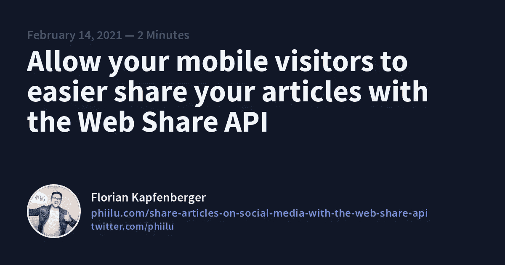
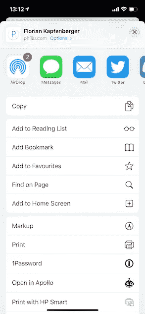
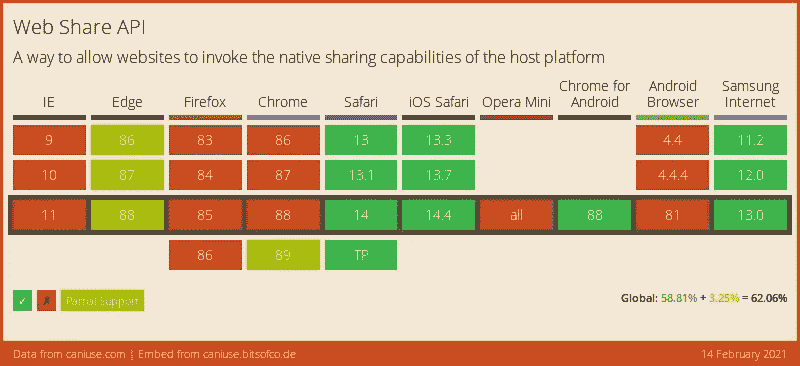
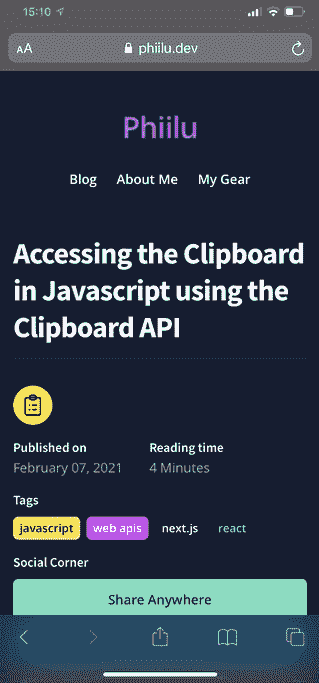

# 允许您的移动访问者通过 Web 共享 API 更轻松地共享您的文章

> 原文：<https://levelup.gitconnected.com/allow-your-mobile-visitors-to-easier-share-your-articles-with-the-web-share-api-299038344947>

分享网站是网络的一个基本过程，提供一个尽可能简单的方法可以让用户轻松分享你的作品。

[Web 共享 API](https://www.w3.org/TR/web-share/) 允许用户使用操作系统的本地共享机制。当你想用原生应用程序分享图片或视频时，你可能已经看到了这一点。

因为这是使用操作系统的本地共享机制，所以 Web Share API 并非在所有浏览器和操作系统中都可用。在撰写本文时，它仅在 Chrome(仅限 Windows 和 Chrome OS)、Edge、Safari、iOS Safari、Chrome for Android、Firefox for Android 和 Samsung Internet 中可用。你可以在 caniuse.com 网站上找到最新的列表。

网络共享 API 在 14。2021 年 2 月

# 如果 Web 共享 API 可用，请使用它

支持 Web 共享 API 的浏览器将在`navigator`对象上公开`share`方法。还有一个`canShare`方法，但是这个方法并不是在所有的浏览器中都可用。所以检查它是否可用的最好方法是检查`share`方法是否存在。

# 使用 Web 共享 API 共享 URL

使用 Web 共享 API 非常简单。在它的基本版本中，它只是你调用的一个函数，仅此而已。

`share`方法将一个对象作为它的第一个参数。在这里，您可以定义稍后将使用的 share 方法应该预填充的内容。

*   `title`:应预填的标题(如果支持)
*   `url`:您想要分享的网站/网址
*   `text`:共享前应预填充的自定义文本

# 使用 Web 共享 API 共享文件

通过给`share`函数添加一个`files`数组，你也可以允许用户共享图像。

不幸的是，我无法用我现有的设备让它工作。我用一部 iPhone 12 (iOS 14)和在 macOS 上测试过。

如果你想在你的设备上测试它，这里有一个 CodeSandbox。如果代码不太对劲，也许可以叉出来写我在 [Twitter](https://twitter.com/phiilu) 上，我会更新的！

# 我如何将 Web Share API 添加到我的博客中

如果你正在我的博客上阅读这篇文章，并且你正在使用一个受支持的设备，你现在就可以测试它！

如果支持，您应该会看到一个按钮**在任何地方**共享。试试吧:)

iOS 14 上 Web Share API 的外观

在 React 中，我创建了一个新的`Share`组件。如果`share`方法可用，我将显示除“后退”共享按钮之外的【T2 随处共享】按钮。

你可以在我的 [GitHub](https://github.com/phiilu/phiilu.com/blob/main/src/components/Share/Share.js) 上找到最新的文件。

 [## phiilu/phiilu.com

### 个人网站。在 GitHub 上创建一个帐户，为 phiilu/phiilu.com 的开发做出贡献。

github.com](https://github.com/phiilu/phiilu.com/blob/main/src/components/Share/Share.js) 

# 结论

只需几行代码，您就可以改善移动用户的共享过程，对于不受支持的浏览器，您可以提供一种回退方法。希望将来不再需要它。

**来源:**

*   MDN:[https://developer . Mozilla . org/en-US/docs/Web/API/Navigator/share](https://developer.mozilla.org/en-US/docs/Web/API/Navigator/share)
*   W3C:[https://www.w3.org/TR/web-share/](https://www.w3.org/TR/web-share/)

*原载于 2021 年 2 月 14 日 https://phiilu.com***。**