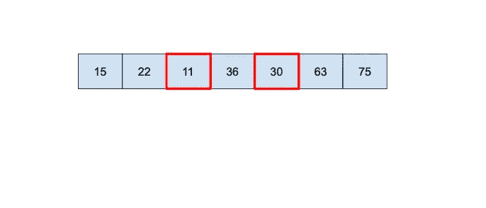

# 2.几乎不递减

> 原文：<https://levelup.gitconnected.com/almost-non-decreasing-1670d1bac6b0>

## 问题:写一个函数检查一个数组是否几乎非减，最多允许一个减元素。



-比如[12，6，8]，你可以把 12 改成 6 -> [6，6，8]，它就变成非减了，你应该返回 true，

-比如[8，6，3]，你需要改变两个数使其非减，应该返回 false。

## 提示:

-您可以遍历数组并进行冒泡比较，

-有 2 种情况，您应该替换前一个元素或提升当前元素。

## 解决方案:

```
func almostNonDecreasing(array: [Int]) -> Bool {
  // 1.
  guard array.count > 1 else { return true }
  var array = array
  var maxChange = 1
  // 2.
  for i in 1..<array.count {
    if array[i] < array[i - 1] {
      // 3.
      if i - 2 < 0 || array[i - 2] <= array[i] {
        array[i - 1] = array[i];
      } else {
        array[i] = array[i - 1];
      }
      // 4.
      maxChange -= 1
      if maxChange < 0 { return false }
    }
  }
  // 5.
  return true
}
```

## 解释:

1.如果数组只包含一个元素，那么它是非递减的。

```
guard array.count > 1 else { return true }
```

2.让我们迭代数组的其他每个元素。

```
for i in 1..<array.count {
```

3.如果前一个元素大于当前元素，我们有一个减少。现在有两个选项使它不递减:

-我们没有两个先前的元素，或者第二个先前的元素低于当前的元素，则为先前的元素分配与当前元素相同的值，

-否则，将前一个元素的值赋给当前元素。

```
if array[i] < array[i - 1] {
  if i - 2 < 0 || array[i - 2] <= array[i] {
    array[i - 1] = array[i];
  } else {
    array[i] = array[i - 1];
  }
```

4.如果我们已经做了改变，返回 false，因为我们需要更多的改变来使它不减少。

```
maxChange -= 1
if maxChange < 0 { return false }
```

5.当我们到达这里时，数组几乎是不递减的。

```
return true
```

## 复杂性:

-时间复杂度:当我们迭代数组时，这是线性时间复杂度 O(n)，

-空间复杂度:由于我们仅使用一个额外的变量来存储改变的数量，这是在恒定的间距 O(1)中进行的。

## 测试案例:

```
public func testAlmostNonDecreasing() {
  assert(almostNonDecreasing(array: [12, 6, 8]) == true, "almostNonDecreasing 1 not equal")
  assert(almostNonDecreasing(array: [8, 6, 3]) == false, "almostNonDecreasing 2 not equal")
  assert(almostNonDecreasing(array: [7, 8, 9, 10, 5, 1]) == false, "almostNonDecreasing 3 not equal")
  assert(almostNonDecreasing(array: [7, 8, 9, 10, 5, 9]) == false, "almostNonDecreasing 4 not equal")
  assert(almostNonDecreasing(array: [7, 8, 9, 10, 5, 16]) == true, "almostNonDecreasing 5 not equal")
}
```

## 后续行动:

没有后续问题。

[< <数据结构、算法&面试题> >](https://medium.com/@jbstevenard/learn-data-structures-and-algorithms-with-swift-5-6-d9f36a4027dd)

[](https://medium.com/@jbstevenard/membership) [## 通过我的推荐链接加入 Medium—JB stevenard

### 阅读 jb stevenard 的每一个故事(以及媒体上成千上万的其他作家)。你的会员费直接支持 jb…

medium.com](https://medium.com/@jbstevenard/membership)