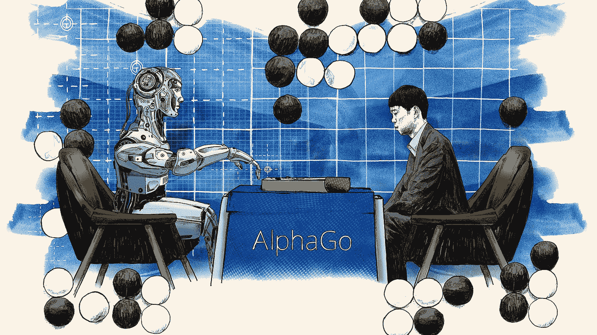
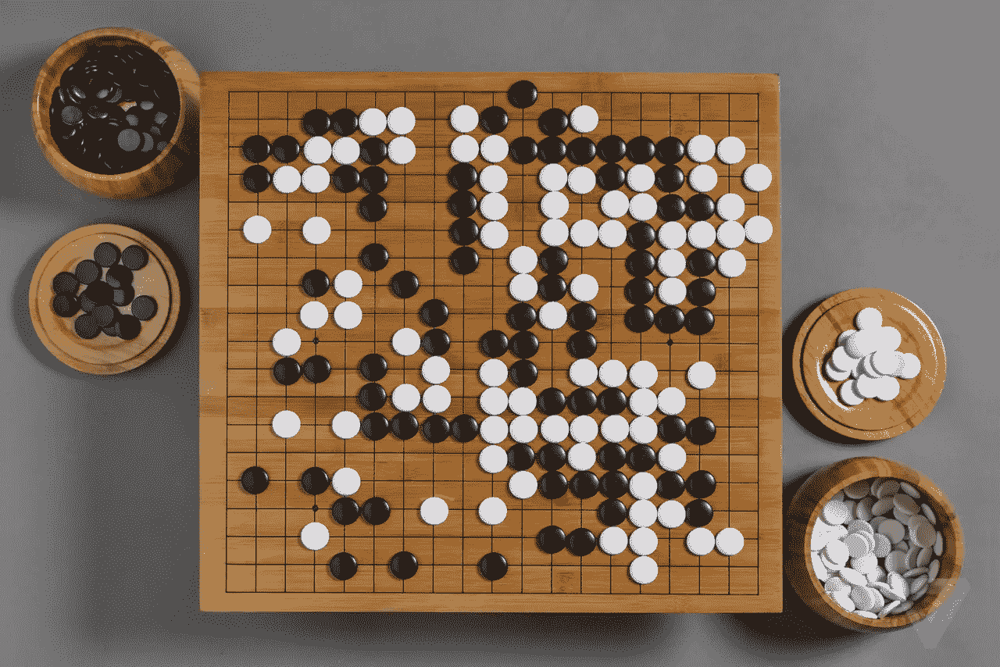
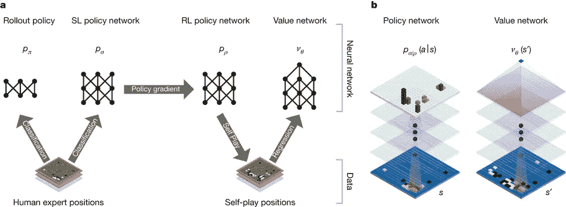
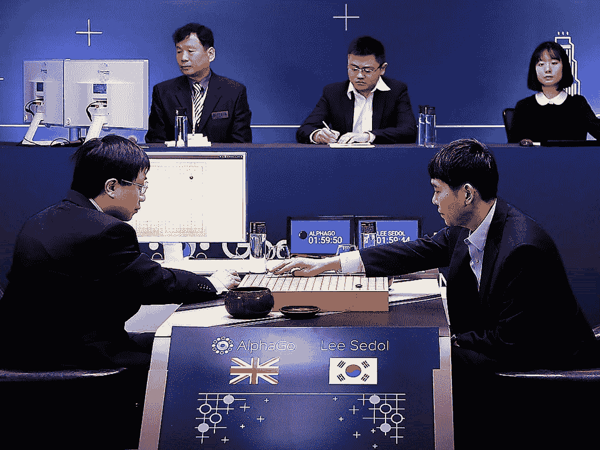

# AlphaGo 击败世界最佳围棋手

> 原文：<https://levelup.gitconnected.com/alphago-beats-the-worlds-best-go-player-1d4ab1428bac>

N ot 不仅是 **AlphaGo** 第一个击败职业人类围棋选手的机器，而且该机器也是第一个击败围棋世界知名冠军的机器，并将永远可以说是历史上最强的围棋选手。

*那么，机器在棋盘游戏中击败人类有什么了不起的呢？以前没做过这个吗？*

要回答这些问题，围棋很特别，因为它因其复杂性而被誉为对人工智能最具挑战性的游戏。在 DeepMind 的 AlphaGo 之前，**只有最强的计算机程序才能和人类业余选手下围棋**。以前用于尝试这一挑战的标准人工智能方法不够复杂，无法处理可能的围棋棋步或评估棋盘上每个位置的实力。

围棋起源于 3000 多年前的中国

## 围棋是什么？

围棋不是任何人下一次就能学会的简单游戏。赢得这场比赛需要战略思维和深刻的分析，由于它的复杂性。两个玩家，一个用黑棋，一个用白棋，轮流把棋子放在棋盘上。最终目标是包围并夺取对方的石头或创造领土空间。在所有可能的移动都被执行后，石头和空点数都被计算，点数最多的人是赢家。这个游戏的规则看似简单，虽然围棋相当复杂。有疯狂的 10 的 170 次方个可能的板配置，这比我们已知的宇宙中的原子数量还要多。

## AlphaGo 工作原理的简要概述

AlphaGo 有一个被称为**“策略网络”**的神经网络，它选择下一步棋。另一个神经网络被称为**“价值网络”**，它预测游戏的赢家。为了训练 AlphaGo，该机器被引入到一些业余游戏中，以帮助开发一个合理的人类游戏的可理解图像。之后，该模型与不同的版本进行了数千次的对比，以从错误中吸取教训。随着时间的推移，通过使用**强化学习**，AlphaGo 在学习和决策任务方面有所改进，变得更加强大。尽管 AlphaGo 使用的搜索最初是基于类似人类的偏好进行指导的，但如果模型发现了一个导致更好结果的步骤，AlphaGo 可以超越这种偏见。很快，这台机器继续在不同的领域击败围棋世界冠军，赢得了有史以来最伟大的围棋选手的称号。

展示政策与价值网络的基本图表。

## 战胜世界上最强的围棋选手

AlphaGo vs Lee Sedol

2016 年 3 月 19 日，标志着**谷歌 DeepMind 的人工智能程序 AlphaGo** , **击败世界上最强的围棋选手 Lee Sedol** 。这场比赛在首尔光化门区的四季酒店举行，标志着一个大事件的开始。韩国主要电视网转播了这场比赛，中国有 6000 万人观看，YouTube 上有超过 10 万人收看了直播。在与 Sedol 的比赛之前，AlphaGo 与欧洲围棋冠军**樊晖**进行了一场比赛，以 5 比 0 击败冠军。在这场比赛之后，DeepMind 分析了结果以及能够击败惠的算法。与你可能感觉到的相反，与回的比赛并没有让 AlphaGo 在与 Sedol 的比赛中成为赢家，Sedol 当时是过去十年中最多的围棋冠军。据估计，AlphaGo 在与 Sedol 的每场比赛中有 5-10%的胜算，但这并没有阻止 AlphaGo 接受挑战。

> “我们作为主播与范辉进行了比赛，我们在 10 月份知道了 AlphaGo 的实力。在这场比赛中，我们现在不知道它的能力，与像塞多尔这样强大的人类选手进行校准。” **-AlphaGo 战队**

DeepMind 非常惊讶 AlphaGo 能够在比较 AlphaGo 与 Hui vs Sedol 的战术时取得如此大的进步。即使在与范辉的成功比赛后，人们也不相信 AlphaGo 会赢像 Sedol 这样的高级围棋选手，所以这台机器实际上击败了围棋世界冠军，这是非常具有革命性的。

> “我很惊讶，没想到会输。我没有想到 AlphaGo 会以如此完美的方式进行比赛。”**-李·塞多尔**

## AlphaGo 的直觉可能会改变未来

由于围棋的复杂性，人类棋手通过多年的练习成为专家，提高预测、决策和学习识别游戏模式。虽然游戏规则简单易懂，但游戏确实有很大的深度，你玩得越多，你就会发现越多新的东西要学，你就会越觉得自己可以变得更好更强。由于 AlphaGo 的学习能力，深度学习允许模型通过玩大量游戏来不断提高能力。通过这样做，策略网络帮助预测下一步行动，这反过来又训练价值网络到评估位置。DeepMind 开发人员找到了一种方法来创建像 AlphaGo 一样具有直觉的人工智能，这绝对是革命性的，随着这项技术的进步，这可能只是向开发类似人类的人工智能又迈进了一步。

## 关键要点🔑

*   AlphaGo 是世界上唯一打败过世界围棋冠军李·塞多尔的机器
*   围棋很特别，因为它因其复杂性而被誉为人工智能领域最具挑战性的游戏
*   在 DeepMind 的 AlphaGo 之前，只有最强的计算机程序才能与人类业余选手下围棋
*   AlphaGo 有一个策略网络，价值网络，使用强化学习
*   由于 AlphaGo 的学习能力，深度学习允许模型通过玩大量游戏来不断提高其能力

# 如有任何疑问，请联系我🚀

大家好，我是 Ashley，一个 16 岁的编程呆子和人工智能爱好者！

我希望你喜欢阅读我的文章，如果你喜欢，请随时查看我在 Medium 上的其他作品:)

如果你读了这篇文章，你会喜欢的:

💫[我如何让人工智能使用 CNN 检测腐烂的农产品](https://ashleyy-czumak.medium.com/how-i-made-a-i-to-detect-rotten-produce-using-a-cnn-f2f16a316914)

💫[在 TensorFlow 中使用 CNN 检测肺炎](https://medium.com/ai-in-plain-english/detecting-pneumonia-using-cnns-in-tensorflow-e70d8a84ebb)

💫[py torch 中的 MNIST 数字分类](https://ashleyy-czumak.medium.com/mnist-digit-classification-in-pytorch-302476b34e4f)

💫[公司需要减轻人工智能偏见](https://medium.com/swlh/companies-need-to-mitigate-a-i-bias-830e7cae8149)

如果您有任何问题，想了解更多关于我的信息，或者想要任何人工智能或编程相关的资源，您可以通过以下方式联系我:

💫电子邮件:ashleycinquires@gmail.com

💫 [Github](https://github.com/ashthedash2k)