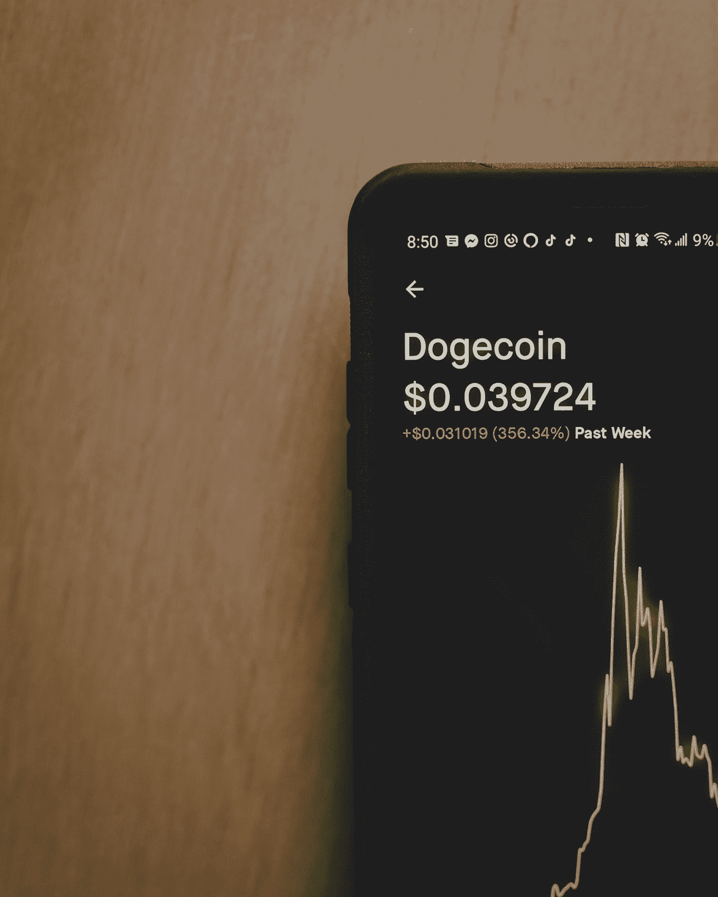

# 另类硬币季到了！

> 原文：<https://levelup.gitconnected.com/alt-coin-season-is-here-4ac544e79932>

## 让我们乘着强大的牛市前进吧！还是已经有羽冠了？

[粘土银行](https://unsplash.com/@claybanks?utm_source=medium&utm_medium=referral)在 [Unsplash](https://unsplash.com?utm_source=medium&utm_medium=referral) 拍摄的照片

复活节快乐！鉴于现在是复活节周末，如果我引用《传道书》的话，请原谅我:对**来说，一切都有一个季节**，一个天堂下一切活动的时间。如果你是一个加密投资者，现在是投资另类硬币的时候了。

## 加密周期

传统上，基于比特币减半的事件，Crypto 以四年为周期运行。每次比特币减半，都会引发加密货币的牛市。比特币引领潮流，另类硬币紧随其后。

这些周期如此有利可图的原因是比特币和 alt 并不同步。因此，很容易利用你的比特币利润来体验更不稳定的替代币。

## 夏普比率

当我刚开始投资 crypto 时，我只投资比特币和以太坊。随着时间的推移，我了解了其他加密货币，也想投资这些货币。

我试着运行一些基于夏普比率的蒙特卡洛模拟，以找出什么样的分布可以在最小化风险的同时最大化我的利润。夏普比率在金融界用于比较各种资产的回报。夏普比率越高，风险/回报比率越高。

在加密领域使用夏普比率的一个问题是，虽然比特币有合理的数据量，但一些较新的替代比特币却很缺乏。这在分析中引入了模糊因素。尽管如此，它仍然让我能够想象以不同的方式对我的投资组合进行加权会如何影响我的整体风险。

我的结论是，对于一个希望在最小化风险的同时仍能获得合理利润的投资者来说，理想的分配是大力支持比特币。

## 风险承受能力带来潜在的更大利润

然而，如果你愿意为了潜在的更大利润而接受更高的风险呢？需要注意的是，你需要比关注最小风险更密切地关注你的投资组合。

## 乘浪前进

我一直乘风破浪的方式——最初投资比特币和以太坊。然而，随着我越来越熟悉这个密码体，我加入了一些备用硬币。

最好的办法就是乘风破浪，交易部分比特币利润来投资 alts。我买的是 Chainlink(链接)，Cardano(阿达)，Polkadot(圆点)。

随意选择任何你喜欢的替代硬币。请注意，虽然你可以大幅增加你的利润，你也增加了你的风险。

随着我对加密周期了解的越来越多，我重新审视了我的投资组合，以便更好地利用 alt-coin 季节。我已经决定把我的 Cardano 换成另一个市值小得多的 alt，我认为它会做得更好。是的，这是一个冒险的举动，但 alt-coin 赛季是时候冒这个险了。

我做得对吗？谁知道呢？也许明天卡尔达诺会卷土重来，或者我的“小盘股”停滞不前。那我就踢自己。

然而，现在是时候让自己接触另类硬币了。虽然他们昨天表现不错，但他们中的一些人今天似乎在休息，这可能是买入的好时机。我认为我们刚刚开始另类硬币牛市阶段，所以你可能要确保你至少有一些接触这些不稳定但潜在相当有利可图的密码。

## 你的风险承受能力

那么，你应该投资另类硬币吗？

就看你的风险承受能力如何了。

加密货币是一种投机性投资。即使你把大部分库存放在比特币里，安全性也是相对的。如果明天出现调整，你的替代硬币可能会下跌 90%。与此同时，如果你投资于相对稳定的比特币，你“只会”下跌 40%。但是 40%对很多人来说还是很多的。

底线是，如果你因为投资压力大而夜不能寐，你就不需要呆在秘密空间。还有其他投资不会破坏你的睡眠周期。

另一方面，你的风险承受能力可能比我大。在这种情况下，你可以做一些更有利可图的事情。

## 一些高风险的举动

虽然我认为通过遵循这个领域的自然周期投资加密是一种赚钱的好方法，但还有其他策略可能会让你赚得更多。

如果你一开始就持有足够多的股份，你可能会成为一个更加活跃的交易者。通过这样做，你可以在每天骑自行车甚至每小时骑自行车的时候增加你的利润。

如果你尝试这样做，请注意，虽然发现广泛的市场模式很容易，但准确的时机并不容易。

此外，要知道，如果你不小心的话，交易费和税会吃掉你的利润。确保你在交易策略中考虑到这些因素。

其他可以获得巨额利润的高风险策略包括保证金购买和卖空加密。据报道，这样做已经发了财。然而，在一个已经充满风险的空间里，这些都是非常冒险的策略。

## 这一切都归结于风险管理。

有些人非常厌恶风险，他们根本不会投资密码。其他人，比如我自己，是小心翼翼尝试的新手。

随着我变得更加舒适，我把钱投入了更多的备用硬币。我认为这是明智的，因为我在另类硬币季节看到了爆炸。但是如果你不想冒相关的风险，那也没关系。只要你持有比特币和以太坊，你仍然会获得丰厚的利润。

最后，还有生活在边缘的人。如果你觉得这样做很舒服，你可以获得巨大的收益。只是要意识到风险。

你可以使用夏普比率这样的工具来帮助你管理风险。在以后的文章中，我将更详细地研究这个特定的工具以及其他一些工具。