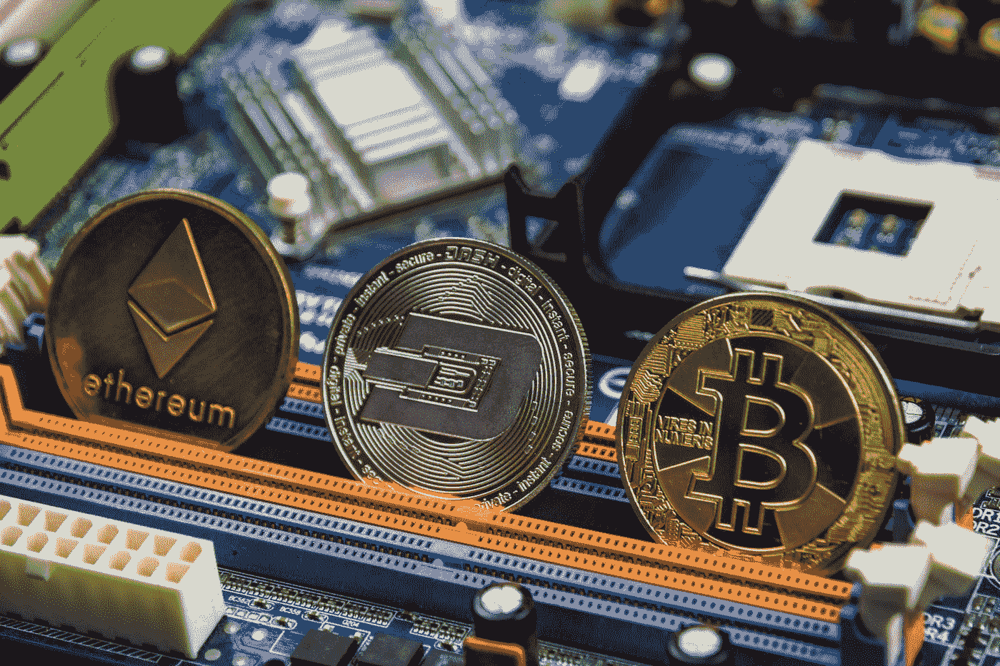

# alt-硬币即将变热

> 原文：<https://levelup.gitconnected.com/alt-coins-about-to-go-hot-3329d0cc57d1>

## 以太坊喘了口气，多格笑了 Chainlink 会涨到 300 美元吗？

[Bermix 工作室](https://unsplash.com/@bermixstudio?utm_source=medium&utm_medium=referral)在 [Unsplash](https://unsplash.com?utm_source=medium&utm_medium=referral) 拍摄的照片

如果你有幸持有以太币，你会发现它最近的价格涨势喜人。

超过 3000 美元是一个很好的指标，表明这里仍然有很多动力和热情。而且，需要明确的是，Eth 的上升期还没有结束。以太坊牛市还有一段路要走。然而，我怀疑现在的焦点将会是另类硬币市场的其余部分。

有一种硬币一直在升值，那就是总督。我从来没有费心去买，因为我认为这是一个虚荣的游戏。我更傻了，嗯？

同时——我对玩 ***每一枚*** 币都不是很感兴趣。

暂且把 Doge 是一个迷因硬币放在一边，它之所以有吸引力，真的要归功于顽皮幽默的马斯克先生。就实用价值而言，有许多硬币远比 Doge 值钱，但我也没有投资过。

我玩这个秘密空间的策略是挑选一些我喜欢的硬币，并坚持不懈地跟随它们。我做研究，跟踪新闻。这是我喜欢玩市场的方式，尽管还有其他同样有效的策略。

然而，无论你采取什么策略，确保在接下来的几周里，除了以太坊，你还会关注一些另类硬币。现在是确保你的投资组合中有稳定的中小盘股的好时机。

总之，我认为另类投资领域即将真正爆发。

当然，我可能是错的。请做好自己的尽职调查！

至于特别的硬币——我特别关注的一个硬币是 Chainlink。我预计在这个周期的某个时候会超过 300 美元。

它会以两种方式之一发生。它可以直接登月。或者……我们可能会看到一种上升/下降/上升的模式，我认为这种可能性更大。

无论哪种方式，我预测 Chainlink 将在当前的 alt-coin 周期中再上涨 600%左右。其他 alt 也会有类似的戏剧性动作。

见鬼，在这一切结束之前，强大的总督可能会达到 10 美元。更奇怪的事情是可能的。