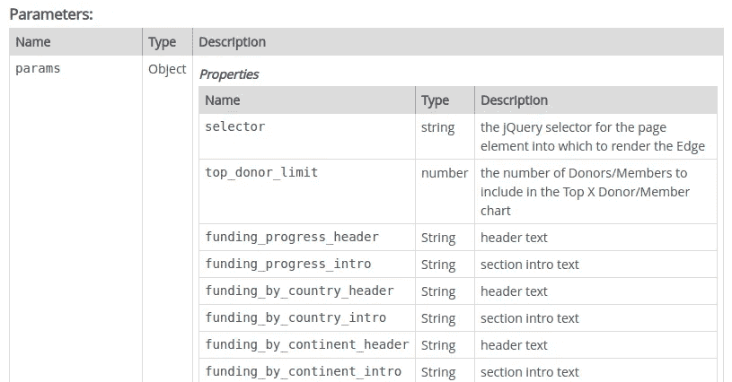

# 始终向 JavaScript 函数传递一个参数

> 原文：<https://levelup.gitconnected.com/always-pass-one-argument-to-your-javascript-function-4140d909937e>


JavaScript 没有真正的关键字参数概念，同时对于传递给函数的内容非常灵活。因此，对于以什么样的顺序将什么传递给一个函数，人们很容易感到困惑或不知所措。我发现，无论是对我自己还是对使用我的代码的其他人来说，总是只将一个名为`params`的参数传递给我的函数，并将所有内容嵌入其中，这样更好。

在我试图说服您这是一个好主意之前，让我们来看看 JavaScript 中的参数处理是如何工作的。

函数可以在其声明中指定任意数量的参数:

```
function callMe(a, b, c) {}
```

当您使用正确数量的位置参数调用该函数时，一切都有意义:

```
function callMe(a, b, c) {
    return a + b + c
}
callMe(1, 2, 3)>>> 6
```

在许多其他语言中，做任何不同的事情都会导致异常。没有提供足够的论据？例外。提供太多参数？例外。在 JavaScript 中并非如此。

尝试用很少的参数调用上面的函数:

```
callMe(1,2)>>> NaN
```

或者太多了:

```
callMe(1,2,3,4)>>> 6
```

现在的情况是，JavaScript 并没有真正的方法“签名”的概念，比如说，你可以在 OO 语言中找到。当你在函数声明中声明一个参数名时，你所做的只是在函数内部使用时给这个位置参数附加一个标签。如果那个参数没有被传入，标签就是`undefined`。如果你传入一个没有位置标签的参数，那么它仍然在函数范围内，你只是没有它的名字。

这解释了我们上面的函数调用的输出。当我们为`c`省略一个值时，那么`c`就是`undefined`，而`a + b + c`就是`NaN`。当我们传入第四个参数时，函数继续运行，就好像它不存在一样。

那么，能够传入没有标签的值，从而无法在函数内部访问这些值，这有什么意义呢？嗯，这句话的后半部分不是真的。我们*可以*访问该值，如果你知道去哪里找的话，那就是在所有声明的函数中存在的特殊的`arguments`局部变量中。它是一种特殊的动物，有自己的类型，如果我们愿意，我们可以将它转换为数组:

```
function callMe() {
    return Array.prototype.slice.call(arguments)
}
```

(注意我这里用的是 ES5，它肯定能在你选择的浏览器中工作。在 ES6 中使用`Array.from(arguments)`有一个稍微快一点的方法。

我们声明这个函数没有位置参数，只是为了让这一点非常清楚。我们现在可以用任意数量的参数来调用它，它会把它们反映给我们:

```
callMe(1, 2, 3, 4)>>> [1, 2, 3, 4]
```

关于参数，你需要知道的另一件事是，从 ES6 开始，你*可以*像这样给它们设置默认值:

```
function callMe(a, b=2, c=4) { return a + b + c }callMe(1)
>>> 7callMe(2, 3)
>>> 9
```

但是不能将参数作为关键字传递。我的意思是，下面的工作不像你预期的那样；试试看:

```
callMe(a=3, c=5);
```

最终，这意味着函数声明的参数只不过是函数能力的指南。再加上缺乏真正的关键字参数，因此很难理解函数声明及其文档，也很难确保您传入的是正确的内容。

经常会看到 JavaScript 文档这样写道:

*函数 doIt(oneThingOrAnother，[someOption。[其他选项]])*

*调用这个函数，用一个东西或另一个东西作为第一个参数，然后你的选项是…*

对我来说，这种函数声明是笨拙的，在我看到它如何工作之前，几乎总是会导致一点尝试性的错误。

相反，我更喜欢使用单个函数参数`params`，记录它的结构，并且永远不用担心变量参数列表。我们可以像这样快速重写上面的函数:

```
function doIt(params) {
    var oneThing = params.oneThing;
    var anotherThing = params.anotherThing;
    var someOption = params.someOption;
    var someOtherOption = params.someOtherOption;
    // ....
}
```

这还不完美，我们会在进行过程中清理它…

让我们深入了解为什么这种方法是一个好主意:

它**消除了参数的位置排序**——你的用户不再需要反复提醒自己参数的传递顺序。当我调用这个函数时，我可以用任何方式:

```
doIt({
    oneThing: "one", anotherThing: "another", 
    someOption: "a", someOtherOption: "b"
});doIt({
    someOption: "a", someOtherOption: "b",
    oneThing: "one", anotherThing: "another"
});
```

它允许我连贯地传递可变数量的参数(T12)——我可以省略一个参数，而不会打乱顺序或行为。比如如果我只想通过`oneThing`或`anotherThing`:

```
doIt({
    oneThing: "one", someOption: "a", someOtherOption: "b"
});doIt({
    anotherThing: "another", someOption: "a", someOtherOption: "b"
});
```

作为一个函数作者，如果调用者没有指定默认参数**和**，我可以很容易地做到:

```
function doIt(params) {
    var oneThing = params.hasOwnProperty("oneThing") ? 
                      params.oneThing : "defaultOneThing"; var anotherThing = params.hasOwnProperty("anotherThing") ? 
                      params.anotherThing : "defaultAnotherThing"; var someOption = params.hasOwnProperty("someOption") ? 
                      params.someOption : "defaultSomeOption"; var someOtherOption = params.hasOwnProperty("someOther") ? 
                      params.someOther : "defaultSomeOther";
    // ....
}
```

(注意我们不使用老式的`var oneThing = params.oneThing || "defaultOneThing"`方法，因为这个*最终会*破坏你的函数，你可以在这里读到我对那个[的咆哮。)](https://itnext.io/you-shouldnt-use-truthy-tests-753b39ef8893)

这也意味着我可以用命名良好的参数来宣传我的函数的特性，而不必在函数中坚持那些参数名称。这可能是一个非常方便的区别。例如:

```
function doIt(params) {
    var one = params.hasOwnProperty("oneThing") ? 
                      params.oneThing : "defaultOneThing"; var another = params.hasOwnProperty("anotherThing") ? 
                      params.anotherThing : "defaultAnotherThing"; var opt1 = params.hasOwnProperty("someOption") ? 
                      params.someOption : "defaultSomeOption"; var opt2 = params.hasOwnProperty("someOther") ? 
                      params.someOther : "defaultSomeOther";
    // ....
}
```

在文档方面，**函数调用本身变得相当自文档化**，或者至少更容易理解:

```
doIt({
    oneThing: "one", someOption: "a", someOtherOption: "b"
});
```

对抗

```
doIt("one", "a", "b")
```

在函数声明方面，**记录`params`对象的内部结构**很容易，而 [JSDoc](http://usejsdoc.org/) 会很好地为您将文档列表。这是最近一个项目的文档片段，以及它产生的 JSDoc 输出:

```
*/**
 ** ***@param*** *{Object} params
 ** ***@param*** *{string} params.selector - the jQuery selector for the page element into which to render the Edge
 ** ***@param*** *{number} params.top_donor_limit - the number of Donors/Members to include in the Top X Donor/Member chart
 ** ***@param*** *{String} params.funding_progress_header - header text
 ** ***@param*** *{String} params.funding_progress_intro - section intro text
 ** ***@param*** *{String} params.funding_by_country_header - header text
 ** ***@param*** *{String} params.funding_by_country_intro - section intro text
 ** ***@param*** *{String} params.funding_by_continent_header - header text
 ** ***@param*** *{String} params.funding_by_continent_intro - section intro text
 * ...
 */*
```



params 对象的 JSDoc 输出

有很多很好的理由这样声明你的函数。当然，和 JavaScript 一样，这是一个惯例，你可能会发现你想违反它的情况。你肯定会使用其他人的代码，而这些代码不会以这种方式运行。不过，我向您保证，从长远来看，像这样编写您自己的代码将使您免于处理声明不当的函数这种低级的后台问题。

*Richard 是软件开发咨询公司*[*Cottage Labs*](https://cottagelabs.com)*的创始人，该公司专注于数据生命周期的各个方面。他偶尔会在推特上发*[*@ Richard _ d _ Jones*](https://twitter.com/richard_d_jones)

[](https://levelup.gitconnected.com)[](https://gitconnected.com/learn/javascript) [## 学习 JavaScript -最佳 JavaScript 教程(2019) | gitconnected

### 排名前 65 的 JavaScript 教程。课程由开发者提交并投票，使您能够找到最好的…

gitconnected.com](https://gitconnected.com/learn/javascript)