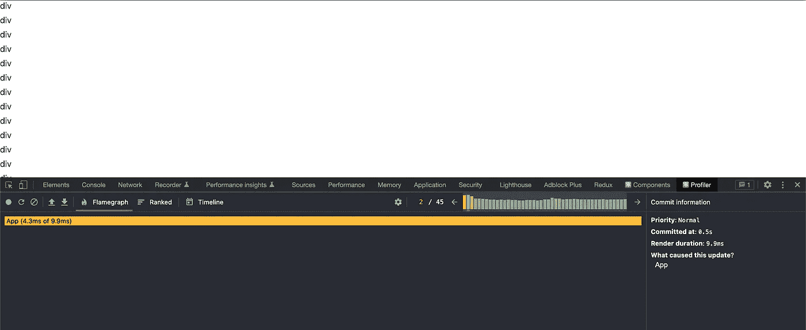
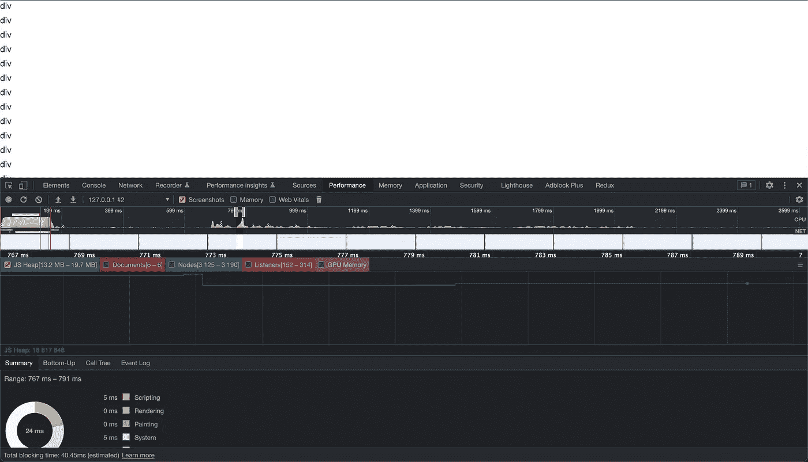
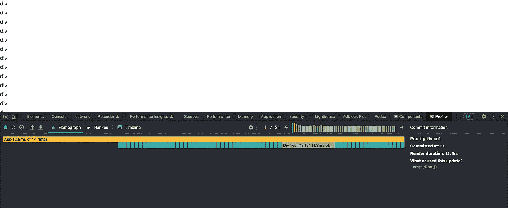
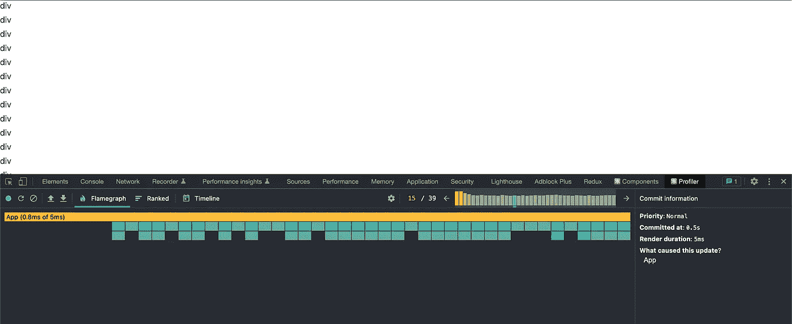
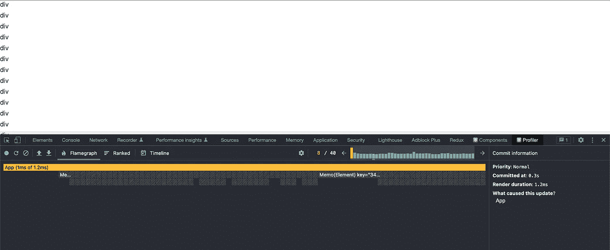
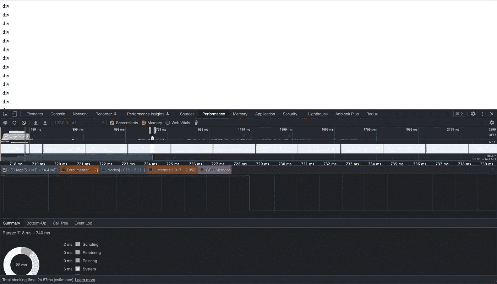

# 我反应过度了吗？还是 React 反应过度了？

> 原文：<https://levelup.gitconnected.com/am-i-overreacting-or-is-react-over-reacting-d3e7d0cb4d37>


一个真正的图书馆

*原载于*[*https://devtails . XYZ*](https://devtails.xyz/@adam/am-i-overreacting-or-is-react-over-reacting)*。*

***编辑 2023 年 1 月 4 日***

*不出所料，这个具体的例子引起了很多关注。虽然有些批评是有根据的，但这篇文章的重点并不是所展示的具体行为。相反，它是关于演示具有大量元素的单个 React 渲染的开销，并显示您需要添加多少额外的层来撤消 React 提供的自动渲染。如果我能想出一个更好的例子，我可能会做后续工作。*

这篇文章的代码可以在这里找到[。](https://github.com/adamjberg/react-overreact)

当我第一次开始做 web 开发时，主要是用 Python/Django。一切都是服务器端渲染的，我从来没有想过“渲染性能”。10 年后，随着计算机速度至少提高一倍，渲染性能现在比以往任何时候都更成问题。像 React 这样的单页应用程序和前端库鼓励并支持高度动态的网页。不幸的是，根据我的经验，默认推荐的 React 代码编写方式实际上并不能很好地支持高度动态的页面。

在这篇文章中，我将探索标准 React 代码带来的问题，改进 React 性能的推荐选项，最后用 vanilla JS 中的例子来反驳这些问题。

## 我们正在建造的东西

想出一个简洁的例子是困难的，因为真实项目的复杂性更好地展示了所有事情是如何结合在一起的。这篇文章将介绍一个基本的“动态”例子，突出 React 在状态频繁变化时的表现。这个例子是 500 个文本 div，当鼠标悬停在其中一个元素上时，它们的背景颜色会更新。在每一组修改之后，我会包含概要分析器的源代码和截图，以显示 React 在渲染上花费了多少时间。

## 使用创建 React 应用程序初始化项目

此代码的初始基础来自 create-react-app typescript 模板。我只修改了示例中的`App.tsx`文件，以便更容易一次看到所有的变化。

```
npx create-react-app react-overreact --template typescript
```

## 简单反应溶液

在第一个例子中，我们将捕获当前悬停的元素作为状态，并使用它来更新元素的背景颜色。在你举起你的干草叉说这可以简单地用 CSS `:hover`完成之前，想象一下这个悬停状态是其他事情所需要的，我们只是使用`backgroundColor`属性作为一种可视化状态变化的方式。

请参见下面的代码。

```
// App.tsx
import React, { useState } from "react";
import "./App.css";

function App() {
  const [hoveredElementId, setHoveredElementId] = useState("");

  const elements = [];

  for (let i = 0; i < 500; i++) {
    const elementId = String(i);
    const isHovered = hoveredElementId === elementId;

    elements.push(
      <div 
        key={i}
        style={ { marginBottom: 8, backgroundColor: isHovered ? "#eee" : "" } }
        onMouseEnter={() => {
          setHoveredElementId(elementId);
        }}
        onMouseLeave={()=> {
          if (elementId == hoveredElementId) {
            setHoveredElementId("");
          }
        }}
      >
        div
      </div>
    );
  }

  return <>{elements}</>;
}

export default App;
```

## 仿形铣床



在 M1 Macbook Pro **上，单个渲染时钟在 3 毫秒到 9 毫秒之间。**你还可以看到，每当一个新元素被悬停时，一个新的渲染被触发。如果你认为 10 毫秒以下听起来很快，请记住，M1 芯片是目前最快的单线程执行 CPU 之一。很容易想象会有比这至少慢两倍的旧设备。这也是所有最简单的文本元素。即使只是重复元素中的几个元素也会增加几毫秒的渲染时间。

我承认使用开发构建会有“一些”开销，但是我不认为打开生产模式会对这个例子有实质性的影响。

**更新:**

我尝试了几种不同的方法在生产中进行分析，但是每种方法都得出了相同的结论。与我在本文结尾的最后一个例子相比，最公平的比较是一个完整的生产版本(`yarn build`)和 Chrome Performance 标签。

## Chrome 性能标签

下面你可以看到没有任何额外 React 开发开销的数字看起来与 React 开发工具显示的非常相似。



我来自一个游戏开发背景，在那里你根深蒂固地认为，为了保持每秒 60 帧，你的帧需要在 16 毫秒内完成所有处理。仅仅用了 500 个元素，我就已经用 React 接近这个门槛了。一旦一帧超过 16 毫秒，停顿变得明显，并导致排队，导致可怕的用户体验。

## 优化 React 的性能

在 React 的[优化性能页面](https://reactjs.org/docs/optimizing-performance.html)上，他们声称“对于许多应用程序来说，使用 React 将导致快速的用户界面，而无需做太多工作来专门优化性能。”在我看来，这应该重新措辞为“大多数应用不会有足够的元素来担心 React 的默认过度渲染”。

这个列表中的第一个建议是[虚拟化长列表](https://reactjs.org/docs/optimizing-performance.html#virtualize-long-lists)。根据他们的文档:“如果您的应用程序呈现很长的数据列表(数百或数千行)，我们建议使用一种称为“窗口”的技术”。这在无限列表的领域中是有意义的，但是在 100 多个元素中，这是一个不必要的复杂问题。在我撰写本文的真实示例中，有高度嵌套的组件，这意味着有时单个元素非常简单，而有时单个元素可能有几个其他组件。使用这种方法设置窗口需要计算每个元素的动态高度，这可能会导致比一开始就显示所有元素更差的性能。

下一个例子建议[避免和解](https://reactjs.org/docs/optimizing-performance.html#avoid-reconciliation)。本质上是建议更新组件，这样如果道具没有改变，组件就不会重新渲染。当我第一次了解到这一点时，我不得不重复一遍。我认为 React 的整个要点是，如果道具没有改变，那么组件中就没有工作要做。但结果是**反应只是盲目地重新渲染整个子树，如果一个父节点的属性改变的话。**

还记得建议这一点的有用页面吗？实际上，没有一个告诉你如何用功能组件做到这一点。react 网站上唯一一个致力于性能优化的页面并没有给出任何关于如何使用钩子进行优化的信息(这是现在推荐的 React 使用方式)。相反，关于钩子优化的细节隐藏在[钩子常见问题](https://reactjs.org/docs/hooks-faq.html#performance-optimizations)中，一旦发现就太晚了。

## 避免与 React.memo 协调(或不协调)

```
import React, { useState } from "react";
import "./App.css";

type ElementProps = {
  id: string;
  hoveredElementId: string;
  onMouseEnter: (id: string) => void;
  onMouseLeave: (id: string) => void;
};

function Div(props: ElementProps) {
  const isHovered = props.hoveredElementId === props.id;

  return (
    <div
      style={ { marginBottom: 8, backgroundColor: isHovered ? "#eee" : "" } }
      onMouseEnter={() => {
        props.onMouseEnter(props.id);
      }}
      onMouseLeave={() => {
        props.onMouseLeave(props.id);
      }}
    >
      div
    </div>
  );
}

function App() {
  const [hoveredElementId, setHoveredElementId] = useState("");

  const handleMouseEnter = (id: string) => {
    setHoveredElementId(id);
  };

  const handleMouseLeave = (id: string) => {
    if (id == hoveredElementId) {
      setHoveredElementId("");
    }
  };

  const elements = [];

  for (let i = 0; i < 500; i++) {
    elements.push(
      <Div
        key={i}
        id={String(i)}
        hoveredElementId={hoveredElementId}
        onMouseEnter={handleMouseEnter}
        onMouseLeave={handleMouseLeave}
      />
    );
  }

  return <>{elements}</>;
}

export default App;
```

首先，我们将内部元素放入它自己的 React 组件中，以便从防止重新渲染的能力中受益。从功能上讲，这应该与我们开始的第一个代码块非常相似。分析器显示我们现在在 4 毫秒到 16 毫秒之间。最后一个数字应该看起来很熟悉…我们已经从引入一个 React 组件来包装我们的基本 div 开始接近 60fps 了(您可以发挥想象力来想象当内部组件有多个自己的子组件时会发生什么)。

## 仿形铣床



每当悬停的元素 id 改变时，**上面的代码仍然触发完全渲染。**这是因为我们将`hoveredElementId`传递给元素，因此每次悬停的元素改变时，每个孩子的道具都会改变，从而触发所有内容的完全重新渲染。

## 使用`React.memo`和`propsAreEqual`回调

如果`hoveredElementId`是当前元素(在这种情况下，我们需要更新 backgroundColor)，或者前一个`hoveredElementId`与当前元素匹配(在这种情况下，我们需要移除 backgroundColor 样式)，则元素只需要重新呈现。

在下面的代码中，我们检查`prevProps.hoveredElementId`或`nextProps.hoveredElementId`是否匹配我们的元素的 id。如果是，我们返回`false`来指示组件应该被重新渲染。我们还需要确保对其他属性的更改会触发重新渲染，因此我们要确保使用 lodash 的`isEqual`对其余属性执行相等检查。默认情况下，React.memo 进行浅层比较，但据我所知，它们实际上并没有公开一个方便的函数供您用来进行自己的浅层比较。

```
import _ from "lodash";
import React, { useState } from "react";
import "./App.css";

type ElementProps = {
  id: string;
  hoveredElementId: string;
  onMouseEnter: (id: string) => void;
  onMouseLeave: (id: string) => void;
};

function Element(props: ElementProps) {
  const isHovered = props.hoveredElementId === props.id;

  return (
    <div
      style={ { marginBottom: 8, backgroundColor: isHovered ? "#eee" : "" } }
      onMouseEnter={() => {
        props.onMouseEnter(props.id);
      }}
      onMouseLeave={() => {
        props.onMouseLeave(props.id);
      }}
    >
      div
    </div>
  );
}

const MemoedElement = React.memo(Element, (prevProps, nextProps) => {
  const { hoveredElementId: oldHoveredElementId, ...oldProps } = prevProps;
  const { hoveredElementId: newHoveredElementId, ...newProps } = nextProps;

  if (oldHoveredElementId === nextProps.id) {
    return false;
  }
  if (newHoveredElementId === nextProps.id) {
    return false;
  }
  return _.isEqual(oldProps, newProps);
});

function App() {
  const [hoveredElementId, setHoveredElementId] = useState("");

  const handleMouseEnter = (id: string) => {
    setHoveredElementId(id);
  };

  const handleMouseLeave = (id: string) => {
    if (id === hoveredElementId) {
      setHoveredElementId("");
    }
  };

  const elements = [];

  for (let i = 0; i < 500; i++) {
    elements.push(
      <MemoedElement
        key={i}
        id={String(i)}
        hoveredElementId={hoveredElementId}
        onMouseEnter={handleMouseEnter}
        onMouseLeave={handleMouseLeave}
      />
    );
  }

  return <>{elements}</>;
}

export default App;
```

## 仿形铣床



不幸的是，第一次尝试失败了。其原因非常不明显。当`hoveredElementId`状态改变时，它触发`App`组件的重新渲染。在每次渲染时，`handleMouseEnter`和`handleMouseLeave`回调被重新定义。这意味着当它们被传递回`MemoedElement`时，它们不再是同一个引用，这导致`MemoedElement`再次完全重新呈现自身。

我已经做了学习 React 内部如何工作的工作，但是必须向初级开发人员解释这超出了一个应该简化这类事情的库所需要的。

## 使用回调来防止回调触发不必要的呈现

钩子常见问题解答的另一个问题是[“钩子慢是因为在 render 中创建函数吗”](https://reactjs.org/docs/hooks-faq.html#are-hooks-slow-because-of-creating-functions-in-render)。

> 传统上，React 中内联函数的性能问题与在每次渲染时传递新回调如何破坏子组件中的 shouldComponentUpdate 优化有关

这里 React 承认了这样一个事实，即功能组件中的回调在默认情况下是中断的。在下面的代码中，我更新了我的回调函数，用神奇的`useCallback`来包装。

```
import _ from "lodash";
import React, { useCallback, useState } from "react";
import "./App.css";

type ElementProps = {
  id: string;
  hoveredElementId: string;
  onMouseEnter: (id: string) => void;
  onMouseLeave: (id: string) => void;
};

function Element(props: ElementProps) {
  const isHovered = props.hoveredElementId === props.id;

  return (
    <div
      style={ { marginBottom: 8, backgroundColor: isHovered ? "#eee" : "" } }
      onMouseEnter={() => {
        props.onMouseEnter(props.id);
      }}
      onMouseLeave={() => {
        props.onMouseLeave(props.id);
      }}
    >
      div
    </div>
  );
}

const MemoedElement = React.memo(Element, (prevProps, nextProps) => {
  const { hoveredElementId: oldHoveredElementId, ...oldProps } = prevProps;
  const { hoveredElementId: newHoveredElementId, ...newProps } = nextProps;

  if (oldHoveredElementId === nextProps.id) {
    return false;
  }
  if (newHoveredElementId === nextProps.id) {
    return false;
  }
  return _.isEqual(oldProps, newProps);
});

function App() {
  const [hoveredElementId, setHoveredElementId] = useState("");

  const handleMouseEnter = useCallback((id: string) => {
    setHoveredElementId(id);
  }, [setHoveredElementId]);

  const handleMouseLeave = useCallback((id: string) => {
    if (id === hoveredElementId) {
      setHoveredElementId("");
    }
  }, [setHoveredElementId]);

  const elements = [];

  for (let i = 0; i < 500; i++) {
    elements.push(
      <MemoedElement
        key={i}
        id={String(i)}
        hoveredElementId={hoveredElementId}
        onMouseEnter={handleMouseEnter}
        onMouseLeave={handleMouseLeave}
      />
    );
  }

  return <>{elements}</>;
}

export default App;
```

## 仿形铣床



您可以在 profiler 截图中看到，这已经成功地实现了在每次悬停时不重新渲染每个组件的目标。

为了实现这一点，任何存在的回调都必须包装在这个`useCallback`中。不要错过依赖数组中的一些东西，否则你会发现自己有一些奇怪的行为。

```
const handleMouseEnter = useCallback((id: string) => {
  setHoveredElementId(id);
}, [setHoveredElementId]);
```

在编程中，人们常说“过早优化是万恶之源”。这通常是正确的，建议的方法是，仅当问题区域本身成为问题时，才描述并明确地针对问题区域。

这也适用于编写 React 代码，但是 React 中事后优化的过程是不愉快的。当您知道性能是个问题时，您已经有了几个不同的组件，它们都需要单独记忆。一旦你做到了这一点，你需要找出所有回调给你带来痛苦的例子。

最终的代码仍然是合理的(如果你知道这些模式和问题的话)，但是依赖数组和 arePropsEqual 的微妙之处很容易引入新的问题。添加“只需再做一件事”，可以很容易地打破记忆，让你回到糟糕表现的起点。

FAQ 接下来建议`[useReducer](https://reactjs.org/docs/hooks-faq.html#how-to-avoid-passing-callbacks-down)` [避免在多个组件之间传递回调](https://reactjs.org/docs/hooks-faq.html#how-to-avoid-passing-callbacks-down)。在本文中，我不会详细介绍它是什么样子的(尽管您可能会在将来看到一个这样的例子)。

## 我们需要做出反应吗？

在这篇文章中，我介绍了至少 3 个独立的主要 React 概念(`React.memo`、`arePropsEqual`和`useCallback`)，以便获得可以说是默认行为的性能(坦率地说，对于 500 个元素来说，1 毫秒仍然相当尴尬)。我长期以来一直质疑 React 实际上给了我什么好处，我在性能领域经历的这些挫折令人极其失望。

在以后的文章中，我想探索和分享一些我为了摆脱 React 而做的实验。但是作为一个引子，下面是用普通的旧 JavaScript 编写的类似例子的代码。

```
const root = document.createElement("div");
document.body.appendChild(root);

for (let i = 0; i < 500; i++) {
  const element = document.createElement('div');
  element.style.marginBottom = "8px";
  element.innerText = "div";

  element.addEventListener("mouseenter", () => {
    element.style.backgroundColor = "#eee"
  });

  element.addEventListener("mouseleave", () => {
    element.style.backgroundColor = ""
  });

  root.appendChild(element);
}
```

## 仿形铣床



React Profiler 不能再用了，但是 Chrome Performance 标签显示最差的帧是 2ms 的脚本。其他的都是 0 毫秒。

## 结论

React 的支持者会声称这是一种不公平的表现，React 的好处会随着你的项目变大而显现。到时候，我会分享如何使用上面介绍的简单代码来毫无问题地维持大型项目。

您不必学习 React 复杂的组件生命周期工作方式，而是可以学习自己管理它。在过去的几个月里，我一直在自己的项目中这样做，我不认为我会回头。

# 分级编码

感谢您成为我们社区的一员！在你离开之前:

*   👏为故事鼓掌，跟着作者走👉
*   📰查看[级编码出版物](https://levelup.gitconnected.com/?utm_source=pub&utm_medium=post)中的更多内容
*   🔔关注我们:[推特](https://twitter.com/gitconnected) | [LinkedIn](https://www.linkedin.com/company/gitconnected) | [时事通讯](https://newsletter.levelup.dev)

🚀👉 [**加入升级人才集体，找到一份惊艳的工作**](https://jobs.levelup.dev/talent/welcome?referral=true)