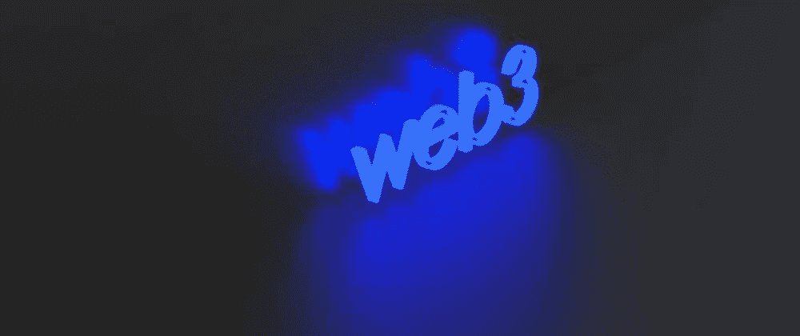

# 开发人员学习 Web3 的惊人免费资源

> 原文：<https://levelup.gitconnected.com/amazing-free-resources-to-learn-web3-for-developers-12c22bcedc67>

正如你们许多人所知，web3 现在非常流行。杰克·多西和埃隆·马斯克之前讨论过这个问题，a16z 的马克·安德森在推特上屏蔽了杰克。或许，现在是开始学习 web3 的好时机。在这篇文章中，我将向你介绍一些很棒的免费资源！

# 基础

# 奥德赛

https://www.odysseydao.com/
奥德赛是一个很好的网站，可以了解与 web3 相关主题的基本情况。例如，区块链，NFTs，web3 概念，DeFi 等。

# 使用网站 3

[https://www.useweb3.xyz/](https://www.useweb3.xyz/)use web 3 是一个非常有用的学习平台，可以获取有用的资源。

# 服务

# thirdweb

[https://thirdweb.com/](https://thirdweb.com/)
你控制的智能合约。加快工作流程的工具。面向开发人员的直观 SDK 和小部件。thirdweb 允许我们快速构建 dApp！另外，thirdweb 对非技术人员也有好处。

# 道德

[https://moralis.io/](https://moralis.io/)

# 魔力

[https://www.alchemy.com/](https://www.alchemy.com/)

我正在使用这个，如果你注册了[这个链接](https://alchemy.com/?r=86bf99545c6273ef)，你和我将获得 100 美元的信用点数！

# INFURA

【https://infura.io/[世界上最强大的区块链开发套件](https://infura.io/)

# 沙丘分析

[https://dune.xyz/](https://dune.xyz/)
社区免费加密分析。你可以找到与 crypto/web3 相关的真正有用的数据。如果你熟悉 SQL，你会爱上 Dune Analytics！

# 辅导的

# 秘密僵尸

https://cryptozombies.io/

# 指针

[https://www.pointer.gg/](https://www.pointer.gg/)指针为开发者提供了非常好的教程。如果你已经知道`reactjs`，指针将对你有好处。

# 建筑空间

https://app.buildspace.so/home
Buildspace 提供了非常好的教程来理解 web3 的东西。它涵盖了以太坊，索拉纳，多边形(很快)。
他们的 discord 服务器对想学 web3 的人也很有帮助。一件很棒的事情是，在你完成一个教程后，Buildspace 会给你一个 NFT。另外，如果你能帮助别人，Buildspace 会给你一个 NFT 来证明你帮助了别人。

# LearnWeb3

https://www.learnweb3.io/提供了很棒的教程。他们的教程分为 4 个级别:大一，大二，大三，大四。此外，他们还提供测试来检查你的理解能力。

# 以太坊开发教程

[https://ethereum.org/en/developers/tutorials/](https://ethereum.org/en/developers/tutorials/)

# 开发者资源(Solana)

[https://solana.com/developers](https://solana.com/developers)

# 油管（国外视频网站）

# Nader Dabit YouTube 频道

https://www.youtube.com/c/naderdabit:你们中的一些人可能知道，纳德曾经是亚马逊的一名开发者，但现在他在 web3 世界工作。自去年以来，他发布了许多有用的视频。他在 freeCodeCamp 上的帖子也很棒。
什么是 Web3？去中心化的未来互联网解释
[https://www.freecodecamp.org/news/what-is-web3/](https://www.freecodecamp.org/news/what-is-web3/)
当然，你应该去看看他在 dev . to
[https://dev.to/dabit3](https://dev.to/dabit3)上的帖子

# 帕特里克·柯林斯 YouTube 频道

https://www.youtube.com/c/PatrickCollins 是 Chainlink 的一名开发者，他的视频涵盖了许多与区块链有关的东西。还有，他的博客很有用。
https://medium . com/@ Patrick . Collins _ 58673

# 全球 YouTube 频道

[https://www.youtube.com/c/ETHGlobal/videos](https://www.youtube.com/c/ETHGlobal/videos)

> 黑客马拉松教授新技能，加强开发者社区，并推动新技术的发展。在 ETHGlobal，我们利用多年的经验来培养以太坊开发者和企业家的世界级生态系统。

# 链接 YouTube 频道

https://www.youtube.com/channel/UCnjkrlqaWEBSnKZQ71gdyFA

# 如何构建和部署 Solana 智能合同| Chainlink 工程教程

【https://www.youtube.com/watch?v=7l1P3xzr7Jo 

# 哈希表

如果你对 NFT 感兴趣，HashLips Youtube 频道是学习如何创建 NFT 的最好地方。
[https://www.youtube.com/c/HashLipsNFT](https://www.youtube.com/c/HashLipsNFT)

# 智能合同程序员

智能合同程序员提供了很好的实例教程。很棒的一点是他的例子支持 v 0 . 8 . 10 .
[https://www.youtube.com/watch?v=xv9OmztShIw&list = plo 5 vpqh 6 owdvqwpqfw 9 rz 67 o 6 pjf o6 q-p](https://www.youtube.com/watch?v=xv9OmztShIw&list=PLO5VPQH6OWdVQwpQfw9rZ67O6Pjfo6q-p)
[https://solidity-by-example.org/](https://solidity-by-example.org/)

# 博客

# 如何使用安全帽和元遮罩构建 React Dapp

[https://medium . com/building-blocks-on-the-chain/how-to-build-a-react-dapp-with-hard hat-and-meta mask-9 cec8 f 6410d 3](https://medium.com/building-blocks-on-the-chain/how-to-build-a-react-dapp-with-hardhat-and-metamask-9cec8f6410d3)

# 完整的实际操作安全帽教程

[https://better programming . pub/the-complete-hands-on-hard hat-tutorial-9e 23728 fc8a 4](https://betterprogramming.pub/the-complete-hands-on-hardhat-tutorial-9e23728fc8a4)

# 开发者的可靠性:以太坊区块链

[https://coins bench . com/solidity-for-developers-the-ether eum-区块链-7b6c8a18c93e](https://coinsbench.com/solidity-for-developers-the-ethereum-blockchain-7b6c8a18c93e)

# FullStack Web3 —您需要知道的一切

[https://better programming . pub/everything-you-need-know-on-full stack-web 3-94c 0 f1 b 18019](https://betterprogramming.pub/everything-you-need-to-know-about-fullstack-web3-94c0f1b18019)

# 其他的

# Vyper

https://vyper.readthedocs.io/en/stable/:如果你喜欢/热爱 python，这很好。

> Vyper 是一种面向契约的 pythonic 编程语言，目标是以太坊虚拟机(EVM)。