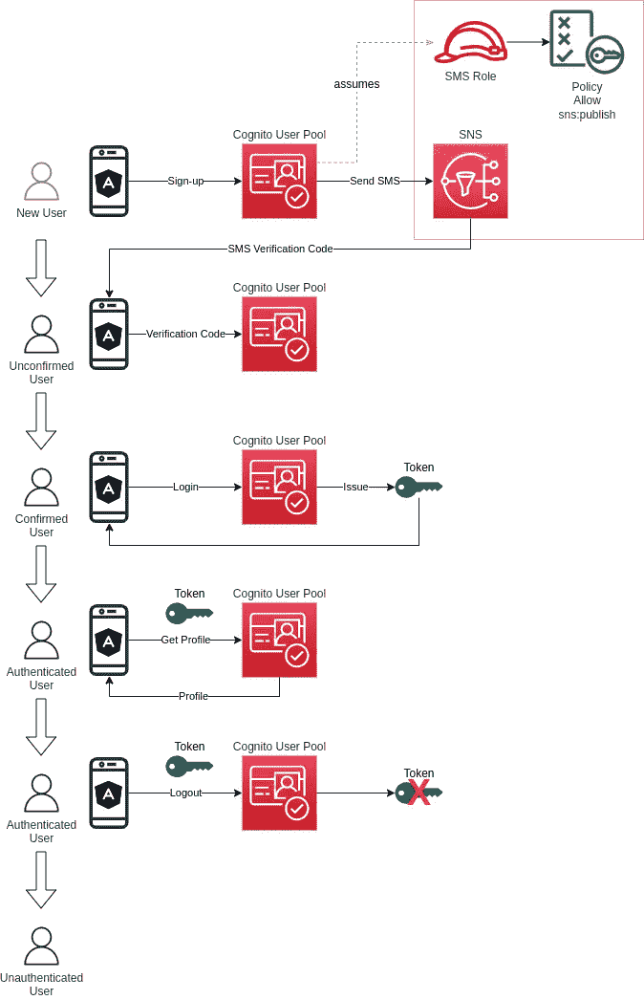

# 亚马逊认知与短信用户验证

> 原文：<https://levelup.gitconnected.com/amazon-cognito-with-sms-user-verification-8c0d90121faa>

## 包括一个工作角度温泉样本应用程序

[Amazon Cognito](https://aws.amazon.com/cognito/) 是一款安全且可扩展的服务，用于管理移动和网络应用的注册、登录和访问控制。有许多[功能](https://aws.amazon.com/cognito/details/)，服务的全部广度可以在[文档](https://docs.aws.amazon.com/cognito/latest/developerguide/what-is-amazon-cognito.html)中找到。

在本文中，我们将创建一个完整的解决方案，通过一个 Angular 前端应用程序和一个使用 Terraform 部署的 Cognito 用户池后端来演示用户注册和登录。

源代码可以在 [Github](https://github.com/oliverschenk/aws-cognito-angular/tree/amazon-cognito-with-sms-user-verification) 中找到。


值得注意的是，Cognito 提供了很多功能、灵活性和定制。然而，这也是以复杂性为代价的。

通常，最好的办法是想一想你想在你的应用中实现什么，然后从那里开始研究，而不是试图钻研每一个可能的功能。考虑业务流程，然后是数据和应用程序需求，最后选择满足这些需求的技术。Cognito 当然不是市场上唯一的解决方案——还有 [Auth0](https://auth0.com/) 、 [Okta](https://www.okta.com/au/) 、 [Firebase](https://firebase.google.com/) 、 [Azure AD](https://azure.microsoft.com/en-au/services/active-directory/) 等等…

作为一种替代方法，AWS 提供了一种名为 [AWS Amplify](https://aws.amazon.com/amplify/) 的服务，除了一系列常见的应用程序功能，还包括用户管理和认证作为其抽象之一。它旨在隐藏认知的复杂性，促进快速开发风格。

酷的是，我们仍然可以利用 Amplify 库的能力，而实际上不必使用完整的 Amplify 服务。在本文中，我们将利用 AWS Amplify Auth 库。

# **我们将建造什么**

我们希望实现的功能包括:

*   基于电话号码的自助用户注册
*   使用短信验证码激活帐户
*   用户登录和注销
*   自定义用户属性
*   查看用户配置文件
*   密码重置

# 解决方案架构

该解决方案包括两个主要部分。第一个是使用 Terraform 部署在 AWS 中的后端 Cognito 基础设施，第二个是将与 Cognito 服务交互的前端 Angular 应用程序。

下图显示了该解决方案将构建的内容以及它将支持的流程。



## 后端

后端的主要组件是一个 Cognito 用户池和相关的配置，以支持我们上面指定的特性。

Cognito 可以针对许多不同的用例进行配置。任何需要强大但可定制的安全性的技术都不可避免地在概念和实践上具有更高的复杂性。

使用以下 AWS 资源可以实现我们想要的与未经身份验证和经过身份验证的用户管理相关的所有功能:

*   **Cognito 用户池** 这是 Cognito 中的主要用户目录资源。
*   **Cognito 用户池 App 客户端** 这是一个客户端应用程序，可以作为未经认证的客户端进行 Cognito API 调用，如注册、登录和密码重置。在我们的例子中，用户池客户端是 Angular 前端应用程序。
*   **短信角色** 这是 Cognito 将承担的通过 Amazon SNS 发送短信的角色。

我们将在下面的实现中更详细地讨论上述每一项。

## 前端

前端代表面向用户的应用程序。在本指南中，创建前端是为了演示与 Cognito 服务交互相关的特定功能。

本指南中的应用程序是使用 Angular 编写的，但是同样的原则适用于任何在浏览器或移动应用程序中运行的“公共”客户端。Cognito 还支持被视为“机密”的应用客户端，如服务器端呈现的应用程序或后端脚本。

应用程序使用定制的 UI 设计，而不是 [Cognito 托管的 UI](https://docs.aws.amazon.com/cognito/latest/developerguide/cognito-user-pools-app-integration.html) 。这意味着与 Cognito 的通信必须手动处理。这是通过使用 [AWS Amplify Auth](https://www.npmjs.com/package/@aws-amplify/auth) 库实现的，该库在幕后使用了[Amazon-cognito-identity-js](https://www.npmjs.com/package/amazon-cognito-identity-js)库。

# 先决条件

*   [地形](https://www.terraform.io/intro)
*   [节点。JS](https://nodejs.org/)
*   [可选] [aws-vault](https://github.com/99designs/aws-vault) (用于凭证管理)
*   [可选] Redux DevTools Chrome 扩展(用于可视化 NgRx 动作和状态)
*   AWS 帐户的 SMS 沙箱中的一个[已验证的电话号码](https://docs.aws.amazon.com/sns/latest/dg/sns-sms-sandbox.html)

# 后端实现

好了，让我们开始用 Terraform 来建造一些基础设施。本节假设您至少对 Terraform 以及文件的一般定义和组织方式有所了解。

在你的 repo 的根目录下创建*后端*文件夹，里面有一些空文件。

```
mkdir backend
cd backend
touch variables.tf main.tf outputs.tf provider.tf
```

首先，让我们在`provider.tf`文件中设置提供者。如果您想从一个特定的概要文件中加载凭证，您可以在`provider`块中提供`profile = <credentials_profile>`。然而，为了更好的安全性，您可能想要查看类似于 [aws-vault](https://github.com/99designs/aws-vault) 的东西，并承担角色以访问所需帐户中的资源。

现在在`variables.tf`中定义一些变量。

现在让我们定义一下我们在`main.tf`的主要资源。

最后，在`outputs.tf`中定义输出，这是配置前端所需要的。

## 当地人

在`main.tf`文件的`locals`部分，我定义了一个`id`,用于资源命名。通过调整`project_name`和`stage`变量，您可以随意命名您的资源。包含一个阶段变量是一个很好的做法，因为它清楚地显示了一个资源是 dev 还是 prod。

## **认知用户群**

Cognito 中的用户池代表主用户目录。这是创建和管理用户的地方。以下列表强调了配置的重要方面:

*   `username_attributes`属性允许您指定注册时允许将哪些[用户池属性](https://docs.aws.amazon.com/cognito/latest/developerguide/user-pool-settings-attributes.html)用作用户名。这可以是`email`、 `phone_number`、两者(意味着两者都可以使用，但是你的应用需要更复杂的验证逻辑)或空(意味着你的用户名由你的用户以字符串的形式明确提供)。在我们的例子中，我们希望用户使用他们的电话号码注册，所以我们将这个设置为`phone_number`。
*   在用户可以自己注册的应用程序中，电子邮件地址和/或电话号码通常是必填字段，然后进行验证，以帮助减少假冒或虚假账户被激活。在 Cognito 中，有几种方法可以实现这一点。一种方法是实现一个[预注册 Lambda 触发器](https://docs.aws.amazon.com/cognito/latest/developerguide/user-pool-lambda-pre-sign-up.html)并编写自己的逻辑来发送和处理用户的验证。另一种方法是使用 Cognito 的`auto_verified_attributes`属性，让 Cognito 根据是否指定了`email`或`phone_number`来发送必要的验证邮件或短信。在我们的例子中，我们希望将其设置为`phone_number`，以便 Cognito 创建一个验证码，然后使用 SNS 向给定的电话号码发送 SMS。
*   为了确保允许用户自己注册，而不仅仅是通过管理控制台或 API，应该将`allow_admin_create_user_only`属性设置为`false`。
*   关于`sms_configuration`配置块的解释，参见下面的 SNS 角色部分。
*   `password_policy`配置块定义了密码策略和任何临时密码或代码的生命周期。这是[这里记录的](https://docs.aws.amazon.com/AWSCloudFormation/latest/UserGuide/aws-properties-cognito-userpool-passwordpolicy.html)。
*   `account_recovery_setting`配置块用于定义密码恢复机制。在我们的例子中,`name`属性应该设置为`verified_phone_number`,以确保用户可以使用他们验证过的电话号码恢复他们的密码。
*   `schema`配置块用于定义用户属性。这包括[标准和定制属性](https://docs.aws.amazon.com/cognito/latest/developerguide/user-pool-settings-attributes.html)。请注意，在 Terraform 源代码中，无法区分哪些属性是标准属性，哪些是自定义属性。然而，一旦创建了用户池，定制属性将在 Cognito 中自动以`custom:`为前缀，并且需要在我们的代码中引用。

## **SNS IAM 角色**

为了允许 Cognito 发送 SMS 消息，必须允许它承担一个角色，包括通过 Amazon SNS 发布的相关政策。角色的 ARN 在用户池的`sms_configuration`配置块`sns_caller_arn`中给出。

为了增加安全性，角色配置了一个`sts:ExternalId`参数，该参数也通过`external_id`参数提供给用户池`sms_configuration`对象。这意味着当 Cognito 承担角色时，它将传递`ExternalID`参数，然后根据角色的预期`ExternalID`进行验证。在我们的例子中，外部 ID 是由 Terraform 使用`random_string`资源随机生成的。

## 认知用户池客户端

Cognito 用户池支持各种各样的 [API 调用](https://awscli.amazonaws.com/v2/documentation/api/latest/reference/cognito-idp/index.html#cli-aws-cognito-idp)。这些 API 调用中的一些可以通过应用程序在未经验证的用户状态下执行。注册、电子邮件/电话号码确认和密码重置就是这种操作的例子。这些调用必须在 Cognito 用户池客户机的上下文中完成，方法是在 API 调用中提供客户机 ID 作为参数。

用户池客户端配置的目的是指定特定客户端允许使用哪些身份验证流、如何管理令牌过期、使用哪些回调 URL 以及其他与 OAuth 相关的设置。

一个用户池可以连接许多用户池客户端配置。这是因为尽管不同类型的应用程序可能会访问同一个用户池，但它们可能会有不同的身份验证要求，具体取决于应用程序的性质(例如前端或后端、第三方集成等)

针对本指南中构建的解决方案，做出了以下选择:

*   [显式授权流](https://docs.aws.amazon.com/cognito-user-identity-pools/latest/APIReference/API_CreateUserPoolClient.html#CognitoUserPools-CreateUserPoolClient-request-ExplicitAuthFlows)被设置为`ALLOW_USER_SRP_AUTH`和`ALLOW_REFRESH_TOKEN_AUTH`。这允许安全的用户名和密码身份验证方法，以及在现有令牌过期时刷新令牌以获取新令牌。
*   将参数`enable_token_revocation`设置为`true`允许通过[中记载的](https://docs.aws.amazon.com/cognito/latest/developerguide/token-revocation.html)多种方法撤销令牌。
*   将参数`prevent_user_existence_errors`设置为`ENABLED`确保错误消息不会泄露用户不存在的事实。这将在中进一步记录[。简单地说“用户名或密码不正确”比说“找不到用户”更安全，因为这样可以发现真实的电话号码。](https://docs.aws.amazon.com/cognito/latest/developerguide/cognito-user-pool-managing-errors.html)

## 测试

为了测试 Cognito 用户池，我们可以使用 AWS CLI。我们可以做的第一件事是尝试注册一个新用户。

*注意，我使用 aws-vault 进行凭证管理。*

```
aws-vault exec OliverSchenk-Admin-Dev -- aws cognito-idp sign-up --client-id 9ocqafeo835vplo3lns7pc7ub --username +61400000000 --password TestPassword1 --user-attributes Name="name",Value="Oliver Schenk" Name="custom:company",Value="ACME" Name="custom:role_name",Value="Inventor"
```

*   用您自己的客户端 ID 替换`client-id`值
*   用您自己的测试电话号码替换`username`值
*   用您想要的密码替换`password`值
*   将`name`、`custom:company`和`custom:role_name`的其他值替换为您想要的任何值

在这一点上，你应该得到一个短信，你的注册沙盒电话号码包含一个 6 位数的代码。如果没有，请检查您的电话号码是否包含国家代码，以及您的 AWS 帐户是否启用了 SMS 沙箱。

现在，您可以通过使用另一个 AWS CLI 命令提供代码来验证电话号码。

```
aws-vault exec OliverSchenk-Admin-Dev -- aws cognito-idp confirm-sign-up --client-id 9ocqafeo835vplo3lns7pc7ub --username +61400000000 --confirmation-code 123456
```

*   用您自己的客户端 ID 替换`client-id`值
*   用您自己的电话号码替换`username`值
*   用您在短信中收到的代码替换`confirmation code`

此时，用户已经过验证。

我们将无法使用 AWS CLI 轻松测试身份验证部分，因为配置的身份验证方法使用 SRP，如果不使用代码和库，SRP 不容易计算。在下一节中，我们将看到如何使用[Amazon-cognito-identity-js](https://www.npmjs.com/package/amazon-cognito-identity-js)库与 cogn ITO 用户池进行交互。

# 前端实施

现在让我们来关注一下前端。为了让事情更有趣一点，我使用了 [Ionic](https://ionicframework.com/) 框架和 [NgRx](https://ngrx.io/) 进行反应式应用状态管理。你会在 [GitHub repo](https://github.com/oliverschenk/aws-cognito-angular/tree/amazon-cognito-with-sms-user-verification) 中找到完整的源代码。

我不打算将每个源代码文件都粘贴到文章正文中，但是我提供了一些与 Cognito 实现相关的重要部分，以及我遇到的必须解决的任何其他问题。

## 认知用户池和认知客户端 ID

作为使用 Terraform 创建的 Cognito 用户池和用户池客户端资源的输出，您将获得一个 Cognito 用户池 ID 和一个 Cognito 用户池客户端 ID。这些应在如下的`environment.ts`文件中提供。你应该用你自己的细节来代替这些。

你最有可能至少有一个`dev`和`prod`阶段，因此生产认知 id 将进入`environment.prod.ts`。

## 运行示例应用程序

您可以通过安装 Ionic CLI 并使用以下命令提供应用程序来运行示例应用程序。

```
npm install -g @ionic/clicd frontend/aws-cognito-angular
ionic serve
```

最好使用浏览器的开发工具，并在移动应用程序视图大小中运行应用程序，或者调整浏览器窗口的大小。

## 授权模块

所有与身份验证相关的逻辑和 UI 都包含在存储在`src\app\core\auth`文件夹中的身份验证模块中。这包括以下内容:

*   **组件** —授权页面使用的角度可重用组件。
*   **页面** —代表离子页面的角度组件。
*   **服务** —主要的授权服务和守卫。
*   **状态** —用于认证动作和页面状态动作的 NgRx 动作、效果、模型、缩减器和选择器。
*   **验证模块** —验证特征存储和效果的角度模块定义和 NgRx 导入的根。
*   **授权路由** —页面路由定义。

## 授权服务

这个示例应用程序中与 Cognito 的交互是通过一个服务来处理的，该服务使用了 [@aws-amplify/auth](https://www.npmjs.com/package/@aws-amplify/auth) 库和 [Amplify 网站](https://docs.amplify.aws/lib/auth/getting-started/q/platform/js/#option-2-call-authentication-apis-manually)上的文档。

该服务提供了统一的身份验证和用户管理 API，隐藏了一些 Cognito 细节和通信。它提供了应用程序应有的所有标准功能，包括注册、登录、注销、密码管理和用户档案管理。

## 影响和降低因素

虽然 auth 服务负责提供一个简化的 API 来与 Cognito 通信，但是 NgRx 效果负责处理从 UI 和其他效果发出的任何动作。

例如，当单击登录按钮时，登录页面会调度一个`signIn`动作。这是由`signIn$`效应递过来的。这又调用了`authService.signIn`方法，如果结果是成功的，则调度`signInSuccessful`动作。这反过来由`signInSuccessful$`效果处理，它导航到站点的根路径(例如个人资料页面)。

当每个动作被分派时，reducers 也设置相关的状态。比如`loading`、`showError`和`isLoggedIn`。这些状态然后动态地反映在 UI 中，因为它们都是可观察的。

## 配置文件模块

个人资料模块负责个人资料主页面和个人资料编辑页面。你可以看看源代码来了解这部分 app。这个应用程序的安全部分相当简单，因为本文主要关注的是与认知相关的操作。

添加配置文件页面是为了演示一个受保护的页面，使用一个`AuthGuard`和当前已验证的用户进行 Cognito API 调用。概要文件数据本身是使用 Cognito API 通过概要文件和身份验证服务读取和更新的。

# 技巧

以下是我在使用 Angular 解决方案时遇到的各种问题的提示。

## 提示 1 —修复 EsLint 错误

为了防止 eslint 在每个 Typescript 源代码文件中显示错误，我不得不遵循[这个关于堆栈溢出的信息](https://stackoverflow.com/questions/64933543/parsing-error-cannot-read-file-tsconfig-json-eslint)来解决这个问题。我必须将`.eslintrc.json`重命名为`.eslintrc.js`，然后在该文件中将以下内容添加到`parserOptions`配置中:

```
“tsconfigRootDir”: __dirname
```

## 提示 2-修复“未定义全局”错误

提供 ionic 项目时，您很可能会在浏览器中看到如下错误:

```
Uncaught ReferenceError: global is not defined
```

要解决这个问题，在`polyfills.ts`文件的末尾添加以下内容:

```
(window as any).global = window;
```

## 提示 3 — CommonJS 和 AMD 构建警告

在构建或提供 Angular SPA 时，由于使用了 AWS Amplify Auth 库，会出现许多警告。这些可以在`angular.json`中通过添加以下构建选项来静音:

```
"options": {
  ...
  "allowedCommonJsDependencies": [
    "crypto-js",
    "buffer",
    "isomorphic-unfetch",
    "url",
    "@aws-crypto/sha256-js",
    "@aws-crypto/sha256-browser",
    "uuid"
  ]
}
```

## 技巧 4— Redux 开发工具

确保使用 Redux DevTools Chrome 扩展来查看 NgRx 存储在执行各种操作时的状态。

# 分级编码

感谢您成为我们社区的一员！更多内容请参见[升级编码出版物](https://levelup.gitconnected.com/)。
跟随: [Twitter](https://twitter.com/gitconnected) ， [LinkedIn](https://www.linkedin.com/company/gitconnected) ，[迅](https://newsletter.levelup.dev/)
**升一级正在改造理工大招聘➡️** [**加入我们的人才集体**](https://jobs.levelup.dev/talent/welcome?referral=true)