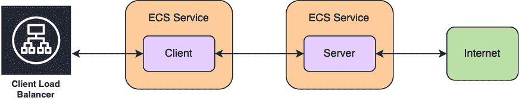
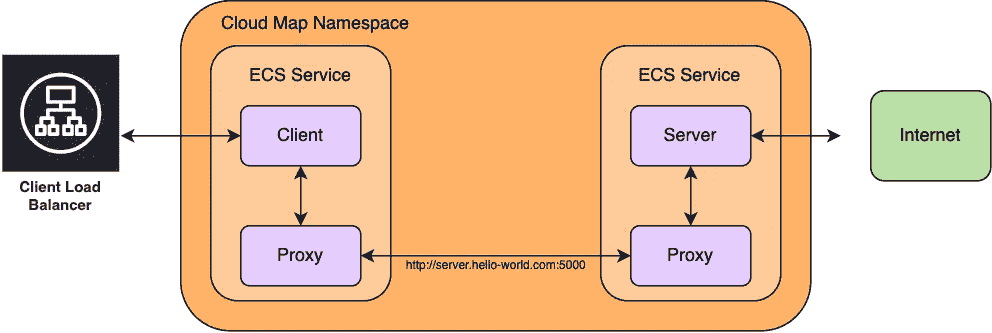

# 亚马逊 ECS 服务连接

> 原文：<https://levelup.gitconnected.com/amazon-ecs-service-connect-298680f65e9>

## AWS 中的托管服务发现和网格配置

于 2015 年 4 月正式推出的[弹性容器服务](https://aws.amazon.com/ecs/) (ECS)是一个受欢迎的[亚马逊网络服务](https://aws.amazon.com/) (AWS)解决方案，用于在云中托管基于容器的应用程序。当我们大规模供应集装箱化系统时，我们创建的基础设施可能会快速增长，以包括许多[服务](https://docs.aws.amazon.com/AmazonECS/latest/developerguide/ecs_services.html)、[负载平衡器](https://aws.amazon.com/elasticloadbalancing/)和 [DNS 记录](https://docs.aws.amazon.com/Route53/latest/DeveloperGuide/rrsets-working-with.html)。

约翰·巴克利普通过 Unsplash 拍摄的照片

在这种服务/负载平衡器/ DNS 记录模式下，每个新服务都会导致成本增加。[通过](https://docs.aws.amazon.com/AmazonECS/latest/developerguide/service-discovery.html) [AWS 云地图](https://aws.amazon.com/cloud-map/)的服务发现消除了我们创建弹性负载平衡器的需要，而是要求我们提供[云地图服务](https://docs.aws.amazon.com/cloud-map/latest/dg/working-with-services.html)。

最近，ECS 推出了 [Service Connect](https://docs.aws.amazon.com/AmazonECS/latest/developerguide/service-connect.html) :一种新的互连方法，除了服务网格配置之外，还提供完全托管的服务发现。以前我们可能依赖 [AWS App Mesh](https://aws.amazon.com/app-mesh/) 进行标准化的服务对服务通信，现在我们可以采用 Service Connect 来减少我们的基础设施，并完全从 ECS 管理服务发现和 Mesh 配置。

# 服务连接是如何工作的？

假设我们有一个 ECS 应用程序(“客户机”)通过一个弹性负载均衡器接收来自互联网的请求。客户端希望从另一个 ECS 应用程序(“服务器”)请求信息，该应用程序本身从互联网获取信息。我们有流入客户端的流量、客户端和服务器之间的通信以及来自服务器的流出流量。

作者图表

Service Connect 特别支持单个[云地图名称空间](https://docs.aws.amazon.com/cloud-map/latest/dg/working-with-namespaces.html)内的服务对服务通信。虽然它不支持入口和出口配置，但我们可以对客户端和服务器之间的流量采用 Service Connect，只要我们将它们分配到同一个名称空间。服务连接分别将它们称为**客户端**和**客户端-服务器**服务:我们的客户端将只向服务连接端点发送流量，而我们的服务器(“客户端-服务器”)公开一个服务连接端点供请求使用。如果需要，服务器还可以向其他服务连接端点发送流量。

对于服务发现，每个服务连接应用程序都需要一个代理容器。当应用程序部署到 ECS 时，代理容器会自动配置，并在云地图命名空间中搜索活动端点。这仅在托管我们的应用程序的 [ECS 任务](https://docs.aws.amazon.com/AmazonECS/latest/developerguide/task_definitions.html)首次启动时发生，因此之后创建的任何其他服务连接端点都不会被发现，除非应用程序任务再次启动。

这种行为意味着我们部署 Service Connect 服务的顺序很重要:客户端希望向服务器端点发送流量，因此服务器必须在客户端之前启动，否则客户端的代理将无法识别服务器的 Service Connect 端点。

当我们启动服务器时，我们为应用程序的容器端口定义一个端口映射名称。我们可以在我们的服务连接配置中指定这个映射，使它能够被客户端发现。在这个例子中，假设我们在端口 5000 上运行服务器应用程序，端口映射名为`server`。

在我们的客户端代码中，假设我们配置了名称空间`hello-world.com`中的所有内容，我们可以向`[http://server.hello-world.com:5000](http://hello-world-server:5000.)`发送服务器请求。客户机代理容器将在端点`server`启动时检测它(在服务器之后),并知道将这些请求路由到相应的服务器代理容器。实现这一目标的所有底层代理和服务网格配置都完全由 ECS 管理。

作者图表

通过采用 Service Connect，我们不再需要为每个 ECS 应用程序调配我们自己的负载平衡器或云服务，Service Connect 会自动为我们管理负载平衡、超时和流量重试。这减少了我们所需的配置和基础设施的数量。

# 服务连接的限制和成本是什么？

《开发人员指南》中记录了 Service Connect 的价格[。与服务发现类似，我们对](https://docs.aws.amazon.com/AmazonECS/latest/developerguide/service-discovery.html#service-discovery-pricing) [Route53](https://aws.amazon.com/route53/) 内的 DNS 资源以及云图 API 操作收费。默认的容器级健康检查是免费执行的。

虽然 Service Connect 听起来很适合上面的例子，但是对于这个功能有几个限制需要记住。AWS [在他们的开发人员指南中记录了一个全面的概念和考虑事项的列表](https://docs.aws.amazon.com/AmazonECS/latest/developerguide/service-discovery.html#service-discovery-considerations)，值得进一步详细阅读。举几个关键点:

*   服务连接仅适用于 ECS 服务到服务的流量，
*   服务必须部署在相同的云地图命名空间中，并且
*   服务连接不支持 Windows 容器。

# 我们如何配置服务连接？

在撰写本文时应用最新版本的 AWS 云开发工具包(CDK )( v 2 . 55 . 1 ),让我们浏览一下 ECS Service Connect 所需的不同配置。

首先从 [ECS 集群](https://docs.aws.amazon.com/AmazonECS/latest/developerguide/clusters.html)开始，我们可以设置`defaultCloudMapNamespace`来指定服务连接名称空间的名称。命名空间`hello-world.com`将作为我们 CloudFormation 堆栈的一部分，在集群旁边自动为我们创建。

当集群被提供时，我们可以为服务连接名称空间创建客户机和客户机-服务器服务。首先从一个客户端开始，我们可以用我们的云地图名称空间的名称来设置属性`serviceConnectConfiguration`。相同的配置适用于 EC2 和 Fargate 服务。

对于客户机-服务器服务，我们还需要设置端点名称供客户机发现。这需要额外的`serviceConnectConfiguration`属性，通过名称指示我们希望客户端可以访问哪些容器端口映射。该设置将从容器端口映射定义中推断出正确的端口，在本例中为`5000`。

在我们的客户机中，我们可以编写一个小脚本，向我们新配置的服务连接客户机-服务器提交请求。基于上面配置的端口映射，我们可以向`[http://server.hello-world.com:5000](http://server:5000.)`发送请求。

请注意，Service Connect 的云地图名称空间确实需要很短的时间来提供，并且还需要一点时间来取消服务注册。因此，最好在独立的 CDK /云架构堆栈中配置任何集群和名称空间，以便与 Service Connect 服务分开部署。

# 进一步阅读

感谢您花时间阅读这篇博文。很高兴能更深入地探索在 AWS 2022[re:Invent](https://reinvent.awsevents.com/)之后推出的最新 ECS 功能。事实证明，以下链接对这篇博文非常有价值，可以作为有用的进一步阅读参考:

*   [服务连接的开发者指南](https://docs.aws.amazon.com/AmazonECS/latest/developerguide/service-connect.html)
*   [AWS 新闻博客文章](https://aws.amazon.com/blogs/aws/new-amazon-ecs-service-connect-enabling-easy-communication-between-microservices/)宣布服务连接
*   [云信息](https://docs.aws.amazon.com/AWSCloudFormation/latest/UserGuide/aws-properties-ecs-service-serviceconnectconfiguration.html)和 [CDK](https://docs.aws.amazon.com/cdk/api/v2/docs/aws-cdk-lib.aws_ecs.ServiceConnectProps.html) 的服务连接配置
*   [ECS 互连方法的用户指南](https://docs.aws.amazon.com/AmazonECS/latest/userguide/interconnecting-services.html)(如 App Mesh)

如果您有使用 ECS Service Connect 的直接经验，请告诉我们您对这项新功能的想法。否则，如果您正在使用 App Mesh 等其他互连方法，了解 Service Connect 是否可以简化您的解决方案将是一件好事。