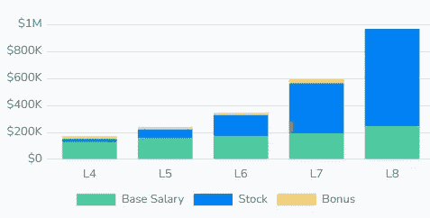

# 亚马逊软件工程师面试手册(2023)

> 原文：<https://levelup.gitconnected.com/amazon-software-engineer-interview-handbook-2022-fe64e7ad35a2>

了解一下 2023 年在亚马逊面试软件工程师是什么感觉。

在这本全面的手册中，你会发现在亚马逊面试过程中到底会发生什么。你还可以找到如何回答一些最常见的亚马逊问题的细节。

让我们让你的面试更上一层楼吧！

# 亚马逊在美国的薪酬结构

以下是亚马逊在美国软件工程师的平均工资:

*   SDE 一号(L4): 17 万英镑
*   SDE 二世(L5): 239K
*   SDE 三世(L6):34.5 万英镑

亚马逊工资(参考:levels.fyi)

# 亚马逊面试流程

以下是在亚马逊面试软件工程师时会遇到的情况:

**➡** **招聘人员电话筛选** —根据简历、背景和团队契合度进行初步筛选。

**➡1–2 在线评估** —算法和编码问题。

**➡技术电话面试**——你将与招聘经理面对面或通过电话进行面试，招聘经理将是你的直接经理。你会被问到一两个与数据结构和算法相关的编码问题。简历中的一些问题。

**➡现场循环(5-6 次面试)** —算法、系统设计或面向对象设计、行为问题。

*   算法——在白板上解决编码问题。
*   设计——初级工程师将被问到面向对象的设计问题，而高级工程师将被问到系统设计问题。
*   与亚马逊领导原则相关的行为问题。

**➡调酒者面试**——调酒者是一个有技巧的面试官，在招聘过程中扮演中立的第三方。期待与亚马逊领导原则相关的编码、设计和行为问题。

# 面试技巧

1.  **数据结构** —练习常见的数据结构，如数组、字符串、哈希表、树、链表、堆栈和队列。理解这些数据结构的内部工作原理。您应该知道常见操作的运行时以及它们如何使用内存。
2.  **算法** —练习分而治之、广度优先搜索与深度优先搜索以及遍历算法。
3.  **编码** —候选人应该写出语法正确的代码。
4.  **亚马逊的领导原则—**[https://www.amazon.jobs/en/principles](https://www.amazon.jobs/en/principles)

# 最近亚马逊在 LeetCode 上标记的热门编码问题

## 1.最大的岛(易)— LC (695)

[钻研编码面试](https://designgurus.org/path-player?courseid=grokking-the-coding-interview&unit=grokking-the-coding-interview_62d53be009288Unit)

**语句:**给定一个只包含`1` s(陆地)和`0` s(水)的 2D 数组(即矩阵)，找出其中最大的岛屿。写一个函数返回最大岛屿的面积。

岛屿是一组相连的`1` s(陆地)并且被一条边或者`0` s(水)包围。每个单元都被视为水平或垂直(非对角)连接到其他单元。

## 2.k '到原点的最近点(容易)— LC (973)

[钻研编码面试](https://designgurus.org/path-player?courseid=grokking-the-coding-interview&unit=grokking-the-coding-interview_1628744290707_95Unit)

**语句:**给定 2D 平面中的一组点，找出离原点最近的“K”个点。

## 3.二叉树的右视图(简单)— LC (199)

[寻找编码面试](https://designgurus.org/path-player?courseid=grokking-the-coding-interview&unit=grokking-the-coding-interview_1628743902403_52Unit)

**语句:**给定一棵二叉树，返回其右视图中包含节点的数组。二叉树的右视图是从右侧看树时可见的一组**节点。**

## 4.岛屿数量(中等)— LC (200)

[钻研编码面试](https://designgurus.org/path-player?courseid=grokking-the-coding-interview&unit=grokking-the-coding-interview_1654828199398_262Unit)

**语句:**给定一个只包含`1` s(陆地)和`0` s(水)的 2D 数组(即矩阵)，统计其中岛屿的个数。

一个**岛**是一组连接的`1` s(陆地)并且被一条边或者`0` s(水)包围。每个单元都被视为水平或垂直(非对角)连接到其他单元。

## 5.合并“K”个排序列表(中等) **— LC (23)**

[钻研编码面试](https://designgurus.org/path-player?courseid=grokking-the-coding-interview&unit=grokking-the-coding-interview_1628744411540_108Unit)

**语句:**给定一个 K 个排序链表的数组，将它们合并成一个排序链表。

## 6.任务调度(中型)— LC (207)

[钻研编码面试](https://designgurus.org/path-player?courseid=grokking-the-coding-interview&unit=grokking-the-coding-interview_1628744536717_122Unit)

**语句:**有‘N’个任务，从‘0’到‘N-1’标记。每个任务都可以有一些先决任务，需要在调度之前完成这些任务。给定任务的数量和先决条件对的列表，找出是否有可能调度所有的任务。

## 7.合并间隔(中等)—液相色谱(56)

[钻研编码面试](https://designgurus.org/path-player?courseid=grokking-the-coding-interview&unit=grokking-the-coding-interview_1628743622133_21Unit)

**语句:**给定一个区间列表，合并所有重叠的区间，产生一个只有互斥区间的列表。

## 8.之字形遍历(中)— LC (103)

[钻研编码面试](https://designgurus.org/path-player?courseid=grokking-the-coding-interview&unit=grokking-the-coding-interview_1628743859019_46Unit)

**语句:**给定一棵二叉树，填充一个数组来表示它的锯齿形层次顺序遍历。您应该从左到右填充第一个级别的所有节点的值，然后从右到左填充下一个级别的值，并以相同的方式交替填充后面的级别。

## 9.最少会议室(硬)-LC(252)

[钻研编码面试](https://designgurus.org/path-player?courseid=grokking-the-coding-interview&unit=grokking-the-coding-interview_1628743654901_25Unit)

**语句:**给定代表“N”次会议开始和结束时间的间隔列表，找出召开所有会议所需的最少房间数。

## 10.外星人字典(硬)-LC(269)

[寻找编码面试](https://designgurus.org/path-player?courseid=grokking-the-coding-interview&unit=grokking-the-coding-interview_1628744560693_125Unit)

**陈述:**有一本词典收录了来自外星语言的单词，我们不知道这些单词的字母顺序。写一个方法找出外语中字母的正确顺序。假设输入是一个有效的字典，并且其字母之间存在排序。

# 参考

*   [14 个最受欢迎的亚马逊编码面试问题](https://designgurus.org/blog/amazon-14-question)
*   [钻研编码面试](https://designgurus.org/course/grokking-the-coding-interview)
*   [探寻面向对象设计面试](https://designgurus.org/course/grokking-the-object-oriented-design-interview)
*   [钻研系统设计面试](https://designgurus.org/course/grokking-the-system-design-interview)
*   [在亚马逊面试](https://www.amazon.jobs/en/landing_pages/interviewing-at-amazon)
*   [亚马逊的领导原则](https://www.amazon.jobs/en/principles)

 [## 系统设计面试生存指南(2023):准备策略和实用技巧

### 2023 年系统设计面试剧本。

levelup.gitconnected.com](/system-design-interview-survival-guide-2023-preparation-strategies-and-practical-tips-ba9314e6b9e3) 

# 感谢阅读

*   👏请为这个故事鼓掌，然后跟我来👉
*   📰查看更多关于[编码和系统设计访谈的内容](https://designgurus.org/blog)
*   🔔关注我:[LinkedIn](https://www.linkedin.com/in/arslanahmad/)|[Twitter](https://twitter.com/arslan_ah)|[时事通讯](https://designgurus.org/interview-noodle-page)