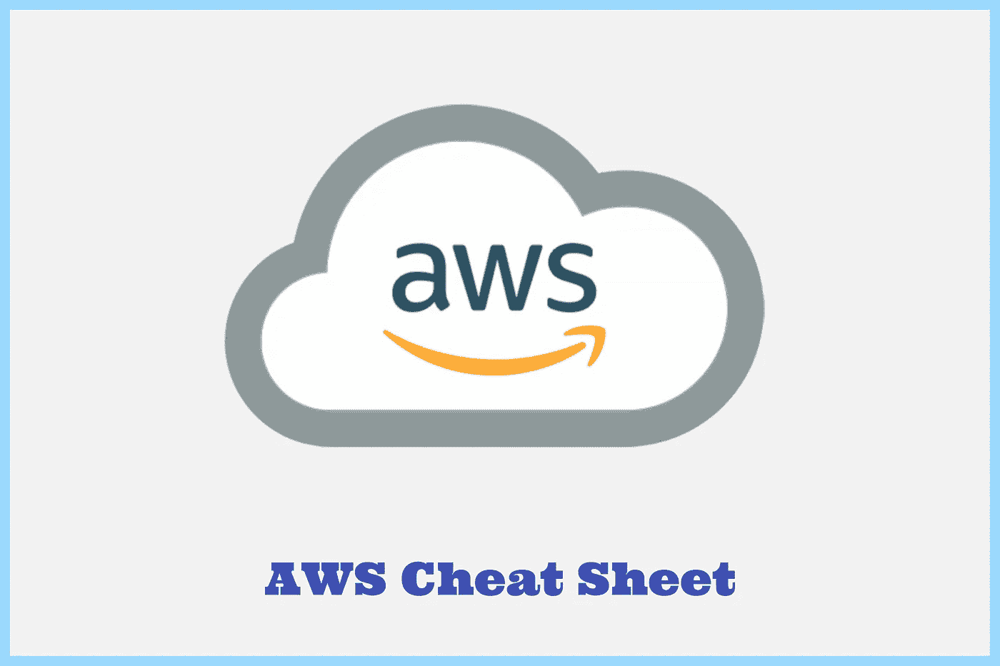

# 亚马逊网络服务(AWS)备忘单

> 原文：<https://levelup.gitconnected.com/amazon-web-services-aws-cheat-sheet-f1bddd736d0a>

**云计算**是一种基于互联网的存储和访问数据的计算服务。它不会在硬盘或本地存储设备上存储任何数据。它将它们保存到远程数据库中。

# 什么是 AWS？

[亚马逊网络服务](https://aws.amazon.com/)是一个在线平台，提供灵活、可靠、可扩展、易于使用且经济高效的云计算解决方案。产品包括存储、数据库、分析、网络、移动、开发工具、机器学习、企业应用、人工智能，采用现收现付的定价模式。

# 目录

*   [分析学](#9267)
*   [应用集成](#02fc)
*   [区块链](#a4c2)
*   [业务应用](#5e72)
*   [云财务管理](#0afe)
*   [计算](#cfb9)
*   [联络中心](#92d0)
*   [集装箱](#b425)
*   [数据库](#fcf9)
*   [开发者工具](#84c7)
*   [最终用户计算](#8375)
*   [前端 Web &移动](#10f0)
*   [游戏技术](#ec53)
*   [物联网](#b8d2)
*   [机器学习](#8761)
*   [管理&治理](#47c8)
*   [媒体服务](#b206)
*   [迁移&转移](#138e)
*   [联网&内容交付](#2bd3)
*   [量子技术](#0f36)
*   [机器人学](#6d07)
*   [卫星](#f39b)
*   [安全、身份、&合规](#3280)
*   [无服务器](#0848)
*   [储存](#830a)
*   [VR & AR](#c615)

# 分析学

*用例:数据仓库、大数据处理、实时分析、运营分析*

a. [**亚马逊雅典娜**](https://aws.amazon.com/athena/) —无服务器交互式查询服务，使用标准 SQL 轻松分析亚马逊 S3 的数据。您只需为运行的查询付费。

Athena 帮助您分析存储在亚马逊 S3 的非结构化、半结构化和结构化数据。示例包括 CSV、JSON 或列数据格式，如 Apache Parquet 和 Apache ORC。您可以使用 Athena 通过 ANSI SQL 运行即席查询，而无需将数据聚合或加载到 Athena 中。

b.[**Amazon cloud search**](https://aws.amazon.com/cloudsearch)**—**可扩展且完全托管的服务，让您能够简单且经济高效地为您的网站或应用程序设置、管理和扩展搜索解决方案。

Amazon CloudSearch 提供了几个优于运行自己的自我管理搜索服务的好处，包括易于配置、数据和流量的自动扩展、自我修复集群以及 Multi-AZ 的高可用性。只需在 AWS 管理控制台中点击几下，您就可以创建一个搜索域并上传您想要搜索的数据，Amazon CloudSearch 会自动提供所需的资源并部署高度优化的搜索索引。

c. [**亚马逊弹性搜索服务**](https://aws.amazon.com/elasticsearch-service/) —完全托管的服务，使在 AWS 云中部署、操作和扩展弹性搜索集群变得容易。Elasticsearch 是一个流行的开源搜索和分析引擎，用于日志分析、实时应用程序监控和点击流分析等用例。

*使用案例:应用监控、安全信息和事件管理、搜索、基础设施监控*

d. [**亚马逊 EMR**](https://aws.amazon.com/emr)**(Elastic Map Reduce)——**托管集群平台，简化在 AWS 上运行大数据框架，如 Apache Hadoop 和 Apache Spark，以处理和分析海量数据。这使得设置、操作和扩展您的大数据环境变得非常容易，方法是自动执行诸如配置容量和调整集群等耗时的任务。

*用例:机器学习、ETL(提取、转换、加载)、点击流分析、实时流、交互式分析、基因组学*

e. [**亚马逊 FinSpace**](https://aws.amazon.com/finspace/) **—** 完全托管的数据管理和分析服务，可轻松存储、编目和准备大规模金融行业数据，将金融服务行业(FSI)客户查找和访问所有类型的金融数据以进行分析所需的时间从几个月缩短到几分钟。

f.[**Amazon kine sis**](https://aws.amazon.com/kinesis/)**—**实时云分析引擎，可轻松收集、处理和分析实时流数据，以便您获得及时的见解并对新信息做出快速反应。

*用例:构建视频分析应用，从批量分析发展到实时分析，构建实时应用，分析物联网设备数据*

g.[**Amazon Managed Streaming for Apache Kafka**](https://aws.amazon.com/msk/)**—**完全托管的服务，使您能够构建和运行使用 Apache Kafka 处理流数据的应用程序。Apache Kafka 是一个用于构建实时流数据管道和应用程序的开源平台。

h. [**亚马逊红移**](https://aws.amazon.com/redshift) **—** 完全托管的 Pb 级数据仓库服务，您可以在其中分析数据集，并敏捷快速地运行数十亿行。

*用例:商业智能、事件运营分析、数据即服务、预测分析*

i. [**亚马逊 Quicksight**](https://aws.amazon.com/quicksight/) **—** 可扩展、无服务器、可嵌入、机器学习驱动的商业智能服务，您可以使用它向您的同事提供易于理解的见解，无论他们身在何处。

*用例:操作数据库、数据仓库、数据湖*

j. [**AWS 数据交换**](https://aws.amazon.com/data-exchange/) **—** 一种服务，可以轻松安全地在 AWS 云中交换基于文件的数据集。

*用例:金融服务、消费&零售、医疗保健&生命科学*

k. [**AWS 数据管道**](https://aws.amazon.com/datapipeline/)**——**可以用来自动化数据移动和转换的 Web 服务。您可以轻松创建容错、可重复和高度可用的复杂数据处理工作负载。

长度[**AWS Glue**](https://aws.amazon.com/glue)**—**完全托管的无服务器 ETL(提取、转换和加载)服务，使数据分类、清理、丰富以及在各种数据存储和数据流之间可靠地移动变得简单且经济高效。

*用例:构建事件驱动的 ETL 管道，创建统一的目录以在多个数据存储中查找数据，无需编码即可创建、运行和监控 ETL 作业，通过自助式可视化数据准备探索数据*

米（meter 的缩写））[**AWS Lake Formation**](https://aws.amazon.com/lake-formation)**—**全面托管服务，让您更轻松地构建、保护和管理数据湖。数据湖是一个集中的、有管理的、安全的存储所有数据的仓库。

# 应用集成

a. [**AWS 步骤功能**](https://aws.amazon.com/step-functions/) **—** 无服务器编排服务，让您将 AWS Lambda 功能和其他 AWS 服务结合起来，构建业务关键型应用程序。

*用例:自动化提取、转换和加载(ETL)过程，为机器学习(ML)准备数据，编排微服务*

b. [**亚马逊 AppFlow**](https://aws.amazon.com/appflow/) **—** 完全托管的集成服务，使您能够在软件即服务(SaaS)应用程序(如 Salesforce、Zendesk、Slack)和 AWS 服务(如亚马逊简单存储服务(S3)和亚马逊红移)之间安全地交换数据。

*使用案例:Customer 360，数据丰富，创建基于事件的工作流，存储或同步 Salesforce 数据，自动化数据备份，定期分析闲置事件*

c.[**Amazon event bridge**](https://aws.amazon.com/eventbridge/)**——**无服务器事件总线服务，您可以使用它将您的应用程序与各种来源的数据连接起来。EventBridge 将来自您的应用程序、软件即服务(SaaS)应用程序和 AWS 服务的实时数据流传送到 AWS Lambda 函数、使用 API 目的地的 HTTP 调用端点或其他 AWS 帐户中的事件总线等目标。

*用例:针对速度、监控和审计进行重新架构，通过 SaaS 集成扩展功能，使用 AI/ML 定制 SaaS*

d. [**Amazon 托管的 Apache Airflow 工作流**](https://aws.amazon.com/managed-workflows-for-apache-airflow) **—** 托管的 Apache Airflow 服务，更易于在云中大规模设置和操作端到端数据管道。Apache Airflow 是一个开源工具，用于以编程方式创作、调度和监控称为“工作流”的流程和任务序列

*用例:启用复杂的工作流，协调提取、转换和加载(ETL)作业，准备机器学习(ML)数据*

e.[**Amazon MQ**](https://aws.amazon.com/amazon-mq/)**——**Apache MQ 和 Rabbit MQ 的托管消息代理服务，可以轻松迁移到云中的消息代理。一个*消息代理*允许软件应用程序和组件使用各种编程语言、操作系统和正式的消息协议进行通信。

f.[**亚马逊简单队列服务(SQS)**](https://aws.amazon.com/sqs/) **—** 完全托管的消息队列服务，提供安全、持久、可用的托管队列，允许您集成和分离分布式软件系统和组件。使用 SQS，您可以在任意数量的软件组件之间发送、存储和接收消息，而不会丢失消息或要求其他服务可用。

g. [**亚马逊简单通知服务(SNS)**](https://aws.amazon.com/sns/) **—** 完全托管的消息服务，提供从发布者到订阅者的消息传递。

*使用案例:短信、电子邮件、移动推送通知*

h.[**AWS app sync**](https://aws.amazon.com/appsync/)**—**完全托管的服务，为应用程序开发人员提供一个健壮的、可扩展的 GraphQL 接口，以组合来自多个来源的数据，包括 Amazon DynamoDB、AWS Lambda 和 HTTP APIs。

*用例:实时协作、实时聊天应用、实时物联网仪表盘、统一微服务访问、统一数据访问、离线应用同步*

# 区块链

a. [**亚马逊托管区块链**](https://aws.amazon.com/managed-blockchain)**——**使用开源框架创建和管理网络和网络资源的全托管服务。区块链使得构建多方可以执行交易而不需要可信的中央机构的应用成为可能。

*用例:交易和资产转移、零售、供应链*

b. [**亚马逊量子账本数据库(QLDB)**](https://aws.amazon.com/qldb/)**——**完全托管的账本数据库，提供透明、不可变、可密码验证的交易日志，归中央可信机构所有。

*用例:金融、制造、保险、人力资源&工资单、零售&供应链*

# 商业应用

a.[**Amazon Connect**](https://aws.amazon.com/connect/)**——**全渠道云联络中心，帮助您以更低的成本提供卓越的客户服务。

b.[**Amazon Pinpoint**](https://aws.amazon.com/pinpoint/)**—**灵活的沟通服务，您可以使用它通过多种信息渠道与客户沟通。

*用例:营销消息、交易消息、与定制渠道的批量通信、电子邮件、短信或推送通知*

c.**生产力应用**

*   [Amazon Honeycode](https://www.honeycode.aws/?&trk=el_a134p000003yC6YAAU&trkCampaign=pac-edm-2020-honeycode-homepage&sc_channel=el&sc_campaign=pac-edm-2020-honeycode-website_links-adoption-aws_global_menu_products_link&sc_outcome=Enterprise_Digital_Marketing&sc_geo=NAMER&sc_country=mult) :不用编码就能构建应用程序来管理团队的工作
*   [亚马逊铃声](https://aws.amazon.com/chime/?nc2=h_mo):无挫败感的会议、视频通话和聊天
*   [亚马逊工作文档](https://aws.amazon.com/workdocs/?nc2=h_mo):安全的企业文档存储和共享
*   [亚马逊工作邮件](https://aws.amazon.com/workmail/?nc2=h_mo):安全电子邮件和日历
*   Alexa for Business :让您的组织拥有 Alexa

*用例:团队生产力、远程会议、文档协作*

d.**通信开发人员服务—** 一组 SDK 和 API，允许开发人员将客户通信直接嵌入到他们的应用中。

*   [Amazon Chime SDK](https://aws.amazon.com/chime/chime-sdk/?nc2=h_mo) —在您的应用中嵌入成熟的实时通信功能。
*   [亚马逊简单电子邮件服务(SES)](https://aws.amazon.com/ses/?nc2=h_mo) —大规模入站和出站云电子邮件服务
*   [Amazon Pinpoint API](https://docs.aws.amazon.com/pinpoint/latest/developerguide/welcome.html?nc2=h_mo)—通过多种信息渠道与您的客户互动。
*   [Amazon Chime 语音连接器](https://aws.amazon.com/chime/voice-connector/?nc2=h_mo) —由 AWS 支持的经济高效的 SIP 中继和高级电话功能
*   [Amazon WorkDocs SDK](https://aws.amazon.com/workdocs/sdk/?nc2=h_mo) —简化的安全内容协作

*用例:应用于个人、异步、实时通信*

# 云财务管理

a. [**AWS 成本管理器**](https://aws.amazon.com/aws-cost-management/aws-cost-explorer/?nc2=h_mo) **—** 工具，可让您查看和分析一段时间内的成本和使用情况。

b. [**AWS 预算**](https://aws.amazon.com/aws-cost-management/aws-budgets/?nc2=h_mo) **—** 帮助您跟踪 AWS 成本和使用情况并采取措施的工具，您可以选择通过电子邮件或产品升级和技术支持服务通知获得提醒。

*用例:监控、报告和响应您的 AWS 成本和使用情况*

c. [**预订实例报告**](https://aws.amazon.com/aws-cost-management/reserved-instance-reporting/?nc2=h_mo) **—** 管理和监控您的实例预订

d. [**AWS 成本和使用报告**](https://aws.amazon.com/aws-cost-management/aws-cost-and-usage-reporting/?nc2=h_mo) **—** 跟踪您的 AWS 使用情况，并提供与您的帐户相关的预计费用

# 计算

a. [**亚马逊 EC2(弹性计算云)**](https://aws.amazon.com/ec2/) —在 AWS 云中提供可扩展、安全且可调整大小的计算能力。您可以使用 Amazon EC2 启动任意多或任意少的虚拟服务器，配置安全性和网络，以及管理存储。

b. [**Amazon EC2 自动伸缩**](https://aws.amazon.com/ec2/autoscaling/)**——**通过自动添加或删除 EC2 实例，帮助您确保拥有正确数量的 Amazon EC2 实例来处理应用程序的负载。

c. [**亚马逊 light sail**](https://aws.amazon.com/lightsail/)**——**易于使用的虚拟私人服务器，为您提供构建应用程序或网站所需的一切，以及经济高效的月度计划。

*用例:简单的网络应用、网站、商业软件、开发/测试环境*

d.[**AWS App Runner**](https://aws.amazon.com/apprunner/)—完全托管的服务，提供快速、简单且经济高效的方式，从源代码或容器映像直接部署到 AWS 云中可扩展的安全 web 应用程序。

*用例:前端和后端 web 应用、微服务和 API、快速生产部署*

e. [**AWS 批处理**](https://aws.amazon.com/batch/) —帮助您在 AWS 云上运行批处理计算工作负载。批处理计算是开发人员、科学家和工程师访问大量计算资源的常用方式。

*用例:金融服务的交易后分析、生物制药的药物筛选、视觉效果渲染*

f.[**AWS Elastic Beanstalk**](https://aws.amazon.com/elasticbeanstalk/)**——**易于使用的服务，用于部署和扩展用 Java 开发的 web 应用程序和服务。NET、PHP、Node.js、Python、Ruby、Go、Docker 在 Apache、Nginx、Passenger、IIS 等熟悉的服务器上。

g.[**AWS Lambda**](https://aws.amazon.com/lambda/)**—**无服务器计算服务，让您无需配置或管理服务器即可运行代码。Lambda 只在需要的时候运行你的函数，并且自动伸缩，从每天几个请求到每秒几千个请求。您只需为您所消耗的计算时间付费，当您的代码不运行时，不收取任何费用。

*用例:数据处理、实时文件处理、实时流处理、机器学习、web 应用的无服务器后端、物联网、移动应用*

h. [**AWS 前哨**](https://aws.amazon.com/outposts/) **—** 将 AWS 基础设施、服务、API 和工具扩展到客户场所的完全托管服务。

*用例:制造自动化、医疗保健、电信、媒体&娱乐、金融服务、在线游戏和游戏流媒体*

一、 [**AWS 无服务器应用库**](https://aws.amazon.com/serverless/serverlessrepo/) **—** 无服务器应用的托管库。您可以在无服务器架构中使用无服务器应用程序存储库中的预构建应用程序，帮助您和您的团队减少重复工作，确保组织最佳实践，并更快地进入市场。

j. [**AWS 雪族**](https://aws.amazon.com/snow/)**——**高度安全的便携式设备，在边缘收集和处理数据，并将数据迁移到 AWS 云中或从 AWS 云中迁移出来。

*   [AWS Snowcone](https://aws.amazon.com/snowcone) :使用 Snowcone 将数据移动到 AWS，或者通过运输设备离线，或者通过 AWS 数据同步在线。
*   [AWS 雪球](https://aws.amazon.com/snowball/):具有板载存储和计算能力的 Pb 级数据传输
*   [AWS Snowmobile](https://aws.amazon.com/snowmobile/) :将 EB 级的数据集迁移到 AWS 或从 AWS 中移出

k. [**AWS 波长**](https://aws.amazon.com/wavelength/) **—** 构建向移动设备和最终用户提供超低延迟的应用。Wavelength 将标准 AWS 计算和存储服务部署到电信运营商的 5G 网络边缘。

*用例:联网汽车、交互式实时视频流、AR/VR、智能工厂、实时游戏、医疗保健的人工智能辅助诊断*

长度[**AWS 上的 VMware 云**](https://aws.amazon.com/vmware) **—** 这将 VMWare 的企业级 SDDC 软件引入 AWS 云，优化了对本机 AWS 服务的访问。

# 联络中心

a.[**Amazon Connect**](https://aws.amazon.com/connect/)**——**全渠道云联络中心，帮助您以更低的成本提供卓越的客户服务。

# 容器

a.[**Amazon Elastic Container Registry**](https://aws.amazon.com/ecr/)**——**完全托管的容器注册表使您可以轻松地在任何地方存储、管理、共享和部署您的容器映像和工件。

b. [**亚马逊弹性容器服务(ECS)**](https://aws.amazon.com/ecs/) **—** 完全托管的容器编排服务，可以轻松运行、停止和管理集群上的容器。

c.[**Amazon ECS Anywhere**](https://aws.amazon.com/ecs/anywhere/)**—**Amazon ECS 的一项功能，支持您在客户托管的基础设施上轻松运行和管理容器工作负载。

d. [**亚马逊弹性 Kubernetes 服务(EKS)**](https://aws.amazon.com/eks/)**——**托管服务，您可以使用它在 AWS 上运行 Kubernetes，而无需安装、操作和维护您自己的 Kubernetes 控制平面或节点。

*用例:混合部署、机器学习、批处理、Web 应用、大数据*

e. [**亚马逊 EKS Anywhere**](https://aws.amazon.com/eks/eks-anywhere/)**—**亚马逊 EKS 的一项功能，使您能够轻松地在本地创建和操作 Kubernetes 集群。

*用例:在云中训练模型并在本地运行推理、工作负载迁移(本地到云)、应用程序现代化、数据主权、突发*

f. [**亚马逊 EKS 发行版**](https://aws.amazon.com/eks/eks-distro/)**——**亚马逊 EKS 使用的 Kubernetes 发行版，帮助创建可靠和安全的集群。您可以将 EKS 发行版部署到您的应用程序需要运行的任何地方。

g.[**AWS App 2 container**](https://aws.amazon.com/app2container/)**—**一个命令行工具，帮助您提升和转移在您的内部数据中心或虚拟机上运行的应用程序，以便它们在由亚马逊 ECS、亚马逊 EKS 或 AWS App Runner 管理的容器中运行。

h.[**AWS App Runner**](https://aws.amazon.com/apprunner/)—完全托管的服务，提供快速、简单且经济高效的方式，从源代码或容器映像直接部署到 AWS 云中可扩展的安全 web 应用程序。

*用例:前端和后端 web 应用、微服务和 API、快速生产部署*

一.**[**AWS Copilot**](https://aws.amazon.com/containers/copilot/)**—**一个命令行界面(CLI)，使客户能够快速启动并轻松管理 AWS 上的容器化应用。**

**j.[**AWS Fargate**](https://aws.amazon.com/fargate/)**—**用于容器的无服务器计算引擎，可与[亚马逊弹性容器服务(ECS)](https://aws.amazon.com/ecs/) 和[亚马逊弹性 Kubernetes 服务(EKS)](https://aws.amazon.com/eks/) 一起工作。有了 Fargate，您不再需要供应、配置或扩展虚拟机集群来运行容器。**

**k.[**AWS 上的 Red Hat OpenShift 服务**](https://aws.amazon.com/rosa/)**——**帮助 Red Hat OpenShift 用户在 AWS 上构建、扩展和管理容器化应用的托管服务。**

# **数据库ˌ资料库**

**a. [**亚马逊极光**](https://aws.amazon.com/rds/aurora)**——**兼容 MySQL 和 PostgreSQL 的全托管关系数据库引擎。Amazon Aurora 比标准 MySQL 数据库快 5 倍，比标准 PostgreSQL 数据库快 3 倍。**

***使用案例:企业应用、软件即服务(SaaS)应用、网络和移动游戏***

**b. [**亚马逊极光无服务器 V2**](https://aws.amazon.com/rds/aurora/serverless/) **—** 亚马逊极光的按需、自动扩展配置。它会自动启动、关闭，并根据您的应用需求增加或减少容量。它使您能够在云中运行数据库，而无需管理任何数据库容量。**

**c. [**Amazon DocumentDB(与 MongoDB 兼容)**](https://aws.amazon.com/documentdb/)**——**快速、可靠、完全托管的数据库服务，使在云中设置、操作和扩展与 MongoDB 兼容的数据库变得容易。**

***使用案例:内容和目录管理、档案管理、移动和网络应用***

**d.[**Amazon dynamo db**](https://aws.amazon.com/dynamodb/)—全面管理、多区域、多活动、持久的 NoSQL 数据库服务，提供快速、可预测的性能和无缝的可扩展性。它是一个键值和文档数据库，在任何规模下都能提供一位数的毫秒级性能。**

***用例:广告技术、游戏、零售、银行和金融、媒体和娱乐、软件和互联网***

**e. [**亚马逊 ElastiCache**](https://aws.amazon.com/elasticache/)——一种 web 服务，可以更容易地在云中设置、操作和扩展分布式缓存。这与 Redis 和 Memcached 兼容。**

***用例:减轻后端数据库负载、简化数据访问、构建会话存储***

**f. [**Amazon Keyspaces(针对 Apache Cassandra)**](https://aws.amazon.com/keyspaces/)**—**一个可伸缩、高度可用、可管理的 Apache Cassandra 兼容数据库服务。有了 Amazon Keyspaces，您不必供应、修补或管理服务器，也不必安装、维护或操作软件。Apache Cassandra 是一个开源的宽列数据存储，旨在处理大量数据。**

***用例:构建要求低延迟的应用程序，使用开源技术构建应用程序，将您的 Cassandra 工作负载迁移到云中，为应用程序存储数据***

**g.[**Amazon Neptune**](https://aws.amazon.com/neptune/)**—**一种快速、可靠、完全托管的图形数据库服务，可以轻松构建和运行处理高度关联数据集的应用程序。**

**用例:知识图、身份图、欺诈检测、推荐引擎、社交网络、网络/ IT 运营、生命科学**

**h. [**亚马逊量子账本数据库(QLDB)**](https://aws.amazon.com/qldb/) **—** 完全托管的账本数据库，提供由中央可信机构拥有的透明、不可变、可密码验证的交易日志。**

***用例:金融、制造、保险、人力资源&工资单、零售&供应链***

**I .[**Amazon RDS**](https://aws.amazon.com/rds/)—一种 web 服务，使在 AWS 云中建立、操作和扩展关系数据库变得更加容易。它为行业标准的关系数据库提供了经济高效、可调整大小的容量，并管理常见的数据库管理任务。**

***使用案例:网络和移动应用、电子商务应用、移动和在线游戏***

**j. [**基于 VMware 的亚马逊 RDS**](https://aws.amazon.com/rds/vmware/)**—**在内部 VMware 环境中部署亚马逊 RDS 管理的数据库。**

**k. [**亚马逊红移**](https://aws.amazon.com/redshift) **—** 完全托管的 Pb 级数据仓库服务，您可以在其中分析数据集，并敏捷快速地运行数十亿行。**

***用例:商业智能、事件运营分析、数据即服务、预测分析***

**长度 [**亚马逊时间流**](https://aws.amazon.com/timestream/) **—** 一种面向物联网和运营应用的快速、可扩展、无服务器的时间序列数据库服务，可以轻松存储和分析每天数万亿次的事件，速度快 1000 倍，成本仅为关系数据库的 1/10。**

***用例:物联网应用、开发运维应用、分析应用***

**米（meter 的缩写）） [**AWS 数据库迁移服务**](https://aws.amazon.com/dms/) **—** 在最短的停机时间内将您的数据库迁移到 AWS。**

***用例:同构数据库迁移、异构数据库迁移、开发和测试、数据库整合、连续数据复制***

**名词（noun 的缩写）[**AWS Glue**](https://aws.amazon.com/glue)**——**完全托管的无服务器 ETL(提取、转换和加载)服务，使您的数据分类、清理、丰富以及在各种数据存储和数据流之间可靠地移动变得简单且经济高效。**

***使用案例:构建事件驱动的 ETL 管道，创建统一的目录以在多个数据存储中查找数据，无需编码即可创建、运行和监控 ETL 作业，通过自助式可视化数据准备探索数据***

# **开发者工具**

**a. [**亚马逊代码大师**](https://aws.amazon.com/codeguru/) —提供智能建议，以提高代码质量，并确定应用程序最昂贵的代码行。**

**b.[**Amazon Corretto**](https://aws.amazon.com/corretto/)**—**开放式 Java 开发套件的无成本、多平台、生产就绪分发版。使用 Corretto，您可以在流行的操作系统上开发和运行 Java 应用程序，包括 Linux、Windows 和 macOS。**

**c.[**AWS Cloud Development Kit**](https://aws.amazon.com/cdk/)**—**一个软件开发框架，用于在代码中定义基础设施，并通过 AWS CloudFormation 对其进行配置。**

**d.[**AWS cloud 9**](https://aws.amazon.com/cloud9/)**—**集成开发环境(IDE)，提供丰富的代码编辑体验，支持多种编程语言和运行时调试器，以及内置终端。**

**e.[**AWS cloud Shell**](https://aws.amazon.com/cloudshell/)**——**一个基于浏览器的 shell，让您轻松安全地管理、探索 AWS 资源并与之交互。**

**f.[**AWS code artifact**](https://aws.amazon.com/codeartifact/)**—**完全托管的工件存储库服务，便于组织安全地存储和共享用于应用程序开发的软件包。**

**g.[**AWS code build**](https://aws.amazon.com/codebuild/)**—**完全托管的持续集成服务，可编译源代码、运行测试并生成可随时部署的软件包。**

**h.[**AWS code commit**](https://aws.amazon.com/codecommit/)**—**一种安全、高度可伸缩的托管源代码控制服务，托管私有 Git 存储库。**

**I .[**AWS code deploy**](https://aws.amazon.com/codedeploy/)—完全托管的部署服务，可自动将软件部署到各种计算服务，如 Amazon EC2、AWS Fargate、AWS Lambda 和您的本地服务器。**

**j.[**AWS code pipeline**](https://aws.amazon.com/codepipeline/)**—**全面管理的持续交付服务，帮助您自动化发布管道，实现快速可靠的应用和基础架构更新。**

**k.[**AWS CodeStar**](https://aws.amazon.com/codestar/)**—**使用统一的用户界面在 AWS 上快速开发、构建和部署应用程序。**

**长度 [**AWS 命令行界面**](https://aws.amazon.com/cli/)**——**从命令行管理您的 AWS 服务的统一工具。**

**米（meter 的缩写））[**AWS Device Farm**](https://aws.amazon.com/device-farm/)**—**一种应用程序测试服务，让您通过在广泛的桌面浏览器和真实移动设备上测试来提高 web 和移动应用程序的质量；而不必供应和管理任何测试基础设施。**

**名词（noun 的缩写） [**AWS 故障注入模拟器**](https://aws.amazon.com/fis/) **—** 完全托管的服务，用于在 AWS 上运行故障注入实验，从而更轻松地提高应用程序的性能、可观察性和弹性。**

**o. [**AWS 工具和 SDK**](https://aws.amazon.com/getting-started/tools-sdks/?nc2=h_mo)**—**使用您喜欢的开发语言或平台访问和管理 AWS 服务**

**页（page 的缩写）[**AWS X-Ray**](https://aws.amazon.com/xray/)**—**帮助开发者分析和调试生产、分布式应用，比如那些使用微服务架构构建的应用。**

# **最终用户计算**

**a. [**亚马逊工作区**](https://aws.amazon.com/workspaces) **—** 完全托管的持久桌面虚拟化服务，使您的用户能够随时随地从任何支持的设备访问他们需要的数据、应用和资源。**

***使用案例:临时员工、远程工作、并购、联络中心代理***

**b.[**Amazon AppStream 2.0**](https://aws.amazon.com/appstream2)—完全托管的非持久性桌面和应用虚拟化服务，允许您的用户随时随地从任何支持的设备安全地访问他们需要的数据、应用和资源。**

***用例:联络中心代理、在线试用、演示、培训、远程学生和实验室、3D 设计和工程***

**c.[**Amazon work link**](https://aws.amazon.com/worklink/)**—**完全托管的服务，让您的员工能够使用手机安全、轻松地访问您的内部公司网站和网络应用。**

***使用案例:保护高度管控的敏感数据，支持自带设备(BYOD)，支持访问 JIRA 和 Confluence 等项目管理工具，支持远程和移动工作人员安全访问内部 Web 应用，为合作伙伴、承包商和供应商提供安全访问***

# **前端网络和移动**

**a. [**AWS 放大**](https://aws.amazon.com/amplify/)**——**一套专门构建的工具和服务，帮助前端 web 和移动开发者更快地在 AWS 上构建全栈应用。Amplify 支持流行的 web 框架，包括 JavaScript、React、Angular、Vue、Next.js，以及移动平台，包括 Android、iOS、React Native、Ionic 和 Flutter。**

***用例:创建入职流程、实时协作、释放人工智能/人工智能能力、发起有针对性的活动***

**b. [**亚马逊 API 网关**](https://aws.amazon.com/api-gateway/)**——**一项完全托管的服务，让开发者可以轻松创建、发布、维护、监控和保护任何规模的 API。**

**c. [**亚马逊定位服务**](https://aws.amazon.com/location/)**——**安全、轻松地为应用添加定位功能，而不会危及数据安全和用户隐私。**

***用例:资产跟踪、交付、用户参与&地理营销***

**d.[**Amazon Pinpoint**](https://aws.amazon.com/pinpoint/)**—**灵活的沟通服务，您可以使用它通过多种信息渠道与客户交流。**

***用例:营销消息、交易消息、定制渠道的批量通信、电子邮件、短信或推送通知***

**e.[**AWS app sync**](https://aws.amazon.com/appsync/)**—**完全托管的服务，为应用程序开发人员提供一个健壮的、可扩展的 GraphQL 接口，以组合来自多个来源的数据，包括 Amazon DynamoDB、AWS Lambda 和 HTTP APIs。**

***用例:实时协作、实时聊天应用、实时物联网仪表盘、统一微服务访问、统一数据访问、离线应用同步***

**f.[**AWS Device Farm**](https://aws.amazon.com/device-farm/)**——**一种应用程序测试服务，让您通过在广泛的桌面浏览器和真实移动设备上测试来提高 web 和移动应用程序的质量；而不必供应和管理任何测试基础设施。**

# **游戏技术**

**a. [**亚马逊 game lift**](https://aws.amazon.com/gamelift/)**——**一个专门的游戏服务器托管解决方案，为多人游戏部署、运营和扩展云服务器。**

**b. [**亚马逊伐木场**](https://aws.amazon.com/lumberyard/) **—** 游戏开发软件，并包含 3d、动画、拖拽& drop、虚拟现实、IT 资产管理等功能。**

# **物联网**

**a.[**AWS IoT 1-Click**](https://aws.amazon.com/iot-1-click/)**—**服务，使简单的设备能够触发可以执行某个动作的 AWS Lambda 函数。**

***用例:再订购商品和服务、酒店&设施管理、工业制造、客户支持***

**b. [**AWS 物联网分析**](https://aws.amazon.com/iot-analytics/) —一种完全托管的服务，可以轻松运行和操作海量物联网数据的复杂分析，而不必担心构建物联网分析平台通常所需的成本和复杂性。**

***使用案例:智能农业、预测性维护、主动补给、流程效率评分***

**c. [**AWS 物联网按钮**](https://aws.amazon.com/iotbutton/)**——**基于亚马逊 Dash 按钮硬件的可编程按钮。**

**d. [**AWS 物联网核心**](https://aws.amazon.com/iot-core/) —轻松安全地将设备连接到云。AWS 物联网核心可以支持数十亿台设备和数万亿条消息，并可以可靠、安全地处理和路由这些消息到 AWS 端点和其他设备。**

**e. [**AWS 物联网设备卫士**](https://aws.amazon.com/iot-device-defender/) **—** 全面托管服务，帮助您保护物联网设备群。**

**f. [**AWS 物联网设备管理**](https://aws.amazon.com/iot-device-management/) **—** 轻松安全地注册、组织、监控和远程管理大规模物联网设备。**

**g. [**AWS 物联网 edu kit**](https://aws.amazon.com/iot/edukit/)**——**了解如何利用参考硬件和分步教程构建简单的物联网应用。**

**h. [**AWS 物联网事件**](https://aws.amazon.com/iot-events/) **—** 轻松检测和响应来自物联网传感器和应用的事件。**

***使用案例:制造业、石油和天然气、商业和消费品***

**一. [**AWS 物联网 green grass**](https://aws.amazon.com/greengrass/)**—帮助你构建、部署、管理设备软件的开源 edge 运行时和云服务。****

****j.[**AWS IoT site wise**](https://aws.amazon.com/iot-sitewise/)**—**托管服务，可轻松收集、存储、组织和监控来自大规模工业设备的数据，帮助您做出更好的数据驱动型决策。****

*****用例:制造业、食品和饮料、能源和公用事业*****

****k. [**AWS 物联网物联网图形**](https://aws.amazon.com/iot-things-graph/) **—** 服务，可以轻松直观地连接不同的设备和 web 服务，构建物联网应用。****

*****用例:家庭自动化、工业自动化、能源管理*****

****长度 [**AWS 合作伙伴设备目录**](https://devices.amazonaws.com/) **—** 发现与 AWS 服务协同工作的合格硬件，帮助构建和交付成功的物联网解决方案。****

****米（meter 的缩写））[**FreeRTOS**](https://aws.amazon.com/freertos/)**—**面向微控制器的开源实时操作系统，使小型低功耗边缘设备易于编程、部署、保护、连接和管理。****

*****用例:工业应用、消费产品、B2B 解决方案*****

# ****机器学习****

****1.[**Amazon sage maker**](https://aws.amazon.com/sagemaker/)—通过汇集一系列专门为机器学习构建的功能，帮助数据科学家和开发人员快速准备、构建、训练和部署高质量的机器学习(ML)模型。****

****2. [**亚马逊增强 AI**](https://aws.amazon.com/augmented-ai/)**——一种机器学习服务，可以轻松构建人工审核所需的工作流程。******

*******用例:医疗保健、金融服务*******

******3. [**亚马逊代码大师**](https://aws.amazon.com/codeguru/) —提供智能建议，以提高代码质量并确定应用程序最昂贵的代码行。******

****4. [**亚马逊理解**](https://aws.amazon.com/comprehend/)**——**一种自然语言处理(NLP)服务，使用机器学习来揭示非结构化数据中的信息。****

*****用例:呼叫中心分析、索引和搜索产品评论、个性化网站内容、客户支持票证处理、临床试用招聘*****

****5. [**亚马逊 DevOps 大师**](https://aws.amazon.com/devops-guru/)**——**一种机器学习驱动的服务，可以轻松提高应用的运营性能和可用性。****

*****用例:提高运营性能和可用性，动态发现新资源和指标，减少平均恢复时间(MTTR)，主动资源管理*****

****6. [**亚马逊弹性推理**](https://aws.amazon.com/machine-learning/elastic-inference/)**——**允许你在亚马逊 EC2 和 Sagemaker 实例或亚马逊 ECS 任务上附加低成本的 GPU 驱动的加速，将运行深度学习推理的成本降低高达 75%。****

****7. [**亚马逊预测**](https://aws.amazon.com/forecast/)——一种完全托管的服务，使用机器学习来提供高度准确的预测。****

*****用例:产品需求规划、财务规划、资源规划*****

****8. [**亚马逊欺诈检测器**](https://aws.amazon.com/fraud-detector/) —一种完全托管的服务，使用机器学习(ML)来识别潜在的欺诈活动，以便客户可以更快地捕捉更多的在线欺诈。****

****9. [**亚马逊 health lake**](https://aws.amazon.com/healthlake/)**——**几分钟内安全存储、转换、查询、分析健康数据。****

*****使用案例:管理人口健康，提高医疗质量，优化医院效率*****

****10. [**亚马逊肯德拉**](https://aws.amazon.com/kendra/)——机器学习驱动的智能搜索服务。****

*****使用案例:改善客户互动，加快研发，最大限度地降低监管和合规风险，为员工提供他们需要的数据*****

****11.[**Amazon Lex**](https://aws.amazon.com/lex/)**——**一种使用语音和文本将对话界面构建到任何应用程序中的服务。****

*****用例:呼叫中心聊天机器人和语音助手、QnA 机器人和信息机器人、应用程序机器人、企业生产力机器人*****

****12. [**亚马逊寻找设备**](https://aws.amazon.com/lookout-for-equipment/)**——**分析来自你设备上传感器的数据(例如，发电机中的压力、压缩机的流速、风扇的每分钟转数)，仅基于你的数据为你的设备自动训练机器学习模型——不需要 ML 专业知识。****

*****使用案例:发电机、压缩机、风力涡轮机*****

****13. [**亚马逊关注指标**](https://aws.amazon.com/lookout-for-metrics/) **—** 自动检测和诊断业务和运营数据中的异常，例如销售收入或客户获取率的突然下降。****

*****用例:监控业务绩效、改善客户体验、优化数字广告支出、提高用户参与度*****

****14. [**亚马逊 Lookout for Vision**](https://aws.amazon.com/lookout-for-vision/)**——**一种机器学习服务，使用计算机视觉来发现视觉表示中的缺陷和异常。****

*****用例:检测零件损坏，识别缺失组件，发现流程问题*****

****15. [**亚马逊 Monitron**](https://aws.amazon.com/monitron/) —一个端到端的系统，使用机器学习(ML)来检测工业机械中的异常行为，使您能够实施预测性维护，减少计划外停机时间。****

****16.[**亚马逊个性化**](https://aws.amazon.com/personalize/) —使用相同的机器学习技术构建应用程序进行实时个性化推荐——不需要 ML 专业知识。****

****17. [**亚马逊 Polly**](https://aws.amazon.com/polly/)**——**一种将文本转化为逼真语音的服务，允许你创建会说话的应用程序，并构建全新类别的语音功能产品。****

*****使用案例:内容创建、电子学习、电话*****

****18.[**Amazon Rekognition**](https://aws.amazon.com/rekognition/?blog-cards.sort-by=item.additionalFields.createdDate&blog-cards.sort-order=desc)**——**使用成熟、高度可扩展的深度学习技术，无需使用机器学习专业知识，即可轻松将图像和视频分析添加到您的应用中。****

*****使用案例:媒体分析、使内容可搜索、标记不当内容、支持数字身份验证、工作场所安全、识别产品、地标和品牌*****

****19. [**亚马逊 text ract**](https://aws.amazon.com/textract/)——一种机器学习服务，可以从扫描的文档中自动提取文本、手写和数据，超越了简单的光学字符识别(OCR)，可以识别、理解和提取表格和表格中的数据。****

*****使用案例:金融服务、医疗保健和生命科学、公共部门*****

****20. [**亚马逊翻译**](https://aws.amazon.com/translate/)——一种神经机器翻译服务，提供快速、高质量、经济实惠、可定制的语言翻译。****

*****用例:语言本地化、文本分析、通信*****

****21. [**亚马逊转录**](https://aws.amazon.com/transcribe/)**——**让开发者可以轻松地将语音转文本功能添加到他们的应用中。****

*****用例:实时通话分析和代理协助、通话后分析、临床文档、媒体内容字幕、媒体情报、数字记录和法庭记录员*****

****22. [**AWS 深度学习 AMIs**](https://aws.amazon.com/machine-learning/amis/)**——**预配置环境，快速构建深度学习应用。****

****23. [**AWS 深度学习容器**](https://aws.amazon.com/machine-learning/containers/)**——**使用优化的预打包容器映像快速设置深度学习环境。****

****24.[**AWS deep composer**](https://aws.amazon.com/deepcomposer/)**——**给开发者一个创造性的入门机器学习的方法。****

****25.**[**AWS deep lens**](https://aws.amazon.com/deeplens/)**——**全球首款支持深度学习的面向开发者的摄像机。******

****26.[**AWS deep racer**](https://aws.amazon.com/deepracer/)——一款自主 1/18 比例赛车，旨在通过在物理赛道上比赛来测试 RL 模型。****

****27. [**AWS 推理**](https://aws.amazon.com/machine-learning/inferentia/) —高性能机器学习推理芯片，由 AWS 定制设计。****

****28.[**AWS Panorama**](https://aws.amazon.com/panorama/)—一种机器学习设备和软件开发套件(SDK)，允许组织将计算机视觉(CV)引入内部摄像机，以高精度和低延迟在本地进行预测。****

****29.[**AWS 上的 Apache MXNet**](https://aws.amazon.com/mxnet/)**——**一个快速可扩展的训练和推理框架，具有一个易于使用、简洁的机器学习 API。****

****30.[**py torch on AWS**](https://aws.amazon.com/pytorch/)**——**一个开源的深度学习框架，可以轻松开发机器学习模型并部署到生产中。****

****31.[**tensor flow on AWS**](https://aws.amazon.com/tensorflow/)**——**使客户能够跨计算机视觉、自然语言处理、语音翻译等领域开发和服务自己的模型。****

# ****管理和治理****

1.  ****[**Amazon cloud watch**](https://aws.amazon.com/cloudwatch/)**—**专为 DevOps 工程师、开发人员、站点可靠性工程师(sre)和 IT 经理打造的监控和可观察性服务。****

*****使用案例:基础设施监控和故障排除、平均解决时间改进、主动资源优化、应用监控、日志分析*****

****2. [**亚马逊 Grafana**](https://aws.amazon.com/grafana/) 托管服务——与 Grafana Labs 共同开发的基于开源 Grafana 的全托管服务。Grafana 是一个流行的开源分析平台，使您能够查询、可视化、提醒和了解您的指标，无论它们存储在哪里。****

*****用例:统一可观察性、容器监控、一个仪表板、多个用户、协作解决运营问题、物联网监控、软件开发生命周期监控*****

****3. [**亚马逊 Prometheus 托管服务**](https://aws.amazon.com/prometheus/) **—** 兼容 Prometheus 的监控服务，可以轻松监控大规模的容器化应用。Prometheus project 是一个流行的开源监控和警报解决方案，针对容器环境进行了优化。****

*****用例:统一容器监控、故障排除和根本原因分析、工作负载和应用指标监控、高基数指标监控*****

****4. [**AWS 自动扩展**](https://aws.amazon.com/autoscaling/) —监控您的应用并自动调整容量，以尽可能低的成本保持稳定、可预测的性能。****

****5. [**AWS 聊天机器人**](https://aws.amazon.com/chatbot/)——一个互动代理，它可以轻松地监控你的 AWS 资源，并与你的 [Slack](https://slack.com/) 频道和 [Amazon Chime](https://aws.amazon.com/chime/) 聊天室进行互动。****

****6.[**AWS cloud formation**](https://aws.amazon.com/cloudformation/)**—帮助您建模和设置 AWS 资源的服务，以便您可以花更少的时间管理这些资源，将更多的时间专注于在 AWS 中运行的应用程序。******

******7.[**AWS cloud trail**](https://aws.amazon.com/cloudtrail/)**—**一项服务，可对您的 AWS 帐户进行治理、合规、运营审计和风险审计。******

*****使用案例:合规援助、安全分析、数据泄露、运营问题故障排除、异常活动检测*****

****8. [**AWS 命令行界面**](https://aws.amazon.com/cli/)**——**从命令行管理您的 AWS 服务的统一工具。****

****9. [**AWS 计算优化器**](https://aws.amazon.com/compute-optimizer/) **—** 分析 AWS 资源配置和利用率指标的服务。它会报告您的资源是否处于最佳状态，并生成优化建议以降低成本并提高工作负载的性能。****

****10. [**AWS 配置**](https://aws.amazon.com/config/) —使您能够评估、审计和评价 AWS 资源配置的服务。****

*****使用案例:发现、变更管理、持续审计和法规遵从性、法规遵从性框架、故障排除、安全分析*****

****11. [**AWS 控制塔**](https://aws.amazon.com/controltower/) **—** 建立和管理安全多账户 AWS 环境的最简单方法。****

****12. [**AWS 控制台移动应用**](https://aws.amazon.com/console/mobile/) **—** 查看和管理一组精选资源，以便在旅途中支持事件响应。****

****13. [**用于 OpenTelemetry 的 AWS 发行版**](https://aws.amazon.com/otel/)—open telemetry 项目的一个安全的、生产就绪的、AWS 支持的发行版。OpenTelemetry 提供开源 API、库和代理来收集分布式跟踪和应用程序监控指标。****

*****用例:向 AWS 和第三方合作伙伴监控服务发送指标和跟踪，自动收集跟踪，收集应用程序资源的元数据，在 CloudWatch 中收集、分析和警告应用程序指标*****

****14. [**AWS 启动向导**](https://aws.amazon.com/launchwizard/) —在 AWS 上轻松调整、配置和部署第三方应用。****

*****使用案例:设置生产就绪的 SQL Server 始终在线部署，设置生产就绪的基于 HANA 的 SAP 系统，测试新配置，将内部活动目录连接到部署*****

****15. [**AWS 许可证管理器**](https://aws.amazon.com/license-manager/) —跨 AWS 和内部环境轻松管理来自微软、SAP、Oracle 和 IBM 等供应商的软件许可证。****

****16. [**AWS 管理控制台**](https://aws.amazon.com/console/) —在一个 web 界面中访问和管理 AWS 云所需的一切****

****17. [**AWS 托管服务**](https://aws.amazon.com/managed-services/) **—** 更高效、更安全地运营您的 AWS 基础设施。****

*****使用案例:加速数据中心迁移、交钥匙云运营模式、员工扩充*****

****18.**[**AWS ops works**](https://aws.amazon.com/opsworks/)**—**一个配置管理服务，提供 Chef 和 Puppet 的托管实例。Chef 和 Puppet 是自动化平台，允许您使用代码来自动化服务器的配置。******

****19. [**AWS 组织**](https://aws.amazon.com/organizations/) —随着 AWS 资源的增长和扩展，集中管理和治理您的环境。****

*****使用案例:自动创建 AWS 帐户并使用组对工作负载进行分类，实施并执行审计和合规性策略，在鼓励开发的同时为您的安全团队提供工具和访问权限，跨帐户共享公共资源*****

****20. [**AWS 个人健康仪表板**](https://aws.amazon.com/premiumsupport/technology/personal-health-dashboard/) **—** 为可能影响您环境的 AWS 事件提供警报和指导。****

****21.[**AWS Proton**](https://aws.amazon.com/proton/)**—**针对集装箱和无服务器应用的全面管理交付服务。****

*****用例:简化管理、托管开发人员自助服务、基础设施即代码采用*****

****22. [**AWS 服务目录**](https://aws.amazon.com/servicecatalog) —允许组织创建和管理批准在 AWS 上使用的 IT 服务目录****

****23. [**AWS 系统管理器**](https://aws.amazon.com/systems-manager/) **—** 提供统一的用户界面，以便您可以从一个中心位置跟踪和解决 AWS 应用程序和资源的运营问题。****

****24. [**AWS 可信顾问**](https://aws.amazon.com/premiumsupport/technology/trusted-advisor/) **—** 提供建议，帮助您遵循 AWS 最佳实践。可信顾问通过使用支票来评估您的帐户。****

****25. [**AWS 架构良好的工具**](https://aws.amazon.com/well-architected-tool/) **—** 审查您的架构并采用最佳实践。****

# ****媒体服务****

1.  ****[**亚马逊弹性转码器**](https://aws.amazon.com/elastictranscoder/)**——**将您存储在亚马逊简单存储服务(亚马逊 S3)中的媒体文件转换为消费者播放设备所需格式的媒体文件。****

****2. [**亚马逊互动视频服务**](https://aws.amazon.com/ivs/) —托管直播解决方案，设置快速简单，非常适合创建互动视频体验。****

****3. [**亚马逊 Kinesis 视频流**](https://aws.amazon.com/kinesis/video-streams/) **—** 将视频从连接的设备安全地流式传输到 AWS，用于分析、机器学习(ML)、回放和其他处理。****

*****用例:智能家居、智能城市、工业自动化*****

****4. [**亚马逊 Nimble Studio**](https://aws.amazon.com/nimble-studio/)**——**使创意工作室能够完全在云端制作视觉效果、动画和互动内容，从故事板草图到最终交付。****

*****用例:视觉效果(VFX)、动画、互动内容*****

****5.[**【AWS Elemental media connect】**](https://aws.amazon.com/mediaconnect/)—高质量的视频直播传输服务。****

****6.[**AWS Elemental media convert**](https://aws.amazon.com/mediaconvert/)—基于文件的视频转码服务，具有广播级功能。****

****7.[**AWS Elemental media live**](https://aws.amazon.com/medialive/)—一种广播级的视频直播处理服务。****

****8.[**AWS Elemental media package**](https://aws.amazon.com/mediapackage/)—轻松准备和保护视频，以便传送到互联网设备。****

****9.[**AWS Elemental media store**](https://aws.amazon.com/mediastore/)—针对媒体优化的 AWS 存储服务。****

****10.[**AWS Elemental media tailor**](https://aws.amazon.com/mediatailor/)—一种频道组装和个性化广告插入服务，面向视频提供商，使用现有视频内容创建线性 OTT(互联网交付)频道，并通过个性化广告将这些频道或其他直播流和 VOD 内容货币化。****

****11.[**AWS Elemental Appliances&软件**](https://aws.amazon.com/elemental-appliances-software/) —视频处理和交付的内部解决方案。****

# ****迁移和转移****

1.  ****[**AWS 迁移中心**](https://aws.amazon.com/migration-hub/) —提供单一位置来跟踪跨多个 AWS 和合作伙伴解决方案的应用程序迁移进度。****

****2. [**AWS 应用程序发现服务**](https://aws.amazon.com/application-discovery/) —通过收集关于企业内部数据中心的信息，帮助企业客户规划迁移项目。****

****3. [**AWS 应用程序迁移服务(cloud bearing Migration)**](https://aws.amazon.com/application-migration-service/?nc2=h_mo)—简化并加快您的迁移，同时降低成本****

****4. [**AWS 数据库迁移服务**](https://aws.amazon.com/dms/) **—** 在最短的停机时间内将您的数据库迁移到 AWS。****

*****使用案例:同构数据库迁移、异构数据库迁移、开发和测试、数据库整合、连续数据复制*****

****5.[**AWS data sync**](https://aws.amazon.com/datasync/)—一种在线数据传输服务，可简化、自动化并加速内部存储系统和 AWS 存储服务之间以及 AWS 存储服务之间的数据移动。****

*****用例:数据迁移、数据保护、冷数据归档、混合工作负载的数据处理*****

****6. [**AWS 服务器迁移服务**](https://aws.amazon.com/server-migration-service/) —将您的内部工作负载迁移到 AWS****

****7.[**AWS Snow Family**](https://aws.amazon.com/snow/)**—**高度安全的便携式设备，在边缘收集和处理数据，并将数据迁移到 AWS 云中或从 AWS 云中迁移出来。****

*   ****[AWS Snowcone](https://aws.amazon.com/snowcone) :使用 Snowcone 将数据移动到 AWS，或者通过运输设备离线，或者通过 AWS 数据同步在线。****
*   ****[AWS 雪球](https://aws.amazon.com/snowball/):具有板载存储和计算能力的 Pb 级数据传输****
*   ****[AWS Snowmobile](https://aws.amazon.com/snowmobile/) :将 EB 级的数据集迁移到 AWS 或从 AWS 中迁移出来****

****8. [**AWS 传输系列**](https://aws.amazon.com/aws-transfer-family/?whats-new-cards.sort-by=item.additionalFields.postDateTime&whats-new-cards.sort-order=desc) —完全托管支持使用 SFTP、FTPS 和 FTP 直接在亚马逊 S3 或亚马逊 EFS 之间传输文件。****

*****使用案例:在内部以及与第三方共享和接收文件，数据分发变得安全简单，生态系统数据湖*****

****9. [**迁移评估器(原 TSO Logic)**](https://aws.amazon.com/migration-evaluator/) —为 AWS 构建数据驱动的业务案例。您可以免费获得见解，并加快向 AWS 迁移的决策过程。****

# ****网络和内容交付****

1.  ****[**亚马逊 VPC**](https://aws.amazon.com/vpc/?vpc-blogs.sort-by=item.additionalFields.createdDate&vpc-blogs.sort-order=desc) —一种让你在自己定义的逻辑隔离的虚拟网络中启动 AWS 资源的服务。您可以完全控制虚拟网络环境，包括选择自己的 IP 地址范围、创建子网以及配置路由表和网络网关。****

*****使用案例:托管一个面向公众的简单网站，托管多层 web 应用程序，在灾难发生后备份和恢复您的数据，将您的企业网络扩展到云中，将云应用程序安全地连接到您的数据中心*****

****2. [**亚马逊 API 网关**](https://aws.amazon.com/api-gateway/)**——**一项完全托管的服务，让开发者可以轻松创建、发布、维护、监控和保护任何规模的 API。****

****3. [**亚马逊 CloudFront**](https://aws.amazon.com/cloudfront/) —快速内容交付网络(CDN)服务，以低延迟、高传输速度向全球客户安全交付数据、视频、应用和 API，所有这些都在一个对开发人员友好的环境中进行。****

*****用例:网站交付和安全、动态内容& API 加速、直播&点播视频流、软件分发、游戏交付和物联网 OTA*****

****4. [**亚马逊 Route 53**](https://aws.amazon.com/route53/) —高可用、可扩展的云[域名系统(DNS)](https://aws.amazon.com/route53/what-is-dns/) web 服务。****

****5. [**AWS 应用网格**](https://aws.amazon.com/app-mesh/) —一种服务网格，提供应用程序级网络，使您的服务能够轻松地跨多种类型的计算基础架构相互通信。****

****6. [**AWS 云图**](https://aws.amazon.com/cloud-map/) —云资源的服务发现。****

*****用例:服务发现、持续集成和交付、自动化健康监控*****

****7. [**AWS 直连**](https://aws.amazon.com/directconnect/) —轻松建立从您的场所到 AWS 的专用网络连接。****

*****用例:混合连接、实时应用、处理大型数据集*****

****8. [**AWS 全球加速器**](https://aws.amazon.com/global-accelerator/) —一种网络服务，使用亚马逊网络服务的全球网络基础设施，将您用户的流量性能提高高达 60%。****

*****使用案例:改善单区域应用的延迟和可用性，简化和灵活的多区域应用流量路由，增强游戏网络性能，在 AWS 上运行通信即服务和 IP 语音*****

****9. [**AWS PrivateLink**](https://aws.amazon.com/privatelink/) —在 VPC 和 AWS 或内部托管的服务之间建立私有连接，而不会将数据暴露给互联网。****

****10. [**AWS 中转网关**](https://aws.amazon.com/transit-gateway/?whats-new-cards.sort-by=item.additionalFields.postDateTime&whats-new-cards.sort-order=desc) —通过中央集线器连接 VPC 和内部网络。****

****11. [**AWS VPN**](https://aws.amazon.com/vpn/) —在您的内部网络、远程办公室、客户端设备和 AWS 全球网络之间建立安全连接。****

****AWS 客户端 VPN:完全托管的弹性 VPN 服务，可根据用户需求自动扩展或缩减。****

****AWS 站点到站点 VPN:您的数据中心或分支机构与您的 AWS 云资源之间的安全连接。****

****12. [**弹性负载平衡**](https://aws.amazon.com/elasticloadbalancing/) —自动在多个目标之间分配传入的应用流量，例如 Amazon EC2 实例、容器、IP 地址、Lambda 函数和虚拟设备。****

****应用负载平衡器:用于 HTTP 和 HTTPS 流量的负载平衡，并提供针对现代应用架构交付的高级请求路由，包括微服务和容器。****

****网络负载平衡器:用于传输控制协议(TCP)、用户数据报协议(UDP)和传输层安全性(TLS)流量的负载平衡，这些流量需要极高的性能。****

****网关负载平衡器:轻松部署、扩展和运行第三方虚拟网络设备。****

****经典负载平衡器:跨多个 Amazon EC2 实例的基本负载平衡，在请求级和连接级运行。****

*****用例:迁移到 AWS，使用无服务器和容器实现应用程序现代化，构建混合云，扩展第三方虚拟设备*****

# ****量子技术****

****a. [**亚马逊 Braket**](https://aws.amazon.com/braket/)—完全托管的量子计算服务，帮助研究人员和开发人员开始使用该技术，以加速研究和发现。****

****b. [**亚马逊量子解决方案实验室**](https://aws.amazon.com/quantum-solutions-lab/) —与专家合作，加速量子解决方案的开发。****

# ****机器人学****

****a. [**AWS RoboMaker**](https://aws.amazon.com/robomaker/) —在云规模上模拟和部署机器人应用。****

# ****卫星****

****a. [**AWS 地面站**](https://aws.amazon.com/ground-station/) —完全托管的服务，让您控制卫星通信、处理数据和扩大运营规模，而不必担心建设或管理自己的地面站基础设施。****

# ****安全性、身份和合规性****

1.  ****[**AWS 身份和访问管理(IAM)**](https://aws.amazon.com/iam/) —安全地管理对 AWS 服务和资源的访问。****

*****使用案例:对 AWS 资源的细粒度访问控制、针对高权限用户的多因素身份验证、分析访问、与您的公司目录集成*****

****2.[**Amazon cogn ITO**](https://aws.amazon.com/cognito/)—快速轻松地为您的 web 和移动应用添加用户注册、登录和访问控制。****

****3. [**亚马逊侦探**](https://aws.amazon.com/detective/) —分析、调查并快速识别潜在安全问题或可疑活动的根本原因。****

*****用例:分类安全发现、事件调查、威胁搜寻*****

****4. [**亚马逊守卫职责**](https://aws.amazon.com/guardduty/) —一种威胁检测服务，持续监控恶意活动和未经授权的行为，以保护您的 AWS 帐户、工作负载和存储在亚马逊 S3 的数据。****

****5.[**Amazon Inspector**](https://aws.amazon.com/inspector/)—一种自动化安全评估服务，有助于提高部署在 AWS 上的应用程序的安全性和合规性。****

****6. [**亚马逊 Macie**](https://aws.amazon.com/macie/) —完全托管的数据安全和数据隐私服务，使用机器学习和模式匹配来发现和保护您在 AWS 中的敏感数据。****

*****使用案例:评估您的数据隐私和安全性，维护法规合规性，识别数据迁移中的敏感数据*****

****7. [**AWS 工件**](https://aws.amazon.com/artifact/) —对您至关重要的合规性相关信息的集中资源。****

****8. [**AWS 审计经理**](https://aws.amazon.com/audit-manager/) —持续审计您的 AWS 使用情况，以简化您评估风险以及法规和行业标准合规性的方式。****

*****使用案例:从手动到自动证据收集的过渡、持续审计和合规性、内部风险评估*****

****9. [**AWS 证书管理器**](https://aws.amazon.com/certificate-manager/) —轻松供应、管理和部署公共和私有安全套接字层/传输层安全(SSL/TLS)证书，以用于 AWS 服务和您的内部连接资源。****

*****使用案例:保护您的网站，保护您的内部资源，帮助满足合规性要求，延长正常运行时间*****

****10.[**AWS Cloud HSM**](https://aws.amazon.com/cloudhsm/)—基于云的硬件安全模块(HSM)，使您能够在 AWS 云上轻松生成和使用自己的加密密钥。****

*****用例:卸载 web 服务器的 SSL 处理，保护证书颁发机构(CA)的私钥，为 Oracle 数据库启用透明数据加密(TDE)*****

****11. [**AWS 目录服务**](https://aws.amazon.com/directoryservice/)—AWS 中托管的微软活动目录。****

*****使用案例:让您的内部 AD 用户快速访问 AWS，利用与 Amazon RDS 和 Amazon FSx 的集成，实现 AWS 终端用户计算服务的单点登录体验，让您的内部 AD 用户快速联合访问 AWS 管理控制台和 AWS CLI，让您的内部 AD 用户单击访问云业务应用*****

****12. [**AWS 防火墙管理器**](https://aws.amazon.com/firewall-manager/) —在 [AWS 组织中集中配置和管理您的帐户和应用程序的防火墙规则](https://aws.amazon.com/organizations/)。****

****13. [**AWS 密钥管理服务**](https://aws.amazon.com/kms/) —轻松创建和管理加密密钥，并控制它们在各种 AWS 服务和应用程序中的使用。****

****14. [**AWS 网络防火墙**](https://aws.amazon.com/network-firewall/?whats-new-cards.sort-by=item.additionalFields.postDateTime&whats-new-cards.sort-order=desc) —托管服务，可轻松为您的所有亚马逊虚拟私有云(VPC)部署必要的网络保护。****

*****使用案例:检查 VPC 到 VPC 的流量，过滤出站流量，保护 AWS 直连和 VPN 流量，过滤互联网流量*****

****15. [**AWS 资源访问管理器**](https://aws.amazon.com/ram/) —跨 AWS 帐户、在您的组织或 AWS 组织中的组织单位(ou)内、与 IAM 角色和 IAM 用户安全地共享您的资源，以获得支持的资源类型。****

****16.[**AWS Secrets Manager**](https://aws.amazon.com/secrets-manager/)—轻松保护访问您的应用、服务和 IT 资源所需的机密。该服务使您能够在整个生命周期中轻松地轮换、管理和检索数据库凭证、API 密钥和其他机密。****

****17. [**AWS 安全中心**](https://aws.amazon.com/security-hub/?aws-security-hub-blogs.sort-by=item.additionalFields.createdDate&aws-security-hub-blogs.sort-order=desc) —集中查看和管理安全警报，并自动执行安全检查。****

****18. [**AWS Shield**](https://aws.amazon.com/shield/?whats-new-cards.sort-by=item.additionalFields.postDateTime&whats-new-cards.sort-order=desc) —托管分布式拒绝服务(DDoS)保护服务，保护运行在 AWS 上的应用程序。****

****19. [**AWS 单点登录**](https://aws.amazon.com/single-sign-on/) —在 AWS 中一次性创建或连接您的员工身份，并集中管理整个 AWS 组织的访问权限。****

****20.[**AWS WAF**](https://aws.amazon.com/waf/)—web 应用程序防火墙，帮助保护您的 web 应用程序或 API 免受常见 web 漏洞和僵尸程序的攻击，这些漏洞和僵尸程序可能会影响可用性、危害安全性或消耗过多资源。****

# ****无服务器****

****a.[**AWS Lambda**](https://aws.amazon.com/lambda/)**——**无服务器计算服务，让您无需配置或管理服务器即可运行代码。Lambda 只在需要的时候运行你的函数，并且自动伸缩，从每天几个请求到每秒几千个请求。您只需为您所消耗的计算时间付费，当您的代码不运行时，不收取任何费用。****

*****用例:数据处理、实时文件处理、实时流处理、机器学习、网络应用的无服务器后端、物联网、移动应用*****

****b. [**亚马逊 API 网关**](https://aws.amazon.com/api-gateway/)**——**一项完全托管的服务，让开发者可以轻松创建、发布、维护、监控和保护任何规模的 API。****

****c.[**Amazon dynamo db**](https://aws.amazon.com/dynamodb/)—全面管理、多区域、多活动、持久的 NoSQL 数据库服务，提供快速、可预测的性能和无缝的可扩展性。它是一个键值和文档数据库，在任何规模下都能提供一位数的毫秒级性能。****

*****用例:广告技术、游戏、零售、银行和金融、媒体和娱乐、软件和互联网*****

****d.[**Amazon event bridge**](https://aws.amazon.com/eventbridge/)**—**无服务器事件总线服务，您可以使用它将您的应用程序与各种来源的数据连接起来。EventBridge 将来自您的应用程序、软件即服务(SaaS)应用程序和 AWS 服务的实时数据流传送到 AWS Lambda 函数、使用 API 目的地的 HTTP 调用端点或其他 AWS 帐户中的事件总线等目标。****

*****用例:针对速度、监控和审计进行重新架构，通过 SaaS 集成扩展功能，使用 AI/ML 定制 SaaS*****

****e. [**亚马逊简单通知服务(SNS)**](https://aws.amazon.com/sns/) **—** 完全托管的消息服务，提供从发布者到订阅者的消息传递。****

*****使用案例:短信、电子邮件、移动推送通知*****

****f. [**亚马逊简单队列服务(SQS)**](https://aws.amazon.com/sqs/)**——**完全托管的消息队列服务，提供安全、持久、可用的托管队列，让您集成和分离分布式软件系统和组件。使用 SQS，您可以在任意数量的软件组件之间发送、存储和接收消息，而不会丢失消息或要求其他服务可用。****

****g. [**亚马逊 S3**](https://aws.amazon.com/s3/) —为从任何地方检索任何数量的数据而构建的对象存储。****

*****使用案例:构建数据湖、备份和恢复关键数据、以最低成本归档数据、运行云原生应用*****

****h.[**AWS app sync**](https://aws.amazon.com/appsync/)**—**完全托管的服务，为应用程序开发人员提供一个健壮的、可扩展的 GraphQL 接口，以组合来自多个来源的数据，包括 Amazon DynamoDB、AWS Lambda 和 HTTP APIs。****

*****用例:实时协作、实时聊天应用、实时物联网仪表盘、统一微服务访问、统一数据访问、离线应用同步*****

****一.[**AWS Fargate**](https://aws.amazon.com/fargate/)**—**用于容器的无服务器计算引擎，可与[亚马逊弹性容器服务(ECS)](https://aws.amazon.com/ecs/) 和[亚马逊弹性 Kubernetes 服务(EKS)](https://aws.amazon.com/eks/) 一起工作。有了 Fargate，您不再需要供应、配置或扩展虚拟机集群来运行容器。****

****j. [**AWS 步骤功能**](https://aws.amazon.com/step-functions/) **—** 无服务器编排服务，可让您结合 AWS Lambda 功能和其他 AWS 服务来构建业务关键型应用程序。****

*****用例:自动化提取、转换和加载(ETL)过程，为机器学习(ML)准备数据，编排微服务*****

# ****储存；储备****

****a. [**【亚马逊简单存储服务(S3)**](https://aws.amazon.com/s3/) —为从任何地方检索任何数量的数据而构建的对象存储。****

*****使用案例:构建数据湖，备份和恢复关键数据，以最低成本归档数据，运行云原生应用*****

****b.**亚马逊弹性数据块存储(EBS)——一种易于使用的高性能数据块存储服务，旨在与亚马逊弹性计算云(EC2)配合使用，用于任何规模的吞吐量和事务密集型工作负载。******

*******用例:企业应用、关系数据库、业务连续性、NoSQL 数据库、大数据分析引擎、文件系统&媒体工作流*******

******c. [**亚马逊弹性文件系统(EFS)**](https://aws.amazon.com/efs/) —简单、无服务器、一劳永逸的弹性文件系统，让您无需配置或管理存储即可共享文件数据。******

*****使用案例:容器和无服务器持久文件存储、转向托管文件系统、分析&机器学习、网络服务&内容管理、应用测试&开发、媒体&娱乐、数据库备份*****

****d.[**Amazon FSx for Lustre**](https://aws.amazon.com/fsx/lustre/)—完全托管的服务，为计算工作负载提供经济高效、高性能、可扩展的存储。Lustre 是世界上最受欢迎的高性能文件系统。****

*****用例:机器学习、高性能计算、媒体处理和代码转换、自动驾驶汽车、大数据和金融分析、电子设计自动化*****

****e.[**Amazon FSx for Windows File Server**](https://aws.amazon.com/fsx/windows/)—完全托管、高度可靠且可扩展的文件存储，可通过行业标准服务器消息块(SMB)协议进行访问。****

*****使用案例:主目录、移动 Windows 应用程序、高可用性 Microsoft SQL Server 部署、媒体工作流、Web 服务和内容管理、数据分析*****

****f. [**亚马逊 S3 冰川**](https://aws.amazon.com/s3/glacier/) —安全、耐用、成本极低的亚马逊 S3 云存储类别，用于数据归档和长期备份。****

*****使用案例:媒体资产工作流、医疗保健信息归档、监管&合规性归档、科学数据存储、数字保存、磁带替换*****

****g. [**AWS 备份**](https://aws.amazon.com/backup/) —跨 AWS 服务集中并自动化数据保护。****

*****使用案例:云本机备份、混合备份*****

****h. [**AWS 雪族**](https://aws.amazon.com/snow/)**——**高度安全的便携式设备，在边缘收集和处理数据，并将数据迁移进和迁移出 AWS 云。****

*   ****[AWS Snowcone](https://aws.amazon.com/snowcone) :使用 Snowcone 将数据移动到 AWS，或者通过运输设备离线，或者通过 AWS DataSync 在线。****
*   ****[AWS 雪球](https://aws.amazon.com/snowball/):具有板载存储和计算能力的 Pb 级数据传输****
*   ****[AWS Snowmobile](https://aws.amazon.com/snowmobile/) :将 EB 级的数据集迁移到 AWS 或从 AWS 中迁移出来****

****i. [**AWS 存储网关**](https://aws.amazon.com/storagegateway/) —一套混合云服务，让您能够在内部访问几乎无限的云存储。****

*****使用案例:本地应用对云的低延迟访问，使用由云存储支持的本地文件共享，将备份移动到云，数据保护和灾难恢复*****

****j. [**云忍受灾难恢复**](https://aws.amazon.com/cloudendure-disaster-recovery/) —物理、虚拟和云服务器的可扩展、经济高效的业务连续性。****

*****使用案例:本地到云灾难恢复、跨区域灾难恢复、本地到本地灾难恢复、跨云灾难恢复*****

# ****虚拟现实和增强现实****

****a. [**亚马逊苏美尔**](https://aws.amazon.com/sumerian) —轻松创建和运行基于浏览器的 3D、增强现实(AR)和虚拟现实(VR)应用。****

*****使用案例:3D 网络、增强现实、虚拟现实*****